```mermaid
flowchart TD
    subgraph "⭐ Advanced & Emerging"
        direction LR
        O[📊 Lab 15: Cluster Monitoring<br/>Kube-Prometheus & Init Containers]
        P[🌐 Lab 16: IPFS & Fleek<br/>Decentralized Infrastructure]
    end

    subgraph "🌐 Production Kubernetes"
        direction LR
        M[🔄 Lab 13: ArgoCD<br/>GitOps Workflows]
        N[💾 Lab 14: StatefulSets<br/>Stateful Applications]
    end

    subgraph "🎯 Advanced Kubernetes"
        direction LR
        K[🔐 Lab 11: Vault<br/>Secret Management]
        L[⚙️ Lab 12: ConfigMaps<br/>Configuration & Persistence]
    end

    subgraph "☸️ Kubernetes Foundation"
        direction LR
        I[⚓ Lab 9: K8s Basics<br/>Deployments & Services]
        J[📦 Lab 10: Helm<br/>Package Management]
    end

    subgraph "📊 Observability Stack"
        direction LR
        G[📝 Lab 7: Loki<br/>Logging Stack]
        H[📈 Lab 8: Prometheus<br/>Metrics & Monitoring]
    end

    subgraph "🛠️ Configuration Management"
        direction LR
        E[📋 Lab 5: Ansible<br/>Automation Basics]
        F[🚀 Lab 6: CD<br/>Deployment Automation]
    end

    subgraph "⚙️ CI/CD & Infrastructure"
        direction LR
        C[🔄 Lab 3: GitHub Actions<br/>Continuous Integration]
        D[🏗️ Lab 4: Terraform<br/>Infrastructure as Code]
    end

    subgraph "🏗️ Foundation Layer"
        direction LR
        A[📱 Lab 1: Web Apps<br/>Application Development]
        B[🐳 Lab 2: Docker<br/>Containerization]
    end

    A --> B
    B --> C
    B --> D
    C --> E
    D --> E
    E --> F
    F --> G
    F --> H
    G --> I
    H --> I
    I --> J
    J --> K
    J --> L
    K --> M
    L --> M
    M --> N
    N --> O
    O -.-> P

    classDef foundation fill:#e8f6f3,stroke:#1abc9c,stroke-width:3px,color:#2c3e50
    classDef cicd fill:#fef9e7,stroke:#f39c12,stroke-width:3px,color:#2c3e50
    classDef config fill:#eaf2f8,stroke:#3498db,stroke-width:3px,color:#2c3e50
    classDef observability fill:#f4ecf7,stroke:#9b59b6,stroke-width:3px,color:#2c3e50
    classDef kubernetes fill:#e8f8f5,stroke:#16a085,stroke-width:3px,color:#2c3e50
    classDef production fill:#fdedec,stroke:#e74c3c,stroke-width:3px,color:#2c3e50
    classDef advanced fill:#fff3cd,stroke:#f1c40f,stroke-width:3px,color:#2c3e50

    class A,B foundation
    class C,D cicd
    class E,F config
    class G,H observability
    class I,J,K,L kubernetes
    class M,N production
    class O,P advanced
```

# 🚀 DevOps Engineering: Core Practices & Advanced Infrastructure

[](#-lab-based-learning-experience)
[](#-evaluation-framework)
[](#-lab-based-learning-experience)
[](#-course-roadmap)

Welcome to the **DevOps Engineering Core Course**, where you will master **production-grade DevOps practices** through hands-on implementation.
This comprehensive course takes you from application development to advanced Kubernetes orchestration and decentralized infrastructure.

Through **progressive labs and real-world scenarios**, you'll build, containerize, deploy, monitor, and scale applications — mastering the complete DevOps lifecycle used by industry-leading teams.

---

## 📚 Course Roadmap

**Intensive course** with progressive modules building production-ready DevOps expertise:

| Lab | Module                                    | Key Topics & Technologies                                                                                                 |
|-----|-------------------------------------------|--------------------------------------------------------------------------------------------------------------------------|
| 1   | **Web Application Development**           | Python/Go web apps, Moscow timezone handling, framework selection, best practices                                        |
| 2   | **Containerization with Docker**          | Dockerfiles, multi-stage builds, rootless containers, distroless images, Docker Hub                                      |
| 3   | **Continuous Integration**                | GitHub Actions, unit testing, linting, Snyk vulnerability scanning, Docker CI/CD                                         |
| 4   | **Infrastructure as Code**                | Terraform workflows, Docker infrastructure, Yandex Cloud/AWS, GitHub provider, state management                          |
| 5   | **Configuration Management - Ansible**    | Ansible roles, playbooks, Docker deployment, dynamic inventory, structured automation                                     |
| 6   | **Continuous Deployment - Ansible**       | Application deployment roles, Docker Compose templates, tags, blocks, role dependencies                                  |
| 7   | **Observability & Logging**               | Promtail, Loki, Grafana stack, log aggregation, Docker Compose orchestration                                             |
| 8   | **Monitoring with Prometheus**            | Prometheus setup, metrics collection, Grafana dashboards, service health checks, resource limits                         |
| 9   | **Kubernetes Fundamentals**               | Minikube, kubectl, Deployments, Services, declarative manifests, Ingress                                                 |
| 10  | **Helm Package Management**               | Helm charts, chart hooks, library charts, templating, values management                                                  |
| 11  | **Kubernetes Secrets & Vault**            | Kubernetes Secrets, HashiCorp Vault integration, sidecar injection, resource management                                  |
| 12  | **ConfigMaps & Persistence**              | ConfigMaps, persistent volumes, file mounting, environment variables, application state                                  |
| 13  | **GitOps with ArgoCD**                    | ArgoCD setup, application sync, multi-environment deployment, auto-sync, self-healing                                    |
| 14  | **StatefulSets & Optimization**           | StatefulSet controllers, headless services, persistent storage, ordering guarantees, update strategies                   |
| 15  | **Kubernetes Monitoring & Init Containers** | Kube-Prometheus stack, Grafana dashboards, Init containers, queue patterns, cluster observability                       |
| 16  | **🎁 Decentralized Infrastructure**       | IPFS gateway setup, Fleek deployment, decentralized storage, content addressing                                          |

> **Note:** Lab 16 is a **bonus lab** for exploring cutting-edge decentralized technologies. Complete it for extra credit!

---

## 🗺️ DevOps Learning Journey

```mermaid
graph LR
    ROOT[🚀 DevOps Engineering Mastery]

    %% Foundation Branch
    ROOT --- FOUND[🏗️ Foundation Layer]
    FOUND --- A[📱 Lab 1: Web Apps<br/>• Python/Go Development<br/>• Framework Selection<br/>• Best Practices]
    FOUND --- B[🐳 Lab 2: Containerization<br/>• Docker Images<br/>• Multi-stage Builds<br/>• Distroless]

    %% CI/CD Branch
    ROOT --- CICD[⚙️ CI/CD Pipeline]
    CICD --- C[🔄 Lab 3: CI/CD<br/>• GitHub Actions<br/>• Testing & Linting<br/>• Security Scanning]
    CICD --- D[🏗️ Lab 4: Infrastructure<br/>• Terraform<br/>• Cloud Provisioning<br/>• State Management]

    %% Configuration Management Branch
    ROOT --- CONFIG[🛠️ Configuration Management]
    CONFIG --- E[📋 Lab 5: Ansible Basics<br/>• Playbooks & Roles<br/>• Docker Deployment<br/>• Dynamic Inventory]
    CONFIG --- F[🚀 Lab 6: CD with Ansible<br/>• App Deployment<br/>• Templates<br/>• Role Dependencies]

    %% Observability Branch
    ROOT --- OBS[📊 Observability Stack]
    OBS --- G[📝 Lab 7: Logging<br/>• Loki Stack<br/>• Log Aggregation<br/>• Grafana]
    OBS --- H[📈 Lab 8: Monitoring<br/>• Prometheus<br/>• Metrics Collection<br/>• Dashboards]

    %% Kubernetes Foundation
    ROOT --- K8S[☸️ Kubernetes Ecosystem]
    K8S --- I[⚓ Lab 9: K8s Basics<br/>• Minikube<br/>• Deployments<br/>• Services & Ingress]
    K8S --- J[📦 Lab 10: Helm<br/>• Chart Creation<br/>• Hooks<br/>• Library Charts]

    %% Advanced Kubernetes
    ROOT --- K8SADV[🎯 Advanced K8s]
    K8SADV --- K[🔐 Lab 11: Secrets<br/>• Vault Integration<br/>• Secret Management<br/>• Resources]
    K8SADV --- L[⚙️ Lab 12: ConfigMaps<br/>• Configuration<br/>• Persistence<br/>• Volume Mounts]

    %% Production Kubernetes
    ROOT --- PROD[🌐 Production K8s]
    PROD --- M[🔄 Lab 13: GitOps<br/>• ArgoCD<br/>• Multi-env Deploy<br/>• Auto-sync]
    PROD --- N[💾 Lab 14: StatefulSets<br/>• Stateful Apps<br/>• Persistent Storage<br/>• Update Strategies]

    %% Advanced Topics
    ROOT --- ADV[⭐ Advanced Topics]
    ADV --- O[📊 Lab 15: Cluster Monitoring<br/>• Kube-Prometheus<br/>• Init Containers<br/>• Observability]
    ADV --- P[🌐 Lab 16: Web3 Infra<br/>• IPFS<br/>• Fleek<br/>• Decentralization]

    %% Styling
    classDef rootStyle fill:#1a1a1a,stroke:#ffffff,stroke-width:3px,color:#ffffff
    classDef branchStyle fill:#2c3e50,stroke:#3498db,stroke-width:2px,color:#ffffff
    classDef foundationModule fill:#e8f8f5,stroke:#16a085,stroke-width:2px,color:#2c3e50
    classDef cicdModule fill:#fdf2e9,stroke:#e67e22,stroke-width:2px,color:#2c3e50
    classDef configModule fill:#eaf2f8,stroke:#3498db,stroke-width:2px,color:#2c3e50
    classDef obsModule fill:#f4ecf7,stroke:#9b59b6,stroke-width:2px,color:#2c3e50
    classDef k8sModule fill:#e8f6f3,stroke:#1abc9c,stroke-width:2px,color:#2c3e50
    classDef prodModule fill:#fdedec,stroke:#e74c3c,stroke-width:2px,color:#2c3e50
    classDef advModule fill:#fff3cd,stroke:#f1c40f,stroke-width:2px,color:#2c3e50

    class ROOT rootStyle
    class FOUND,CICD,CONFIG,OBS,K8S,K8SADV,PROD,ADV branchStyle
    class A,B foundationModule
    class C,D cicdModule
    class E,F configModule
    class G,H obsModule
    class I,J,K,L k8sModule
    class M,N prodModule
    class O,P advModule
```

<details>
<summary>🌳 View Complete Skill Tree Structure</summary>



</details>

<details>
<summary>🏗️ View Technology Stack Progression</summary>



</details>

---

## 🛠 Lab-Based Learning Experience

**Your grade comes from progressive labs and a comprehensive final exam** — building real-world DevOps expertise.

> **Key Points:**
> - **16 progressive labs** covering the complete DevOps lifecycle
> - **15 required labs** provide core competencies
> - **Lab 16 is optional** for extra credit (up to 2.5 bonus points)
> - **Each lab builds on previous knowledge** — follow the sequence
> - **Minimum 6/10 points per lab** required to pass

### Lab Structure

* **Progressive Curriculum:** Start with app development, progress to Kubernetes orchestration
* **Production Focus:** Real-world tools and workflows used by industry teams
* **Hands-On Implementation:** Build, deploy, monitor, and scale applications
* **Best Practices:** Security, observability, automation, and GitOps principles
* **Comprehensive Documentation:** Technical writing and analysis skills
* **Bonus Opportunities:** Extra credit tasks in each lab (2.5 points each)

### Lab Overview by Category

<details>
<summary>📋 View Complete Lab Breakdown</summary>

**🏗️ Foundation & Development (Labs 1-2):**

1. **Web Application Development** — Python/Go web apps with best practices
   - Framework selection and justification
   - Moscow timezone implementation
   - Clean code and testing practices
   - **Bonus:** Additional language implementation (2.5 pts)

2. **Containerization with Docker** — Production-ready containerization
   - Dockerfile best practices and linting
   - Rootless containers and security
   - Multi-stage builds optimization
   - **Bonus:** Distroless images comparison (2.5 pts)

**⚙️ CI/CD & Infrastructure (Labs 3-4):**

3. **Continuous Integration** — Automated testing and deployment
   - GitHub Actions workflows
   - Unit testing and linting
   - Docker build and push automation
   - Snyk vulnerability scanning
   - **Bonus:** Multi-app CI workflows (2.5 pts)

4. **Infrastructure as Code with Terraform** — Cloud provisioning automation
   - Docker infrastructure with Terraform
   - Yandex Cloud/AWS VM provisioning
   - GitHub repository management
   - State management and best practices
   - **Bonus:** GitHub teams management (2.5 pts)

**🛠️ Configuration Management (Labs 5-6):**

5. **Ansible & Docker Deployment** — Configuration automation
   - Custom Ansible roles for Docker
   - Playbook development and testing
   - Dynamic inventory setup
   - Structured repository organization
   - **Bonus:** Dynamic inventory & security (2.5 pts)

6. **Continuous Deployment with Ansible** — Application deployment automation
   - Application deployment roles
   - Docker Compose templates (Jinja2)
   - Role dependencies and tags
   - Wipe logic and idempotency
   - **Bonus:** Multi-app playbooks (2.5 pts)

**📊 Observability Stack (Labs 7-8):**

7. **Monitoring & Logging with Loki** — Log aggregation and analysis
   - Promtail, Loki, Grafana stack
   - Docker Compose orchestration
   - Log collection and visualization
   - Component architecture understanding
   - **Bonus:** Multi-container logging (2.5 pts)

8. **Monitoring with Prometheus** — Metrics collection and alerting
   - Prometheus setup and configuration
   - Grafana dashboard creation
   - Service health monitoring
   - Resource limits and log rotation
   - **Bonus:** Application metrics & health checks (2.5 pts)

**☸️ Kubernetes Foundation (Labs 9-10):**

9. **Introduction to Kubernetes** — Container orchestration fundamentals
   - Minikube cluster setup
   - Deployments and Services
   - Declarative manifest creation
   - Ingress configuration
   - **Bonus:** Multi-app deployments with Ingress (2.5 pts)

10. **Helm Charts & Package Management** — Kubernetes application packaging
    - Helm chart creation and customization
    - Chart hooks (pre-install, post-install)
    - Library charts for reusability
    - Values management and templating
    - **Bonus:** Library chart for multiple apps (2.5 pts)

**🎯 Advanced Kubernetes (Labs 11-12):**

11. **Kubernetes Secrets & HashiCorp Vault** — Secure secret management
    - Kubernetes Secrets creation
    - Vault installation via Helm
    - Vault sidecar injection
    - Kubernetes authentication
    - **Bonus:** Resource management & named templates (2.5 pts)

12. **ConfigMaps & Persistent Storage** — Configuration and data persistence
    - ConfigMap creation and mounting
    - Persistent volumes and claims
    - Application state management
    - File and environment variable injection
    - **Bonus:** Multi-app persistence (2.5 pts)

**🌐 Production Kubernetes (Labs 13-14):**

13. **GitOps with ArgoCD** — Declarative continuous deployment
    - ArgoCD installation and configuration
    - Application sync automation
    - Multi-environment deployment (dev/prod)
    - Auto-sync and self-healing
    - **Bonus:** Bonus app ArgoCD integration (2.5 pts)

14. **StatefulSets & Optimization** — Managing stateful applications
    - StatefulSet implementation
    - Persistent storage validation
    - Headless service configuration
    - Parallel pod operations
    - **Bonus:** Update strategies exploration (2.5 pts)

**⭐ Advanced Topics (Labs 15-16):**

15. **Kubernetes Monitoring & Init Containers** — Cluster observability
    - Kube-Prometheus stack installation
    - Grafana dashboard exploration
    - Init container implementation
    - Cluster metrics analysis
    - **Bonus:** App metrics & init container queue (2.5 pts)

16. **🎁 IPFS & Fleek Decentralization** — Web3 infrastructure (OPTIONAL)
    - IPFS gateway setup with Docker
    - File upload and verification
    - Fleek deployment
    - Decentralized storage concepts

> **Bonus Lab Benefits:**
> - Lab 16 is completely optional but provides up to 2.5 bonus points
> - Explore cutting-edge decentralized technologies
> - Perfect for students interested in Web3 infrastructure
> - Counts toward your final grade as extra credit

</details>

### Submission Workflow


<details>
<summary>📋 Detailed Submission Process</summary>

**Step-by-Step Submission Guide:**

1. **Fork the Course Repository**
   - Navigate to the course repository on GitHub
   - Click "Fork" to create your own copy
   - Clone your fork locally:
     ```bash
     git clone https://github.com/YOUR_USERNAME/DevOps-Core-Course.git
     cd DevOps-Core-Course
     ```

2. **Create a Lab Branch**
   - Always work on feature branches, never directly on master:
     ```bash
     git checkout -b lab1
     # or for subsequent labs
     git checkout -b lab2
     ```

3. **Complete Lab Tasks**
   - Follow the lab instructions in the `labN.md` file
   - Create required folders and files
   - Implement all main tasks (10 points)
   - Attempt bonus tasks if possible (2.5 points)

4. **Test & Document**
   - Test all commands and verify outputs
   - Take screenshots for proof of work
   - Create required documentation files (.md)
   - Ensure proper Markdown formatting

5. **Commit and Push Changes**
   - Stage and commit your work:
     ```bash
     git add .
     git commit -m "Complete lab1: Web application development"
     git push -u origin lab1
     ```

6. **Create Pull Requests (2 PRs Required)**

   **PR #1: Fork → Course Repository**
   - Go to the **course repository** (original, not your fork)
   - Click "New Pull Request"
   - Click "compare across forks"
   - Set: `base repository: course-repo` ← `head repository: your-fork`
   - Set: `base: master` ← `compare: lab1`
   - Title: `Lab 1 Submission - Your Name`
   - Fill PR template with completion checklist

   **PR #2: Lab Branch → Your Fork's Master**
   - Go to **your fork**
   - Click "New Pull Request"
   - Set: `base: master` ← `compare: lab1`
   - Title: `Lab 1 - Web Application Development`

7. **Wait for Review & Grade**
   - Instructor will review both PRs
   - Grade will be provided with feedback
   - Address any required changes if needed

**⚠️ Important Reminders:**
- Create **both PRs** as specified (fork→course AND lab→fork-master)
- Submit **before the deadline** (late submissions max 6/10 points)
- Use **proper Markdown formatting** ([check with linter](https://dlaa.me/markdownlint/))
- Test **everything works** before submission
- Include **all required documentation**

</details>

### Grading Policy

<details>
<summary>🎯 Lab Grading Breakdown</summary>

**Each Lab Scoring:**

* **Main Tasks (10 points maximum):**
  - **10/10:** All tasks completed perfectly
    - Full implementation with correct functionality
    - Comprehensive documentation
    - Best practices applied
    - Clean code and proper structure
    - On-time submission

  - **8-9/10:** Strong submission with minor issues
    - All tasks completed
    - Good documentation
    - Minor improvements needed
    - Functional implementation

  - **6-7/10:** Passing submission (minimum to pass)
    - Core tasks completed
    - Basic documentation present
    - Some areas need improvement
    - Generally functional

  - **< 6/10:** Below passing
    - Incomplete tasks
    - Insufficient documentation
    - Major functionality gaps
    - Requires resubmission

* **Bonus Tasks (2.5 points per lab):**
  - Additional challenges beyond main requirements
  - Same quality standards as main tasks
  - Adds to overall grade (can exceed 10/10 per lab)
  - No penalty for not completing
  - Great for grade buffer

**Late Submission Policy:**
- **On-time:** Full points possible (up to 12.5/10 with bonus)
- **Late (within 1 week):** Maximum 6/10 points
  - Bonus tasks not graded for late submissions
  - Must complete all main tasks
  - 1-7 days after deadline
- **Very Late (> 1 week):** No credit accepted

**Resubmission Policy:**
- One resubmission allowed if score < 6/10
- Must address all feedback points
- Resubmission deadline: 1 week after grade received
- Maximum 8/10 on resubmissions

</details>

---

## 📊 Evaluation Framework

### Grade Composition

| Component | Weight | Points | Details |
|-----------|--------|--------|---------|
| **Labs (15 required)** | 70% | 150 points | 15 labs × 10 points each |
| **Final Exam** | 30% | 50 points | Comprehensive assessment covering all labs |
| **Bonus Tasks** | Extra | +37.5 points max | 15 labs × 2.5 bonus points each |
| **Lab 16 (Optional)** | Bonus | +12.5 points | Optional IPFS/Fleek lab with 10 main + 2.5 bonus |
| **Total Base** | 100% | 200 points | Required to pass: 120+ points (60%) |
| **Maximum Possible** | — | 247.5 points | With all bonuses (capped at 100% for final grade) |

### Performance Tiers

<details>
<summary>📈 Grading Scale & Requirements</summary>

| Grade | Range | Percentage | Description |
|-------|-------|------------|-------------|
| **A** | 180-200+ | 90-100% | Exceptional mastery, innovative solutions, comprehensive documentation |
| **B** | 150-179 | 75-89% | Strong understanding, consistent quality, minor improvements needed |
| **C** | 120-149 | 60-74% | Adequate competency, basic requirements met, needs reinforcement |
| **D** | 0-119 | 0-59% | Insufficient understanding, major gaps, re-attempt required |

**Grade Calculation Examples:**

**Scenario 1: Perfect Required Labs + Exam**
```
Required Labs: 15 × 10 = 150 points
Final Exam: 60/60 points
Total: 200/200 = 100% (A)
```

**Scenario 2: Good Labs + Good Exam**
```
Required Labs: 15 × 9 = 135 points (avg 9/10 per lab)
Final Exam: 45/60 points
Total: 180/200 = 90% (A)
```

**Scenario 3: All Labs Passed + Average Exam**
```
Required Labs: 15 × 8 = 120 points (avg 8/10 per lab)
Final Exam: 37/60 points
Total: 157/200 = 78.5% (B)
```

**Scenario 4: With Bonus Tasks (Grade Buffer)**
```
Required Labs: 15 × 9 = 135 points
Bonus Tasks: 10 labs × 2.5 = 25 points
Final Exam: 39/60 points
Total: 199/200 = 99.5% (A)
```

**Scenario 5: With Optional Lab 16**
```
Required Labs: 15 × 9 = 135 points
Bonus Tasks: 8 labs × 2.5 = 20 points
Lab 16: 10 + 2.5 bonus = 12.5 points
Final Exam: 50/60 points
Total: 212.5 points → 100% (capped at A+)
```

**Minimum Passing Requirements:**
- Must complete **all 15 required labs** with at least 6/10 each
- Minimum 90 points from labs (15 × 6)
- Must take final exam (minimum 30/60 to reach 120 total)
- Total minimum: 120/200 points (60%)

**⚠️ Failing Conditions:**
- Any lab with < 6/10 points (must resubmit)
- Total < 120 points after labs + exam
- Missing any required lab submission
- Academic dishonesty or plagiarism

</details>

<details>
<summary>🏆 Bonus Points Strategy</summary>

**Maximizing Your Grade with Bonuses:**

**Bonus Task Opportunities (35 points maximum):**
- Lab 1: +2.5 (additional language web app)
- Lab 2: +2.5 (distroless images)
- Lab 3: +2.5 (multi-app CI)
- Lab 4: +2.5 (GitHub teams)
- Lab 5: +2.5 (dynamic inventory)
- Lab 6: +2.5 (multi-app playbooks)
- Lab 7: +2.5 (multi-container logging)
- Lab 8: +2.5 (app metrics)
- Lab 9: +2.5 (multi-app Ingress)
- Lab 10: +2.5 (library charts)
- Lab 11: +2.5 (resource management)
- Lab 12: +2.5 (multi-app persistence)
- Lab 13: +2.5 (bonus app ArgoCD)
- Lab 14: +2.5 (update strategies)
- Lab 15: +2.5 (metrics)

**Optional Lab 16 (12.5 points):**
- Main tasks: 10 points
- Bonus task: 2.5 points
- Completely optional but recommended

**Strategic Benefits:**
1. **Grade Insurance:** Bonus points provide buffer for exam performance
2. **Skill Development:** Bonus tasks explore advanced concepts
3. **Portfolio Building:** Extra implementations strengthen your portfolio
4. **Exam Flexibility:** High bonus points reduce exam pressure
5. **Learning Depth:** Go beyond basics to master tools

**Recommended Approach:**
- **Priority 1:** Complete all required labs with 8+/10
- **Priority 2:** Add bonus tasks to labs you found interesting
- **Priority 3:** Complete Lab 16 if interested in Web3/IPFS
- **Priority 4:** Focus on exam preparation with lab reviews

**Example High-Achievement Path:**
```
Required Labs: 15 × 10 = 150 points (perfect main tasks)
Bonus Tasks: 10 labs × 2.5 = 25 points (selective bonuses)
Lab 16: 12.5 points (optional)
Exam: 55/60 points (92%)
Total: 232.5 points → 100%+ (A+)
```

</details>

---

## ✅ Success Path

> **"Complete all 15 required labs with minimum 6/10 each (84 pts). Score 36+ on final exam (60 pts). Total 120+ points = Pass. Aim for 180+ = A grade."**

<details>
<summary>💡 Tips for Success</summary>

**Lab Completion Strategy:**

1. **Start Early**
   - Begin each lab as soon as it's released
   - Don't wait until deadline week
   - Time management is critical with 15 labs

2. **Read Instructions Thoroughly**
   - Review entire lab document before starting
   - Understand main vs bonus tasks
   - Note all documentation requirements
   - Check submission requirements

3. **Follow the Progressive Path**
   - Complete labs in sequence (1→16)
   - Each lab builds on previous knowledge
   - Don't skip ahead without completing prerequisites
   - Review previous labs before starting new ones

4. **Test Everything**
   - Verify all commands work before documenting
   - Test in clean environments when possible
   - Take screenshots as proof of work
   - Keep terminal outputs for documentation

5. **Document as You Go**
   - Don't leave documentation until the end
   - Write explanations while fresh in mind
   - Include both commands AND their purpose
   - Explain your decisions and learnings

**Time Allocation Guidelines:**

| Lab Category | Estimated Time | Notes |
|--------------|----------------|-------|
| Labs 1-2 (Foundation) | 4-6 hours each | Setup time included |
| Labs 3-6 (CI/CD/Config) | 5-7 hours each | Learning new tools |
| Labs 7-8 (Observability) | 4-6 hours each | Mostly configuration |
| Labs 9-12 (Kubernetes) | 6-8 hours each | New paradigm, take time |
| Labs 13-15 (Advanced) | 5-7 hours each | Build on K8s knowledge |
| Lab 16 (Bonus) | 4-5 hours | Optional, Web3 concepts |
| Bonus Tasks | +1-2 hours each | Per bonus task |

**Documentation Best Practices:**

1. **Structure Your Documentation**
   - Clear headings and sections
   - Logical flow of information
   - Code blocks for commands
   - Screenshots for visual proof

2. **Explain Your Thinking**
   - Why you chose specific approaches
   - What problems you encountered
   - How you solved issues
   - What you learned

3. **Use Proper Markdown**
   - Format with headers (##, ###)
   - Code blocks with language hints
   - Lists for step-by-step instructions
   - Tables for comparisons
   - Validate with [markdownlint](https://dlaa.me/markdownlint/)

4. **Include All Requirements**
   - Command outputs as specified
   - Screenshots where requested
   - Explanations of concepts
   - Best practices you applied

**Git Workflow Best Practices:**

1. **Branch Strategy**
   ```bash
   # Always create branches from master
   git checkout master
   git pull origin master
   git checkout -b lab3
   ```

2. **Commit Frequently**
   ```bash
   # Make small, logical commits
   git add app_python/
   git commit -m "Add Python web application with timezone handling"

   git add app_python/PYTHON.md
   git commit -m "Document Python app best practices"
   ```

3. **Push Regularly**
   ```bash
   # Don't lose work - push often
   git push -u origin lab3
   ```

4. **PR Quality**
   - Use descriptive titles
   - Fill out PR templates completely
   - Reference lab number clearly
   - Check that files render correctly on GitHub

**Common Pitfalls to Avoid:**

❌ **Don't:**
- Start labs late (deadline pressure causes errors)
- Copy-paste without understanding
- Skip documentation thinking you'll remember
- Work directly on master branch
- Submit without testing
- Ignore Markdown linting warnings
- Rush through bonus tasks for points
- Forget to create both required PRs

✅ **Do:**
- Start early with time buffer
- Understand every command you run
- Document as you work
- Use proper Git workflow
- Test thoroughly before submission
- Validate Markdown formatting
- Only attempt bonuses if you have time
- Double-check PR destinations

**Getting Help:**

1. **Use Available Resources**
   - Lab instructions and examples
   - Official tool documentation
   - Course slides and materials
   - Previous lab solutions (your own)

2. **Collaborate Appropriately**
   - Discuss concepts with classmates
   - Share understanding, not solutions
   - Help others debug (don't give answers)
   - Ask for clarification, not solutions

3. **Ask Questions Early**
   - Don't wait until deadline to ask
   - Be specific about what you've tried
   - Include error messages and context
   - Show your debugging attempts

4. **Office Hours & Forums**
   - Attend office hours regularly
   - Participate in course discussions
   - Help answer others' questions (learn by teaching)
   - Share useful resources you find

</details>

<details>
<summary>📅 Recommended Study Schedule</summary>

**Course Timeline:**

**Weeks 1-8: Foundation & Core Skills**

- **Week 1 - Lab 1:** Web Application Development
  - Day 1-2: Python app development
  - Day 3-4: Testing and documentation
  - Day 5-6: Bonus task (optional second language)
  - Day 7: Submit PRs

- **Week 2 - Lab 2:** Containerization
  - Day 1-2: Docker basics and Dockerfile creation
  - Day 3-4: Implement best practices (rootless, layers)
  - Day 5-6: Multi-stage builds and distroless (bonus)
  - Day 7: Document and submit

- **Week 3 - Lab 3:** Continuous Integration
  - Day 1-2: GitHub Actions workflow creation
  - Day 3-4: Testing, linting, Snyk integration
  - Day 5-6: Docker CI/CD and multi-app workflows (bonus)
  - Day 7: Finalize and submit

- **Week 4 - Lab 4:** Infrastructure as Code
  - Day 1-2: Terraform basics and Docker infrastructure
  - Day 3-4: Cloud VM provisioning
  - Day 5-6: GitHub provider and teams (bonus)
  - Day 7: Documentation and submission

- **Week 5 - Lab 5:** Ansible Basics
  - Day 1-2: Ansible installation and role creation
  - Day 3-4: Docker deployment playbooks
  - Day 5-6: Dynamic inventory (bonus)
  - Day 7: Testing and submission

- **Week 6 - Lab 6:** Continuous Deployment
  - Day 1-2: Application deployment role
  - Day 3-4: Docker Compose templates and dependencies
  - Day 5-6: Multi-app playbooks (bonus)
  - Day 7: Finalize and submit

- **Week 7 - Lab 7:** Logging Stack
  - Day 1-2: Loki stack setup
  - Day 3-4: Configuration and testing
  - Day 5-6: Multi-container logging (bonus)
  - Day 7: Documentation and submission

- **Week 8 - Lab 8:** Prometheus Monitoring
  - Day 1-2: Prometheus configuration
  - Day 3-4: Grafana dashboards
  - Day 5-6: Application metrics (bonus)
  - Day 7: Review and submit

**Weeks 9-14: Kubernetes Mastery**

- **Week 9 - Lab 9:** Kubernetes Basics
  - Day 1-2: Minikube setup and first deployment
  - Day 3-4: Services and Ingress
  - Day 5-6: Multi-app deployment (bonus)
  - Day 7: Submit

- **Week 10 - Lab 10:** Helm Charts
  - Day 1-2: Chart creation and customization
  - Day 3-4: Hooks implementation
  - Day 5-6: Library charts (bonus)
  - Day 7: Finalize and submit

- **Week 11 - Lab 11:** Secrets & Vault
  - Day 1-2: Kubernetes Secrets basics
  - Day 3-4: Vault installation and integration
  - Day 5-6: Resource management (bonus)
  - Day 7: Document and submit

- **Week 12 - Lab 12:** ConfigMaps & Persistence
  - Day 1-2: ConfigMap creation and mounting
  - Day 3-4: Persistent volumes
  - Day 5-6: Multi-app persistence (bonus)
  - Day 7: Submit

- **Week 13 - Lab 13:** GitOps with ArgoCD
  - Day 1-2: ArgoCD installation
  - Day 3-4: Multi-environment deployment
  - Day 5-6: Bonus app integration
  - Day 7: Finalize and submit

- **Week 14 - Lab 14:** StatefulSets
  - Day 1-2: StatefulSet implementation
  - Day 3-4: Storage validation and testing
  - Day 5-6: Update strategies (bonus)
  - Day 7: Submit

**Post-Week 14: Advanced & Exam Prep**

- **Week 15 - Lab 15:** Cluster Monitoring
  - Complete within 1 week following same pattern
  - Focus on Kube-Prometheus stack
  - Init containers exploration

- **Optional - Lab 16:** IPFS & Fleek
  - Complete if time permits
  - Great for resume and Web3 knowledge
  - Extra credit toward final grade

- **Exam Preparation:**
  - Review all lab submissions
  - Revisit key concepts from each module
  - Practice commands and workflows
  - Understand tool relationships
  - Focus on "why" not just "what"

**Daily Time Commitment:**
- Regular labs: 1-2 hours/day during lab weeks
- Kubernetes labs: 2-3 hours/day (more complex)
- Bonus tasks: +30-60 minutes if pursued
- Review time: 30 minutes/day between labs

</details>

---

## 📚 Additional Resources

<details>
<summary>🔗 Essential Documentation & Tools</summary>

**Core Technologies:**

**Version Control & Collaboration:**
- [Git Documentation](https://git-scm.com/doc)
- [GitHub Skills](https://skills.github.com/)
- [Pro Git Book](https://git-scm.com/book/en/v2)
- [GitHub Actions Documentation](https://docs.github.com/en/actions)

**Containerization:**
- [Docker Documentation](https://docs.docker.com/)
- [Docker Best Practices](https://docs.docker.com/develop/dev-best-practices/)
- [Dockerfile Reference](https://docs.docker.com/engine/reference/builder/)
- [Docker Compose Documentation](https://docs.docker.com/compose/)

**Infrastructure as Code:**
- [Terraform Documentation](https://www.terraform.io/docs)
- [Terraform Best Practices](https://www.terraform-best-practices.com/)
- [Terraform Registry](https://registry.terraform.io/)
- [Ansible Documentation](https://docs.ansible.com/)
- [Ansible Galaxy](https://galaxy.ansible.com/)

**Observability:**
- [Grafana Documentation](https://grafana.com/docs/)
- [Loki Documentation](https://grafana.com/docs/loki/latest/)
- [Prometheus Documentation](https://prometheus.io/docs/)
- [Promtail Configuration](https://grafana.com/docs/loki/latest/clients/promtail/)

**Kubernetes Ecosystem:**
- [Kubernetes Documentation](https://kubernetes.io/docs/)
- [Kubectl Reference](https://kubernetes.io/docs/reference/kubectl/)
- [Helm Documentation](https://helm.sh/docs/)
- [Minikube Documentation](https://minikube.sigs.k8s.io/docs/)
- [ArgoCD Documentation](https://argo-cd.readthedocs.io/)
- [HashiCorp Vault Documentation](https://www.vaultproject.io/docs)

**Web3 & Decentralization (Lab 16):**
- [IPFS Documentation](https://docs.ipfs.tech/)
- [IPFS Concepts](https://docs.ipfs.tech/concepts/)
- [Fleek Documentation](https://docs.fleek.xyz/)
- [4EVERLAND Docs](https://docs.4everland.org/)

**Security & Best Practices:**
- [OWASP Top 10](https://owasp.org/www-project-top-ten/)
- [Snyk Documentation](https://docs.snyk.io/)
- [CIS Docker Benchmark](https://www.cisecurity.org/benchmark/docker)
- [Kubernetes Security Best Practices](https://kubernetes.io/docs/concepts/security/security-best-practices/)

</details>

<details>
<summary>📖 Learning Resources by Module</summary>

**Foundation (Labs 1-2):**
- [Python Web Frameworks Comparison](https://www.fullstackpython.com/web-frameworks.html)
- [Go Web Development](https://golang.org/doc/articles/wiki/)
- [Docker Curriculum](https://docker-curriculum.com/)
- [Docker Security Best Practices](https://cheatsheetseries.owasp.org/cheatsheets/Docker_Security_Cheat_Sheet.html)

**CI/CD & IaC (Labs 3-4):**
- [GitHub Actions Best Practices](https://docs.github.com/en/actions/learn-github-actions/security-hardening-for-github-actions)
- [Terraform Getting Started](https://learn.hashicorp.com/collections/terraform/aws-get-started)
- [Infrastructure as Code Principles](https://www.terraform.io/intro/index.html)

**Configuration Management (Labs 5-6):**
- [Ansible for DevOps Book](https://www.ansiblefordevops.com/)
- [Ansible Best Practices](https://docs.ansible.com/ansible/latest/user_guide/playbooks_best_practices.html)
- [Jinja2 Templating](https://jinja.palletsprojects.com/en/3.0.x/templates/)

**Observability (Labs 7-8):**
- [Observability Engineering Book](https://www.oreilly.com/library/view/observability-engineering/9781492076438/)
- [Grafana Fundamentals](https://grafana.com/tutorials/grafana-fundamentals/)
- [Prometheus Best Practices](https://prometheus.io/docs/practices/)

**Kubernetes Foundation (Labs 9-10):**
- [Kubernetes Basics Interactive Tutorial](https://kubernetes.io/docs/tutorials/kubernetes-basics/)
- [Helm Chart Best Practices](https://helm.sh/docs/chart_best_practices/)
- [Learn Kubernetes Basics](https://kubernetes.io/docs/tutorials/)

**Advanced Kubernetes (Labs 11-15):**
- [Kubernetes Patterns Book](https://k8spatterns.io/)
- [GitOps Principles](https://opengitops.dev/)
- [StatefulSet Best Practices](https://kubernetes.io/docs/tutorials/stateful-application/)
- [Kubernetes Security](https://kubernetes-security.info/)

**Bonus & Advanced (Lab 16):**
- [IPFS Whitepaper](https://ipfs.io/ipfs/QmR7GSQM93Cx5eAg6a6yRzNde1FQv7uL6X1o4k7zrJa3LX/ipfs.draft3.pdf)
- [Web3 Infrastructure Guide](https://web3.foundation/)
- [Decentralized Web Primer](https://flyingzumwalt.gitbooks.io/decentralized-web-primer/)

</details>

<details>
<summary>🛠️ Required Tools & Installation</summary>

**Core Tools (Required for Most Labs):**

| Tool | Purpose | Installation |
|------|---------|--------------|
| **Git** | Version control | [Download](https://git-scm.com/downloads) |
| **Docker** | Containerization | [Download](https://docs.docker.com/get-docker/) |
| **Docker Compose** | Multi-container orchestration | [Download](https://docs.docker.com/compose/install/) |
| **VS Code / Editor** | Code editing | [Download](https://code.visualstudio.com/) |
| **Terminal/Shell** | Command line interface | Built-in (Linux/Mac) or [WSL2](https://docs.microsoft.com/en-us/windows/wsl/install) (Windows) |

**Lab-Specific Tools:**

**Labs 1-2 (Development & Containers):**
- Python 3.8+ or Go 1.16+ (depending on your choice)
- Docker Desktop or Docker Engine

**Lab 3 (CI/CD):**
- GitHub account (free)
- Snyk account (free tier)

**Lab 4 (Terraform):**
- [Terraform](https://www.terraform.io/downloads.html) (latest version)
- Yandex Cloud account (free tier) or AWS account
- VPN tool for cloud access

**Labs 5-6 (Ansible):**
- [Ansible](https://docs.ansible.com/ansible/latest/installation_guide/intro_installation.html) (2.9+)
- SSH access to a VM (from Lab 4)

**Labs 7-8 (Observability):**
- Docker Compose (for stack deployment)
- Web browser for Grafana access

**Labs 9-15 (Kubernetes):**
- [kubectl](https://kubernetes.io/docs/tasks/tools/) (latest stable)
- [Minikube](https://minikube.sigs.k8s.io/docs/start/) (v1.33.0 recommended)
- [Helm](https://helm.sh/docs/intro/install/) (v3.x)
- VirtualBox or Docker driver for Minikube

**Lab 16 (IPFS - Optional):**
- Docker (for IPFS node)
- Fleek account (free)
- 4EVERLAND account (optional)

**Platform-Specific Setup:**

**Windows Users:**
- Install [WSL2](https://docs.microsoft.com/en-us/windows/wsl/install) (Ubuntu recommended)
- Install Docker Desktop with WSL2 backend
- Use Windows Terminal for better experience

**macOS Users:**
- Install [Homebrew](https://brew.sh/) for package management
- Use built-in Terminal or iTerm2

**Linux Users:**
- Native Docker installation (not Docker Desktop)
- Package manager (apt/yum/dnf) for tools

**Recommended VS Code Extensions:**
- Docker
- Kubernetes
- YAML
- Markdown All in One
- GitLens
- Terraform
- Ansible

</details>

<details>
<summary>💡 Troubleshooting & Common Issues</summary>

**Common Lab Issues & Solutions:**

**Docker Issues:**
- **Problem:** Docker daemon not running
  - **Solution:** `sudo systemctl start docker` (Linux) or start Docker Desktop
- **Problem:** Permission denied errors
  - **Solution:** Add user to docker group: `sudo usermod -aG docker $USER`
- **Problem:** Port already in use
  - **Solution:** Change port in configuration or stop conflicting service

**Minikube Issues:**
- **Problem:** Minikube won't start
  - **Solution:** Try different driver: `minikube start --driver=docker`
- **Problem:** Resource constraints
  - **Solution:** Allocate more resources: `minikube start --memory=4096 --cpus=2`
- **Problem:** Version compatibility
  - **Solution:** Use recommended versions from Lab 15

**Git & GitHub Issues:**
- **Problem:** PR to wrong repository
  - **Solution:** Close PR and create new one to correct destination
- **Problem:** Large files in repository
  - **Solution:** Use `.gitignore` and remove from history
- **Problem:** Merge conflicts
  - **Solution:** Resolve manually or start from clean master

**Terraform Issues:**
- **Problem:** State lock errors
  - **Solution:** Force unlock: `terraform force-unlock <lock-id>`
- **Problem:** Provider version conflicts
  - **Solution:** Use version constraints in terraform block
- **Problem:** Authentication failures
  - **Solution:** Check credentials and use environment variables

**Ansible Issues:**
- **Problem:** SSH connection failures
  - **Solution:** Verify SSH keys and host accessibility
- **Problem:** Module not found
  - **Solution:** Install required collections: `ansible-galaxy collection install`
- **Problem:** Permission denied on target
  - **Solution:** Check sudo configuration and privileges

**Kubernetes Issues:**
- **Problem:** ImagePullBackOff errors
  - **Solution:** Verify image name and registry access
- **Problem:** CrashLoopBackOff
  - **Solution:** Check logs: `kubectl logs <pod-name>`
- **Problem:** Service not accessible
  - **Solution:** Check service type and use `minikube service` command

**Getting More Help:**
1. Check lab-specific troubleshooting sections
2. Review tool documentation
3. Search for error messages (include tool name)
4. Ask in course forum with:
   - Exact error message
   - Commands you ran
   - What you've already tried
   - Relevant configuration files

</details>

---

## 🎓 Course Completion

Upon successful completion of this course, you will have:

✅ **Full-Stack DevOps Expertise** — Complete pipeline from development to production
✅ **Production Portfolio** — 15+ documented projects with real infrastructure
✅ **Container Mastery** — Docker best practices and multi-stage optimization
✅ **CI/CD Implementation** — Automated testing, building, and deployment pipelines
✅ **Infrastructure as Code** — Terraform and Ansible for automated provisioning
✅ **Observability Skills** — Complete monitoring and logging stack implementation
✅ **Kubernetes Proficiency** — Container orchestration from basics to production patterns
✅ **GitOps Experience** — Declarative deployment with ArgoCD
✅ **Security Integration** — Secrets management with Vault and security scanning
✅ **Production Readiness** — StatefulSets, persistence, monitoring, and self-healing

**Bonus Achievements (if completed):**
⭐ **Web3 Infrastructure** — Decentralized storage and hosting with IPFS/Fleek
⭐ **Advanced Kubernetes** — Library charts, init containers, and update strategies
⭐ **Multi-Language Experience** — Application development beyond Python

---

## 📋 Quick Reference

<details>
<summary>📌 Important Links & Commands</summary>

**Course Links:**
- Course Repository: [GitHub Repository Link]
- Moodle Course: [Moodle Link]
- Lab Deadlines: Check Moodle
- Markdown Linter: https://dlaa.me/markdownlint/

**Essential Git Commands:**
```bash
# Setup
git clone https://github.com/YOUR_USERNAME/DevOps-Core-Course.git
git checkout -b labN

# Development cycle
git status
git add .
git commit -m "descriptive message"
git push -u origin labN

# Keep fork updated
git remote add upstream https://github.com/COURSE-ORG/DevOps-Core-Course.git
git fetch upstream
git merge upstream/master
```

**Docker Quick Reference:**
```bash
# Build and run
docker build -t myapp:latest .
docker run -p 8080:8080 myapp:latest

# Manage containers
docker ps
docker logs <container-id>
docker exec -it <container-id> /bin/sh
docker stop <container-id>
docker rm <container-id>

# Image management
docker images
docker rmi <image-id>
docker push username/image:tag
```

**Kubernetes Quick Reference:**
```bash
# Cluster management
minikube start --driver=docker
minikube status
minikube service <service-name>
minikube dashboard

# Resource management
kubectl get pods,svc,deployments
kubectl describe pod <pod-name>
kubectl logs <pod-name>
kubectl exec -it <pod-name> -- /bin/sh
kubectl delete pod <pod-name>

# Configuration
kubectl apply -f manifest.yaml
kubectl delete -f manifest.yaml
kubectl get events --sort-by='.lastTimestamp'
```

**Helm Quick Reference:**
```bash
# Chart management
helm create mychart
helm install myrelease mychart/
helm list
helm upgrade myrelease mychart/
helm rollback myrelease 1
helm uninstall myrelease

# Debugging
helm lint mychart/
helm template myrelease mychart/
helm install --dry-run --debug myrelease mychart/
```

**Useful Debugging Commands:**
```bash
# Check system resources
docker stats
kubectl top nodes
kubectl top pods

# Network debugging
curl -v http://localhost:8080
nc -zv hostname port
nslookup domain

# File system
ls -lah
du -sh *
df -h

# Process management
ps aux | grep processname
systemctl status servicename
journalctl -u servicename -f
```

</details>

---

**Ready to begin your DevOps journey? Fork the repository and start with Lab 1!** 🚀

> **Remember:** Success in DevOps comes from hands-on practice, continuous learning, and understanding the "why" behind each tool and practice. Take your time, experiment, break things, and learn from failures — that's the DevOps way!

**Questions?** Check the course Moodle page or ask during office hours.

**Good luck!** 🎓
