# 📌 Lecture 1 — Introduction to DevOps: From Chaos to Flow

## 📍 Slide 1 – 🚀 Welcome to DevOps

* 🌍 **Software is eating the world** — but shipping it is hard
* 😰 Teams struggle with slow releases, broken deploys, finger-pointing
* 🌉 **DevOps bridges the gap** between **building** and **running** software
* 🎯 This course: practical skills to transform how you deliver software

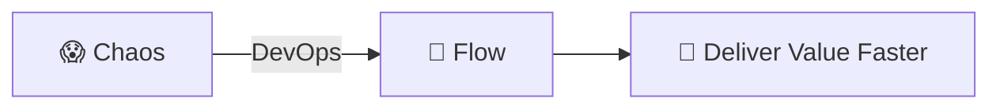

---

## 📍 Slide 2 – 🎯 What You Will Learn

* ✅ Understand what DevOps is (and isn't)
* ✅ Identify problems DevOps solves
* ✅ Apply DevOps thinking to real scenarios
* ✅ Map DevOps practices to your future workflow

**🎓 Learning Outcomes:**
| # | Outcome |
|---|---------|
| 1 | 🧠 Define DevOps and its core principles |
| 2 | 🔍 Recognize pre-DevOps problems |
| 3 | 🛠️ Apply DevOps solutions to scenarios |
| 4 | 🗺️ Navigate the DevOps lifecycle |

---

## 📍 Slide 3 – 📋 How This Lecture Works

* 📚 **Concepts + Diagrams** — visual learning
* 🎮 **Real-world scenarios** — you decide!
* 📝 **3 quiz checkpoints**: PRE / MID / POST
* 🕹️ **Interactive simulation**: "DevOps as a Game"

**⏱️ Lecture Structure:**
```
Section 0: Introduction (now)     → 📝 PRE Quiz
Section 1: The Problem
Section 2: What DevOps Is
Section 3: DevOps as a Game       → 📝 MID Quiz
Section 4: Lifecycle & Metrics
Section 5: Real Life
Section 6: Reflection             → 📝 POST Quiz
```

---

## 📍 Slide 4 – ❓ The Big Question

* 📊 **70%** of IT projects experience significant delays
* ⏱️ Average time from code complete to production: **weeks to months**
* 💥 Most outages caused by **changes** (deploys, configs)

> 💬 *"It worked on my machine"* — Every developer, ever

**🤔 Think about it:**
* Why is software delivery so hard?
* Why do teams fear deployments?
* What would "good" look like?

---

## 📍 Slide 5 – 📝 QUIZ — DEVOPS_L1_PRE

---

## 📍 Slide 6 – 🔥 Section 1: The Problem Before DevOps

* 👨‍💻 **Development** and ⚙️ **Operations** = separate teams, separate goals
* 🚀 Dev wants: **ship features fast**
* 🛡️ Ops wants: **keep systems stable**
* 💥 Result: **conflict, blame, slow delivery**

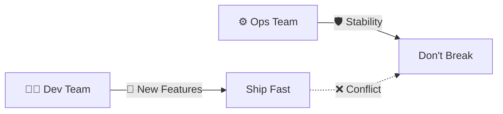

---

## 📍 Slide 7 – 🧱 The Wall of Confusion

* 🧱 **The Wall** = invisible barrier between Dev and Ops
* 📦 Dev "throws code over the wall"
* 🔥 Ops catches the blame when it breaks
* 🔄 Ops rejects changes to avoid risk

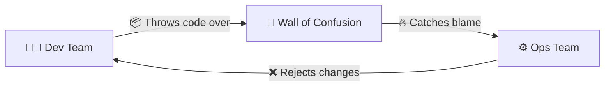

> 🤔 **Think:** Have you seen this pattern before?

---

## 📍 Slide 8 – 😱 Manual Release Hell

* 📅 Deployments are rare (monthly, quarterly)
* 🎰 Each release = **high-risk event**
* 📋 Manual steps, checklists, weekend work
* 💀 One mistake = hours of rollback

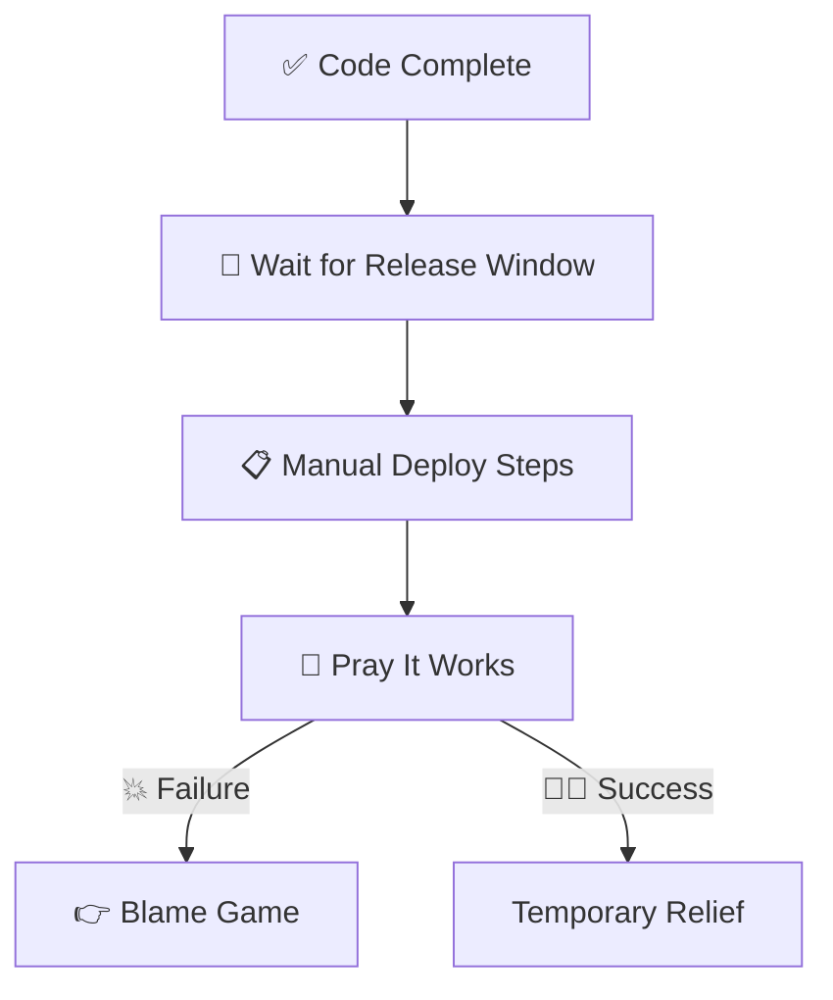

**📊 The Numbers:**
* 🐢 Average release cycle: **3-6 months**
* 📉 Success rate: **~60%**
* ⏱️ Rollback time: **4-8 hours**

---

## 📍 Slide 9 – 😨 Fear and Blame Culture

* 🌙 Incident happens at 2am
* 👉 First question: *"Who did this?"*
* 🙈 Engineers hide mistakes
* 🚫 Nobody wants to deploy on Friday
* 💀 Innovation stops

> ⚠️ **Fear kills velocity**

**😰 Signs of Blame Culture:**
* 🔇 People afraid to speak up
* 📝 Excessive documentation "for protection"
* 🐌 Slow decision-making
* 🚪 High turnover

**💬 Discussion:** Why does blame make things worse?

---

## 📍 Slide 10 – 💸 The Cost of Chaos

| 🔥 Problem | 💥 Impact |
|------------|-----------|
| 🐢 Slow releases | Lost market opportunity |
| 📋 Manual processes | Human error, burnout |
| 👉 Blame culture | Talent leaves |
| 🙈 No visibility | Firefighting mode |

**📈 Real Numbers:**
* 🏢 **Amazon pre-DevOps**: deploys took **weeks**
* 🚀 **Amazon post-DevOps**: deploys every **11.7 seconds**

**💰 Cost of Downtime:**
* 💵 Small business: **$427/minute**
* 🏢 Enterprise: **$9,000/minute**
* 🌐 Amazon: **$220,000/minute**

---

## 📍 Slide 11 – 💡 Section 2: What DevOps Really Is

* 🤝 **DevOps** = Development + Operations working as **one team**
* 🌱 A **culture** of collaboration and shared responsibility
* 🔧 A set of **practices** for fast, reliable delivery
* 🚫 NOT just tools, NOT a job title, NOT a team

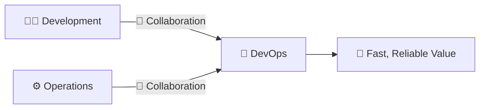

**📖 Definition:**
> *DevOps is a set of practices that combines software development (Dev) and IT operations (Ops) to shorten the development lifecycle while delivering features, fixes, and updates frequently in close alignment with business objectives.*

---

## 📍 Slide 12 – 🚫 What DevOps is NOT

| ❌ Myth | ✅ Reality |
|---------|-----------|
| "We hired a DevOps engineer, we're done" | 👥 Everyone participates |
| "DevOps means using Kubernetes" | 🛠️ Tools support culture |
| "DevOps replaces developers/ops" | 🤝 It unites them |
| "DevOps = just automation" | 🧩 Automation + Culture + Measurement |
| "DevOps is a team" | 🌍 It's a way of working |

> 🔥 **Hot take:** You can't buy DevOps. You build it.

**🎯 DevOps is about:**
* 🧠 Mindset change
* 🤝 Breaking silos
* 🔄 Continuous improvement
* 📊 Data-driven decisions

---

## 📍 Slide 13 – 🔄 The Three Ways of DevOps

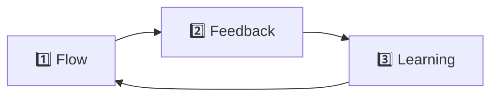

| 🛤️ Way | 🎯 Focus | 💡 Example |
|--------|---------|-----------|
| 1️⃣ **Flow** | Fast Dev → Prod | 🚀 CI/CD pipelines |
| 2️⃣ **Feedback** | Fast Prod → Dev | 📊 Monitoring, alerts |
| 3️⃣ **Learning** | Experiment safely | 📝 Blameless postmortems |

**📚 Source:** *The Phoenix Project* by Gene Kim

---

## 📍 Slide 14 – 🧩 The CAMS Model

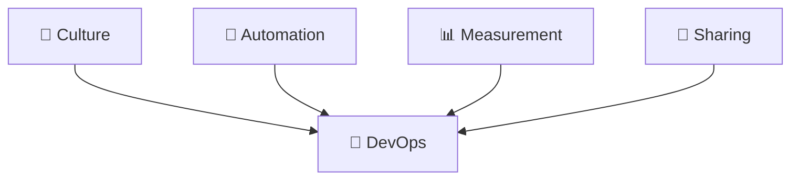

* 🌱 **C = Culture** — Trust, collaboration, shared ownership
* 🤖 **A = Automation** — Eliminate manual, error-prone work
* 📊 **M = Measurement** — Track metrics, decide with data
* 🔗 **S = Sharing** — Knowledge flows, blameless postmortems

**🎯 Key Metrics:**
* ⏱️ **MTTR** = Mean Time to Recovery
* ❌ **CFR** = Change Failure Rate
* 📦 **DF** = Deployment Frequency
* 🚀 **LT** = Lead Time

---

## 📍 Slide 15 – ⚡ Before vs After DevOps

| 😰 Before | 🚀 After |
|----------|---------|
| 📅 Releases every few months | 📆 Releases daily/weekly |
| 📋 Manual deployments | 🤖 Automated pipelines |
| 👉 Blame when things break | 📝 Blameless postmortems |
| 🙅 "Not my problem" | 🤝 Shared ownership |
| 😨 Fear of change | 💪 Embrace change |
| 🐌 Weeks to deploy | ⚡ Minutes to deploy |

> 🤔 Which column describes your current environment?

---

## 📍 Slide 16 – 🎮 Section 3: DevOps as a Game

## 🕹️ Simulation: You're the CTO

* 🏢 Welcome to **FlowStart Inc.** — a growing startup
* 👥 You have: 5 developers, 2 ops engineers
* 🌐 A web application with 10K users
* 📈 Pressure to ship new features

**❓ What could go wrong?**

> 💀 **Everything.**

🎮 **Let's play.**

---

## 📍 Slide 17 – 💥 Scenario 1: Release Failure

**📅 Friday 5pm:**
* 👨‍💻 Developer pushes "small fix"
* 🚫 No tests, no review, straight to production
* 💥 App crashes, users can't log in
* 🤷 Nobody knows what changed

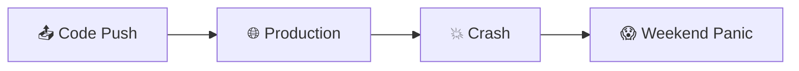

**📊 Impact:**
* 👥 10,000 users affected
* ⏱️ 4 hours downtime
* 💰 $50,000 lost revenue
* 😤 Angry customers on Twitter

> ❓ **What would you do?**

---

## 📍 Slide 18 – ✅ Solution: CI/CD

## 🛠️ Fix: Continuous Integration & Delivery

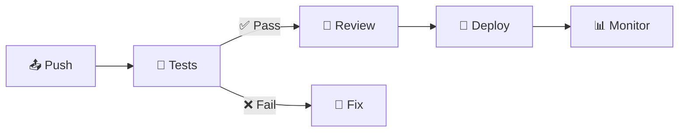

* ✅ Every change triggers **automated tests**
* ✅ **Code review** required before merge
* ✅ **Automated deployment** pipeline
* ✅ **One-click rollback**

**🎯 Result:** Deploy with confidence, not prayers

**📊 CI/CD Benefits:**
* 🐛 Catch bugs early (80% cheaper to fix)
* 🚀 Deploy 200x more frequently
* ⏱️ 24x faster recovery from failures

---

## 📍 Slide 19 – 🐾 Scenario 2: Infrastructure Drift

**😰 Situation:**
* 🖥️ Production server configured manually over 2 years
* 👋 Ops engineer who set it up **left the company**
* 📈 Need to scale — but **can't recreate the setup**

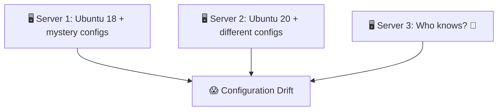

> 🐶🐄 **"Pets vs Cattle"** — Which do you have?

**🐶 Pets:** Unique, irreplaceable, nursed back to health
**🐄 Cattle:** Identical, replaceable, automated

---

## 📍 Slide 20 – ✅ Solution: Infrastructure as Code

## 🛠️ Fix: IaC

* 📝 Define infrastructure in **version-controlled files**
* 🔄 Servers are **reproducible**, not unique
* ⚡ Spin up identical environments in **minutes**

```hcl
# 🌍 Terraform example
resource "aws_instance" "web" {
  ami           = "ami-0c55b159cbfafe1f0"
  instance_type = "t2.micro"
  count         = 3  # 🔢 3 identical servers
}
```

**🎯 Result:** Cattle, not pets. Replace, don't repair.

**🛠️ IaC Tools:**
* 🌍 **Terraform** — Multi-cloud
* 🧩 **Ansible** — Configuration management
* 📦 **Pulumi** — Code-based IaC

---

## 📍 Slide 21 – 🔓 Scenario 3: Secret Leak

**💀 What happened:**
* 👨‍💻 Developer commits database password to GitHub
* 🤖 Bot scrapes it within **minutes**
* 💥 Attackers access production database

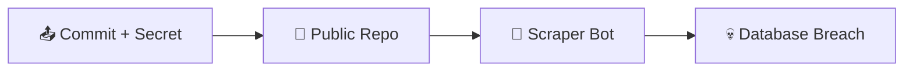

> ⏱️ **How fast do bots find secrets?** Under 5 minutes.

**📊 Real Stats:**
* 🔍 GitHub scans 100M+ repos for secrets
* ⏱️ Average time to exploit: **<1 hour**
* 💰 Average breach cost: **$4.45 million**

---

## 📍 Slide 22 – ✅ Solution: Secrets Management

## 🛠️ Fix: Vault & Secret Scanning

* 🚫 **Never** store secrets in code
* 🔐 Use secret management tools (Vault, AWS Secrets Manager)
* 🔍 Pre-commit hooks scan for secrets
* 🔄 Rotate credentials automatically

```yaml
# ❌ Bad
password: "super_secret_123"

# ✅ Good
password: ${VAULT_DB_PASSWORD}
```

**🎯 Result:** Secrets stay secret

**🛠️ Secret Tools:**
* 🔐 **HashiCorp Vault**
* 🔑 **AWS Secrets Manager**
* 🔒 **Azure Key Vault**
* 🔍 **git-secrets** (pre-commit)

---

## 📍 Slide 23 – 🙈 Scenario 4: Blind Operations

**👥 Users report:** *"App is slow"*

**🤷 Team asks:**
* Is it? How slow?
* Which part is slow?
* Since when?
* How many users affected?

**😰 Answer:** No idea. No metrics. No logs. No visibility.

⏱️ **Hours spent guessing.**

---

## 📍 Slide 24 – ✅ Solution: Observability

## 🛠️ Fix: Logs, Metrics, Traces

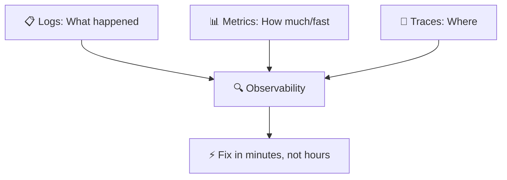

| 📊 Pillar | 🛠️ Tools |
|-----------|----------|
| 📋 Logs | ELK, Loki, CloudWatch |
| 📊 Metrics | Prometheus, Grafana, Datadog |
| 🔗 Traces | Jaeger, Zipkin, X-Ray |

**🎯 Result:** See problems before users report them

---

## 📍 Slide 25 – 📝 QUIZ — DEVOPS_L1_MID

---

## 📍 Slide 26 – ♾️ Section 4: DevOps Lifecycle

## 🔄 The Infinity Loop

* ♾️ DevOps is **continuous** — no "done" state
* 🔄 Each stage feeds the next
* 🔁 Forever improving

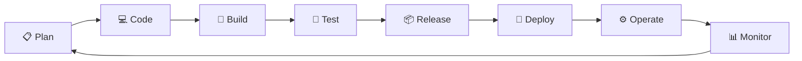

---

## 📍 Slide 27 – 🔁 Lifecycle Phases

| 📍 Phase | 🎯 Activity | 🛠️ Tools |
|----------|------------|----------|
| 📋 Plan | Requirements, design | Jira, GitHub Issues |
| 💻 Code | Write & review | Git, VS Code |
| 🔨 Build | Compile, package | Docker, npm, Maven |
| 🧪 Test | Automated testing | pytest, Jest, Selenium |
| 📦 Release | Version, approve | GitHub Releases, Tags |
| 🚀 Deploy | Push to environment | ArgoCD, Ansible, Helm |
| ⚙️ Operate | Run, scale | Kubernetes, Terraform |
| 📊 Monitor | Observe, alert | Prometheus, Grafana |

---

## 📍 Slide 28 – 🗺️ Course Map

## 📚 How This Course Covers the Lifecycle

```mermaid
flowchart TD
  subgraph 📋 Plan & Code
    L1[🔬 Labs 1-3: Git, GitHub]
  end
  subgraph 🔨 Build & Test
    L2[🐳 Labs 4-6: Docker, CI/CD]
  end
  subgraph 🚀 Deploy & Operate
    L3[☸️ Labs 7-10: K8s, Helm]
  end
  subgraph 🔐 Secure & Monitor
    L4[📊 Labs 11-15: Vault, Monitoring]
  end
```

✅ **Every lab maps to a real DevOps skill.**

---

## 📍 Slide 29 – 📊 DORA Metrics

## 📈 Measuring DevOps Success

| 📊 Metric | 📏 Measures | 🏆 Elite |
|-----------|------------|---------|
| ⏱️ **Lead Time** | Commit → Prod | < 1 hour |
| 📦 **Deploy Frequency** | How often | Multiple/day |
| ❌ **Change Failure Rate** | % broken deploys | < 15% |
| 🔧 **MTTR** | Recovery time | < 1 hour |

> 📚 These 4 metrics predict software delivery performance.
> *Source: DORA State of DevOps Report*

**🤔 Question:** Where does your team stand?

---

## 📍 Slide 30 – 🌊 From Chaos to Flow

## 🎯 The Goal

```mermaid
flowchart LR
  subgraph 😱 Chaos
    Manual[📋 Manual Work]
    Silos[🧱 Silos]
    Fear[😨 Fear]
  end
  subgraph 🌊 Flow
    Auto[🤖 Automation]
    Collab[🤝 Collaboration]
    Confidence[💪 Confidence]
  end
  Chaos -->|🚀 DevOps| Flow
```

**🎯 Flow State:**
* ⚡ Changes flow smoothly from idea to production
* 🔄 Feedback loops are fast
* 📈 Teams continuously improve

---

## 📍 Slide 31 – 🏢 Section 5: DevOps in Real Life

## 📅 A Day in DevOps

**☀️ Morning:**
* 📊 Check dashboards — all green ✅
* 👀 Review pull requests
* 🔀 Merge → auto-deploy

**🌤️ Afternoon:**
* 🚨 Alert: latency spike
* 🔍 Check traces → slow DB query
* 🔧 Fix, test, deploy — **20 min total**

**🌙 Evening:**
* 🤖 Systems run themselves
* 🏠 Go home on time

---

## 📍 Slide 32 – 👥 DevOps Roles

| 👤 Role | 🎯 Focus |
|---------|---------|
| 🔧 **DevOps Engineer** | Pipelines, automation, infra |
| 🛡️ **SRE** | Reliability, SLOs, incidents |
| 🏗️ **Platform Engineer** | Developer experience, internal tools |
| ☁️ **Cloud Engineer** | Cloud infra, cost optimization |

**🔗 Common thread:** Collaboration, automation, ownership

**💰 Salary Range (2024):**
* 🔧 DevOps Engineer: $100K - $180K
* 🛡️ SRE: $120K - $200K
* 🏗️ Platform Engineer: $130K - $220K

---

## 📍 Slide 33 – 🤝 Team Collaboration

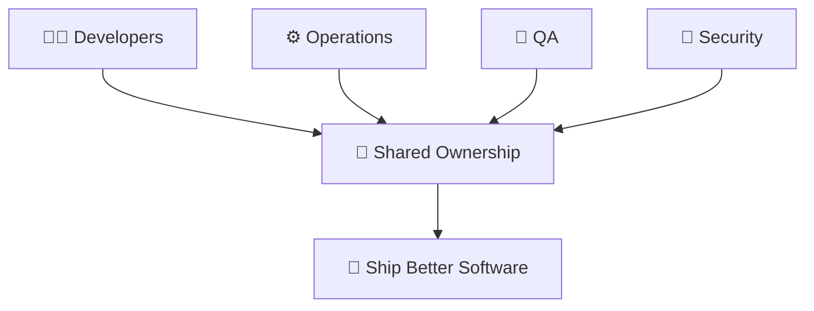

**🤝 Collaboration Practices:**
* 📟 Shared on-call rotations
* 📝 Blameless incident reviews
* 👥 Cross-functional squads
* 🔓 Everyone can deploy

---

## 📍 Slide 34 – 📈 Career Path

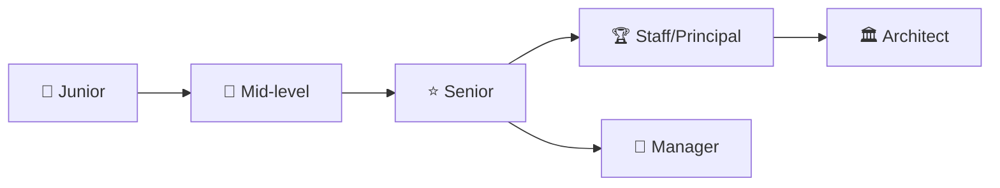

**🛠️ Skills to Build:**
* 🐧 Linux, networking
* 📝 Scripting (Bash, Python)
* 🐳 Containers & K8s
* 🔄 CI/CD pipelines
* ☁️ Cloud platforms (AWS, GCP, Azure)

---

## 📍 Slide 35 – 🌍 Real Company Examples

**🎬 Netflix:**
* 🚀 1000+ deploys/day
* 🐒 Chaos Monkey breaks things on purpose
* 🔄 Self-healing infrastructure

**📦 Amazon:**
* ⚡ Deploy every **11.7 seconds**
* 🔧 "You build it, you run it"
* 👥 Two-pizza teams

**🔍 Google:**
* 🛡️ Invented **SRE**
* 📊 Error budgets balance speed & reliability
* 📝 Blameless postmortems

---

## 📍 Slide 36 – 🎯 Section 6: Reflection

## 📝 Key Takeaways

1. 🧩 **DevOps = Culture + Practices + Tools**
2. 🧱 **Break down silos** between Dev and Ops
3. 🤖 **Automate everything** repeatable
4. 📊 **Measure what matters** (DORA metrics)
5. 📝 **Learn from failures**, don't assign blame

> 💡 DevOps isn't a destination. It's a direction.

---

## 📍 Slide 37 – 🧠 The Mindset Shift

| 😰 Old Mindset | 🚀 DevOps Mindset |
|---------------|------------------|
| 🙅 "Not my job" | 🤝 "Our responsibility" |
| 🚫 "Don't touch prod" | 💪 "Deploy with confidence" |
| 👉 "Who broke it?" | 🔍 "How do we prevent this?" |
| 😨 "Change is risky" | ✅ "Small changes = less risk" |
| 💻 "Works on my machine" | 🌍 "Works everywhere" |

> ❓ Which mindset do you want?

---

## 📍 Slide 38 – ✅ Your Progress

## 🎓 What You Now Understand

* ✅ Why DevOps emerged and what it solves
* ✅ The Three Ways and CAMS model
* ✅ How CI/CD, IaC, and observability fit together
* ✅ The DevOps lifecycle and how to measure it
* ✅ Real-world application of DevOps

> 🚀 **You're ready for the labs.**

---

## 📍 Slide 39 – 📝 QUIZ — DEVOPS_L1_POST

---

## 📍 Slide 40 – 🚀 What Comes Next

## 📚 Next Lecture: Version Control with Git

* 🐙 Git fundamentals
* 🌿 Branching strategies
* 🤝 Collaboration workflows
* 💻 Hands-on: Your first pull request

**🎉 Your journey has begun.**

> 🌊 From chaos to flow — one commit at a time.


**👋 See you in the next lecture!**

---

## 📚 Resources & Further Reading

**📕 Books:**
* 📖 *The Phoenix Project* — Gene Kim
* 📖 *The DevOps Handbook* — Gene Kim et al.
* 📖 *Accelerate* — Nicole Forsgren

**🔗 Links:**
* 🌐 [DORA State of DevOps](https://dora.dev)
* 🌐 [DevOps Roadmap](https://roadmap.sh/devops)
* 🌐 [12 Factor App](https://12factor.net)

---
