# 📌 Lecture 10 — Helm Package Management: Templating Kubernetes

## 📍 Slide 1 – 🚀 Welcome to Helm

* 🌍 **Kubernetes manifests are powerful** — but repetitive
* 😰 Copy-pasting YAML for different environments is error-prone
* ⛵ **Helm** = the package manager for Kubernetes
* 🎯 This lecture: master charts, templating, and values management

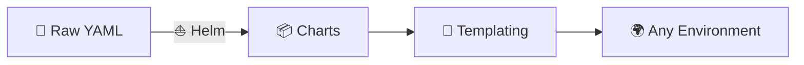

---

## 📍 Slide 2 – 🎯 What You Will Learn

* ✅ Understand Helm architecture and concepts
* ✅ Create production-ready Helm charts
* ✅ Use templating for multi-environment deployments
* ✅ Implement lifecycle hooks for advanced scenarios

**🎓 Learning Outcomes:**
| # | Outcome |
|---|---------|
| 1 | 🧠 Explain charts, releases, and repositories |
| 2 | 🔍 Create charts with proper templating |
| 3 | 🛠️ Manage values for different environments |
| 4 | 🗺️ Implement hooks for lifecycle management |

---

## 📍 Slide 3 – 📋 How This Lecture Works

* 📚 **Concepts + Go templates** — hands-on focus
* 🎮 **Real-world scenarios** — multi-environment challenges
* 📝 **3 quiz checkpoints**: PRE / MID / POST
* 🛠️ **Best practices**: DRY, hooks, library charts

**⏱️ Lecture Structure:**
```
Section 0: Introduction (now)     → 📝 PRE Quiz
Section 1: The Manifest Problem
Section 2: Helm Fundamentals
Section 3: Templating Deep Dive   → 📝 MID Quiz
Section 4: Hooks & Advanced
Section 5: Production Helm
Section 6: Reflection             → 📝 POST Quiz
```

---

## 📍 Slide 4 – ❓ The Big Question

* 📊 **89%** of Kubernetes users use Helm
* ⏱️ Managing 100+ YAML files manually is **chaos**
* 💥 Different configs per environment = **copy-paste errors**

> 💬 *"Is this the dev or prod manifest? Why are they different?"* — Every DevOps engineer

**🤔 Think about it:**
* How do you manage configs for dev, staging, and prod?
* How do you share common patterns across applications?
* How do you version your Kubernetes deployments?

---

## 📍 Slide 5 – 📝 QUIZ — DEVOPS_L10_PRE

---

## 📍 Slide 6 – 🔥 Section 1: The Manifest Problem

* 📝 **Raw YAML** works for one environment
* 📋 Need different values for dev, staging, prod
* 🔧 Copy-paste → divergence → bugs
* 💥 Result: **manifest sprawl**

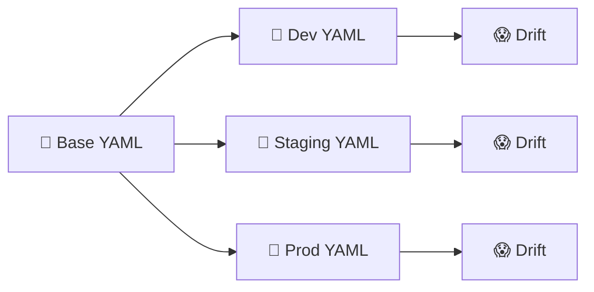

---

## 📍 Slide 7 – 😱 YAML Duplication

* 📋 Same deployment, different image tags
* 📊 Same service, different replicas
* 🔧 Same ingress, different domains
* 💀 Changes require updating multiple files

```yaml
# 😰 dev-deployment.yaml
replicas: 1
image: myapp:latest

# 😰 staging-deployment.yaml
replicas: 2
image: myapp:v1.2.3

# 😰 prod-deployment.yaml
replicas: 5
image: myapp:v1.2.3
```

**📊 The Problem:**
* 🔍 Fix a bug? Update 3 files
* 🆕 New field? Add to all files
* 😰 Easy to miss one file

---

## 📍 Slide 8 – 🔧 Manual Substitution Problems

* 📝 `sed` and `envsubst` are fragile
* 🔍 No validation of resulting YAML
* 📊 No understanding of Kubernetes resources
* 💀 Silent failures

> ⚠️ **sed is not a package manager**

```bash
# 😰 This is fragile
sed -i "s/REPLICAS/3/g" deployment.yaml
envsubst < deployment.yaml.template > deployment.yaml
```

**💬 Discussion:** How do you currently manage environment differences?

---

## 📍 Slide 9 – 😨 Version Chaos

* 📅 "Which version is deployed in prod?"
* 🔧 No rollback mechanism
* 📋 No deployment history
* 💀 Can't reproduce past deployments

> ⚠️ **Without versioning, you can't roll back safely**

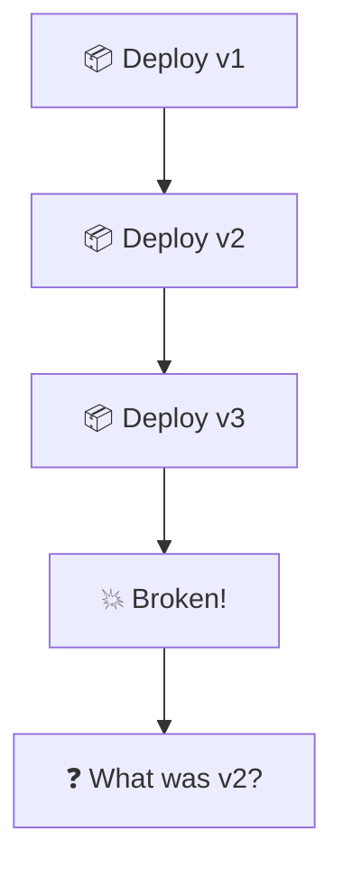

---

## 📍 Slide 10 – 💸 The Cost of Manifest Sprawl

| 🔥 Problem | 💥 Impact |
|------------|-----------|
| 🐢 Update all files | Slow, error-prone |
| 📋 Inconsistency | "Works in dev, not prod" |
| 👉 No history | Can't audit changes |
| 🙈 No versioning | Risky rollbacks |

**📈 Real Numbers:**
* 🏢 **Average K8s app**: 5-20 YAML files
* 🔄 **Environments**: 3-5 (dev, staging, prod, etc.)
* 📊 **Total files**: 15-100 per app (without Helm)
* ⛵ **With Helm**: 1 chart, unlimited environments

---

## 📍 Slide 11 – 💡 Section 2: What Helm Is

* ⛵ **Package manager** for Kubernetes
* 📦 **Charts** = packages of K8s resources
* 🔧 **Templating** = dynamic manifest generation
* 🔄 **Releases** = installed chart instances

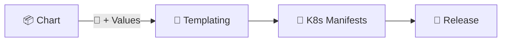

**📖 Definition:**
> *Helm is a package manager for Kubernetes that helps you define, install, and upgrade complex Kubernetes applications using charts (packages of pre-configured resources).*

---

## 📍 Slide 12 – 📦 Core Concepts

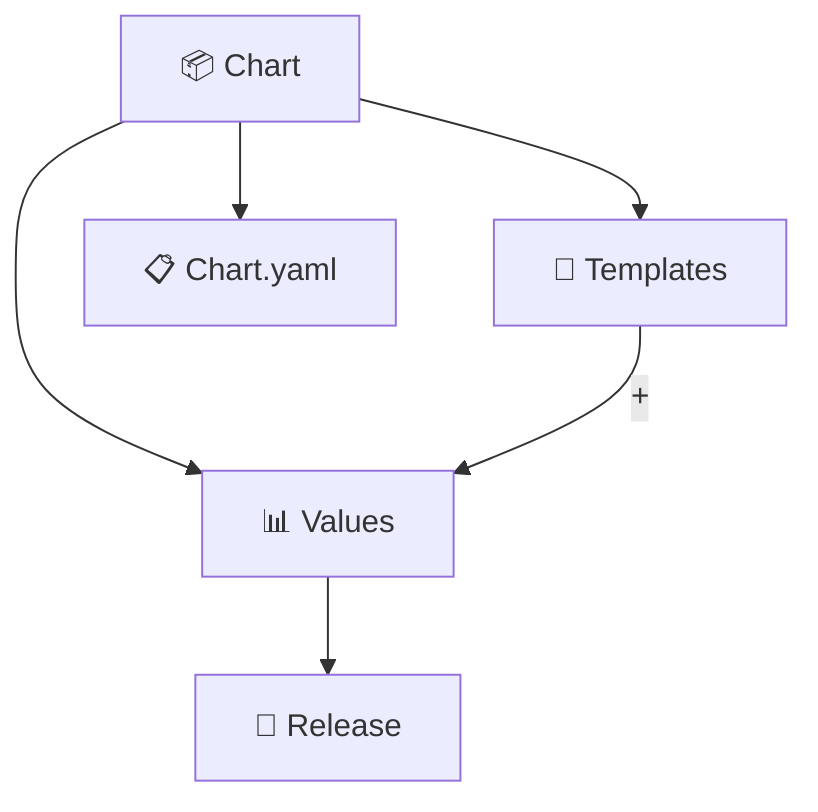

| 📦 Concept | 🎯 Purpose |
|-----------|----------|
| 📦 **Chart** | Package of K8s resources |
| 🚀 **Release** | Installed instance of chart |
| 📊 **Values** | Configuration parameters |
| 📁 **Repository** | Collection of charts |

---

## 📍 Slide 13 – 📁 Chart Structure

```
mychart/
├── Chart.yaml          # 📋 Chart metadata
├── values.yaml         # 📊 Default values
├── charts/             # 📦 Dependencies
└── templates/          # 📝 K8s manifests
    ├── deployment.yaml
    ├── service.yaml
    ├── _helpers.tpl    # 🔧 Template helpers
    └── NOTES.txt       # 📝 Post-install notes
```

**🔑 Key Files:**
* 📋 `Chart.yaml` — Name, version, description
* 📊 `values.yaml` — Default configuration
* 📝 `templates/` — Go templates for manifests
* 🔧 `_helpers.tpl` — Reusable template snippets

---

## 📍 Slide 14 – 📋 Chart.yaml

```yaml
apiVersion: v2
name: my-web-app
description: A Helm chart for my web application
type: application

# 📊 Chart version (SemVer)
version: 0.1.0

# 📦 Application version
appVersion: "1.0.0"

# 📦 Dependencies
dependencies:
  - name: common
    version: 0.1.0
    repository: "file://../common"
```

**🔑 Important Fields:**
* `version` — Chart version (bump when chart changes)
* `appVersion` — Application version (your app's version)
* `dependencies` — Other charts this depends on

---

## 📍 Slide 15 – ⚡ Before vs After Helm

| 😰 Before | 🚀 After |
|----------|---------|
| 📅 Multiple YAML files per env | 📊 One values file per env |
| 📋 Manual substitution | 🔧 Go templating |
| 👉 No versioning | 📦 SemVer releases |
| 😨 Risky rollbacks | 🔙 `helm rollback` |
| 🐌 Copy-paste changes | ⚡ Single source of truth |
| 📝 No sharing | 📁 Chart repositories |

> 🤔 Ready to package your Kubernetes apps?

---

## 📍 Slide 16 – 🎮 Section 3: Templating Deep Dive

## 🔧 Go Template Basics

```yaml
# templates/deployment.yaml
apiVersion: apps/v1
kind: Deployment
metadata:
  name: {{ .Release.Name }}-app
  labels:
    app: {{ .Values.appName }}
spec:
  replicas: {{ .Values.replicaCount }}
  template:
    spec:
      containers:
      - name: {{ .Chart.Name }}
        image: "{{ .Values.image.repository }}:{{ .Values.image.tag }}"
```

**🔧 Template Syntax:**
* `{{ }}` — Template action
* `.Values` — From values.yaml
* `.Release` — Release information
* `.Chart` — From Chart.yaml

---

## 📍 Slide 17 – 📊 Values Management

```yaml
# values.yaml (defaults)
replicaCount: 1
appName: my-app

image:
  repository: myuser/myapp
  tag: latest
  pullPolicy: IfNotPresent

service:
  type: ClusterIP
  port: 80

resources:
  limits:
    cpu: 200m
    memory: 256Mi
  requests:
    cpu: 100m
    memory: 128Mi
```

**🔧 Override Values:**
```bash
# File override
helm install myrelease ./mychart -f values-prod.yaml

# Command line override
helm install myrelease ./mychart --set replicaCount=5
```

---

## 📍 Slide 18 – 🌍 Multi-Environment Values

```yaml
# values-dev.yaml
replicaCount: 1
image:
  tag: latest
resources:
  limits:
    cpu: 100m
    memory: 128Mi

# values-prod.yaml
replicaCount: 5
image:
  tag: v1.2.3
resources:
  limits:
    cpu: 500m
    memory: 512Mi
```

**🚀 Deploy to Different Environments:**
```bash
# Development
helm install myapp-dev ./mychart -f values-dev.yaml

# Production
helm install myapp-prod ./mychart -f values-prod.yaml
```

---

## 📍 Slide 19 – 🔧 Template Functions

```yaml
# Using functions
name: {{ .Values.name | lower | trunc 63 }}

# Default values
tag: {{ .Values.image.tag | default .Chart.AppVersion }}

# Conditional
{{- if .Values.ingress.enabled }}
# ... ingress resource
{{- end }}

# Range (loop)
{{- range .Values.env }}
- name: {{ .name }}
  value: {{ .value | quote }}
{{- end }}
```

**🔧 Common Functions:**
| 🔧 Function | 🎯 Purpose |
|------------|----------|
| `default` | Provide fallback value |
| `quote` | Add quotes |
| `lower/upper` | Case conversion |
| `trunc` | Truncate string |
| `include` | Include template |

---

## 📍 Slide 20 – 🔧 Helper Templates

```yaml
# templates/_helpers.tpl
{{/*
Create chart name and version as used by the chart label.
*/}}
{{- define "mychart.chart" -}}
{{- printf "%s-%s" .Chart.Name .Chart.Version | replace "+" "_" | trunc 63 | trimSuffix "-" }}
{{- end }}

{{/*
Common labels
*/}}
{{- define "mychart.labels" -}}
helm.sh/chart: {{ include "mychart.chart" . }}
app.kubernetes.io/name: {{ .Chart.Name }}
app.kubernetes.io/instance: {{ .Release.Name }}
app.kubernetes.io/version: {{ .Chart.AppVersion | quote }}
app.kubernetes.io/managed-by: {{ .Release.Service }}
{{- end }}
```

**🔧 Using Helpers:**
```yaml
metadata:
  labels:
    {{- include "mychart.labels" . | nindent 4 }}
```

---

## 📍 Slide 21 – 📊 Built-in Objects

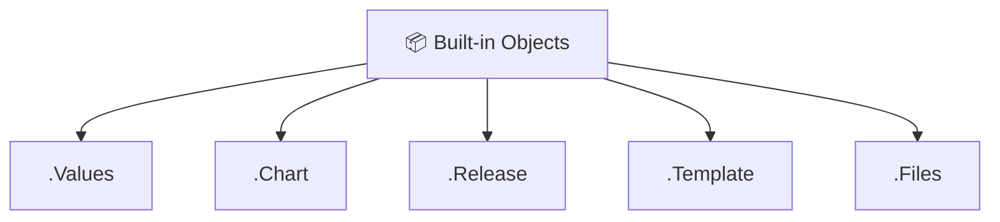

| 📦 Object | 🎯 Contains |
|----------|----------|
| `.Values` | Values from values.yaml + overrides |
| `.Chart` | Contents of Chart.yaml |
| `.Release` | Release name, namespace, revision |
| `.Template` | Current template info |
| `.Files` | Access to non-template files |

---

## 📍 Slide 22 – 🧪 Testing Charts

```bash
# 📋 Lint chart for errors
helm lint ./mychart

# 📝 Render templates locally
helm template myrelease ./mychart

# 🔍 Dry run against cluster
helm install --dry-run --debug myrelease ./mychart

# 📊 Show computed values
helm get values myrelease

# 📝 Show rendered manifests
helm get manifest myrelease
```

**🧪 Testing Workflow:**
1. 📋 `helm lint` — syntax check
2. 📝 `helm template` — verify output
3. 🔍 `--dry-run` — validate against cluster
4. 🚀 `helm install` — deploy

---

## 📍 Slide 23 – 📊 Helm Commands

```bash
# 📦 Create new chart
helm create mychart

# 🚀 Install chart
helm install myrelease ./mychart

# 📋 List releases
helm list

# 🔄 Upgrade release
helm upgrade myrelease ./mychart

# 🔙 Rollback release
helm rollback myrelease 1

# 🗑️ Uninstall release
helm uninstall myrelease

# 📊 Show release history
helm history myrelease
```

---

## 📍 Slide 24 – 🔗 Chart Dependencies

```yaml
# Chart.yaml
dependencies:
  - name: postgresql
    version: 12.0.0
    repository: https://charts.bitnami.com/bitnami
    condition: postgresql.enabled
```

```bash
# Download dependencies
helm dependency update ./mychart

# Build dependencies
helm dependency build ./mychart
```

**🔗 Dependency Features:**
* 📦 Include other charts as sub-charts
* 🔧 Override sub-chart values
* 🔀 Conditional inclusion

---

## 📍 Slide 25 – 📝 QUIZ — DEVOPS_L10_MID

---

## 📍 Slide 26 – 🎣 Section 4: Lifecycle Hooks

## 🎣 What Are Hooks?

* 🎯 **Execute actions** at specific points
* 📦 Run jobs before/after install/upgrade
* 🗑️ Cleanup after completion
* 🔧 Database migrations, tests, notifications

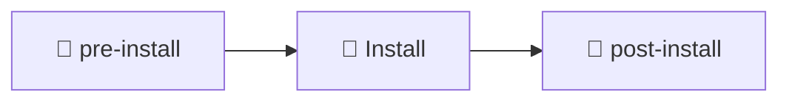

---

## 📍 Slide 27 – 🎣 Hook Types

| 🎣 Hook | ⏱️ When |
|--------|--------|
| `pre-install` | Before resources installed |
| `post-install` | After all resources ready |
| `pre-upgrade` | Before upgrade |
| `post-upgrade` | After upgrade complete |
| `pre-delete` | Before deletion |
| `post-delete` | After deletion |
| `pre-rollback` | Before rollback |
| `post-rollback` | After rollback |

---

## 📍 Slide 28 – 📝 Hook Example

```yaml
# templates/pre-install-job.yaml
apiVersion: batch/v1
kind: Job
metadata:
  name: {{ .Release.Name }}-pre-install
  annotations:
    "helm.sh/hook": pre-install
    "helm.sh/hook-weight": "-5"
    "helm.sh/hook-delete-policy": hook-succeeded
spec:
  template:
    spec:
      restartPolicy: Never
      containers:
      - name: pre-install
        image: busybox
        command: ['sh', '-c', 'echo Pre-install running && sleep 5']
```

**🔑 Hook Annotations:**
* `helm.sh/hook` — Hook type
* `helm.sh/hook-weight` — Execution order (lower first)
* `helm.sh/hook-delete-policy` — When to delete

---

## 📍 Slide 29 – 🏗️ Library Charts

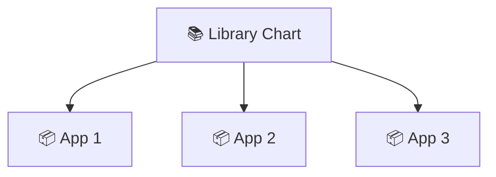

**📚 Library Chart:**
* 🚫 Cannot be installed directly
* 📝 Contains only templates
* 🔄 Shared across multiple charts

```yaml
# Chart.yaml
apiVersion: v2
name: common-lib
type: library  # 📚 Library type
version: 0.1.0
```

---

## 📍 Slide 30 – 📊 Helm Metrics

| 📊 Metric | 📏 Measures | 🏆 Target |
|-----------|------------|---------|
| 📦 **Chart Version** | Tracking | SemVer |
| 🔄 **Release Revision** | Upgrade count | Documented |
| ⏱️ **Deploy Time** | Chart install | < 5 min |
| 🧪 **Lint Errors** | Chart quality | 0 |

> 📚 Version everything!

**🤔 Question:** How do you track what's deployed?

---

## 📍 Slide 31 – 🏢 Section 5: Production Helm

## 📅 A Day with Helm

**☀️ Morning:**
* 📋 Review chart PR
* 🧪 `helm lint` and `helm template`
* ✅ Merge changes

**🌤️ Afternoon:**
* 📊 Update values-prod.yaml
* 🚀 `helm upgrade myapp ./mychart -f values-prod.yaml`
* 📈 Watch rollout: `kubectl rollout status`

**🌙 Evening:**
* 💥 Issue detected
* 🔙 `helm rollback myapp 3`
* ⏱️ **Rollback in 30 seconds**

---

## 📍 Slide 32 – 👥 Team Helm Workflow

| 👤 Role | 🎯 Helm Responsibility |
|---------|----------------------|
| 👨‍💻 **Developer** | Define values requirements |
| 🔧 **DevOps** | Create and maintain charts |
| 🛡️ **SRE** | Manage releases, rollbacks |
| 📊 **Platform** | Build chart standards |

**🔗 GitOps Flow:**
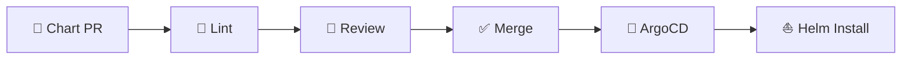

---

## 📍 Slide 33 – 🔐 Production Best Practices

```yaml
# ✅ Good: Specific versions
image:
  tag: v1.2.3  # Not 'latest'

# ✅ Good: Resource limits always
resources:
  limits:
    cpu: 500m
    memory: 512Mi

# ✅ Good: Health probes always
livenessProbe:
  enabled: true
readinessProbe:
  enabled: true
```

**🛡️ Production Checklist:**
* ✅ Specific image tags (not `latest`)
* ✅ Resource limits defined
* ✅ Health probes enabled
* ✅ Values documented
* ✅ Chart versioned with SemVer

---

## 📍 Slide 34 – 📈 Career Path: Helm Skills

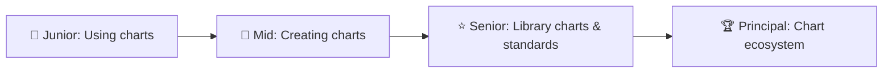

**🛠️ Skills to Build:**
* 📝 Go template fluency
* 📦 Chart design patterns
* 🔗 Dependency management
* 🎣 Hook implementation
* 📁 Repository management

---

## 📍 Slide 35 – 🌍 Real Company Examples

**🏢 Helm at Scale:**
* 📦 **Bitnami**: 100+ production charts
* 🔍 **Google**: GKE uses Helm internally
* 🎬 **Netflix**: Custom chart ecosystem

**☁️ Public Charts:**
* 📊 **Prometheus**: helm-charts/prometheus
* 📋 **Grafana**: helm-charts/grafana
* 🐘 **PostgreSQL**: bitnami/postgresql

**📊 Stats:**
* ⛵ **10,000+** public charts
* 📦 **89%** K8s users use Helm
* 🏢 **Standard** for K8s packaging

---

## 📍 Slide 36 – 🎯 Section 6: Reflection

## 📝 Key Takeaways

1. ⛵ **Helm is the package manager** for Kubernetes
2. 📦 **Charts package** related K8s resources
3. 🔧 **Templating** enables multi-environment deploys
4. 📊 **Values** customize without changing templates
5. 🎣 **Hooks** handle lifecycle events

> 💡 Never hardcode in templates — parametrize everything.

---

## 📍 Slide 37 – 🧠 The Mindset Shift

| 😰 Old Mindset | ⛵ Helm Mindset |
|---------------|------------------|
| 🙅 "Copy YAML for each env" | 📊 "Different values, same chart" |
| 🚫 "sed for substitution" | 🔧 "Go templates" |
| 👉 "Manual versioning" | 📦 "SemVer releases" |
| 😨 "Risky rollbacks" | 🔙 "helm rollback" |
| 💻 "My chart, my rules" | 📚 "Shared libraries" |

> ❓ Which mindset describes your team?

---

## 📍 Slide 38 – ✅ Your Progress

## 🎓 What You Now Understand

* ✅ Helm architecture and concepts
* ✅ Chart creation and structure
* ✅ Go template syntax
* ✅ Multi-environment values management
* ✅ Lifecycle hooks

> 🚀 **You're ready for Lab 10: Helm Charts**

---

## 📍 Slide 39 – 📝 QUIZ — DEVOPS_L10_POST

---

## 📍 Slide 40 – 🚀 What Comes Next

## 📚 Course Continuation

* 🔐 Lab 11: Secrets with Vault
* ⚙️ Lab 12: ConfigMaps
* 🔄 Lab 13: ArgoCD GitOps
* 📊 Lab 14: StatefulSets
* 🔍 Lab 15: K8s Monitoring

**🎉 You've completed the Helm fundamentals!**

> ⛵ From raw YAML to packaged charts — one template at a time.

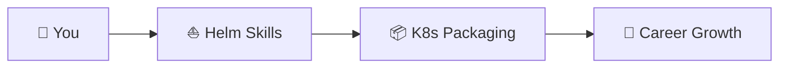

**👋 Continue your DevOps journey!**

---

## 📚 Resources & Further Reading

**📕 Books:**
* 📖 *Learning Helm* — Matt Butcher
* 📖 *Helm in Action* — Matt Palmer
* 📖 *Kubernetes Patterns* — Bilgin Ibryam

**🔗 Links:**
* 🌐 [Helm Documentation](https://helm.sh/docs/)
* 🌐 [Chart Best Practices](https://helm.sh/docs/chart_best_practices/)
* 🌐 [Artifact Hub](https://artifacthub.io/)

---
