# 📌 Lecture 12 — Configuration & Storage: Externalizing Application State

> 🎯 **From hardcoded configs to dynamic, portable applications**

---

## 📍 Slide 1 – 🚀 Welcome to Configuration Management

Last lecture we secured our **secrets**. But what about everything else?

* 🔧 **Database URLs** — different per environment
* 📊 **Feature flags** — enable/disable features dynamically
* 📁 **Data persistence** — where does your app store files?
* ⚙️ **App settings** — logging levels, timeouts, cache sizes

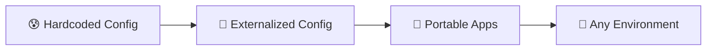

> 🎯 **Goal:** Build applications that run anywhere without code changes

---

## 📍 Slide 2 – 📚 Learning Outcomes

By the end of this lecture, you will:

| # | 🎯 Outcome |
|---|-----------|
| 1 | ✅ Understand the **12-Factor App** configuration principle |
| 2 | ✅ Create and use **ConfigMaps** for non-sensitive configuration |
| 3 | ✅ Differentiate between **ConfigMaps** and **Secrets** |
| 4 | ✅ Understand **Persistent Volumes** and storage in Kubernetes |
| 5 | ✅ Implement **PersistentVolumeClaims** for stateful applications |
| 6 | ✅ Apply configuration management **best practices** |

---

## 📍 Slide 3 – 🗺️ Lecture Overview

```
┌─────────────────────────────────────────────────────────────┐
│  SECTION 0: Introduction                    (Slides 1-4)   │
├─────────────────────────────────────────────────────────────┤
│  📝 PRE QUIZ                                (Slide 5)      │
├─────────────────────────────────────────────────────────────┤
│  SECTION 1: The Configuration Problem       (Slides 6-10)  │
├─────────────────────────────────────────────────────────────┤
│  SECTION 2: ConfigMaps Deep Dive            (Slides 11-15) │
├─────────────────────────────────────────────────────────────┤
│  SECTION 3: Hands-on Scenarios              (Slides 16-24) │
├─────────────────────────────────────────────────────────────┤
│  📝 MID QUIZ                                (Slide 25)     │
├─────────────────────────────────────────────────────────────┤
│  SECTION 4: Persistent Storage              (Slides 26-32) │
├─────────────────────────────────────────────────────────────┤
│  SECTION 5: Production Patterns             (Slides 33-37) │
├─────────────────────────────────────────────────────────────┤
│  📝 POST QUIZ                               (Slide 38)     │
├─────────────────────────────────────────────────────────────┤
│  FINAL: What's Next                         (Slide 39)     │
└─────────────────────────────────────────────────────────────┘
```

---

## 📍 Slide 4 – 🤔 The Big Question

> 💬 *"Store config in the environment, not in the code."*
> — The Twelve-Factor App

**Consider this:**

* 🏭 You have the **same application** running in dev, staging, and production
* 🔧 Each environment needs **different database URLs**
* 📊 You want to change **log levels without redeploying**
* 💾 Your app needs to **persist user uploads** somewhere

> 🤔 **Think:** How do you build ONE container image that works everywhere?

---

## 📍 Slide 5 – 📝 QUIZ — DEVOPS_L12_PRE

---

## 📍 Slide 6 – ⚠️ Section 1: The Configuration Problem

**The Anti-Pattern: Hardcoded Configuration**

```mermaid
flowchart TD
  subgraph 😰 Hardcoded
    A[app-dev.jar] --> D1[Dev DB]
    B[app-staging.jar] --> D2[Staging DB]
    C[app-prod.jar] --> D3[Prod DB]
  end

  subgraph 🚀 Externalized
    E[app.jar] --> F{Config}
    F --> D1
    F --> D2
    F --> D3
  end
```

* 😰 **Hardcoded:** Different artifact per environment
* 🚀 **Externalized:** One artifact, configuration injected at runtime

---

## 📍 Slide 7 – 🔥 Pain Point 1: Environment-Specific Builds

**The Problem:**

```dockerfile
# ❌ Bad: Environment-specific Dockerfile
FROM python:3.12
ENV DATABASE_URL=postgres://dev-server:5432/mydb  # 😱 Hardcoded!
ENV LOG_LEVEL=DEBUG
COPY . /app
```

* 🔄 Need to **rebuild** for each environment
* 🐛 **"Works on my machine"** — config differs
* 🔍 Can't trace which **version** is where
* 💀 Accidentally deploying **dev config to production**

> 😱 **Horror Story:** Company deployed with `DEBUG=true` to production, logging credit card numbers

---

## 📍 Slide 8 – 🔥 Pain Point 2: Configuration Drift

**What happens over time:**

| 📅 Month | 🔧 Dev Config | 🎭 Staging Config | 🏭 Prod Config |
|----------|---------------|-------------------|----------------|
| January  | `timeout=30` | `timeout=30` | `timeout=30` |
| March    | `timeout=60` | `timeout=30` | `timeout=30` |
| June     | `timeout=60` | `timeout=45` | `timeout=30` |
| Now      | 😵 Nobody knows what's deployed where |

* 🔄 **Manual changes** accumulate
* 📋 No **version control** for configuration
* 🐛 **Staging doesn't match production** — bugs slip through

---

## 📍 Slide 9 – 🔥 Pain Point 3: Data Loss

**Stateless containers + persistent data = 💥**


* 📦 Containers are **ephemeral** — data inside is lost on restart
* 💾 User uploads, databases, caches — all **gone**
* 🔄 Rolling updates = **data loss** without proper storage

> 🤔 **Discussion:** Where should container applications store their data?

---

## 📍 Slide 10 – 💰 The Cost of Poor Configuration

| 🔥 Problem | 💥 Impact | 📊 Statistics |
|-----------|----------|---------------|
| Config drift | Inconsistent behavior | 62% of outages involve config changes |
| Hardcoded secrets | Security breaches | Covered in Lecture 11! |
| Data loss | Customer impact | Average $150K per incident |
| Manual config | Human error | 70% of failures are human error |

**Root causes of production incidents (2024 survey):**
* 🔧 Configuration changes: **41%**
* 📦 Code deployments: **31%**
* 🔌 Infrastructure failures: **28%**

---

## 📍 Slide 11 – ✅ Section 2: ConfigMaps to the Rescue

**What is a ConfigMap?**

* 📋 Kubernetes object that stores **non-confidential** configuration data
* 🔑 Key-value pairs or **entire files**
* 🔄 Decouples configuration from container images
* ⚡ Can be updated **without rebuilding** the application

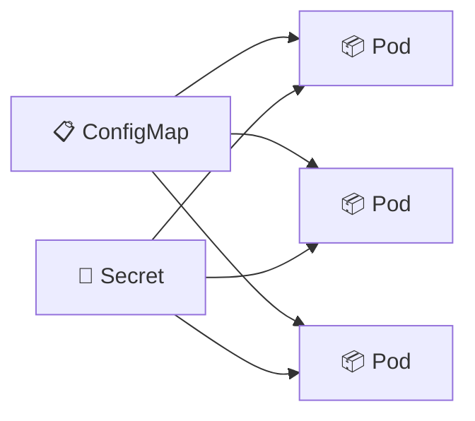

> 💡 **Key Insight:** ConfigMaps for config, Secrets for sensitive data

---

## 📍 Slide 12 – 🚫 ConfigMaps: What They're NOT

| 🚫 Myth | ✅ Reality |
|---------|----------|
| ConfigMaps are secure | ❌ Stored in plain text in etcd |
| ConfigMaps replace Secrets | ❌ Use Secrets for sensitive data |
| ConfigMaps auto-reload apps | ❌ Apps must implement hot-reload |
| ConfigMaps have no size limit | ❌ Limited to 1MB per ConfigMap |

> ⚠️ **Warning:** Never store passwords, tokens, or keys in ConfigMaps!

**When to use which:**

| 📋 ConfigMap | 🔐 Secret |
|-------------|----------|
| Database URLs (without password) | Database passwords |
| Feature flags | API keys |
| Log levels | TLS certificates |
| Application settings | OAuth tokens |

---

## 📍 Slide 13 – 🛠️ Creating ConfigMaps

**Method 1: From literal values**
```bash
kubectl create configmap app-config \
  --from-literal=LOG_LEVEL=INFO \
  --from-literal=CACHE_TTL=3600
```

**Method 2: From a file**
```bash
kubectl create configmap nginx-config \
  --from-file=nginx.conf
```

**Method 3: From YAML manifest**
```yaml
apiVersion: v1
kind: ConfigMap
metadata:
  name: app-config
data:
  LOG_LEVEL: "INFO"
  DATABASE_HOST: "postgres.default.svc"
  config.yaml: |
    server:
      port: 8080
      timeout: 30s
```

---

## 📍 Slide 14 – 🔌 Consuming ConfigMaps

**Option 1: Environment Variables**
```yaml
# ✅ Individual keys
env:
  - name: LOG_LEVEL
    valueFrom:
      configMapKeyRef:
        name: app-config
        key: LOG_LEVEL

# ✅ All keys at once
envFrom:
  - configMapRef:
      name: app-config
```

**Option 2: Volume Mounts (for files)**
```yaml
volumes:
  - name: config-volume
    configMap:
      name: nginx-config
volumeMounts:
  - name: config-volume
    mountPath: /etc/nginx/nginx.conf
    subPath: nginx.conf
```

---

## 📍 Slide 15 – 📊 Before vs After: Configuration

| 📋 Aspect | 😰 Before (Hardcoded) | 🚀 After (ConfigMaps) |
|----------|----------------------|----------------------|
| Build per environment | Yes, multiple images | No, one image |
| Change config | Rebuild & redeploy | Update ConfigMap |
| Version control | In code (scattered) | Centralized, declarative |
| Environment parity | Difficult | Easy |
| Rollback | Redeploy old image | Apply old ConfigMap |
| Audit trail | Git history (code) | K8s + Git history |

> 🤔 **Think:** What configuration in your applications could be externalized?

---

## 📍 Slide 16 – 🎮 Section 3: Let's Simulate!

**Scenario:** You're a DevOps engineer at **CloudMart** 🛒

Your application:
* 🐍 Python/Go web service
* 📊 Needs different configs per environment
* 💾 Stores user uploads
* 🔧 Frequently changes feature flags

**What could go wrong?** Everything! Let's fix it.

---

## 📍 Slide 17 – 💥 Scenario 1: Wrong Environment Config

**Situation:** Developer accidentally deploys with staging database URL to production

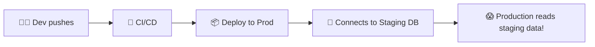

* 😱 **Impact:** Customers see test data
* ⏱️ **Detection time:** 2 hours
* 💰 **Cost:** Lost sales, reputation damage

> 🤔 **Question:** How do we prevent this?

---

## 📍 Slide 18 – ✅ Solution 1: Environment-Specific ConfigMaps

**Fix:** Namespace-isolated ConfigMaps

```yaml
# configmap-prod.yaml
apiVersion: v1
kind: ConfigMap
metadata:
  name: app-config
  namespace: production  # 🔑 Namespace isolation
data:
  DATABASE_HOST: "prod-db.internal"
  ENVIRONMENT: "production"
---
# configmap-staging.yaml
apiVersion: v1
kind: ConfigMap
metadata:
  name: app-config
  namespace: staging
data:
  DATABASE_HOST: "staging-db.internal"
  ENVIRONMENT: "staging"
```

* ✅ **Same ConfigMap name**, different namespaces
* ✅ **Impossible** to mix environments
* ✅ **GitOps friendly** — config in version control

---

## 📍 Slide 19 – 💥 Scenario 2: Config Change Causes Outage

**Situation:** Changed `CACHE_TTL` from 3600 to 36 (typo!) — cache expires every 36 seconds

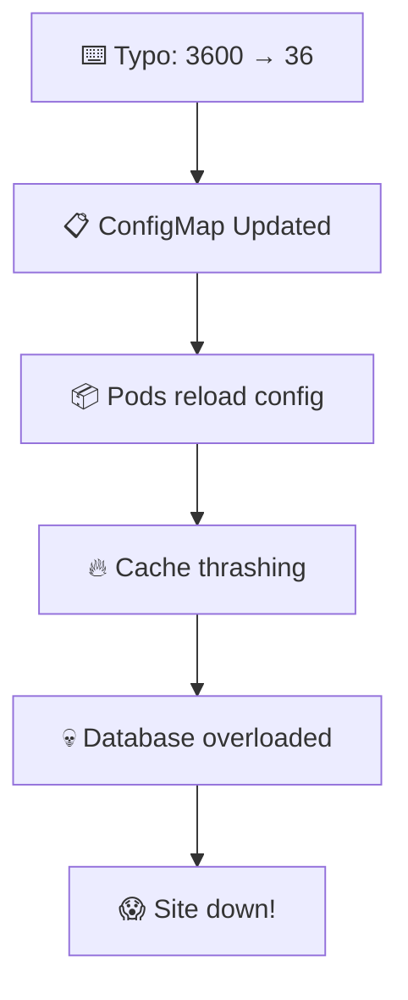

* 😱 **Impact:** 30-minute outage
* 🔍 **Root cause:** No validation, no review

---

## 📍 Slide 20 – ✅ Solution 2: Immutable ConfigMaps + Versioning

**Fix:** Treat ConfigMaps as immutable, version them

```yaml
apiVersion: v1
kind: ConfigMap
metadata:
  name: app-config-v3  # 🔑 Versioned name
  labels:
    version: "3"
immutable: true  # 🔒 Cannot be modified
data:
  CACHE_TTL: "3600"
```

**Deployment references specific version:**
```yaml
envFrom:
  - configMapRef:
      name: app-config-v3  # 🔑 Explicit version
```

* ✅ **Rollback** = change reference to previous version
* ✅ **Audit trail** — which version when
* ✅ **Validation** in CI/CD before applying

---

## 📍 Slide 21 – 💥 Scenario 3: User Uploads Disappear

**Situation:** Deployment rolls out new pods, user uploads are gone

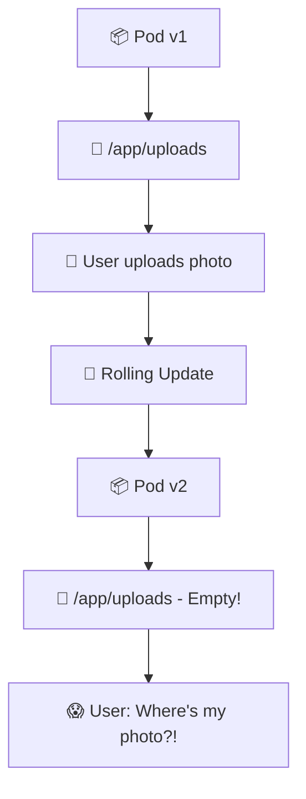

* 💾 Container filesystem is **ephemeral**
* 🔄 New container = **fresh filesystem**
* 😱 All data is **lost**

---

## 📍 Slide 22 – ✅ Solution 3: Persistent Volumes

**Fix:** External storage that survives pod restarts

```yaml
apiVersion: v1
kind: PersistentVolumeClaim
metadata:
  name: uploads-pvc
spec:
  accessModes:
    - ReadWriteOnce
  resources:
    requests:
      storage: 10Gi
---
# In Deployment
volumes:
  - name: uploads
    persistentVolumeClaim:
      claimName: uploads-pvc
volumeMounts:
  - name: uploads
    mountPath: /app/uploads
```

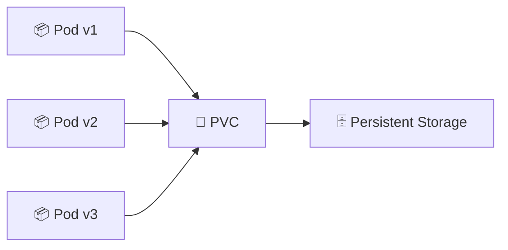

---

## 📍 Slide 23 – 💥 Scenario 4: ConfigMap Update Not Applied

**Situation:** Updated ConfigMap, but app still uses old values


* 🔄 ConfigMap updates **don't automatically restart** pods
* 📦 Pod keeps the config from when it started

---

## 📍 Slide 24 – ✅ Solution 4: Config Reload Strategies

**Strategy 1: Restart Deployment**
```bash
kubectl rollout restart deployment/myapp
```

**Strategy 2: Use a hash annotation (GitOps-friendly)**
```yaml
metadata:
  annotations:
    checksum/config: {{ sha256sum .Values.config | quote }}
```

**Strategy 3: App-level hot reload**
* 📂 Mount ConfigMap as volume
* 👀 Watch for file changes
* 🔄 Reload configuration in-memory

**Strategy 4: Reloader controller**
* 🤖 Automatically restarts pods when ConfigMap changes
* 📦 `stakater/reloader` — popular open source solution

---

## 📍 Slide 25 – 📝 QUIZ — DEVOPS_L12_MID

---

## 📍 Slide 26 – 💾 Section 4: Persistent Storage Deep Dive

**The Storage Stack in Kubernetes:**

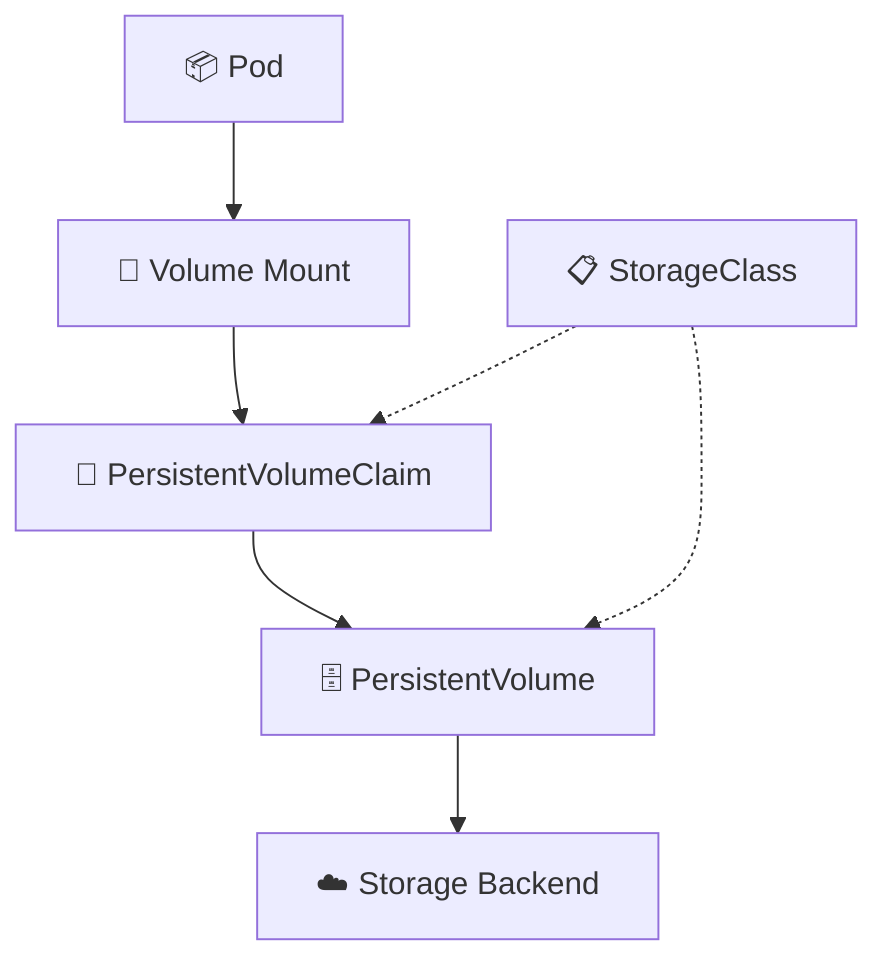

* 📦 **Pod:** Uses the storage via mount
* 💾 **PVC:** Request for storage ("I need 10GB")
* 🗄️ **PV:** Actual storage resource
* ☁️ **Backend:** AWS EBS, GCE PD, NFS, local disk
* 📋 **StorageClass:** Template for dynamic provisioning

---

## 📍 Slide 27 – 📋 Storage Concepts Breakdown

| 🔧 Concept | 📝 Description | 🎯 Analogy |
|-----------|---------------|-----------|
| **PersistentVolume (PV)** | A piece of storage in the cluster | A physical hard drive |
| **PersistentVolumeClaim (PVC)** | A request for storage | "I need a 100GB drive" |
| **StorageClass** | Template for provisioning | "Give me SSD storage" |
| **Access Modes** | How pods can access | ReadWriteOnce, ReadWriteMany |
| **Reclaim Policy** | What happens when PVC deleted | Retain, Delete, Recycle |

**Access Modes:**
* 🔒 **ReadWriteOnce (RWO):** One node can mount read-write
* 📖 **ReadOnlyMany (ROX):** Many nodes can mount read-only
* 📝 **ReadWriteMany (RWX):** Many nodes can mount read-write

---

## 📍 Slide 28 – 🔄 Dynamic Provisioning

**Without Dynamic Provisioning (Manual):**
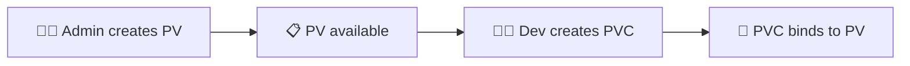

**With Dynamic Provisioning (Automatic):**
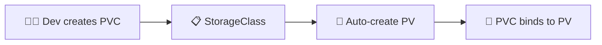

```yaml
apiVersion: storage.k8s.io/v1
kind: StorageClass
metadata:
  name: fast-ssd
provisioner: kubernetes.io/gce-pd  # Cloud-specific
parameters:
  type: pd-ssd
reclaimPolicy: Delete
volumeBindingMode: WaitForFirstConsumer
```

---

## 📍 Slide 29 – ⚠️ Storage Pitfalls

| ⚠️ Pitfall | 💥 Impact | ✅ Solution |
|-----------|----------|------------|
| Wrong access mode | Pod scheduling fails | Match mode to use case |
| No storage class | PVC pending forever | Set default StorageClass |
| Reclaim = Delete | Data lost on PVC delete | Use Retain for important data |
| Zone mismatch | Pod can't mount volume | Use topology-aware provisioning |
| Insufficient capacity | PVC pending | Monitor storage usage |

**Common error:**
```
Warning  FailedScheduling  pod has unbound immediate PersistentVolumeClaims
```

> 🔍 **Debug:** `kubectl describe pvc <name>` — check events

---

## 📍 Slide 30 – 📊 Volume Types Comparison

| 📦 Volume Type | 🎯 Use Case | ⚡ Performance | 💰 Cost |
|---------------|------------|---------------|--------|
| **emptyDir** | Temp data, cache | Fast (node storage) | Free |
| **hostPath** | Node-specific data | Fast | Free |
| **NFS** | Shared storage | Medium | Varies |
| **Cloud (EBS, PD)** | Production workloads | Configurable | $$$ |
| **Local PV** | Databases, high IOPS | Very fast | Node-dependent |

**Decision tree:**
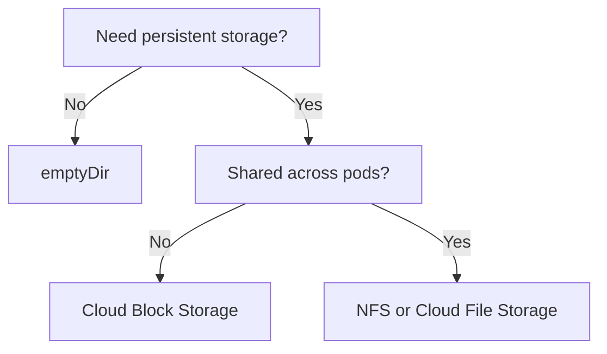

---

## 📍 Slide 31 – 🔧 Practical PVC Example

**Complete example for a web application:**

```yaml
apiVersion: v1
kind: PersistentVolumeClaim
metadata:
  name: app-uploads
spec:
  accessModes:
    - ReadWriteOnce
  storageClassName: standard
  resources:
    requests:
      storage: 5Gi
---
apiVersion: apps/v1
kind: Deployment
metadata:
  name: webapp
spec:
  template:
    spec:
      containers:
        - name: app
          volumeMounts:
            - name: uploads
              mountPath: /app/uploads
      volumes:
        - name: uploads
          persistentVolumeClaim:
            claimName: app-uploads
```

---

## 📍 Slide 32 – 📈 Storage Lifecycle

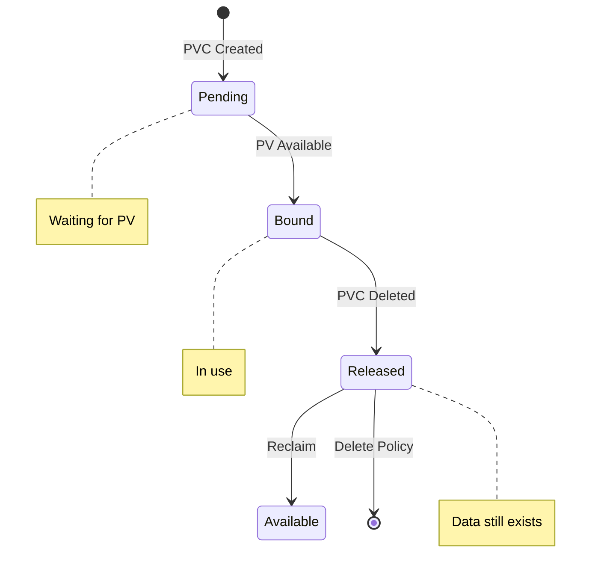

**Key states:**
* ⏳ **Pending:** Waiting for matching PV
* ✅ **Bound:** PVC matched to PV
* 🔓 **Released:** PVC deleted, PV still has data
* ❌ **Failed:** Error in provisioning

---

## 📍 Slide 33 – 🏭 Section 5: Production Patterns

**Pattern 1: GitOps Configuration Management**

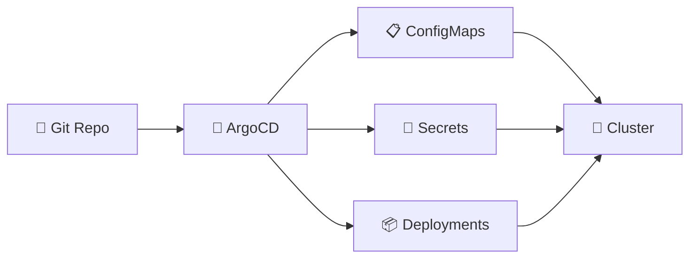

* 📋 **All configuration in Git** — single source of truth
* 🔄 **ArgoCD syncs** to cluster
* 🔍 **Audit trail** — who changed what, when
* ↩️ **Rollback** — `git revert`

---

## 📍 Slide 34 – 🔧 Pattern 2: Environment Hierarchy

**Kustomize for environment-specific configs:**

```
base/
  ├── deployment.yaml
  ├── service.yaml
  └── configmap.yaml
overlays/
  ├── dev/
  │   └── kustomization.yaml
  ├── staging/
  │   └── kustomization.yaml
  └── prod/
      └── kustomization.yaml
```

```yaml
# overlays/prod/kustomization.yaml
resources:
  - ../../base
configMapGenerator:
  - name: app-config
    literals:
      - LOG_LEVEL=WARN
      - REPLICAS=5
```

* ✅ **DRY** — Don't Repeat Yourself
* ✅ **Environment-specific** overrides
* ✅ **Consistent** base configuration

---

## 📍 Slide 35 – 🔐 Pattern 3: Secrets + ConfigMaps Together

**Combining Secrets and ConfigMaps:**

```yaml
spec:
  containers:
    - name: app
      env:
        # 📋 From ConfigMap (non-sensitive)
        - name: DATABASE_HOST
          valueFrom:
            configMapKeyRef:
              name: app-config
              key: DATABASE_HOST
        # 🔐 From Secret (sensitive)
        - name: DATABASE_PASSWORD
          valueFrom:
            secretKeyRef:
              name: app-secrets
              key: db-password
```

**Best Practice:**
* 📋 **ConfigMap:** URLs, ports, feature flags
* 🔐 **Secret:** Passwords, tokens, certificates
* 🔒 **Never mix** sensitive and non-sensitive data

---

## 📍 Slide 36 – 📊 Configuration Best Practices

| 🔧 Practice | 📝 Description |
|------------|---------------|
| **Version ConfigMaps** | Include version in name (`app-config-v2`) |
| **Use namespaces** | Isolate environments (dev, staging, prod) |
| **Validate in CI** | Check config syntax before deploy |
| **Document defaults** | What happens if config missing? |
| **Monitor changes** | Alert on ConfigMap updates |
| **Limit size** | Keep ConfigMaps under 1MB |
| **Use labels** | Tag configs with app, version, environment |

---

## 📍 Slide 37 – 🎯 Key Takeaways

1. 📋 **ConfigMaps** separate configuration from code — one image, any environment
2. 🔐 **ConfigMaps ≠ Secrets** — never store sensitive data in ConfigMaps
3. 💾 **PVCs** provide persistent storage that survives pod restarts
4. 🔄 **Dynamic provisioning** automates storage management
5. 📁 **Version your configs** — treat them like code
6. 🏭 **GitOps** — configuration in Git is the source of truth

> 💬 *"Configuration belongs in the environment, not the artifact."*
> — 12-Factor App

---

## 📍 Slide 38 – 📝 QUIZ — DEVOPS_L12_POST

---

## 📍 Slide 39 – 🚀 What's Next?

**Coming up: Lecture 13 — GitOps with ArgoCD**


* 🔄 **Continuous Deployment** automated
* 📝 **Git as single source of truth**
* 🔍 **Drift detection** and auto-sync
* ↩️ **Easy rollbacks** with git revert

> 🎯 **Lab 12:** Apply these concepts — create ConfigMaps, use PVCs, externalize your app configuration!

---

## 📚 Resources

**Documentation:**
* 📖 [Kubernetes ConfigMaps](https://kubernetes.io/docs/concepts/configuration/configmap/)
* 📖 [Persistent Volumes](https://kubernetes.io/docs/concepts/storage/persistent-volumes/)
* 📖 [12-Factor App — Config](https://12factor.net/config)

**Tools:**
* 🔧 [Kustomize](https://kustomize.io/)
* 🔧 [Reloader](https://github.com/stakater/Reloader)

**Books:**
* 📕 *Kubernetes Patterns* by Bilgin Ibryam & Roland Huß
* 📕 *Cloud Native DevOps with Kubernetes* by John Arundel & Justin Domingus
