# 📌 Lecture 13 — GitOps with ArgoCD: Git as the Source of Truth

> 🎯 **From manual deployments to automated, auditable, self-healing infrastructure**

---

## 📍 Slide 1 – 🚀 Welcome to GitOps

We've learned to store configuration in **ConfigMaps** and **Secrets**. But who deploys them?

* 👨‍💻 **Manual kubectl?** — "Who ran that command?"
* 🔄 **CI/CD pipeline?** — Push-based, fragile
* 🤔 **What about drift?** — Reality vs desired state


> 🎯 **Goal:** Git becomes the single source of truth for your entire infrastructure

---

## 📍 Slide 2 – 📚 Learning Outcomes

By the end of this lecture, you will:

| # | 🎯 Outcome |
|---|-----------|
| 1 | ✅ Understand **GitOps principles** and benefits |
| 2 | ✅ Differentiate **push vs pull** deployment models |
| 3 | ✅ Deploy applications using **ArgoCD** |
| 4 | ✅ Configure **sync policies** and **auto-healing** |
| 5 | ✅ Handle **secrets** in GitOps workflows |
| 6 | ✅ Implement **multi-environment** deployments |

---

## 📍 Slide 3 – 🗺️ Lecture Overview

```
┌─────────────────────────────────────────────────────────────┐
│  SECTION 0: Introduction                    (Slides 1-4)   │
├─────────────────────────────────────────────────────────────┤
│  📝 PRE QUIZ                                (Slide 5)      │
├─────────────────────────────────────────────────────────────┤
│  SECTION 1: The Deployment Problem          (Slides 6-10)  │
├─────────────────────────────────────────────────────────────┤
│  SECTION 2: GitOps Principles               (Slides 11-15) │
├─────────────────────────────────────────────────────────────┤
│  SECTION 3: ArgoCD in Action                (Slides 16-24) │
├─────────────────────────────────────────────────────────────┤
│  📝 MID QUIZ                                (Slide 25)     │
├─────────────────────────────────────────────────────────────┤
│  SECTION 4: Advanced Patterns               (Slides 26-32) │
├─────────────────────────────────────────────────────────────┤
│  SECTION 5: Production GitOps               (Slides 33-37) │
├─────────────────────────────────────────────────────────────┤
│  📝 POST QUIZ                               (Slide 38)     │
├─────────────────────────────────────────────────────────────┤
│  FINAL: What's Next                         (Slide 39)     │
└─────────────────────────────────────────────────────────────┘
```

---

## 📍 Slide 4 – 🤔 The Big Question

> 💬 *"If it's not in Git, it doesn't exist."*
> — GitOps Mantra

**Consider this scenario:**

* 🌙 **3 AM alert:** Production is down
* 🔍 **Investigation:** Someone changed a deployment
* ❓ **Questions:** Who? When? What changed? How to rollback?
* 😱 **Answer:** Nobody knows...

> 🤔 **Think:** How do we ensure every change is tracked, auditable, and reversible?

---

## 📍 Slide 5 – 📝 QUIZ — DEVOPS_L13_PRE

---

## 📍 Slide 6 – ⚠️ Section 1: The Deployment Problem

**Traditional Deployment Models:**

```mermaid
flowchart TD
  subgraph 😰 Manual
    A[👨‍💻 Developer] --> B[⌨️ kubectl apply]
    B --> C[☸️ Cluster]
  end

  subgraph 🔄 CI/CD Push
    D[📝 Git Push] --> E[🔧 CI Pipeline]
    E --> F[⌨️ kubectl apply]
    F --> G[☸️ Cluster]
  end
```

* 😰 **Manual:** No audit trail, human error, inconsistent
* 🔄 **CI/CD Push:** Better, but credentials in pipeline, cluster access

---

## 📍 Slide 7 – 🔥 Pain Point 1: The "It Works on My Machine" Problem

**Symptoms:**

* 👨‍💻 **Dev:** "I deployed it, it's working!"
* 🏭 **Prod:** "It's completely broken!"
* 🔍 **Investigation:** Configs don't match

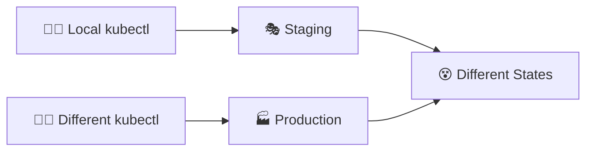

* 🔧 **No single source of truth**
* 📋 **Manual processes** lead to drift
* 😱 **"Emergency fixes"** bypass procedures

---

## 📍 Slide 8 – 🔥 Pain Point 2: Configuration Drift

**Drift:** When actual state ≠ desired state

| 📅 Time | 📝 Git (Desired) | ☸️ Cluster (Actual) | 😱 Drift |
|---------|------------------|---------------------|----------|
| Day 1 | replicas: 3 | replicas: 3 | ✅ None |
| Day 5 | replicas: 3 | replicas: 5 (scaled manually) | ⚠️ Drift! |
| Day 10 | replicas: 3 | replicas: 5, extra env var | 🔥 More drift! |
| Day 30 | 🤷 Unknown | 🤷 Unknown | 💀 Chaos |

**Real impact:**
* 🔄 **Deployments fail** because actual state differs
* 📋 **Documentation lies** — cluster is reality
* 🔍 **Debugging nightmare** — which version is deployed?

---

## 📍 Slide 9 – 🔥 Pain Point 3: Credential Sprawl

**Push-based CI/CD security concerns:**

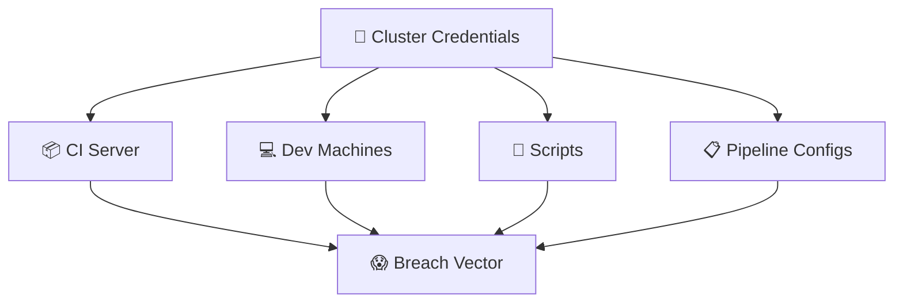

* 🔐 **Credentials everywhere** — CI servers, dev machines
* 🎯 **Attack surface** expands with each tool
* 🔑 **Shared secrets** — who has access?

---

## 📍 Slide 10 – 💰 The Cost of Manual Deployments

| 🔥 Problem | 💥 Impact | 📊 Data |
|-----------|----------|---------|
| No audit trail | Compliance failures | 73% fail audits without GitOps |
| Manual errors | Outages | 70% of outages are human error |
| Credential sprawl | Security breaches | Average breach cost: $4.45M |
| Slow recovery | Downtime | MTTR 4x longer without GitOps |

> 💬 *"The cost of a breach is not the breach itself, but the inability to respond quickly."*

---

## 📍 Slide 11 – ✅ Section 2: GitOps Principles

**What is GitOps?**

* 📝 **Git as single source of truth** — declarative desired state
* 🔄 **Continuous reconciliation** — actual → desired
* 🔀 **Pull-based deployment** — agent pulls from Git
* 🔒 **Immutable, auditable** — every change tracked

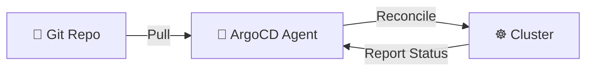

> 💡 **Key Insight:** The cluster pulls changes, no credentials leave the cluster!

---

## 📍 Slide 12 – 🚫 GitOps: What It's NOT

| 🚫 Myth | ✅ Reality |
|---------|----------|
| Just using Git for YAML files | A complete operational model with reconciliation |
| Another CI/CD tool | Continuous deployment, not continuous integration |
| Only for Kubernetes | Works for any declarative infrastructure |
| Complicated to adopt | Can start simple, grow incrementally |

> 🔥 **Hot take:** "Putting YAML in Git is not GitOps. GitOps is about the reconciliation loop."

**The Four Principles (from OpenGitOps):**
1. 📝 **Declarative** — Desired state expressed declaratively
2. 🔄 **Versioned and Immutable** — Stored in Git
3. 🤖 **Pulled Automatically** — Agents pull desired state
4. ♾️ **Continuously Reconciled** — Agents ensure actual = desired

---

## 📍 Slide 13 – 🔄 Push vs Pull Deployment

```mermaid
flowchart TD
  subgraph 🔄 Push Model
    A[📝 Git] --> B[🔧 CI/CD]
    B --> |Push credentials needed| C[☸️ Cluster]
  end

  subgraph 🚀 Pull Model - GitOps
    D[📝 Git] --> |Pull| E[🤖 Agent in Cluster]
    E --> |Apply| F[☸️ Same Cluster]
  end
```

| 📋 Aspect | 🔄 Push | 🚀 Pull (GitOps) |
|----------|--------|------------------|
| Credentials | CI needs cluster creds | Agent has local access |
| Drift detection | None | Continuous |
| Audit trail | CI logs (external) | Git history |
| Recovery | Re-run pipeline | Automatic reconciliation |

---

## 📍 Slide 14 – 🛠️ GitOps Tools Landscape

| 🛠️ Tool | 📝 Description | ⭐ Best For |
|---------|---------------|------------|
| **ArgoCD** | Declarative GitOps for K8s | Most Kubernetes use cases |
| **Flux** | Toolkit approach, CNCF project | Composable, extensible setups |
| **Jenkins X** | CI/CD + GitOps combined | Jenkins-heavy organizations |
| **Rancher Fleet** | Multi-cluster GitOps | Managing many clusters |

**Why ArgoCD?**
* 🎯 Most adopted (70%+ of GitOps users)
* 🖥️ Excellent UI for visualization
* 🔧 Rich feature set out of the box
* 📚 Large community, good documentation

---

## 📍 Slide 15 – 📊 Before vs After: Deployment

| 📋 Aspect | 😰 Before (Manual/Push) | 🚀 After (GitOps) |
|----------|-------------------------|-------------------|
| Change process | kubectl, scripts, pipelines | Git PR → merge → auto-sync |
| Audit trail | Scattered logs | Complete Git history |
| Rollback | "Which version was before?" | `git revert` |
| Drift | Undetected until failure | Detected immediately |
| Credentials | Spread across tools | Stay in cluster |
| Recovery | Manual intervention | Self-healing |

> 🤔 **Think:** How would GitOps have helped in your last deployment issue?

---

## 📍 Slide 16 – 🎮 Section 3: ArgoCD in Action

**ArgoCD Architecture:**

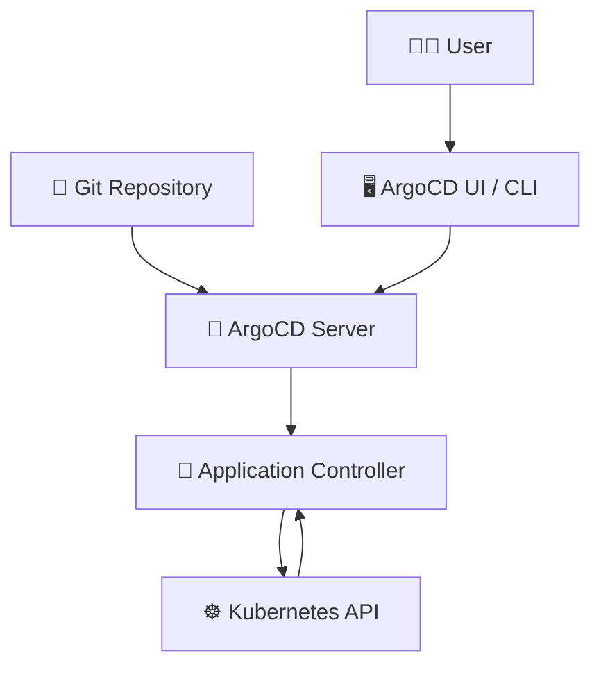

**Components:**
* 🖥️ **API Server:** UI, CLI, webhook endpoints
* 🔄 **Application Controller:** Reconciliation engine
* 📦 **Repository Server:** Caches Git repos, renders manifests
* 🔗 **Dex:** SSO authentication (optional)

---

## 📍 Slide 17 – 💥 Scenario 1: First ArgoCD Deployment

**Situation:** Deploy your first application with ArgoCD

```yaml
# Application manifest
apiVersion: argoproj.io/v1alpha1
kind: Application
metadata:
  name: my-app
  namespace: argocd
spec:
  project: default
  source:
    repoURL: https://github.com/org/app-manifests
    path: environments/dev
    targetRevision: main
  destination:
    server: https://kubernetes.default.svc
    namespace: dev
```


---

## 📍 Slide 18 – ✅ Solution 1: Understanding Sync

**Sync States:**

| 🔄 State | 📝 Meaning | 🎯 Action |
|----------|-----------|----------|
| **Synced** | Cluster matches Git | ✅ Good! |
| **OutOfSync** | Cluster differs from Git | 🔄 Sync needed |
| **Unknown** | Can't determine state | 🔍 Check connection |
| **Missing** | Resources don't exist yet | 🔄 Initial sync |

**Health States:**

| 💚 Health | 📝 Meaning |
|----------|-----------|
| **Healthy** | All resources running correctly |
| **Progressing** | Resources being updated |
| **Degraded** | Some resources have issues |
| **Suspended** | Manually paused |

---

## 📍 Slide 19 – 💥 Scenario 2: Handling Drift

**Situation:** Someone manually changed replicas in the cluster

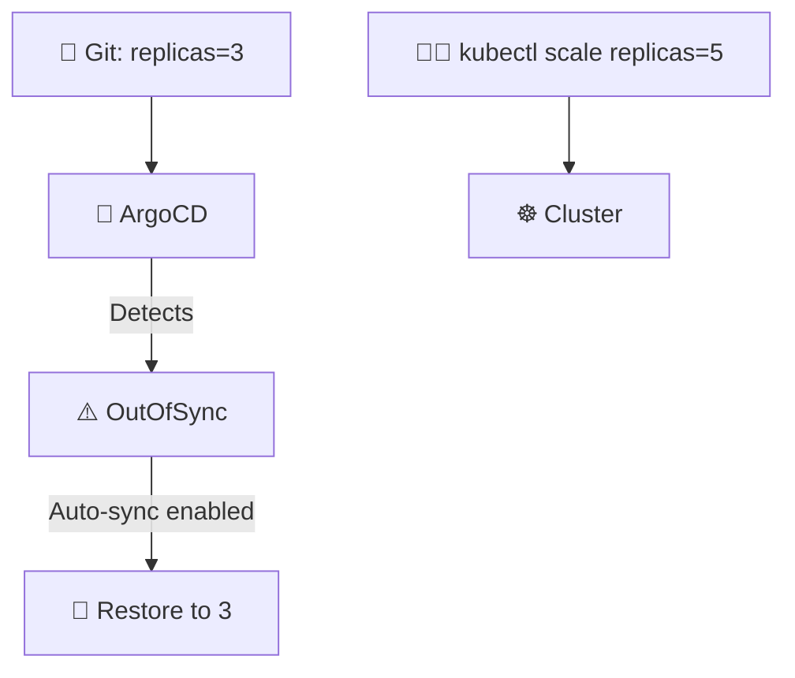

**ArgoCD detects drift immediately!**
* 🔍 **Visibility:** Shows exactly what differs
* 🔄 **Options:** Manual sync or auto-sync
* 📋 **Audit:** Who changed Git matters, not who ran kubectl

---

## 📍 Slide 20 – ✅ Solution 2: Sync Policies

**Configure automatic reconciliation:**

```yaml
spec:
  syncPolicy:
    automated:
      prune: true        # Delete resources not in Git
      selfHeal: true     # Revert manual changes
    syncOptions:
      - CreateNamespace=true
      - PruneLast=true
```

**Options explained:**
* 🔄 **automated:** Enable auto-sync on Git changes
* 🗑️ **prune:** Delete resources removed from Git
* 💚 **selfHeal:** Revert manual cluster changes
* 📦 **CreateNamespace:** Create namespace if missing

---

## 📍 Slide 21 – 💥 Scenario 3: Multi-Environment Deployment

**Situation:** Same app, different configs for dev/staging/prod

```
repo/
├── base/
│   ├── deployment.yaml
│   └── service.yaml
└── overlays/
    ├── dev/
    │   └── kustomization.yaml
    ├── staging/
    │   └── kustomization.yaml
    └── prod/
        └── kustomization.yaml
```

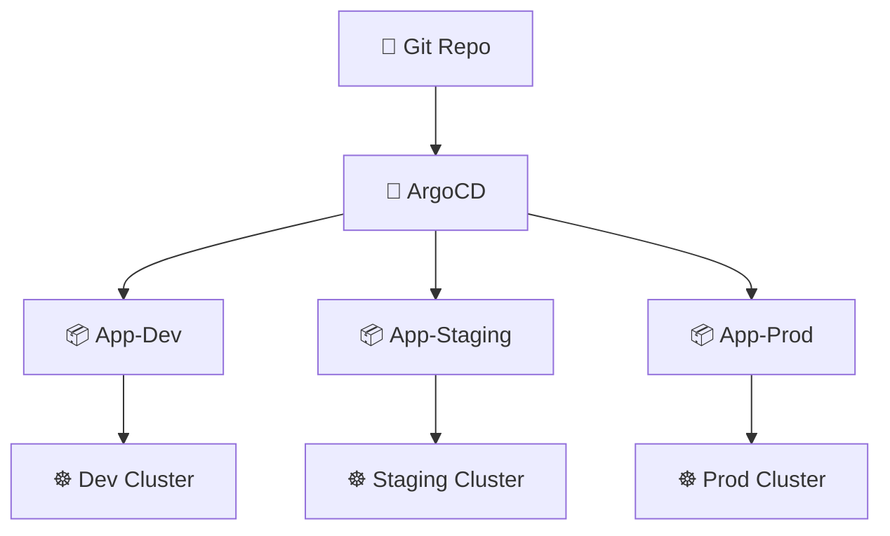

---

## 📍 Slide 22 – ✅ Solution 3: ApplicationSet

**Deploy to multiple environments with one definition:**

```yaml
apiVersion: argoproj.io/v1alpha1
kind: ApplicationSet
metadata:
  name: my-app
spec:
  generators:
    - list:
        elements:
          - env: dev
            namespace: dev
          - env: staging
            namespace: staging
          - env: prod
            namespace: prod
  template:
    metadata:
      name: 'my-app-{{env}}'
    spec:
      source:
        repoURL: https://github.com/org/manifests
        path: 'overlays/{{env}}'
      destination:
        namespace: '{{namespace}}'
```

---

## 📍 Slide 23 – 💥 Scenario 4: Secrets in GitOps

**Problem:** Secrets shouldn't be in Git... but GitOps needs everything in Git!

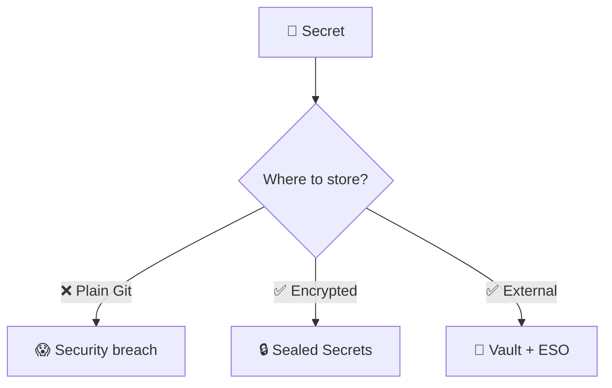

**The dilemma:**
* 📝 GitOps: Everything in Git
* 🔐 Security: Secrets NOT in Git
* 🤔 How to reconcile?

---

## 📍 Slide 24 – ✅ Solution 4: Secrets Management Patterns

**Option 1: Sealed Secrets**
```yaml
apiVersion: bitnami.com/v1alpha1
kind: SealedSecret
metadata:
  name: my-secret
spec:
  encryptedData:
    password: AgBghY8... # Encrypted, safe to commit!
```

**Option 2: External Secrets Operator + Vault**
```yaml
apiVersion: external-secrets.io/v1beta1
kind: ExternalSecret
metadata:
  name: my-secret
spec:
  secretStoreRef:
    name: vault-backend
  target:
    name: my-secret
  data:
    - secretKey: password
      remoteRef:
        key: app/database
        property: password
```

* ✅ **Encrypted in Git** (Sealed Secrets)
* ✅ **Reference only in Git** (External Secrets)

---

## 📍 Slide 25 – 📝 QUIZ — DEVOPS_L13_MID

---

## 📍 Slide 26 – 🔧 Section 4: Advanced ArgoCD Patterns

**Sync Waves & Hooks:**

```yaml
metadata:
  annotations:
    argocd.argoproj.io/sync-wave: "1"  # Order of deployment
    argocd.argoproj.io/hook: PreSync   # Run before main sync
```


**Use cases:**
* 📊 **Database migrations** before app deploy
* 🧹 **Cleanup jobs** after deployment
* 🔍 **Health checks** between phases

---

## 📍 Slide 27 – 🔄 Sync Options Deep Dive

| 🔧 Option | 📝 Purpose |
|----------|-----------|
| `Replace` | Replace instead of apply (for immutable fields) |
| `PruneLast` | Delete resources after all others sync |
| `ApplyOutOfSyncOnly` | Only apply changed resources |
| `ServerSideApply` | Use server-side apply (K8s 1.22+) |
| `FailOnSharedResource` | Fail if resource owned by another app |

```yaml
syncPolicy:
  syncOptions:
    - CreateNamespace=true
    - PrunePropagationPolicy=foreground
    - PruneLast=true
```

---

## 📍 Slide 28 – 🏗️ Repository Structure Patterns

**Pattern 1: Monorepo**
```
repo/
├── apps/
│   ├── app1/
│   └── app2/
└── infrastructure/
    ├── prometheus/
    └── argocd/
```

**Pattern 2: Repo per App**
```
app1-config/     # App 1 manifests
app2-config/     # App 2 manifests
infrastructure/  # Shared infra
```

**Pattern 3: Environment Repos**
```
dev-cluster/     # All dev apps
prod-cluster/    # All prod apps
```

> 💡 **Recommendation:** Start with monorepo, split when it gets complex

---

## 📍 Slide 29 – 📊 ArgoCD Metrics & Monitoring

**Key metrics to watch:**

| 📊 Metric | 📝 Meaning | ⚠️ Alert When |
|----------|-----------|--------------|
| `argocd_app_sync_total` | Total syncs | Unusually high |
| `argocd_app_health_status` | App health | Not healthy |
| `argocd_app_reconcile_duration` | Sync time | > 5 minutes |
| `argocd_cluster_api_resource_objects` | Total objects | Growing unexpectedly |

**Dashboard integration:**
* 📊 Grafana dashboards available
* 🔔 Alertmanager integration
* 📝 Slack/Teams notifications

---

## 📍 Slide 30 – 🔐 RBAC & Multi-tenancy

**ArgoCD RBAC:**

```yaml
# argocd-rbac-cm ConfigMap
policy.csv: |
  p, role:dev-team, applications, get, dev-project/*, allow
  p, role:dev-team, applications, sync, dev-project/*, allow
  p, role:ops-team, applications, *, */*, allow

  g, dev-group, role:dev-team
  g, ops-group, role:ops-team
```

**Projects for isolation:**
```yaml
apiVersion: argoproj.io/v1alpha1
kind: AppProject
metadata:
  name: dev-project
spec:
  sourceRepos:
    - 'https://github.com/org/dev-*'
  destinations:
    - namespace: 'dev-*'
      server: https://kubernetes.default.svc
```

---

## 📍 Slide 31 – 🚨 Disaster Recovery

**Git is your backup!**

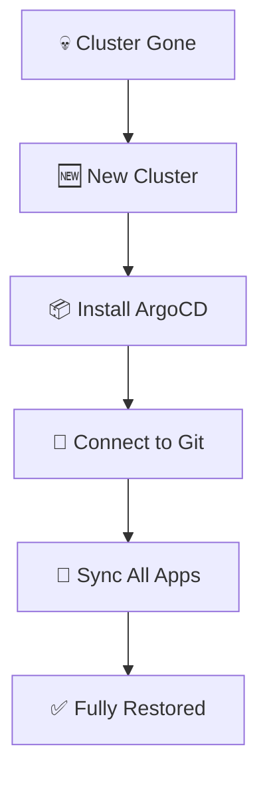

**Recovery steps:**
1. 🆕 Create new cluster
2. 📦 Install ArgoCD
3. 🔗 Point to Git repository
4. ☕ Wait for sync
5. ✅ Everything restored!

> 💡 **Key insight:** If Git has everything, recovery is just a sync away

---

## 📍 Slide 32 – 📋 GitOps Workflow Summary

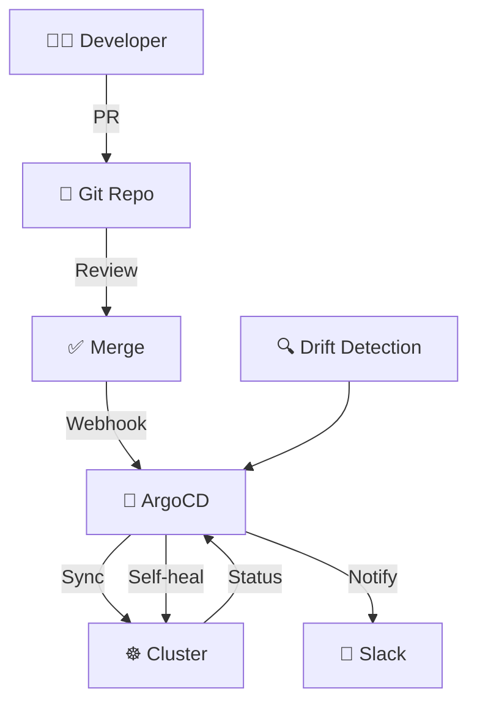

**The complete loop:**
1. 📝 **Change:** Developer creates PR
2. 👀 **Review:** Team reviews and approves
3. 🔀 **Merge:** Changes merge to main
4. 🤖 **Detect:** ArgoCD detects new commit
5. 🔄 **Sync:** Resources deployed to cluster
6. 💚 **Verify:** Health checks pass
7. 📢 **Notify:** Team informed of deployment

---

## 📍 Slide 33 – 🏭 Section 5: Production GitOps

**Enterprise Patterns:**

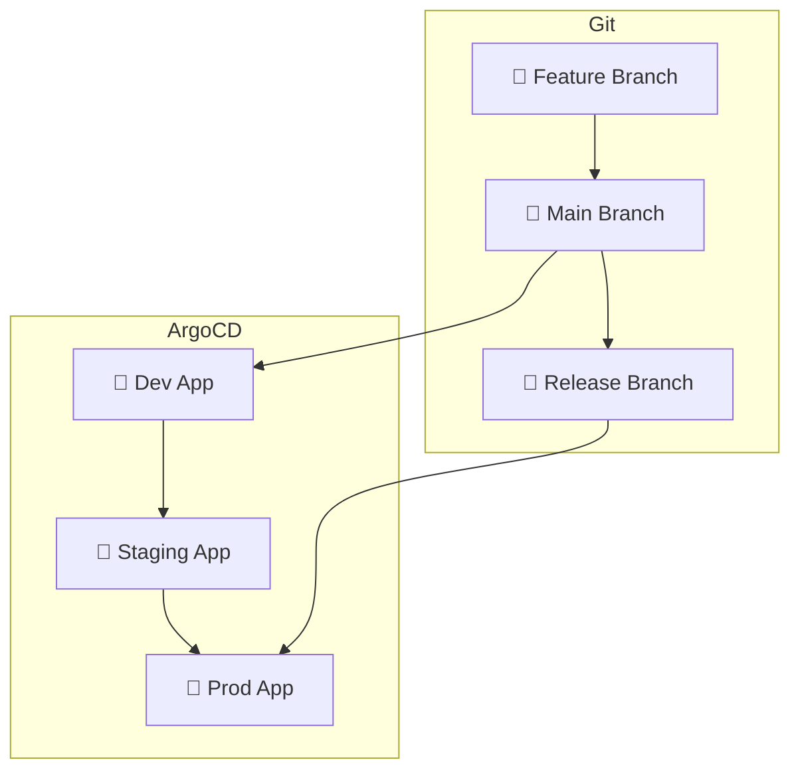

* 🔀 **Branch strategy:** Main for dev, release for prod
* 🎯 **Progressive delivery:** Dev → Staging → Prod
* ✅ **Promotion:** PR from main to release

---

## 📍 Slide 34 – 🏢 Real-World GitOps: Intuit

**Case Study: Intuit's GitOps Journey**

* 📊 **Scale:** 2,000+ applications
* 🔄 **Deployments:** 500+ per day
* ⏱️ **MTTR:** Reduced by 80%

**What they learned:**
* 📋 Start small, grow incrementally
* 🔧 Standardize templates early
* 👥 Train teams on Git workflows
* 📊 Monitor everything

> 💬 *"GitOps turned our deployment from a ceremony into a non-event."* — Intuit Engineer

---

## 📍 Slide 35 – 🔧 Migration Strategy

**Adopting GitOps incrementally:**

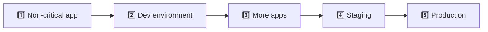

**Phases:**
1. 🧪 **Pilot:** One non-critical app in dev
2. 📚 **Learn:** Document patterns, train team
3. 📦 **Expand:** More apps, still dev
4. 🎭 **Staging:** Full staging environment
5. 🏭 **Production:** Controlled rollout

---

## 📍 Slide 36 – 🎯 Key Takeaways

1. 📝 **Git is the source of truth** — not the cluster, not CI/CD
2. 🔄 **Pull > Push** — credentials stay in cluster
3. 💚 **Self-healing** — drift is detected and corrected
4. 🔍 **Complete audit trail** — git log is your history
5. ↩️ **Easy rollback** — `git revert` reverts infrastructure
6. 🔐 **Secrets need special handling** — Sealed Secrets or External Secrets

> 💬 *"Operations by Pull Request"*
> — Kelsey Hightower

---

## 📍 Slide 37 – 🧠 Mindset Shift

| 😰 Old Mindset | 🚀 New Mindset |
|---------------|----------------|
| "I'll just kubectl this" | "Let me create a PR" |
| "The cluster is truth" | "Git is truth" |
| "We need cluster access" | "We need Git access" |
| "Rollback is scary" | "Rollback is git revert" |
| "Who changed what?" | "Check git log" |
| "Emergency fix!" | "Emergency PR with fast review" |

> 🤔 **Question:** Which mindset do you operate with today?

---

## 📍 Slide 38 – 📝 QUIZ — DEVOPS_L13_POST

---

## 📍 Slide 39 – 🚀 What's Next?

**Coming up: Lecture 14 — Progressive Delivery with Argo Rollouts**


* 🐤 **Canary deployments** — test with small traffic
* 🔵 **Blue-green deployments** — instant switchover
* 📊 **Automated analysis** — metrics-driven promotion
* ↩️ **Automatic rollback** — on failure

> 🎯 **Lab 13:** Set up ArgoCD and deploy your application using GitOps!

---

## 📚 Resources

**Documentation:**
* 📖 [ArgoCD Docs](https://argo-cd.readthedocs.io/)
* 📖 [OpenGitOps](https://opengitops.dev/)
* 📖 [Sealed Secrets](https://sealed-secrets.netlify.app/)
* 📖 [External Secrets Operator](https://external-secrets.io/)

**Tools:**
* 🔧 [ArgoCD](https://argoproj.github.io/cd/)
* 🔧 [Flux](https://fluxcd.io/)
* 🔧 [Kustomize](https://kustomize.io/)

**Books:**
* 📕 *GitOps and Kubernetes* by Billy Yuen, et al.
* 📕 *Continuous Delivery* by Jez Humble & David Farley
