# 📌 Lecture 14 — Progressive Delivery: Deploying with Confidence

> 🎯 **From risky big-bang deployments to controlled, observable releases**

---

## 📍 Slide 1 – 🚀 Welcome to Progressive Delivery

GitOps solved **how** we deploy. But **when things go wrong**...

* 💥 **Traditional deploy:** 100% traffic instantly → all users affected
* 🐤 **Canary:** 5% traffic first → catch issues early
* 🔵 **Blue-green:** Switch traffic instantly → easy rollback

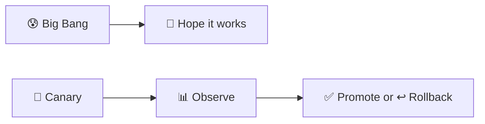

> 🎯 **Goal:** Deploy changes safely with automated analysis and rollback

---

## 📍 Slide 2 – 📚 Learning Outcomes

By the end of this lecture, you will:

| # | 🎯 Outcome |
|---|-----------|
| 1 | ✅ Understand **progressive delivery** concepts and benefits |
| 2 | ✅ Implement **canary deployments** with Argo Rollouts |
| 3 | ✅ Configure **blue-green deployments** for instant rollback |
| 4 | ✅ Set up **automated analysis** with metrics |
| 5 | ✅ Design **traffic management** strategies |
| 6 | ✅ Handle **rollback scenarios** gracefully |

---

## 📍 Slide 3 – 🗺️ Lecture Overview

```
┌─────────────────────────────────────────────────────────────┐
│  SECTION 0: Introduction                    (Slides 1-4)   │
├─────────────────────────────────────────────────────────────┤
│  📝 PRE QUIZ                                (Slide 5)      │
├─────────────────────────────────────────────────────────────┤
│  SECTION 1: The Deployment Risk Problem     (Slides 6-10)  │
├─────────────────────────────────────────────────────────────┤
│  SECTION 2: Progressive Delivery Concepts   (Slides 11-15) │
├─────────────────────────────────────────────────────────────┤
│  SECTION 3: Argo Rollouts in Action         (Slides 16-24) │
├─────────────────────────────────────────────────────────────┤
│  📝 MID QUIZ                                (Slide 25)     │
├─────────────────────────────────────────────────────────────┤
│  SECTION 4: Advanced Strategies             (Slides 26-32) │
├─────────────────────────────────────────────────────────────┤
│  SECTION 5: Production Patterns             (Slides 33-37) │
├─────────────────────────────────────────────────────────────┤
│  📝 POST QUIZ                               (Slide 38)     │
├─────────────────────────────────────────────────────────────┤
│  FINAL: What's Next                         (Slide 39)     │
└─────────────────────────────────────────────────────────────┘
```

---

## 📍 Slide 4 – 🤔 The Big Question

> 💬 *"We don't want to move fast and break things. We want to move fast and fix things."*
> — Facebook (ironically, after many outages)

**Consider this:**

* 🚀 You deploy a new feature at **5 PM Friday**
* 💥 It has a subtle bug affecting **10% of requests**
* ⏰ By the time you notice: **100,000 users affected**
* 😱 Rollback takes **15 minutes** of downtime

> 🤔 **Think:** What if you could test with 1% of users first?

---

## 📍 Slide 5 – 📝 QUIZ — DEVOPS_L14_PRE

---

## 📍 Slide 6 – ⚠️ Section 1: The Deployment Risk Problem

**Traditional "Big Bang" Deployment:**

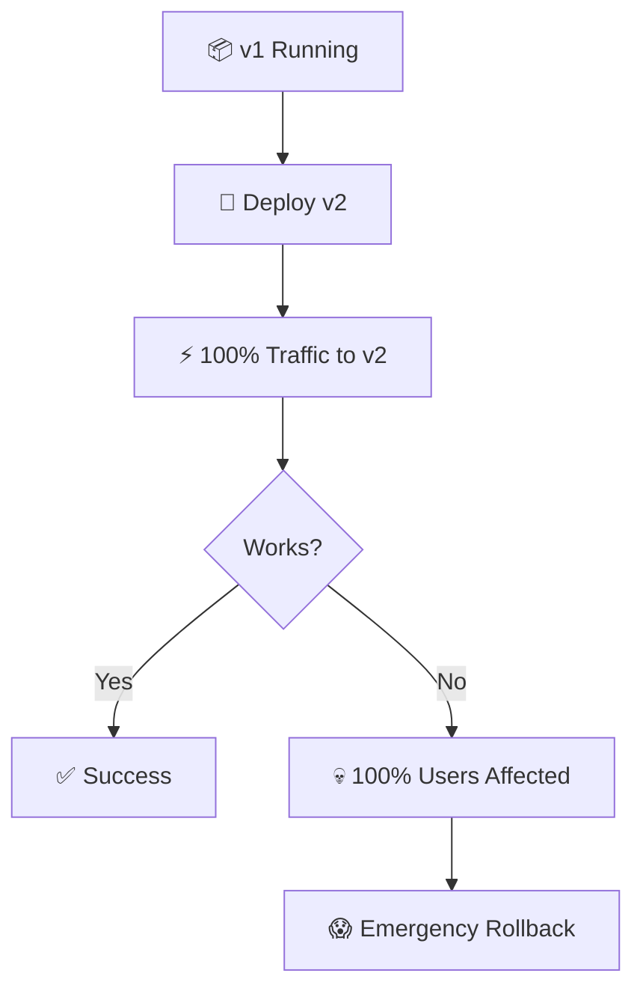

* ⚡ **All-or-nothing:** No gradual validation
* 😱 **High blast radius:** Everyone affected immediately
* ⏱️ **Slow detection:** Issues found in production

---

## 📍 Slide 7 – 🔥 Pain Point 1: Silent Failures

**Scenario:** Memory leak that only triggers under load

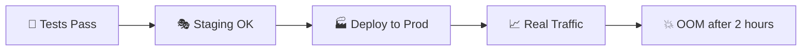

* 🧪 **Tests pass** — synthetic load is different
* 🎭 **Staging works** — not enough traffic to trigger
* 🏭 **Production crashes** — after hours of operation

**Real impact:**
* 😱 Facebook 2021: 6-hour outage from config change
* 💰 Estimated loss: $100 million

---

## 📍 Slide 8 – 🔥 Pain Point 2: Slow Rollback

**Traditional rollback process:**

| ⏱️ Step | 📝 Action | ⌛ Time |
|---------|----------|--------|
| 1 | Detect the issue | 10 min |
| 2 | Confirm it's the deploy | 5 min |
| 3 | Find previous version | 2 min |
| 4 | Rebuild/redeploy | 10 min |
| 5 | Verify rollback | 5 min |
| **Total** | **Downtime** | **32+ min** |

* 🐌 **Slow detection:** Monitoring lag
* 🤔 **Decision paralysis:** "Is it really the deploy?"
* 🔧 **Manual process:** Error-prone under pressure

---

## 📍 Slide 9 – 🔥 Pain Point 3: No Gradual Validation

**What we want:**

```
Deploy → Observe → Decide → Promote/Rollback
```

**What we get:**

```
Deploy → 🙏 Hope → React when broken
```

* 📊 **No metrics integration** — can't auto-decide
* 👨‍💻 **Human in the loop** — for every deploy
* 🎲 **Risk acceptance** — every release is a gamble

---

## 📍 Slide 10 – 💰 The Cost of Bad Deployments

| 🔥 Problem | 💥 Impact | 📊 Industry Data |
|-----------|----------|------------------|
| Failed deployments | Service degradation | 46% experience monthly failures |
| Slow rollback | Extended outages | Avg 30 min to rollback |
| No canary testing | Full user impact | 100% blast radius |
| Manual promotion | Human error | 70% of incidents |

**DORA metrics show:**
* 🏆 **Elite teams:** Deploy multiple times per day with <1% failure rate
* 😰 **Low performers:** Monthly deploys with 15%+ failure rate

---

## 📍 Slide 11 – ✅ Section 2: Progressive Delivery Concepts

**What is Progressive Delivery?**

* 🐤 **Gradual rollout:** Incrementally shift traffic
* 📊 **Observability:** Measure success at each step
* 🤖 **Automation:** Promote or rollback based on metrics
* 🎯 **Targeted:** Control which users see changes

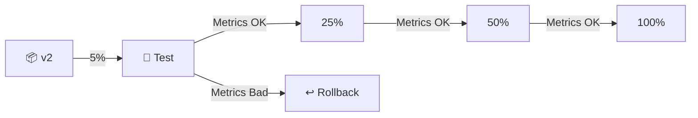

---

## 📍 Slide 12 – 🚫 Progressive Delivery: What It's NOT

| 🚫 Myth | ✅ Reality |
|---------|----------|
| Just slow deployments | Strategic, metrics-driven progression |
| Replaces testing | Complements testing with real traffic |
| Only for big companies | Available via Argo Rollouts, Flagger |
| Complicated to implement | Start simple, add automation gradually |

> 🔥 **Hot take:** "If you're not doing progressive delivery, you're gambling with every deploy."

**Progressive Delivery is:**
* 🎯 **Risk reduction** — smaller blast radius
* 📊 **Data-driven** — metrics decide promotion
* 🔄 **Continuous** — part of the deployment pipeline

---

## 📍 Slide 13 – 🐤 Canary Deployments Explained

**Named after "canary in a coal mine"** — early warning system

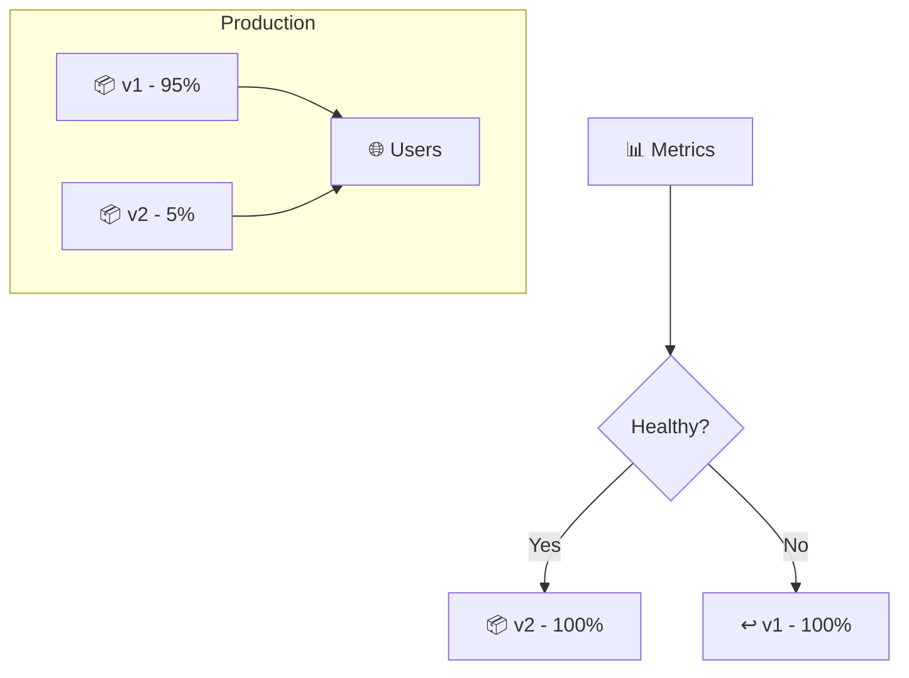

**How it works:**
1. 🚀 Deploy new version alongside old
2. 🎯 Route small % of traffic to new
3. 📊 Compare metrics (errors, latency)
4. ✅ Gradually increase or ↩️ rollback

---

## 📍 Slide 14 – 🔵 Blue-Green Deployments Explained

**Two identical environments, instant switchover**

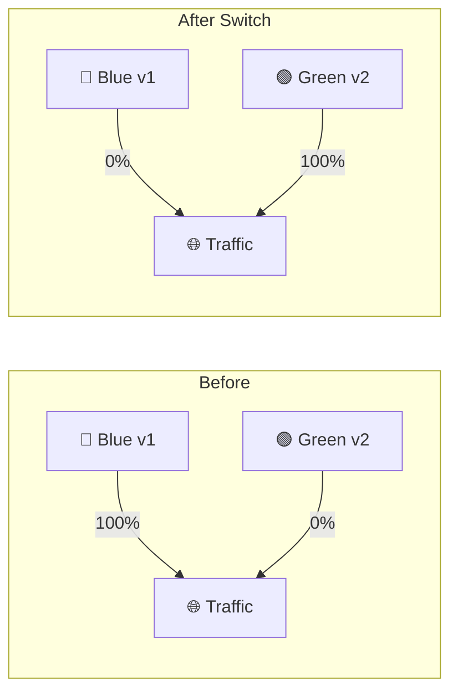

**Characteristics:**
* ⚡ **Instant switch:** Traffic moves all at once
* ↩️ **Fast rollback:** Switch back to blue
* 💰 **Resource cost:** Double infrastructure during deploy
* 🎯 **Use case:** Database migrations, breaking changes

---

## 📍 Slide 15 – 📊 Canary vs Blue-Green

| 📋 Aspect | 🐤 Canary | 🔵 Blue-Green |
|----------|----------|---------------|
| Traffic shift | Gradual (5% → 25% → 100%) | Instant (0% → 100%) |
| Rollback speed | Instant | Instant |
| Resource usage | Minimal overhead | Double during deploy |
| Risk exposure | Minimal (small %) | Full (100% at switch) |
| Complexity | Higher (traffic splitting) | Lower (simple switch) |
| Best for | Most deployments | Major version changes |

> 🤔 **Think:** Which strategy would you use for a database schema change?

---

## 📍 Slide 16 – 🎮 Section 3: Argo Rollouts in Action

**What is Argo Rollouts?**

* 🔄 Kubernetes controller for progressive delivery
* 📦 Replaces standard Deployment resource
* 🎯 Supports canary, blue-green, and more
* 📊 Integrates with metrics providers

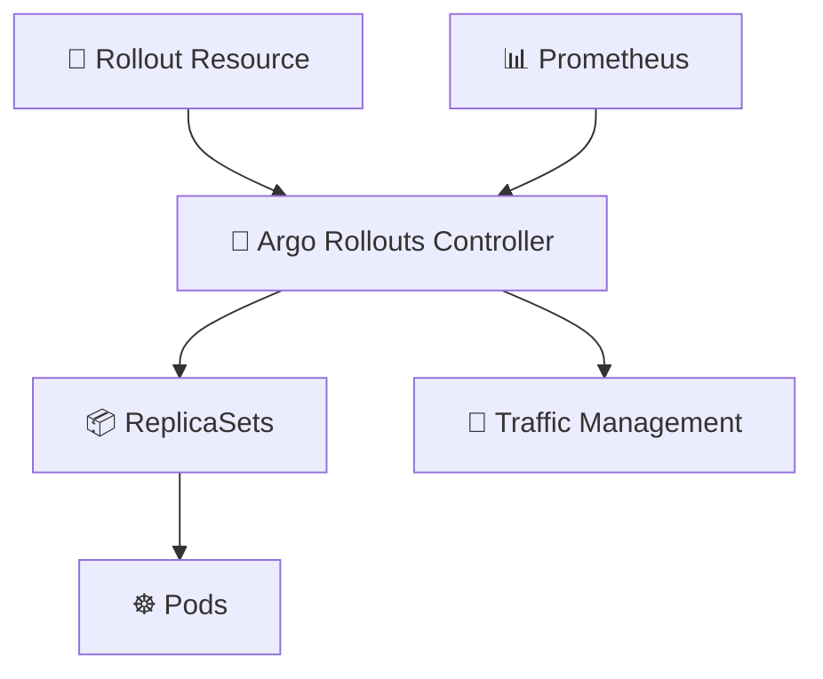

---

## 📍 Slide 17 – 💥 Scenario 1: First Canary Rollout

**Basic canary configuration:**

```yaml
apiVersion: argoproj.io/v1alpha1
kind: Rollout
metadata:
  name: my-app
spec:
  replicas: 10
  strategy:
    canary:
      steps:
        - setWeight: 20
        - pause: {duration: 5m}
        - setWeight: 50
        - pause: {duration: 5m}
        - setWeight: 100
  selector:
    matchLabels:
      app: my-app
  template:
    # Pod template (same as Deployment)
```

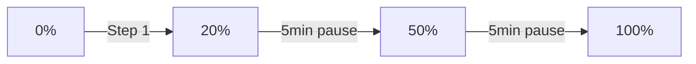

---

## 📍 Slide 18 – ✅ Solution 1: Traffic Progression

**What happens during canary:**

| 🕐 Time | 📦 Stable | 🐤 Canary | 📊 Status |
|---------|----------|----------|-----------|
| T+0 | 100% | 0% | Rollout started |
| T+1 | 80% | 20% | setWeight: 20 |
| T+6 | 50% | 50% | pause completed |
| T+11 | 0% | 100% | Full promotion |

**Rollout states:**
* 🔄 **Progressing:** Moving through steps
* ⏸️ **Paused:** Waiting (manual or timed)
* ✅ **Healthy:** Rollout complete
* 💥 **Degraded:** Issues detected

---

## 📍 Slide 19 – 💥 Scenario 2: Blue-Green with Argo Rollouts

**Blue-green configuration:**

```yaml
apiVersion: argoproj.io/v1alpha1
kind: Rollout
metadata:
  name: my-app
spec:
  replicas: 5
  strategy:
    blueGreen:
      activeService: my-app-active
      previewService: my-app-preview
      autoPromotionEnabled: false  # Manual promotion
      scaleDownDelaySeconds: 30
  selector:
    matchLabels:
      app: my-app
```

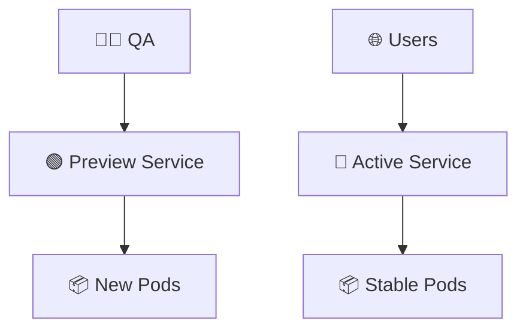

---

## 📍 Slide 20 – ✅ Solution 2: Preview and Promote

**Blue-green workflow:**

1. 🚀 **Deploy:** New pods created, preview service points to them
2. 🧪 **Test:** QA validates via preview service
3. ✅ **Promote:** Traffic switches to new pods
4. 🗑️ **Cleanup:** Old pods scaled down after delay

**Commands:**
```bash
# Check rollout status
kubectl argo rollouts get rollout my-app

# Promote preview to active
kubectl argo rollouts promote my-app

# Abort and rollback
kubectl argo rollouts abort my-app
```

---

## 📍 Slide 21 – 💥 Scenario 3: Automated Analysis

**Problem:** Manual observation doesn't scale

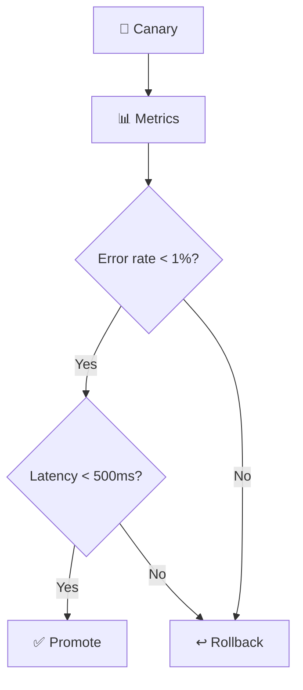

**Solution:** AnalysisTemplate

```yaml
apiVersion: argoproj.io/v1alpha1
kind: AnalysisTemplate
metadata:
  name: success-rate
spec:
  metrics:
    - name: success-rate
      interval: 1m
      successCondition: result[0] >= 0.99
      provider:
        prometheus:
          query: |
            sum(rate(http_requests_total{status=~"2.*"}[5m])) /
            sum(rate(http_requests_total[5m]))
```

---

## 📍 Slide 22 – ✅ Solution 3: Analysis Integration

**Connecting analysis to rollout:**

```yaml
strategy:
  canary:
    steps:
      - setWeight: 20
      - analysis:
          templates:
            - templateName: success-rate
          args:
            - name: service-name
              value: my-app
      - setWeight: 50
      - analysis:
          templates:
            - templateName: success-rate
      - setWeight: 100
```

**Analysis outcomes:**
* ✅ **Successful:** All metrics pass → continue
* ❌ **Failed:** Metric fails → automatic rollback
* ⚠️ **Inconclusive:** Not enough data → pause

---

## 📍 Slide 23 – 💥 Scenario 4: Traffic Management

**Problem:** Need fine-grained traffic control

**Solutions:**

| 🛠️ Traffic Manager | 📝 Description |
|-------------------|---------------|
| **Nginx Ingress** | Canary annotations |
| **Istio** | VirtualService routing |
| **AWS ALB** | Target group weights |
| **Traefik** | TraefikService |

```yaml
# With Istio
strategy:
  canary:
    trafficRouting:
      istio:
        virtualService:
          name: my-app-vsvc
        destinationRule:
          name: my-app-destrule
          canarySubsetName: canary
          stableSubsetName: stable
```

---

## 📍 Slide 24 – ✅ Solution 4: Nginx Ingress Canary

**Simple traffic splitting with Nginx:**

```yaml
strategy:
  canary:
    canaryService: my-app-canary
    stableService: my-app-stable
    trafficRouting:
      nginx:
        stableIngress: my-app-ingress
```

**How it works:**
* 🔧 Argo Rollouts creates canary ingress
* 📊 Sets `nginx.ingress.kubernetes.io/canary-weight`
* 🔄 Updates weight as rollout progresses

---

## 📍 Slide 25 – 📝 QUIZ — DEVOPS_L14_MID

---

## 📍 Slide 26 – 🔧 Section 4: Advanced Strategies

**Experiment: A/B Testing**

```yaml
apiVersion: argoproj.io/v1alpha1
kind: Experiment
metadata:
  name: ab-test
spec:
  duration: 1h
  templates:
    - name: baseline
      specRef: stable
      replicas: 1
    - name: canary
      specRef: canary
      replicas: 1
  analyses:
    - name: compare-versions
      templateName: compare-metrics
```

**Use cases:**
* 🧪 **Feature testing:** Compare feature A vs B
* 📊 **Performance testing:** Baseline vs optimized
* 🎯 **User experience:** Different UIs

---

## 📍 Slide 27 – 📊 Metrics for Analysis

**Common metrics to analyze:**

| 📊 Metric | 📝 What it Measures | ⚠️ Threshold |
|----------|-------------------|-------------|
| Error rate | % of failed requests | < 1% |
| Latency P99 | Slowest 1% of requests | < 500ms |
| Saturation | Resource utilization | < 80% |
| Success rate | % of successful operations | > 99% |

**Prometheus queries:**
```promql
# Error rate
sum(rate(http_requests_total{status=~"5.*"}[5m])) /
sum(rate(http_requests_total[5m]))

# P99 latency
histogram_quantile(0.99, rate(http_duration_seconds_bucket[5m]))
```

---

## 📍 Slide 28 – 🔄 Rollback Strategies

**Automatic rollback triggers:**

```yaml
strategy:
  canary:
    steps:
      - setWeight: 20
      - analysis:
          templates:
            - templateName: error-rate
    # If analysis fails, automatic rollback
```

**Manual rollback:**
```bash
# Abort current rollout
kubectl argo rollouts abort my-app

# Undo to previous version
kubectl argo rollouts undo my-app

# Retry after fix
kubectl argo rollouts retry rollout my-app
```

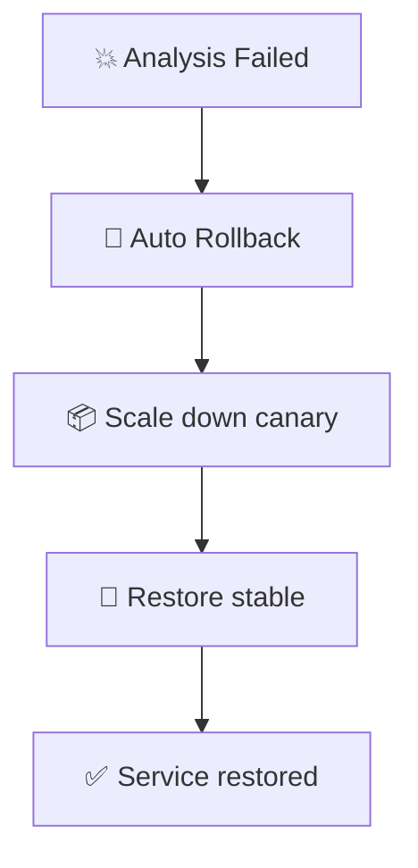

---

## 📍 Slide 29 – ⏸️ Pause and Resume

**Manual gates in rollout:**

```yaml
steps:
  - setWeight: 20
  - pause: {}  # Manual pause - requires promotion
  - setWeight: 50
  - pause: {duration: 10m}  # Timed pause
  - setWeight: 100
```

**Commands:**
```bash
# Resume paused rollout
kubectl argo rollouts promote my-app

# Skip all remaining steps
kubectl argo rollouts promote my-app --full
```

**Use cases:**
* 👀 **Manual verification** before wider rollout
* 🕐 **Business hours** — pause overnight
* 🧪 **QA sign-off** required

---

## 📍 Slide 30 – 🔗 ArgoCD + Argo Rollouts

**GitOps + Progressive Delivery:**

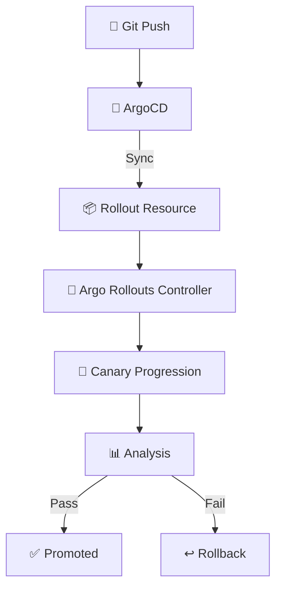

**Benefits:**
* 📝 **Declarative:** Rollout strategy in Git
* 🔄 **Automated:** ArgoCD syncs, Rollouts executes
* 🔍 **Observable:** Both tools have UIs

---

## 📍 Slide 31 – 📊 Dashboard and Visualization

**Argo Rollouts Dashboard:**

```bash
# Install dashboard
kubectl argo rollouts dashboard

# Access at localhost:3100
```

**Features:**
* 📊 **Real-time status:** See rollout progression
* 🎛️ **Controls:** Promote, abort, retry
* 📈 **History:** Past rollouts and outcomes
* 🔗 **Integration:** Links to metrics

---

## 📍 Slide 32 – 🎯 Best Practices

| 📋 Practice | 📝 Why |
|------------|--------|
| Start with simple canary | Learn before adding complexity |
| Always have analysis | Don't rely only on time-based |
| Set appropriate thresholds | Too strict = never promotes |
| Monitor canary metrics | Catch issues before promotion |
| Test rollback procedure | Know it works before you need it |
| Use GitOps | Keep strategy in version control |

---

## 📍 Slide 33 – 🏭 Section 5: Production Patterns

**Netflix Progressive Delivery:**

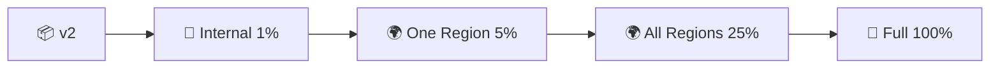

**Their learnings:**
* 🎯 **Internal first:** Employees as first canaries
* 🌍 **Regional:** Test in one region before global
* 📊 **Metrics-driven:** Automated promotion
* 🐌 **Patience:** Days, not minutes

---

## 📍 Slide 34 – 🔧 Anti-Patterns to Avoid

| ❌ Anti-Pattern | ✅ Better Approach |
|----------------|-------------------|
| Canary with no metrics | Add analysis, even basic |
| Too fast progression | Allow time for issues to surface |
| Ignoring saturation | Include resource metrics |
| Manual-only promotion | Automate with analysis |
| Skip staging canary | Test progressive delivery in staging |

---

## 📍 Slide 35 – 📈 Measuring Success

**DORA metrics with progressive delivery:**

| 📊 Metric | 😰 Before | 🚀 After |
|----------|----------|---------|
| Deployment frequency | Weekly | Multiple/day |
| Change failure rate | 15% | < 1% |
| MTTR | 30 min | 2 min |
| Lead time | Days | Hours |

**Why improvement:**
* 🐤 **Catch issues early** — smaller blast radius
* ↩️ **Fast rollback** — seconds, not minutes
* 📊 **Data-driven** — objective decisions
* 🔄 **Confidence** — deploy more often

---

## 📍 Slide 36 – 🎯 Key Takeaways

1. 🐤 **Canary deployments** test with small traffic before full rollout
2. 🔵 **Blue-green** enables instant rollback via traffic switch
3. 📊 **Automated analysis** removes human guesswork
4. 🎯 **Argo Rollouts** makes progressive delivery accessible
5. 🔗 **GitOps integration** keeps strategy declarative
6. ↩️ **Fast rollback** is as important as deployment

> 💬 *"Deploy frequently, observe constantly, rollback automatically."*

---

## 📍 Slide 37 – 🧠 Mindset Shift

| 😰 Old Mindset | 🚀 New Mindset |
|---------------|----------------|
| "Let's hope it works" | "Let's measure and know" |
| "Deploy and pray" | "Deploy, observe, decide" |
| "Rollback is failure" | "Rollback is success" |
| "Testing is enough" | "Testing + production validation" |
| "Deploy once a week (safe)" | "Deploy often (safer)" |
| "100% or nothing" | "Progressive and controlled" |

> 🤔 **Question:** Which deployment approach does your team use today?

---

## 📍 Slide 38 – 📝 QUIZ — DEVOPS_L14_POST

---

## 📍 Slide 39 – 🚀 What's Next?

**Coming up: Lecture 15 — Stateful Applications & Observability**

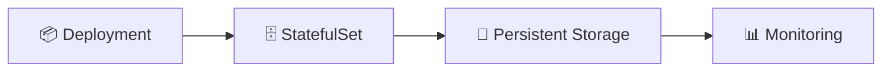

* 🗄️ **StatefulSets:** Managing stateful applications
* 💾 **Persistent storage:** Beyond ephemeral pods
* 📊 **Observability:** Prometheus, Grafana
* 🔍 **Alerting:** Know before users complain

> 🎯 **Lab 14:** Implement canary deployments with Argo Rollouts!

---

## 📚 Resources

**Documentation:**
* 📖 [Argo Rollouts Docs](https://argoproj.github.io/argo-rollouts/)
* 📖 [Progressive Delivery](https://www.weave.works/blog/progressive-delivery)
* 📖 [Canary Deployments](https://martinfowler.com/bliki/CanaryRelease.html)

**Tools:**
* 🔧 [Argo Rollouts](https://argoproj.github.io/argo-rollouts/)
* 🔧 [Flagger](https://flagger.app/)
* 🔧 [Istio](https://istio.io/)

**Books:**
* 📕 *Accelerate* by Nicole Forsgren, Jez Humble, Gene Kim
* 📕 *Continuous Delivery* by Jez Humble & David Farley
