# 📌 Lecture 15 — Stateful Applications & Observability: The Complete Picture

> 🎯 **From stateless simplicity to production-ready stateful workloads with full observability**

---

## 📍 Slide 1 – 🚀 The Final Pieces of Production Kubernetes

We've deployed applications, managed configs, and implemented GitOps. Two challenges remain:

* 🗄️ **Stateful apps:** Databases, message queues, caches — they need identity and stable storage
* 📊 **Observability:** If you can't see it, you can't fix it

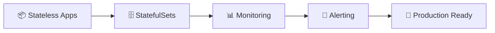

> 🎯 **Goal:** Master stateful workloads and comprehensive cluster observability

---

## 📍 Slide 2 – 📚 Learning Outcomes

By the end of this lecture, you will:

| # | 🎯 Outcome |
|---|-----------|
| 1 | ✅ Understand when to use **StatefulSets** vs Deployments |
| 2 | ✅ Implement **headless services** for pod discovery |
| 3 | ✅ Configure **VolumeClaimTemplates** for per-pod storage |
| 4 | ✅ Deploy **Prometheus** for metrics collection |
| 5 | ✅ Create **Grafana dashboards** for visualization |
| 6 | ✅ Set up **alerting** for proactive incident response |

---

## 📍 Slide 3 – 🗺️ Lecture Overview

```
┌─────────────────────────────────────────────────────────────┐
│  SECTION 0: Introduction                    (Slides 1-4)   │
├─────────────────────────────────────────────────────────────┤
│  📝 PRE QUIZ                                (Slide 5)      │
├─────────────────────────────────────────────────────────────┤
│  SECTION 1: Stateful Workload Challenges    (Slides 6-10)  │
├─────────────────────────────────────────────────────────────┤
│  SECTION 2: StatefulSets Deep Dive          (Slides 11-18) │
├─────────────────────────────────────────────────────────────┤
│  📝 MID QUIZ                                (Slide 19)     │
├─────────────────────────────────────────────────────────────┤
│  SECTION 3: Observability Fundamentals      (Slides 20-28) │
├─────────────────────────────────────────────────────────────┤
│  SECTION 4: Production Monitoring           (Slides 29-36) │
├─────────────────────────────────────────────────────────────┤
│  📝 POST QUIZ                               (Slide 37)     │
├─────────────────────────────────────────────────────────────┤
│  FINAL: What's Next                         (Slide 38)     │
└─────────────────────────────────────────────────────────────┘
```

---

## 📍 Slide 4 – 🤔 The Big Question

> 💬 *"You can't manage what you can't measure."*
> — Peter Drucker

**Consider these scenarios:**

* 🗄️ **Database cluster:** Pods need stable identity for replication
* 📊 **3 AM alert:** Is the app slow, or is it the database?
* 🔍 **Debugging:** "What changed in the last hour?"
* 🔮 **Capacity planning:** "Will we run out of storage next month?"

> 🤔 **Think:** How do you know your system is healthy right now?

---

## 📍 Slide 5 – 📝 QUIZ — DEVOPS_L15_PRE

---

## 📍 Slide 6 – ⚠️ Section 1: Why Stateless Isn't Always Enough

**Deployments (Stateless) characteristics:**

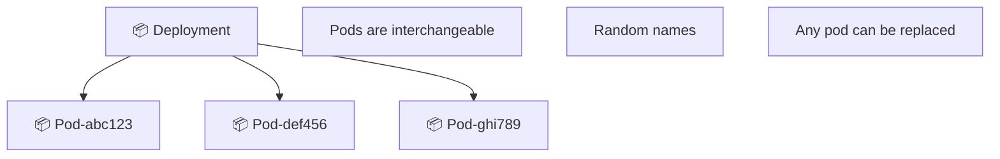

* ✅ **Great for:** Web servers, API services, workers
* ❌ **Problem for:** Databases, message queues, distributed systems

---

## 📍 Slide 7 – 🔥 Pain Point 1: Pod Identity

**Stateful apps need stable identity:**

| 🗄️ Application | 🔑 Why Identity Matters |
|---------------|------------------------|
| **PostgreSQL** | Primary/replica must know who is who |
| **MongoDB** | Replica set members have specific roles |
| **Kafka** | Brokers identified by stable IDs |
| **Redis Cluster** | Nodes need persistent slots |
| **Elasticsearch** | Nodes join cluster by name |

**With Deployment:**
```
pod-abc123 → restarts → pod-xyz789 (new name!)
```

**The problem:** Other pods can't find it anymore

---

## 📍 Slide 8 – 🔥 Pain Point 2: Storage Persistence

**Scenario:** 3-node MongoDB replica set

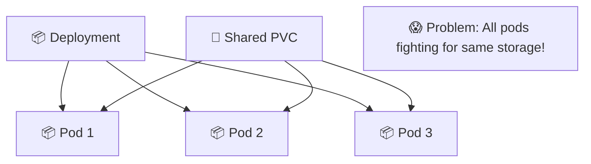

**What we need:**
* 📦 Pod 1 → 💾 Volume 1 (its own data)
* 📦 Pod 2 → 💾 Volume 2 (its own data)
* 📦 Pod 3 → 💾 Volume 3 (its own data)

---

## 📍 Slide 9 – 🔥 Pain Point 3: Ordered Operations

**Database cluster startup order matters:**

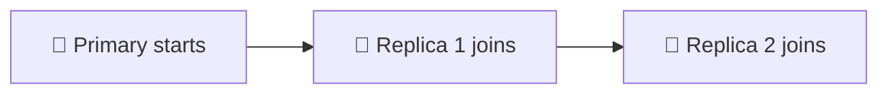

**Deployment behavior:** All pods start simultaneously
* 😱 Race condition: Who is primary?
* 💥 Data corruption risk

**Shutdown order matters too:**
* 🥉 Replicas drain first
* 🥇 Primary shuts down last

---

## 📍 Slide 10 – 📊 Deployment vs StatefulSet

| 📋 Aspect | 📦 Deployment | 🗄️ StatefulSet |
|----------|--------------|----------------|
| Pod names | Random suffix | Stable ordinal (app-0, app-1) |
| Storage | Shared or none | Per-pod PVCs |
| Scaling | Parallel | Sequential |
| Updates | Rolling (parallel) | Rolling (sequential) |
| Network identity | Via Service | Stable DNS per pod |
| Use case | Stateless apps | Stateful apps |

---

## 📍 Slide 11 – ✅ Section 2: StatefulSets to the Rescue

**StatefulSet provides:**

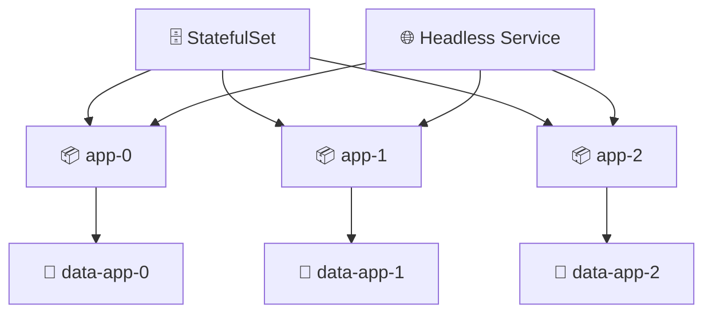

* 🔢 **Stable, unique network IDs:** `app-0`, `app-1`, `app-2`
* 💾 **Stable, persistent storage:** Each pod gets its own PVC
* 📊 **Ordered deployment:** `app-0` first, then `app-1`, then `app-2`
* 🔄 **Ordered termination:** Reverse order

---

## 📍 Slide 12 – 🌐 Headless Services Explained

**Regular Service vs Headless Service:**

```yaml
# Regular Service - Load balances
apiVersion: v1
kind: Service
metadata:
  name: my-app
spec:
  clusterIP: 10.0.0.100  # Gets an IP
  ports:
    - port: 80
---
# Headless Service - Direct pod access
apiVersion: v1
kind: Service
metadata:
  name: my-app-headless
spec:
  clusterIP: None  # No IP assigned!
  ports:
    - port: 80
```

**DNS resolution:**
* **Regular:** `my-app.namespace.svc` → `10.0.0.100`
* **Headless:** `my-app-headless.namespace.svc` → `10.1.2.3, 10.1.2.4, 10.1.2.5` (all pod IPs)

---

## 📍 Slide 13 – 🔗 Pod DNS in StatefulSets

**Each pod gets a stable DNS name:**

```
<pod-name>.<service-name>.<namespace>.svc.cluster.local
```

**Example with MongoDB:**
```
mongodb-0.mongodb-headless.default.svc.cluster.local
mongodb-1.mongodb-headless.default.svc.cluster.local
mongodb-2.mongodb-headless.default.svc.cluster.local
```

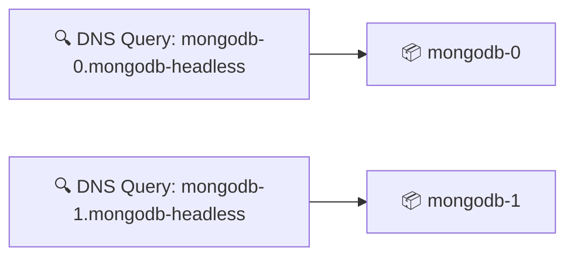

* ✅ Other apps can connect to specific pods
* ✅ Pods can discover each other by name
* ✅ Names stay the same even after restart

---

## 📍 Slide 14 – 💾 VolumeClaimTemplates

**Automatic PVC creation per pod:**

```yaml
apiVersion: apps/v1
kind: StatefulSet
metadata:
  name: mongodb
spec:
  serviceName: mongodb-headless
  replicas: 3
  volumeClaimTemplates:
    - metadata:
        name: data
      spec:
        accessModes: ["ReadWriteOnce"]
        storageClassName: standard
        resources:
          requests:
            storage: 10Gi
```

**Result:**
```
PVC: data-mongodb-0 → bound to mongodb-0
PVC: data-mongodb-1 → bound to mongodb-1
PVC: data-mongodb-2 → bound to mongodb-2
```

---

## 📍 Slide 15 – 🔄 Scaling Behavior

**Scale up (sequential):**
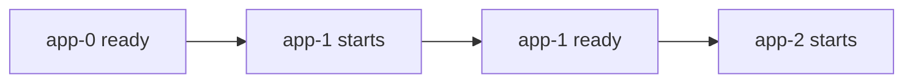

**Scale down (reverse order):**
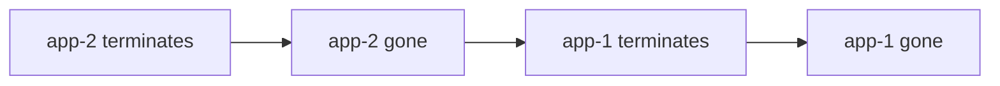

**Key points:**
* 🔄 Next pod only starts when previous is **Ready**
* 🗑️ Scaling down starts from highest ordinal
* 💾 PVCs are **NOT deleted** on scale down (data preserved)

---

## 📍 Slide 16 – 🔄 Update Strategies

**RollingUpdate (default):**
```yaml
spec:
  updateStrategy:
    type: RollingUpdate
    rollingUpdate:
      partition: 0  # Update all pods
```

**Partition for canary:**
```yaml
rollingUpdate:
  partition: 2  # Only update pods >= 2
```

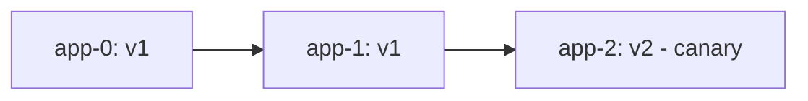

* ✅ Test new version on highest ordinal first
* ✅ Gradually lower partition to update more pods

---

## 📍 Slide 17 – 🗄️ Complete StatefulSet Example

```yaml
apiVersion: apps/v1
kind: StatefulSet
metadata:
  name: mongodb
spec:
  selector:
    matchLabels:
      app: mongodb
  serviceName: mongodb-headless
  replicas: 3
  template:
    metadata:
      labels:
        app: mongodb
    spec:
      containers:
        - name: mongodb
          image: mongo:7
          ports:
            - containerPort: 27017
          volumeMounts:
            - name: data
              mountPath: /data/db
  volumeClaimTemplates:
    - metadata:
        name: data
      spec:
        accessModes: ["ReadWriteOnce"]
        resources:
          requests:
            storage: 10Gi
```

---

## 📍 Slide 18 – ⚠️ StatefulSet Gotchas

| ⚠️ Gotcha | 📝 Solution |
|----------|------------|
| PVCs not deleted on scale down | Manual deletion if needed |
| Pod stuck in Pending | Check PVC binding, storage class |
| Headless service required | Must create before StatefulSet |
| Slow scaling | Increase `podManagementPolicy: Parallel` |
| Data loss on PVC deletion | Use `reclaimPolicy: Retain` |

**Important:** StatefulSets are **more complex** than Deployments. Use only when needed!

---

## 📍 Slide 19 – 📝 QUIZ — DEVOPS_L15_MID

---

## 📍 Slide 20 – 📊 Section 3: The Three Pillars of Observability

**Observability = Understanding system behavior from outputs**

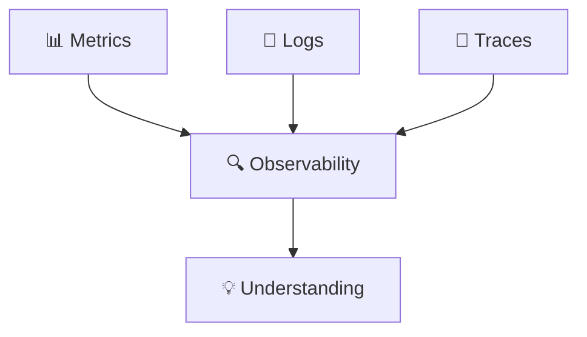

| 📊 Pillar | 📝 What It Answers | 🛠️ Tools |
|----------|-------------------|----------|
| **Metrics** | What is happening? (numbers) | Prometheus, Grafana |
| **Logs** | What happened? (events) | Loki, ELK |
| **Traces** | Where did it happen? (requests) | Jaeger, Zipkin |

---

## 📍 Slide 21 – 📈 Prometheus: The Metrics Foundation

**What is Prometheus?**

* 📊 Time-series database for metrics
* 🔍 Pull-based metric collection
* 📝 Powerful query language (PromQL)
* 🔔 Built-in alerting

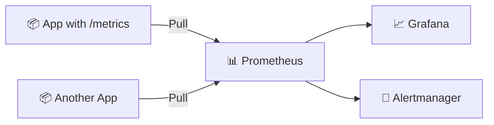

---

## 📍 Slide 22 – 🎯 Prometheus Metric Types

| 📊 Type | 📝 Description | 🎯 Example |
|--------|---------------|-----------|
| **Counter** | Only goes up | Total requests, errors |
| **Gauge** | Can go up/down | Temperature, queue size |
| **Histogram** | Distribution of values | Request latency |
| **Summary** | Similar to histogram | Quantiles |

**Example metrics:**
```promql
# Counter - total HTTP requests
http_requests_total{method="GET", status="200"}

# Gauge - current memory usage
node_memory_MemAvailable_bytes

# Histogram - request duration
http_request_duration_seconds_bucket{le="0.5"}
```

---

## 📍 Slide 23 – 🔍 PromQL Basics

**Query examples:**

```promql
# Current value
up{job="kubernetes-pods"}

# Rate of change (per second over 5m)
rate(http_requests_total[5m])

# Error rate percentage
sum(rate(http_requests_total{status=~"5.."}[5m])) /
sum(rate(http_requests_total[5m])) * 100

# 99th percentile latency
histogram_quantile(0.99, rate(http_request_duration_seconds_bucket[5m]))

# Top 5 pods by CPU
topk(5, sum by (pod) (rate(container_cpu_usage_seconds_total[5m])))
```

---

## 📍 Slide 24 – 📦 kube-prometheus-stack

**All-in-one monitoring solution:**

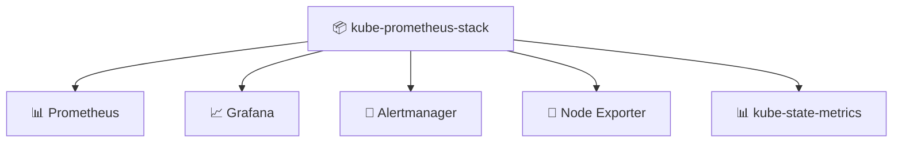

**Includes:**
* 🔧 Pre-configured scrape targets
* 📊 Default dashboards
* 🔔 Default alerting rules
* 📈 Grafana with data sources configured

```bash
helm install prometheus prometheus-community/kube-prometheus-stack
```

---

## 📍 Slide 25 – 📈 Grafana Dashboards

**Key Grafana concepts:**

| 🔧 Concept | 📝 Description |
|-----------|---------------|
| **Data Source** | Where data comes from (Prometheus) |
| **Dashboard** | Collection of panels |
| **Panel** | Single visualization |
| **Variable** | Dynamic filters (namespace, pod) |

**Popular pre-built dashboards:**
* 🔢 **1860:** Node Exporter Full
* 🔢 **315:** Kubernetes cluster
* 🔢 **7249:** Kubernetes Pod Resources

---

## 📍 Slide 26 – 🔔 Alerting with Alertmanager

**Alert flow:**

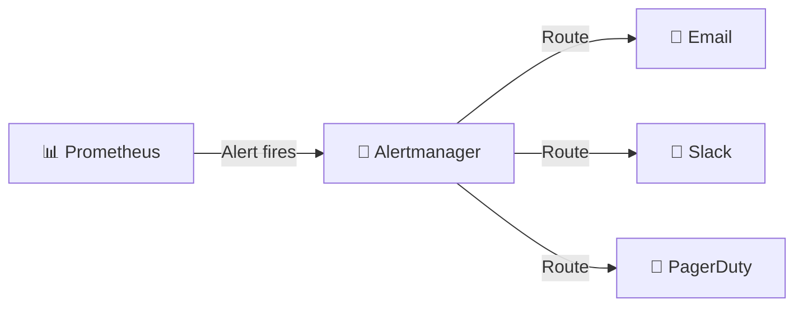

**Alert rule example:**
```yaml
groups:
  - name: app-alerts
    rules:
      - alert: HighErrorRate
        expr: |
          sum(rate(http_requests_total{status=~"5.."}[5m])) /
          sum(rate(http_requests_total[5m])) > 0.01
        for: 5m
        labels:
          severity: critical
        annotations:
          summary: "High error rate detected"
          description: "Error rate is {{ $value | humanizePercentage }}"
```

---

## 📍 Slide 27 – 📊 The Four Golden Signals

**Google SRE's essential metrics:**

| 🔔 Signal | 📝 What to Measure | 📊 Prometheus Example |
|----------|-------------------|----------------------|
| **Latency** | Response time | `histogram_quantile(0.99, ...)` |
| **Traffic** | Request rate | `rate(http_requests_total[5m])` |
| **Errors** | Failure rate | `rate(http_requests_total{status=~"5.."}[5m])` |
| **Saturation** | Resource usage | `container_memory_usage_bytes / limit` |

> 💡 **Tip:** Start by monitoring these four signals for every service

---

## 📍 Slide 28 – 🔧 Init Containers for Dependencies

**Problem:** App starts before database is ready

```yaml
spec:
  initContainers:
    - name: wait-for-db
      image: busybox
      command:
        - sh
        - -c
        - |
          until nc -z postgres-0.postgres-headless 5432; do
            echo "Waiting for database..."
            sleep 2
          done
  containers:
    - name: app
      image: my-app
```

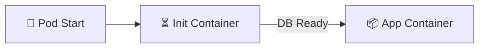

---

## 📍 Slide 29 – 🏭 Section 4: Production Monitoring Setup

**ServiceMonitor for custom apps:**

```yaml
apiVersion: monitoring.coreos.com/v1
kind: ServiceMonitor
metadata:
  name: my-app-monitor
spec:
  selector:
    matchLabels:
      app: my-app
  endpoints:
    - port: metrics
      interval: 30s
      path: /metrics
```

**What this does:**
* 🔍 Tells Prometheus to scrape your app
* 📊 Collects metrics from `/metrics` endpoint
* ⏱️ Every 30 seconds

---

## 📍 Slide 30 – 📊 Monitoring StatefulSets

**Key metrics for stateful apps:**

| 📊 Metric | 📝 Why Important |
|----------|------------------|
| `kubelet_volume_stats_used_bytes` | Disk usage per PVC |
| `kube_statefulset_replicas` | Expected vs actual replicas |
| `kube_statefulset_status_replicas_ready` | Healthy replicas |
| App-specific metrics | Replication lag, connections |

**Alert example:**
```yaml
- alert: StatefulSetNotReady
  expr: |
    kube_statefulset_status_replicas_ready /
    kube_statefulset_replicas < 1
  for: 5m
  labels:
    severity: warning
```

---

## 📍 Slide 31 – 📈 Resource Monitoring

**CPU and Memory queries:**

```promql
# CPU usage percentage
sum(rate(container_cpu_usage_seconds_total{pod=~"my-app.*"}[5m])) /
sum(kube_pod_container_resource_limits{resource="cpu", pod=~"my-app.*"}) * 100

# Memory usage percentage
sum(container_memory_working_set_bytes{pod=~"my-app.*"}) /
sum(kube_pod_container_resource_limits{resource="memory", pod=~"my-app.*"}) * 100
```

**Capacity planning alerts:**
```yaml
- alert: HighMemoryUsage
  expr: |
    sum(container_memory_working_set_bytes) by (pod) /
    sum(kube_pod_container_resource_limits{resource="memory"}) by (pod) > 0.8
  for: 15m
```

---

## 📍 Slide 32 – 🔔 Alert Fatigue Prevention

**Problem:** Too many alerts = ignored alerts

| ❌ Bad Practice | ✅ Better Approach |
|----------------|-------------------|
| Alert on every metric | Alert on symptoms, not causes |
| No severity levels | Critical, warning, info tiers |
| Alert immediately | Use `for` duration |
| Generic messages | Actionable descriptions |
| No runbooks | Link to debugging guides |

**Good alert structure:**
```yaml
annotations:
  summary: "High error rate on {{ $labels.service }}"
  description: "Error rate is {{ $value }}% (threshold: 1%)"
  runbook_url: "https://wiki/alerts/high-error-rate"
```

---

## 📍 Slide 33 – 📊 Dashboard Best Practices

**Effective dashboard layout:**

```
┌─────────────────────────────────────────┐
│  📊 Overview: Key metrics at a glance   │
├─────────────┬─────────────┬─────────────┤
│  🔴 Errors  │  ⏱️ Latency │  📈 Traffic │
├─────────────┴─────────────┴─────────────┤
│  💾 Resource Usage (CPU, Memory, Disk)  │
├─────────────────────────────────────────┤
│  🔍 Detailed Breakdowns (per pod, etc.) │
└─────────────────────────────────────────┘
```

**Tips:**
* 📊 Start with high-level, drill down for details
* 🎨 Use consistent colors (red = bad)
* 📝 Add descriptions to panels
* 🔗 Link related dashboards

---

## 📍 Slide 34 – 🏢 Real-World: Observability at Scale

**Netflix observability approach:**

* 📊 **Metrics:** Atlas (Prometheus-like, billions of time series)
* 📝 **Logs:** Mantis (real-time stream processing)
* 🔗 **Traces:** Edgar (distributed tracing)
* 🔔 **Alerts:** Focused on customer impact

**Key lessons:**
* 🎯 Focus on **business metrics** (not just infra)
* 🔄 Automate **remediation** where possible
* 📈 Invest in **dashboards** as a product
* 👥 Make observability **everyone's** job

---

## 📍 Slide 35 – 🎯 Key Takeaways

1. 🗄️ **StatefulSets** provide stable identity and per-pod storage for databases
2. 🌐 **Headless services** enable direct pod-to-pod communication
3. 📊 **Three pillars:** Metrics, Logs, Traces for full observability
4. 📈 **Prometheus + Grafana** is the standard K8s monitoring stack
5. 🔔 **Alerts should be actionable** — avoid alert fatigue
6. 🎯 **Four Golden Signals:** Latency, Traffic, Errors, Saturation

> 💬 *"Observability is not about collecting data, it's about understanding your system."*

---

## 📍 Slide 36 – 🧠 Mindset Shift

| 😰 Old Mindset | 🚀 New Mindset |
|---------------|----------------|
| "It's working, don't touch it" | "I can see it's working" |
| "Let's check the logs" | "The dashboard shows the issue" |
| "User reported an error" | "Alert fired before impact" |
| "Database needs restart" | "DB has stable identity, restart is safe" |
| "Collect all the metrics" | "Monitor what matters" |
| "Alert on everything" | "Alert on symptoms, investigate causes" |

> 🤔 **Question:** What's the first dashboard you'd build for your app?

---

## 📍 Slide 37 – 📝 QUIZ — DEVOPS_L15_POST

---

## 📍 Slide 38 – 🚀 What's Next?

**Coming up: Lecture 16 — Beyond Kubernetes**

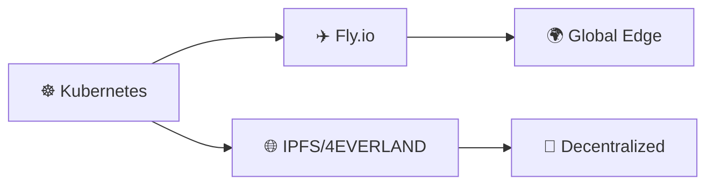

* ✈️ **Fly.io:** Edge deployment simplified
* 🌐 **IPFS:** Decentralized hosting
* 🤔 **When to use what:** Trade-offs and decisions
* 🎯 **Beyond the cluster:** Alternative deployment models

> 🎯 **Labs 15 & 16:** Convert your app to StatefulSet and set up comprehensive monitoring!

---

## 📚 Resources

**StatefulSets:**
* 📖 [Kubernetes StatefulSets](https://kubernetes.io/docs/concepts/workloads/controllers/statefulset/)
* 📖 [Headless Services](https://kubernetes.io/docs/concepts/services-networking/service/#headless-services)

**Observability:**
* 📖 [Prometheus Docs](https://prometheus.io/docs/)
* 📖 [Grafana Docs](https://grafana.com/docs/)
* 📖 [kube-prometheus-stack](https://github.com/prometheus-community/helm-charts/tree/main/charts/kube-prometheus-stack)

**Books:**
* 📕 *Observability Engineering* by Charity Majors, et al.
* 📕 *Site Reliability Engineering* by Google
* 📕 *Kubernetes Patterns* by Bilgin Ibryam & Roland Huß
