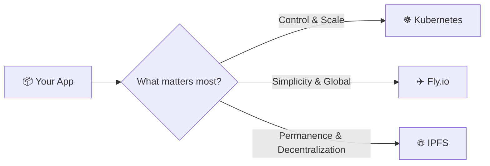
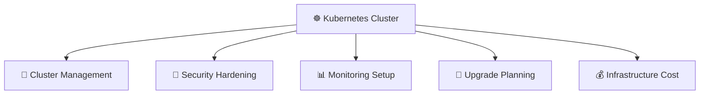
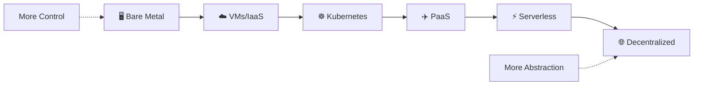
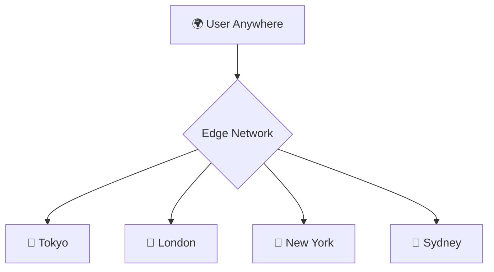
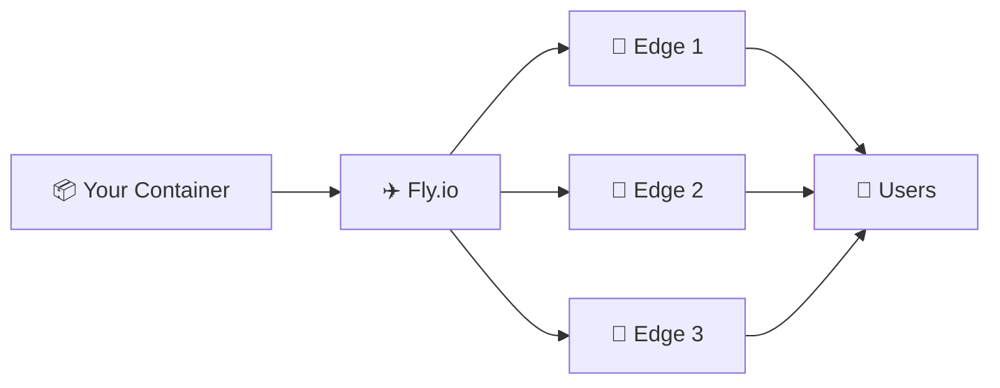
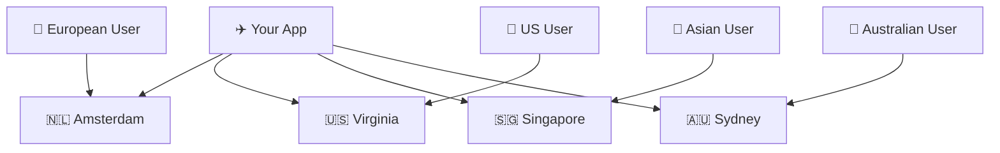
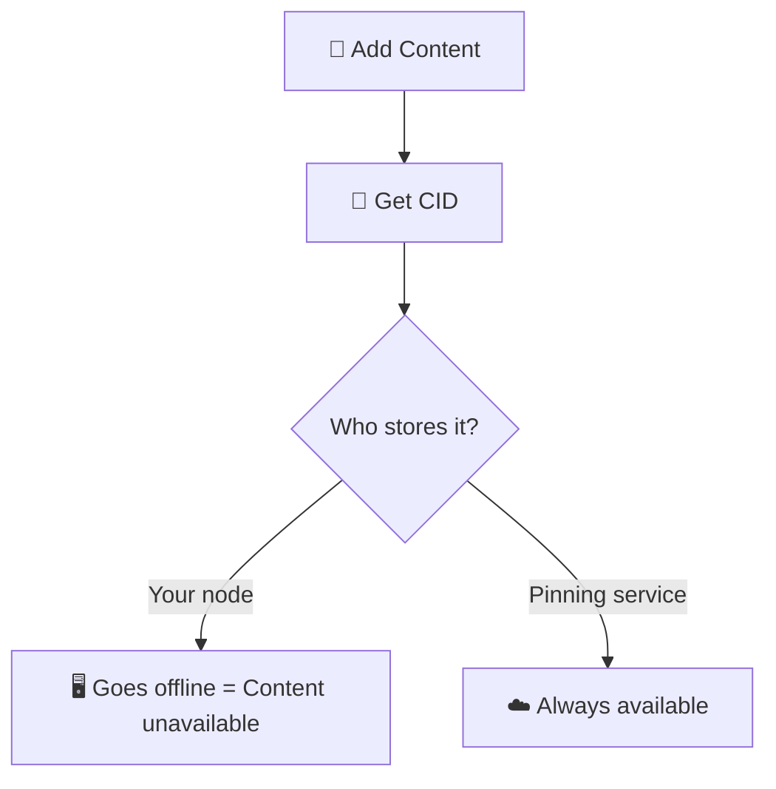
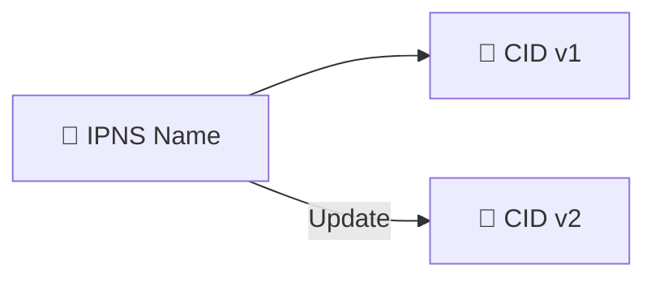
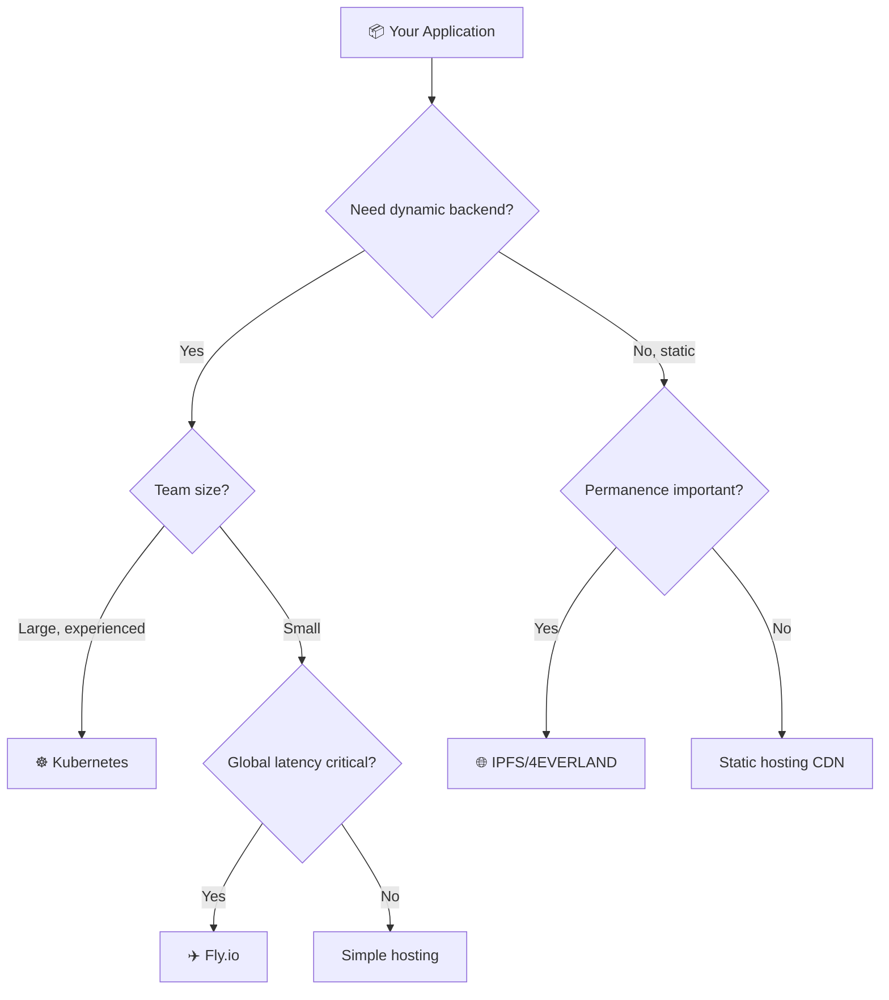

# 📌 Lecture 16 — Beyond Kubernetes: Alternative Deployment Models

> 🎯 **From cluster management to platform abstraction and decentralized hosting**

---

## 📍 Slide 1 – 🚀 Kubernetes Isn't Always the Answer

We've mastered Kubernetes. But is it always the right choice?

* ☸️ **Kubernetes:** Powerful, but complex
* ✈️ **PaaS (Fly.io):** Simple, global, managed
* 🌐 **Decentralized (IPFS):** Permanent, censorship-resistant



> 🎯 **Goal:** Understand when to choose each deployment model

---

## 📍 Slide 2 – 📚 Learning Outcomes

By the end of this lecture, you will:

| # | 🎯 Outcome |
|---|-----------|
| 1 | ✅ Evaluate **trade-offs** between deployment models |
| 2 | ✅ Deploy applications to **Fly.io** edge network |
| 3 | ✅ Understand **IPFS** and content addressing |
| 4 | ✅ Use **4EVERLAND** for decentralized hosting |
| 5 | ✅ Choose the **right tool** for different use cases |
| 6 | ✅ Appreciate the **evolving cloud landscape** |

---

## 📍 Slide 3 – 🗺️ Lecture Overview

```
┌─────────────────────────────────────────────────────────────┐
│  SECTION 0: Introduction                    (Slides 1-4)   │
├─────────────────────────────────────────────────────────────┤
│  📝 PRE QUIZ                                (Slide 5)      │
├─────────────────────────────────────────────────────────────┤
│  SECTION 1: The Complexity Trade-off        (Slides 6-10)  │
├─────────────────────────────────────────────────────────────┤
│  SECTION 2: Edge Computing with Fly.io      (Slides 11-18) │
├─────────────────────────────────────────────────────────────┤
│  📝 MID QUIZ                                (Slide 19)     │
├─────────────────────────────────────────────────────────────┤
│  SECTION 3: Decentralized Web & IPFS        (Slides 20-28) │
├─────────────────────────────────────────────────────────────┤
│  SECTION 4: Choosing Your Path              (Slides 29-35) │
├─────────────────────────────────────────────────────────────┤
│  📝 POST QUIZ                               (Slide 36)     │
├─────────────────────────────────────────────────────────────┤
│  FINAL: Course Wrap-up                      (Slide 37)     │
└─────────────────────────────────────────────────────────────┘
```

---

## 📍 Slide 4 – 🤔 The Big Question

> 💬 *"The best tool is the one that solves your problem with the least unnecessary complexity."*
> — Practical Engineering Wisdom

**Consider these scenarios:**

* 🏢 **Enterprise with 500 microservices:** Probably needs Kubernetes
* 🚀 **Startup with 3 developers:** Maybe doesn't need a cluster
* 📰 **News article that must stay online forever:** Decentralized?
* 🌍 **App serving users globally:** Edge deployment?

> 🤔 **Think:** What does YOUR application actually need?

---

## 📍 Slide 5 – 📝 QUIZ — DEVOPS_L16_PRE

---

## 📍 Slide 6 – ⚠️ Section 1: The Kubernetes Tax

**What Kubernetes requires:**



* 🔧 **Cluster operations:** Updates, scaling, troubleshooting
* 🧠 **Team expertise:** Steep learning curve
* 💰 **Cost:** Control plane, nodes, load balancers
* ⏱️ **Time:** Setup, maintenance, incident response

---

## 📍 Slide 7 – 🔥 When Kubernetes Is Overkill

**Signs you might not need Kubernetes:**

| 🚩 Sign | 📝 Alternative |
|--------|---------------|
| Single application | PaaS (Fly.io, Railway, Render) |
| Small team (1-5 devs) | Managed services |
| Simple deployment needs | Container platforms |
| Cost-sensitive startup | Serverless or PaaS |
| No specialized workloads | Simpler solutions |

> 💬 *"Don't use Kubernetes to solve problems you don't have."*

---

## 📍 Slide 8 – 📊 The Abstraction Spectrum



| 🎚️ Level | 🔧 You Manage | ✅ Platform Manages |
|----------|--------------|---------------------|
| Bare Metal | Everything | Nothing |
| IaaS (EC2) | OS, runtime, app | Hardware |
| Kubernetes | App, configs | Orchestration |
| PaaS | App code only | Everything else |
| Serverless | Functions | Runtime, scaling |

---

## 📍 Slide 9 – 🎯 Right Tool, Right Job

**Decision factors:**

| 📋 Factor | ☸️ K8s | ✈️ PaaS | 🌐 IPFS |
|----------|--------|--------|---------|
| Team size | Large | Small | Varies |
| Control needs | High | Medium | Low |
| Cost at scale | Efficient | Can be expensive | Very low |
| Setup time | Days/weeks | Minutes | Minutes |
| Global distribution | Manual config | Built-in | Inherent |
| Vendor lock-in | Low | Medium | None |

---

## 📍 Slide 10 – 💡 The Emergence of Edge Computing

**Traditional deployment:**
```
User (Tokyo) → CDN → US-East Server → Response (200ms)
```

**Edge deployment:**
```
User (Tokyo) → Edge Server (Tokyo) → Response (20ms)
```



* ⚡ **Lower latency:** Code runs closer to users
* 🌍 **Global by default:** No region configuration
* 🔄 **Automatic routing:** Users hit nearest edge

---

## 📍 Slide 11 – ✈️ Section 2: Fly.io - Simplicity Meets Global

**What is Fly.io?**

* ✈️ Platform for running apps globally
* 📦 Deploys Docker containers (or builds from source)
* 🌍 Runs in 30+ regions automatically
* 💰 Free tier for small apps



---

## 📍 Slide 12 – 🛠️ Fly.io Architecture

**Key concepts:**

| 🔧 Concept | 📝 Description |
|-----------|---------------|
| **Machine** | A Fly VM running your app |
| **App** | A named collection of Machines |
| **Region** | A geographical location (ams, iad, sin) |
| **Volume** | Persistent storage attached to Machine |
| **Secret** | Encrypted environment variable |

```toml
# fly.toml
app = "my-app"
primary_region = "ams"

[http_service]
  internal_port = 8080
  force_https = true
  auto_stop_machines = true
  auto_start_machines = true
```

---

## 📍 Slide 13 – 🚀 Deploying to Fly.io

**The entire deployment process:**

```bash
# 1. Install CLI
curl -L https://fly.io/install.sh | sh

# 2. Login
fly auth login

# 3. Launch (creates app + config)
fly launch

# 4. Deploy
fly deploy

# 5. Open in browser
fly open
```

**That's it!** No cluster, no YAML manifests, no ingress controllers.

---

## 📍 Slide 14 – 🌍 Multi-Region Deployment

**Adding regions:**

```bash
# Add regions
fly regions add iad sin syd

# Check machines
fly machines list

# Scale in specific region
fly scale count 2 --region ams
```



---

## 📍 Slide 15 – 🔐 Secrets & Storage on Fly.io

**Secrets:**
```bash
fly secrets set DATABASE_URL="postgres://..."
fly secrets set API_KEY="secret123"
fly secrets list
```

**Persistent storage:**
```bash
# Create volume
fly volumes create mydata --size 1 --region ams
```

```toml
# fly.toml
[mounts]
  source = "mydata"
  destination = "/data"
```

---

## 📍 Slide 16 – 📊 Fly.io vs Kubernetes Comparison

| 📋 Aspect | ☸️ Kubernetes | ✈️ Fly.io |
|----------|--------------|----------|
| Setup time | Hours/days | Minutes |
| Learning curve | Steep | Gentle |
| Global distribution | Manual | Built-in |
| Scaling | HPA, VPA, manual | Auto-scale, simple commands |
| Cost (small app) | $50-100/month | Free tier available |
| Control | Full | Limited |
| Customization | Unlimited | Constrained |
| Multi-cloud | Yes | No (Fly only) |

---

## 📍 Slide 17 – 🎯 When to Choose Fly.io

**Good fit:**

* ✅ Small to medium applications
* ✅ Need for low global latency
* ✅ Small team, limited DevOps resources
* ✅ Rapid iteration, quick deployments
* ✅ Cost-conscious early-stage projects

**Not ideal:**

* ❌ Complex microservices architectures
* ❌ Need for specific cloud services (AWS RDS, etc.)
* ❌ Compliance requirements for specific regions
* ❌ Already invested heavily in Kubernetes

---

## 📍 Slide 18 – 🔧 Fly.io Best Practices

| 📋 Practice | 📝 Reason |
|------------|----------|
| Use auto_stop_machines | Save costs when idle |
| Add health checks | Enable auto-restart on failure |
| Use volumes for stateful data | Machines are ephemeral |
| Set min_machines_running | Prevent cold starts |
| Use regions near your users | Optimize latency |

```toml
[http_service]
  auto_stop_machines = true
  auto_start_machines = true
  min_machines_running = 1

[checks]
  [checks.health]
    type = "http"
    port = 8080
    path = "/health"
```

---

## 📍 Slide 19 – 📝 QUIZ — DEVOPS_L16_MID

---

## 📍 Slide 20 – 🌐 Section 3: IPFS & The Decentralized Web

**What is IPFS?**

* 🌐 **InterPlanetary File System**
* 📦 Distributed, peer-to-peer storage
* 🔗 Content-addressed (identified by hash, not location)
* ♾️ Immutable, permanent storage


> 💡 **Key insight:** Same content = same address, anywhere in the world

---

## 📍 Slide 21 – 🔍 Content Addressing Explained

**Traditional web (location-based):**
```
https://server.com/path/to/file.html
                    ↓
        Server could change content!
```

**IPFS (content-based):**
```
ipfs://QmXxx.../file.html
          ↓
   Hash of actual content
   If content changes, hash changes!
```

| 📋 Aspect | 🌐 HTTP | 🔗 IPFS |
|----------|--------|---------|
| Addressing | Location | Content hash |
| Mutability | Content can change | Content is immutable |
| Availability | Single server | Distributed nodes |
| Censorship | Easy to block | Very difficult |

---

## 📍 Slide 22 – 🔑 IPFS Key Concepts

| 🔧 Concept | 📝 Description |
|-----------|---------------|
| **CID** | Content Identifier - hash of content |
| **Node** | Computer running IPFS software |
| **Pinning** | Keeping content available (prevent garbage collection) |
| **Gateway** | HTTP bridge to IPFS content |
| **IPNS** | Mutable pointer to IPFS content |

**Example CIDs:**
```
QmXoypizjW3WknFiJnKLwHCnL72vedxjQkDDP1mXWo6uco
bafybeigdyrzt5sfp7udm7hu76uh7y26nf3efuylqabf3oclgtqy55fbzdi
```

---

## 📍 Slide 23 – 📌 Pinning Services

**The persistence problem:**



**Pinning services:**
* 📌 **4EVERLAND** — Web3 hosting platform
* 📌 **Pinata** — IPFS pinning
* 📌 **Infura** — IPFS API
* 📌 **web3.storage** — Free storage

---

## 📍 Slide 24 – 🌐 4EVERLAND Platform

**What is 4EVERLAND?**

* 🌐 Web3 infrastructure platform
* 📦 IPFS hosting made simple
* 🔧 Deploy from Git (like Vercel/Netlify)
* 💰 Free tier available

**Services:**
* 🚀 **Hosting:** Deploy static sites and SPAs
* 📦 **Bucket:** IPFS storage (like S3)
* 🌐 **Gateway:** Access IPFS content via HTTP

---

## 📍 Slide 25 – 🚀 Deploying to 4EVERLAND

**Process:**


**Steps:**
1. 🔗 Connect GitHub repository
2. ⚙️ Configure build settings
3. 🚀 Deploy
4. 🔗 Access via CID or custom domain

**URLs:**
* `https://your-project.4everland.app`
* `https://ipfs.4everland.link/ipfs/CID`

---

## 📍 Slide 26 – 🔄 IPNS: Mutable Pointers

**Problem:** CID changes when content changes

**Solution:** IPNS (InterPlanetary Name System)



| 📋 Type | 🔗 Address | 📝 Behavior |
|--------|-----------|------------|
| **IPFS** | `/ipfs/QmXxx` | Always same content |
| **IPNS** | `/ipns/k51xxx` | Points to current version |

**4EVERLAND handles this:** Your URL stays the same, content updates automatically

---

## 📍 Slide 27 – 📊 Centralized vs Decentralized

| 📋 Aspect | 🏢 Traditional | 🌐 IPFS/4EVERLAND |
|----------|---------------|-------------------|
| Single point of failure | Yes | No |
| Censorship resistance | Low | High |
| Content integrity | Trust server | Cryptographic verification |
| Hosting cost | Ongoing | Pin once, available forever |
| Update mechanism | Overwrite file | New CID (or IPNS) |
| Speed | Fast (CDN) | Variable (depends on nodes) |
| Best for | Dynamic apps | Static content, archives |

---

## 📍 Slide 28 – 🎯 When to Choose IPFS/4EVERLAND

**Good fit:**

* ✅ Static websites and documentation
* ✅ Content that must survive (archives, important documents)
* ✅ Censorship-resistant publishing
* ✅ NFT metadata and assets
* ✅ Open source project hosting

**Not ideal:**

* ❌ Dynamic server-side applications
* ❌ Real-time updates needed
* ❌ Private content (IPFS is public by default)
* ❌ High-performance requirements

---

## 📍 Slide 29 – 🎯 Section 4: Making the Right Choice

**Decision Framework:**



---

## 📍 Slide 30 – 📊 Summary Comparison

| 📋 Criteria | ☸️ Kubernetes | ✈️ Fly.io | 🌐 4EVERLAND/IPFS |
|------------|--------------|----------|-------------------|
| **Complexity** | High | Low | Low |
| **Control** | Full | Medium | Limited |
| **Scalability** | Unlimited | Good | N/A (static) |
| **Global distribution** | Manual | Automatic | Inherent |
| **Cost at scale** | Efficient | Can be expensive | Very low |
| **Learning curve** | Steep | Gentle | Minimal |
| **Use case** | Microservices, enterprise | Global apps, startups | Static content, Web3 |

---

## 📍 Slide 31 – 🏢 Real-World Examples

**Kubernetes users:**
* 🏢 **Spotify:** 200+ microservices
* 🏢 **Pinterest:** ML workloads
* 🏢 **Airbnb:** Multi-region deployments

**Fly.io users:**
* 🚀 **Small startups:** Quick global deployment
* 🎮 **Game backends:** Low-latency requirements
* 🛠️ **Developer tools:** API services

**IPFS/Decentralized:**
* 📚 **Wikipedia mirror:** Censorship-resistant access
* 🎨 **NFT projects:** Metadata storage
* 📰 **News archives:** Permanent preservation

---

## 📍 Slide 32 – 🔮 The Future of Deployment

**Trends to watch:**

| 🔮 Trend | 📝 Description |
|---------|---------------|
| **Edge computing** | Code runs closer to users |
| **WebAssembly** | Run any language at the edge |
| **Decentralization** | Web3 infrastructure growth |
| **Platform abstraction** | Less infra management |
| **AI-assisted DevOps** | Automated operations |

> 💬 *"The cloud is just someone else's computer. The edge is everyone's computer."*

---

## 📍 Slide 33 – 📋 Practical Recommendations

**For students and learning:**
1. 🎓 Master Kubernetes fundamentals first
2. ✈️ Try Fly.io for personal projects
3. 🌐 Experiment with IPFS for static sites

**For production decisions:**
1. 📋 Start with requirements, not technology
2. 📊 Consider team capabilities
3. 💰 Factor in total cost (including time)
4. 🔄 Plan for evolution

---

## 📍 Slide 34 – 🎯 Key Takeaways

1. ☸️ **Kubernetes is powerful** but comes with complexity costs
2. ✈️ **Fly.io offers simplicity** for global, low-latency applications
3. 🌐 **IPFS provides permanence** and censorship resistance
4. 🎯 **No single best solution** — choose based on requirements
5. 📊 **Consider the trade-offs:** control vs simplicity, cost vs features
6. 🔮 **The landscape evolves** — stay curious, keep learning

> 💬 *"The best architecture is the one your team can operate successfully."*

---

## 📍 Slide 35 – 🧠 Course Mindset Shift

| 😰 Before This Course | 🚀 After This Course |
|----------------------|---------------------|
| "How do I deploy this?" | "What's the best deployment model?" |
| "Kubernetes is complicated" | "I understand K8s and its alternatives" |
| "DevOps is ops work" | "DevOps is a culture and practice" |
| "I write code, someone else deploys" | "I can deploy, monitor, and maintain" |
| "Just get it working" | "Make it observable, scalable, reliable" |

---

## 📍 Slide 36 – 📝 QUIZ — DEVOPS_L16_POST

---

## 📍 Slide 37 – 🎓 Course Wrap-up

**What you've learned:**


**Your DevOps toolkit:**
* 🐳 **Containerization:** Docker, multi-stage builds
* ☸️ **Orchestration:** Kubernetes, Helm, StatefulSets
* 🔄 **GitOps:** ArgoCD, declarative infrastructure
* 📊 **Observability:** Prometheus, Grafana, alerting
* 🔐 **Security:** Secrets management, Vault
* 🚀 **Progressive delivery:** Canary, blue-green
* 🌍 **Beyond K8s:** Edge computing, decentralized hosting

> 🎉 **Congratulations!** You're now equipped for production DevOps.

---

## 📚 Resources

**Fly.io:**
* 📖 [Fly.io Documentation](https://fly.io/docs/)
* 📖 [flyctl Reference](https://fly.io/docs/flyctl/)

**IPFS & 4EVERLAND:**
* 📖 [IPFS Documentation](https://docs.ipfs.tech/)
* 📖 [4EVERLAND Docs](https://docs.4everland.org/)
* 📖 [IPFS Concepts](https://docs.ipfs.tech/concepts/)

**Further reading:**
* 📕 *The DevOps Handbook* by Gene Kim, et al.
* 📕 *Accelerate* by Nicole Forsgren, et al.
* 📕 *Site Reliability Engineering* by Google

**Keep learning:**
* 🌐 [CNCF Landscape](https://landscape.cncf.io/)
* 🌐 [DevOps Roadmap](https://roadmap.sh/devops)
