# 📌 Lecture 2 — Containerization with Docker: From "Works on My Machine" to Works Everywhere

## 📍 Slide 1 – 🐳 Welcome to Containerization

* 🌍 **"Works on my machine"** — the most expensive phrase in software
* 📦 **Containers** = package your app + all dependencies together
* 🚀 **Docker** = the tool that made containers mainstream
* 🎯 This lecture: build production-ready containers from scratch

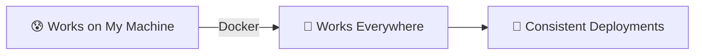

---

## 📍 Slide 2 – 🎯 Learning Outcomes

* ✅ Understand containers vs VMs and why containers win
* ✅ Write production-ready Dockerfiles
* ✅ Apply security best practices (rootless, distroless)
* ✅ Optimize images with multi-stage builds
* ✅ Publish images to Docker Hub

**🎓 By the end of this lecture:**

| # | 🎯 Outcome |
|---|-----------|
| 1 | 🧠 Explain container architecture and benefits |
| 2 | 📝 Write optimized, secure Dockerfiles |
| 3 | 🔐 Implement rootless containers |
| 4 | 📦 Use multi-stage builds for smaller images |
| 5 | 🚀 Push/pull images from Docker Hub |

---

## 📍 Slide 3 – 📋 Lecture Overview

* 📚 **Concepts + Diagrams** — how containers work
* 🛠️ **Dockerfile deep dive** — instructions and best practices
* 🔐 **Security patterns** — rootless and distroless
* 📦 **Optimization** — multi-stage builds
* 🌐 **Registry workflow** — Docker Hub

**⏱️ Lecture Structure:**
```
Section 0: Introduction           → 📝 PRE Quiz
Section 1: The Dependency Problem
Section 2: Container Fundamentals
Section 3: Dockerfile Scenarios   → 📝 MID Quiz
Section 4: Advanced Patterns
Section 5: Real World Usage
Section 6: Reflection             → 📝 POST Quiz
```

---

## 📍 Slide 4 – ❓ The Big Question

* 📊 **65%** of organizations use containers in production (2024)
* 🐳 **Docker Hub**: 14+ million images, 13+ billion pulls/month
* 💥 Yet most Dockerfiles have **security vulnerabilities**

> 💬 *"Containers are the new deployment unit"* — Kelsey Hightower

**🤔 Think about it:**
* Why do apps work locally but fail in production?
* What's inside a container that makes it portable?
* How small can a container image be?

---

## 📍 Slide 5 – 📝 QUIZ — DEVOPS_L2_PRE

---

## 📍 Slide 6 – 🔥 Section 1: The Dependency Problem

* 👨‍💻 **Developer**: "It works on my machine!"
* ⚙️ **Ops**: "Well, we're not shipping your machine!"
* 🧩 **The real problem**: dependencies, versions, configurations
* 💥 **Result**: deployment failures, debugging nightmares

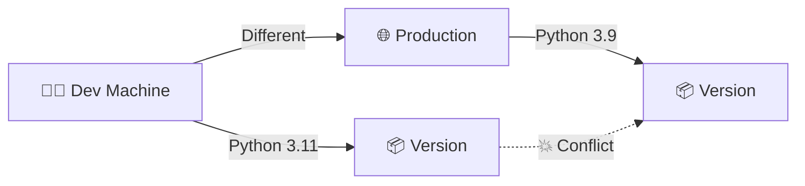

---

## 📍 Slide 7 – 🧩 The Dependency Hell

* 🐍 **Python version**: 3.9 vs 3.11 vs 3.12
* 📚 **Library versions**: requests 2.28 vs 2.31
* 🖥️ **OS differences**: Ubuntu vs Alpine vs macOS
* ⚙️ **System libraries**: OpenSSL, libffi, glibc

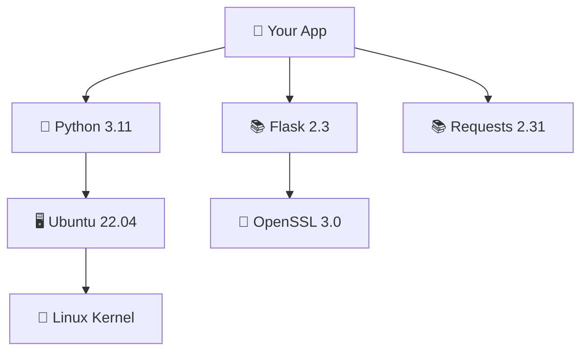

> 🤔 **Think:** How many things can go wrong?

---

## 📍 Slide 8 – 😱 The VM Solution (Heavy)

* 🖥️ **Virtual Machines** = entire OS per application
* 💾 **Size**: 10-50 GB per VM
* ⏱️ **Boot time**: minutes
* 🔧 **Resource overhead**: hypervisor, guest OS kernel

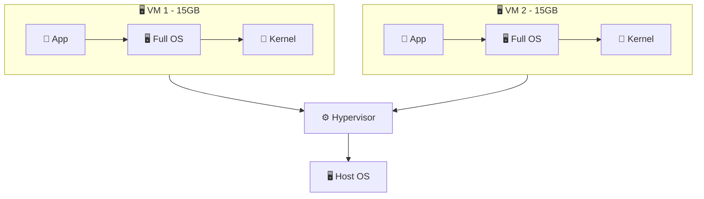

**😰 Problems:**
* 🐌 Slow to start
* 💸 Expensive (RAM, CPU, storage)
* 🔧 Hard to manage at scale

---

## 📍 Slide 9 – 🐳 The Container Solution (Light)

* 📦 **Containers** = isolated processes sharing host kernel
* 💾 **Size**: 5-500 MB typically
* ⏱️ **Start time**: milliseconds
* 🚀 **Density**: 10-100x more containers than VMs

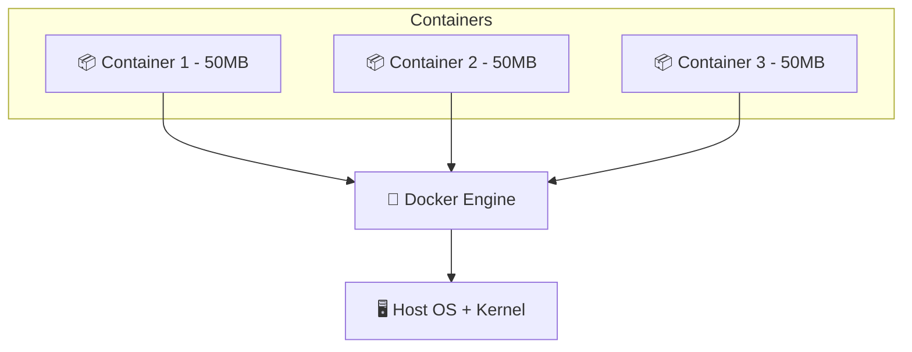

**🚀 Benefits:**
* ⚡ Start in milliseconds
* 💰 Efficient resource usage
* 📦 Portable across environments

---

## 📍 Slide 10 – 💸 VMs vs Containers

| 🔍 Aspect | 🖥️ Virtual Machine | 🐳 Container |
|-----------|-------------------|--------------|
| 💾 **Size** | 10-50 GB | 10-500 MB |
| ⏱️ **Boot Time** | Minutes | Milliseconds |
| 🧠 **Kernel** | Own kernel | Shared kernel |
| 🔒 **Isolation** | Strong (hardware) | Process-level |
| 📦 **Density** | 10-20 per host | 100s per host |
| 🎯 **Use Case** | Full OS needed | App deployment |

**📈 Real Numbers:**
* 🖥️ **VM**: 1 app = ~2GB RAM overhead
* 🐳 **Container**: 1 app = ~50MB overhead
* 🚀 **Result**: 40x more efficient!

---

## 📍 Slide 11 – 📜 History of Containerization

* 🕰️ **1979**: `chroot` — change root directory (Unix V7)
* 🔒 **2000**: FreeBSD Jails — first true isolation
* 🐧 **2006**: cgroups — Google contributes to Linux kernel
* 📦 **2008**: LXC (Linux Containers) — combines namespaces + cgroups
* 🐳 **2013**: **Docker** — makes containers accessible to everyone
* ☸️ **2014**: Kubernetes — container orchestration at scale
* 📦 **2015**: OCI (Open Container Initiative) — standardization

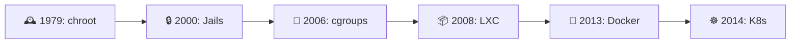

> 💡 Docker didn't invent containers — it made them **usable**.

---

## 📍 Slide 12 – 🐧 Linux Kernel: Namespaces

* 🎯 **Namespaces** = isolate what a process **can see**
* 🔒 Each container gets its own "view" of the system

| 🏷️ Namespace | 🔒 Isolates | 📝 Example |
|--------------|------------|-----------|
| **PID** | Process IDs | Container sees PID 1 as its init |
| **NET** | Network stack | Own IP, ports, routing |
| **MNT** | Mount points | Own filesystem view |
| **UTS** | Hostname | Own hostname |
| **IPC** | Inter-process comm | Own message queues |
| **USER** | User/Group IDs | UID 0 in container ≠ root on host |

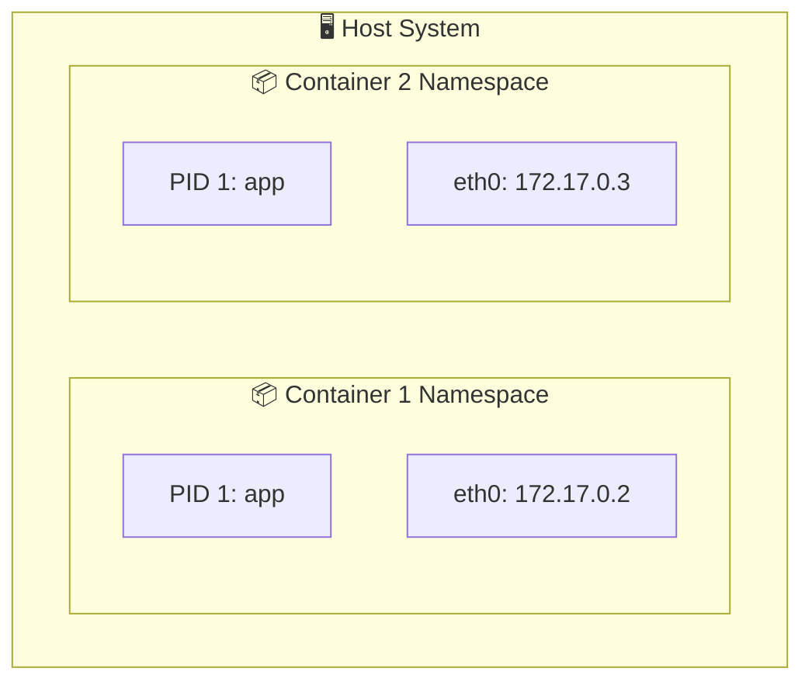

---

## 📍 Slide 13 – 🎛️ Linux Kernel: cgroups

* 🎯 **cgroups** (Control Groups) = limit what a process **can use**
* 📊 Resource limits prevent one container from killing the host

| 🎛️ cgroup | 🔧 Controls | 📝 Example |
|-----------|------------|-----------|
| **cpu** | CPU time | Max 50% of one core |
| **memory** | RAM usage | Max 512MB |
| **blkio** | Disk I/O | Max 100MB/s read |
| **pids** | Process count | Max 100 processes |

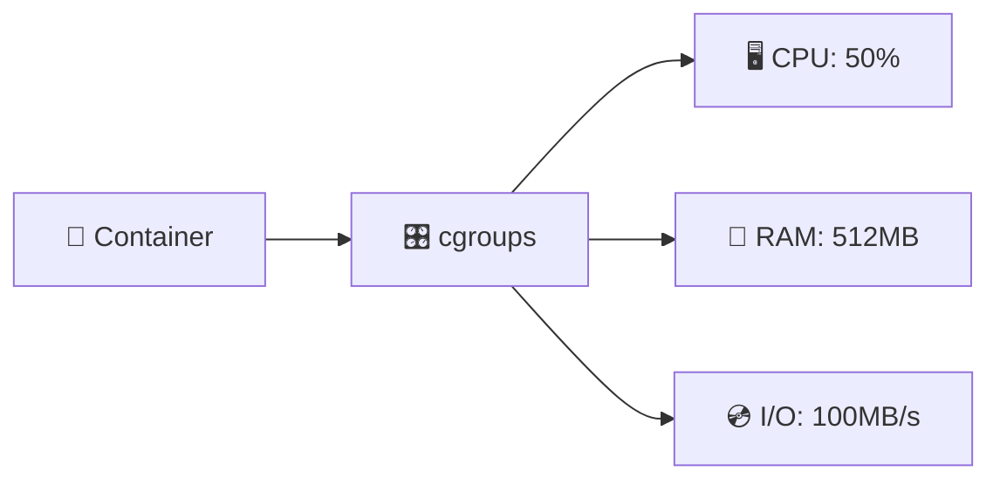

**🛡️ Why it matters:**
* ✅ Prevent runaway processes
* ✅ Fair resource sharing
* ✅ Predictable performance

---

## 📍 Slide 14 – 📂 Linux Kernel: Union Filesystems

* 🎯 **Union FS** = layer multiple filesystems as one
* 📚 Docker uses **overlay2** (default on Linux)
* 💾 Layers are **read-only**, changes go to top layer

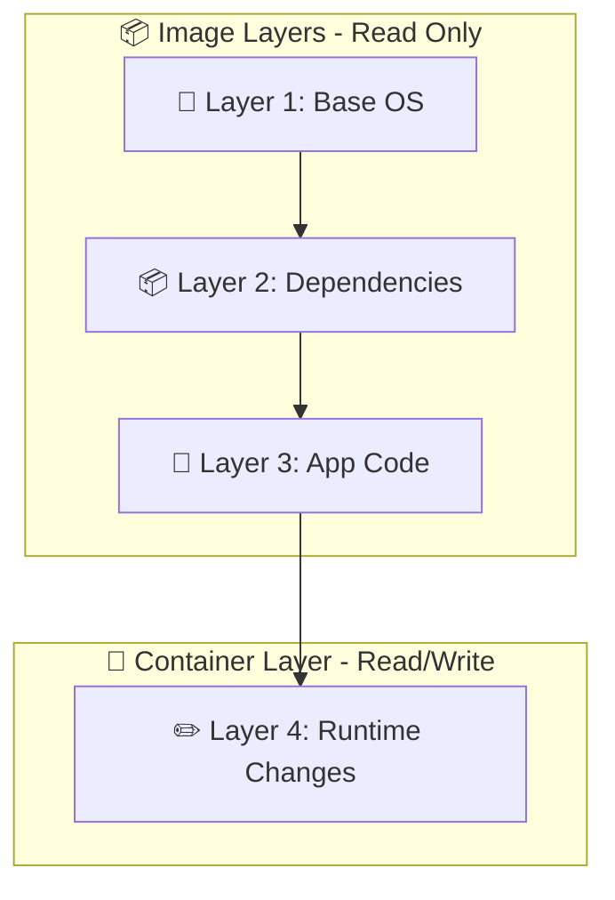

**💡 Benefits:**
* ✅ **Shared layers** — 10 containers can share base image
* ✅ **Fast startup** — no copying, just add thin layer
* ✅ **Efficient storage** — only differences stored

---

## 📍 Slide 15 – 🧩 How It All Fits Together

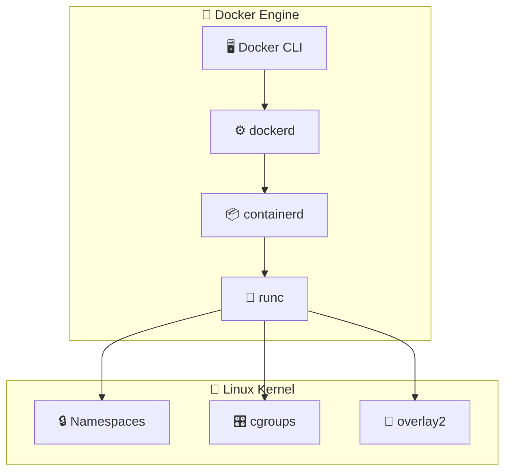

**🔧 The Stack:**
* 🖥️ **Docker CLI** — user interface
* ⚙️ **dockerd** — Docker daemon (API)
* 📦 **containerd** — container lifecycle management
* 🏃 **runc** — OCI runtime (creates containers)
* 🐧 **Kernel** — namespaces + cgroups + filesystem

---

## 📍 Slide 16 – 💡 Section 2: Docker Fundamentals

* 🐳 **Docker** = platform for building, shipping, running containers
* 📦 **Image** = blueprint (read-only template)
* 🏃 **Container** = running instance of an image
* 📝 **Dockerfile** = recipe to build an image

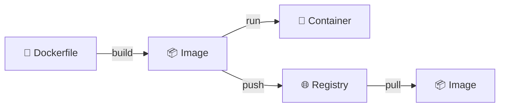

**📖 Definition:**
> *A container is a standard unit of software that packages code and all its dependencies so the application runs quickly and reliably across environments.*

---

## 📍 Slide 17 – 🏗️ Docker Architecture

* 🖥️ **Docker Client** = CLI commands (`docker build`, `docker run`)
* ⚙️ **Docker Daemon** = background service managing containers
* 📦 **Images** = layered filesystem snapshots
* 🌐 **Registry** = image storage (Docker Hub, ECR, GCR)

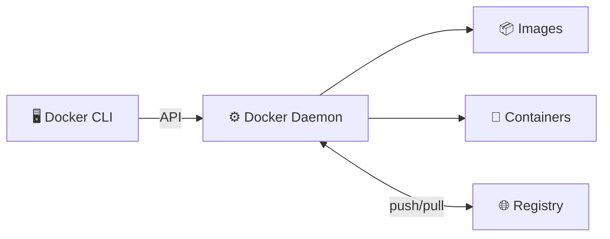

**🔧 Key Commands:**
* 🔨 `docker build` — create image from Dockerfile
* 🏃 `docker run` — start container from image
* 📤 `docker push` — upload image to registry
* 📥 `docker pull` — download image from registry

---

## 📍 Slide 18 – 📚 Image Layers

* 🎂 **Images are layered** = each instruction creates a layer
* 💾 **Layers are cached** = faster rebuilds
* 🔄 **Layers are shared** = efficient storage
* 📝 **Order matters** = for cache efficiency

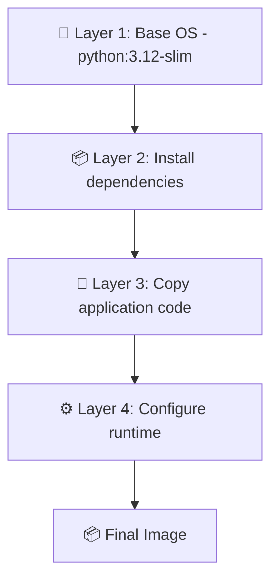

**💡 Key Insight:**
* ✅ Change code → only Layer 3-4 rebuild
* ❌ Change base → ALL layers rebuild

---

## 📍 Slide 19 – 📝 Dockerfile Basics

```dockerfile
# 🐍 Start from base image
FROM python:3.12-slim

# 📁 Set working directory
WORKDIR /app

# 📦 Copy and install dependencies FIRST (caching!)
COPY requirements.txt .
RUN pip install --no-cache-dir -r requirements.txt

# 📁 Copy application code
COPY . .

# 🚀 Define startup command
CMD ["python", "app.py"]
```

**📝 Key Instructions:**
| Instruction | 🎯 Purpose |
|-------------|-----------|
| `FROM` | 🐧 Base image |
| `WORKDIR` | 📁 Set directory |
| `COPY` | 📄 Copy files |
| `RUN` | ⚙️ Execute commands |
| `CMD` | 🚀 Default command |
| `EXPOSE` | 🔌 Document port |

---

## 📍 Slide 20 – ⚡ Before vs After Docker

| 😰 Before Docker | 🐳 After Docker |
|-----------------|-----------------|
| 📋 Manual server setup | 📝 Dockerfile defines everything |
| 🔧 "Install Python 3.11, then..." | 🐳 `FROM python:3.11` |
| 😱 "Works on my machine" | ✅ Works everywhere |
| 📅 Deploy monthly (scary) | 🚀 Deploy daily (confident) |
| 🐛 "Which version is prod?" | 📦 Image tag = version |
| 💀 Snowflake servers | 🐄 Immutable containers |

> 🤔 Which column describes your current workflow?

---

## 📍 Slide 21 – 🎮 Section 3: Dockerfile Scenarios

## 🕹️ Lab Preview: Containerize Your App

* 🏢 **Scenario**: You have a Python Flask app from Lab 1
* 🎯 **Goal**: Package it in a production-ready container
* 📋 **Requirements**: Security, optimization, best practices

**❓ What could go wrong?**

> 💀 **A lot.** Let's see common mistakes and fixes.

🎮 **Let's build it right.**

---

## 📍 Slide 22 – 💥 Scenario 1: Running as Root

**😰 The Problem:**
```dockerfile
FROM python:3.12
COPY . /app
CMD ["python", "app.py"]
# 💀 Running as root by default!
```

* 🔓 Container runs as **root** (UID 0)
* 💥 If attacker escapes container → **root on host**
* 🚨 Kubernetes blocks root containers by default

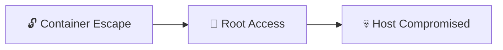

> ❓ **Why is this dangerous?**

---

## 📍 Slide 23 – ✅ Solution: Rootless Containers

## 🛠️ Fix: Create Non-Root User

```dockerfile
FROM python:3.12-slim

# 👤 Create non-root user
RUN useradd --create-home --shell /bin/bash appuser

WORKDIR /app
COPY requirements.txt .
RUN pip install --no-cache-dir -r requirements.txt
COPY . .

# 🔒 Switch to non-root user
USER appuser

CMD ["python", "app.py"]
```

**🎯 Result:** Container runs as `appuser`, not root

**🔐 Security Benefits:**
* ✅ Limited privileges inside container
* ✅ Can't modify system files
* ✅ Container escape = unprivileged user
* ✅ Kubernetes-compatible

---

## 📍 Slide 24 – 🐌 Scenario 2: Slow Builds (Bad Layer Order)

**😰 The Problem:**
```dockerfile
FROM python:3.12-slim
WORKDIR /app

# ❌ Copy EVERYTHING first
COPY . .

# 📦 Then install dependencies
RUN pip install -r requirements.txt

CMD ["python", "app.py"]
```

* 🔄 **Any code change** → reinstall ALL dependencies
* ⏱️ Build time: **5 minutes** every time
* 💸 Wasted CI/CD minutes

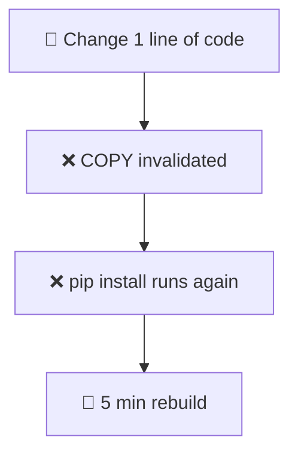

---

## 📍 Slide 25 – ✅ Solution: Optimized Layer Order

## 🛠️ Fix: Dependencies Before Code

```dockerfile
FROM python:3.12-slim
WORKDIR /app

# 📦 Copy ONLY requirements first
COPY requirements.txt .

# 📦 Install dependencies (cached if requirements unchanged)
RUN pip install --no-cache-dir -r requirements.txt

# 📁 THEN copy application code
COPY . .

CMD ["python", "app.py"]
```

**🎯 Result:** Change code → only last layer rebuilds

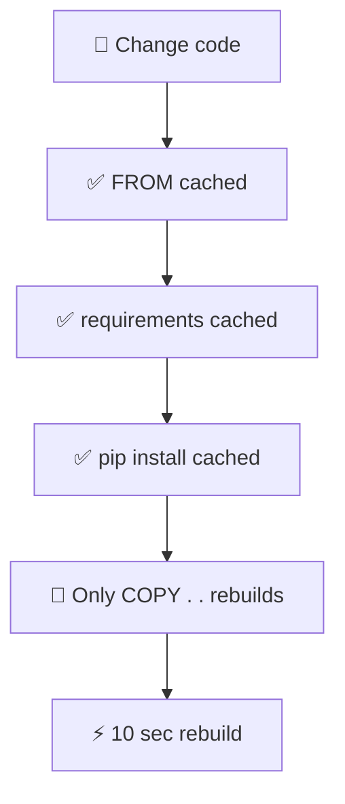

**⚡ Build time: 5 min → 10 sec**

---

## 📍 Slide 26 – 📦 Scenario 3: Bloated Images

**😰 The Problem:**
```dockerfile
FROM python:3.12
# 💾 Full Python image = 1.0 GB!
```

* 💾 Image size: **1+ GB**
* 🐌 Slow to pull/push
* 💸 Storage costs
* 🔓 Larger attack surface

**📊 Python Image Sizes:**
| Image | 💾 Size |
|-------|--------|
| `python:3.12` | 1.0 GB |
| `python:3.12-slim` | 150 MB |
| `python:3.12-alpine` | 50 MB |

> 🤔 **Do you need the full image?**

---

## 📍 Slide 27 – ✅ Solution: Slim Base Images

## 🛠️ Fix: Use Minimal Base Images

```dockerfile
# ✅ Use slim variant
FROM python:3.12-slim

# ✅ No cache for pip (smaller image)
RUN pip install --no-cache-dir -r requirements.txt

# ✅ Only copy what's needed
COPY app.py .
COPY templates/ templates/
```

**🎯 Result:** 1 GB → 150 MB (85% reduction!)

**📦 Base Image Guide:**
| Image Type | 🎯 Use Case | 💾 Size |
|------------|------------|--------|
| `python:3.12` | Need compilation tools | 1.0 GB |
| `python:3.12-slim` | Most apps (recommended) | 150 MB |
| `python:3.12-alpine` | Size-critical, simple apps | 50 MB |

**⚠️ Alpine Warning:** Uses musl libc, may break some packages

---

## 📍 Slide 28 – 📁 Scenario 4: No .dockerignore

**😰 The Problem:**
```bash
# Build context includes EVERYTHING
Sending build context to Docker daemon  500MB
```

* 📁 `.git/` folder (100+ MB)
* 📁 `node_modules/` or `venv/`
* 📁 `__pycache__/` files
* 📄 `.env` with secrets! 💀

**💥 Consequences:**
* 🐌 Slow builds
* 💾 Bloated images
* 🔓 Secrets leaked into image

---

## 📍 Slide 29 – ✅ Solution: .dockerignore

## 🛠️ Fix: Exclude Unnecessary Files

```dockerignore
# 🐙 Version control
.git
.gitignore

# 🐍 Python
__pycache__
*.pyc
*.pyo
venv/
.venv/

# 🔐 Secrets (NEVER include!)
.env
*.pem
secrets/

# 📝 Documentation
*.md
docs/

# 🧪 Tests (if not needed in container)
tests/
```

**🎯 Result:**
* ⚡ Build context: 500 MB → 5 MB
* 🔐 No secrets in image
* 🚀 Faster builds

---

## 📍 Slide 30 – 📝 QUIZ — DEVOPS_L2_MID

---

## 📍 Slide 31 – 🚀 Section 4: Advanced Patterns

## 🏗️ Multi-Stage Builds

* 🎯 **Problem**: Build tools bloat final image
* 💡 **Solution**: Separate build and runtime stages
* 📦 **Result**: Tiny production images

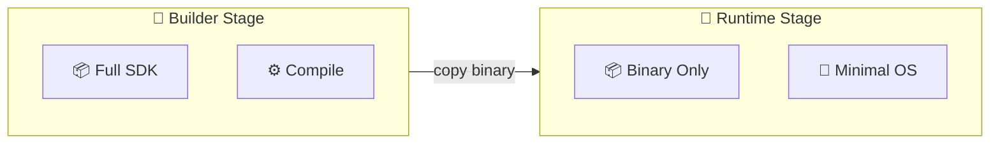

**📊 Size Impact:**
* 🔨 Builder: 1+ GB (SDK, compilers)
* 🚀 Runtime: 10-50 MB (binary only)

---

## 📍 Slide 32 – 📝 Multi-Stage Dockerfile

```dockerfile
# 🔨 Stage 1: Builder
FROM golang:1.21 AS builder
WORKDIR /app
COPY go.mod go.sum ./
RUN go mod download
COPY . .
RUN CGO_ENABLED=0 go build -o myapp

# 🚀 Stage 2: Runtime
FROM alpine:3.18
RUN adduser -D appuser
WORKDIR /app
COPY --from=builder /app/myapp .
USER appuser
CMD ["./myapp"]
```

**🔍 Key Points:**
* 🏷️ `AS builder` — name the stage
* 📦 `COPY --from=builder` — copy from previous stage
* 🗑️ Builder stage discarded in final image

**📊 Result:** 1.2 GB → 15 MB

---

## 📍 Slide 33 – 🔐 Distroless Images

## 🛡️ Ultimate Minimal Images

* 🚫 **No shell** — can't exec into container
* 🚫 **No package manager** — can't install malware
* 🚫 **No unnecessary files** — minimal attack surface
* ✅ **Only your app** — and runtime dependencies

```dockerfile
# 🔨 Build stage
FROM golang:1.21 AS builder
WORKDIR /app
COPY . .
RUN CGO_ENABLED=0 go build -o myapp

# 🔐 Distroless runtime
FROM gcr.io/distroless/static-debian12
COPY --from=builder /app/myapp /
CMD ["/myapp"]
```

**📊 Distroless Options:**
| Image | 🎯 For | 💾 Size |
|-------|-------|--------|
| `distroless/static` | Go, Rust (static) | 2 MB |
| `distroless/base` | C/C++ apps | 20 MB |
| `distroless/python3` | Python apps | 50 MB |
| `distroless/java` | Java apps | 190 MB |

---

## 📍 Slide 34 – 📊 Image Size Comparison

## 📈 Same App, Different Images

| 🏗️ Build Strategy | 💾 Image Size | 🔐 Security |
|-------------------|--------------|-------------|
| `FROM python:3.12` | 1.0 GB | 😰 Large attack surface |
| `FROM python:3.12-slim` | 150 MB | 😊 Better |
| Multi-stage + slim | 100 MB | 😄 Good |
| Multi-stage + alpine | 50 MB | 😄 Good |
| Multi-stage + distroless | 20 MB | 🔐 Excellent |
| `FROM scratch` (Go) | 5 MB | 🔐 Maximum |

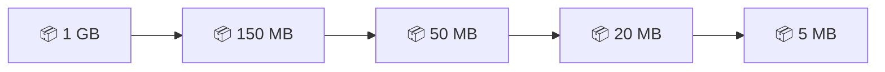

**🎯 Goal:** As small as possible while functional

---

## 📍 Slide 35 – 🌐 Docker Hub & Registries

## 📦 Publishing Your Images

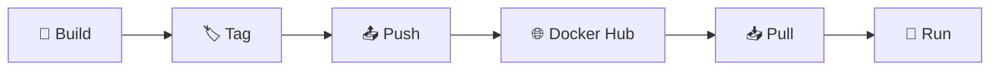

**🔧 Workflow:**
```bash
# 🔨 Build image
docker build -t myapp:1.0 .

# 🏷️ Tag for registry
docker tag myapp:1.0 username/myapp:1.0

# 🔐 Login to Docker Hub
docker login

# 📤 Push to registry
docker push username/myapp:1.0
```

**📦 Registries:**
* 🐳 Docker Hub — public/private
* ☁️ AWS ECR — AWS integrated
* 🌐 GCP GCR — Google integrated
* 🦊 GitLab Registry — GitLab integrated

---

## 📍 Slide 36 – 🏢 Section 5: Real World Usage

## 📅 Docker in Production

**🔨 Build Phase:**
* 📝 Dockerfile in repo
* 🤖 CI builds image on every commit
* 🏷️ Tag with git SHA or semantic version
* 📤 Push to registry

**🚀 Deploy Phase:**
* 📥 Pull image to servers
* 🏃 Run containers
* 📊 Monitor health
* 🔄 Rolling updates

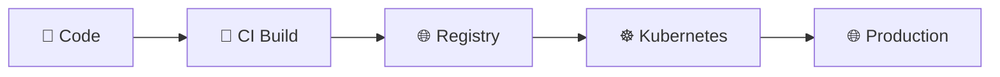

---

## 📍 Slide 37 – 🏷️ Tagging Strategies

| 🏷️ Strategy | 📝 Example | 🎯 Use Case |
|-------------|-----------|-------------|
| **Semantic** | `myapp:1.2.3` | Releases |
| **Git SHA** | `myapp:a1b2c3d` | Traceability |
| **Branch** | `myapp:develop` | Dev environments |
| **Latest** | `myapp:latest` | ⚠️ Avoid in prod! |
| **Date** | `myapp:2024-01-15` | Daily builds |

**⚠️ Never use `latest` in production:**
* 🤷 Which version is "latest"?
* 🔄 Changes without notice
* 🐛 Can't rollback reliably

**✅ Best Practice:**
```bash
# 🏷️ Immutable tags
docker tag myapp:1.0.0 registry/myapp:1.0.0
docker tag myapp:1.0.0 registry/myapp:sha-a1b2c3d
```

---

## 📍 Slide 38 – 🔐 Security Best Practices

```mermaid
flowchart TD
  Scan[🔍 Scan Images] --> Base[📦 Minimal Base]
  Base --> User[👤 Non-root User]
  User --> Secrets[🔐 No Secrets in Image]
  Secrets --> Update[🔄 Update Regularly]
  Update --> Sign[✍️ Sign Images]
```

**🔐 Security Checklist:**
* ✅ Run as non-root user (`USER appuser`)
* ✅ Use minimal base images (slim, distroless)
* ✅ Scan for vulnerabilities (Trivy, Snyk)
* ✅ Never store secrets in images
* ✅ Pin base image versions
* ✅ Update base images regularly

**🛠️ Scanning Tools:**
* 🔍 **Trivy** — open source, fast
* 🔍 **Snyk** — developer-friendly
* 🔍 **Docker Scout** — built into Docker

---

## 📍 Slide 39 – 📈 Career Skills

```mermaid
flowchart LR
  Docker[🐳 Docker Basics] --> Compose[📦 Docker Compose]
  Compose --> K8s[☸️ Kubernetes]
  K8s --> GitOps[🔄 GitOps]
  GitOps --> Platform[🏗️ Platform Engineering]
```

**🛠️ Docker Skills Progression:**
* 🐳 **Level 1**: Write Dockerfiles, build/run containers
* 📦 **Level 2**: Multi-stage builds, optimization
* 🔐 **Level 3**: Security hardening, distroless
* 📊 **Level 4**: Registry management, scanning
* ☸️ **Level 5**: Container orchestration (K8s)

**📊 Job Market (2024):**
* 🐳 Docker required in **80%** of DevOps jobs
* ☸️ Kubernetes in **65%** of container jobs
* 💰 Container skills = **+15-20%** salary

---

## 📍 Slide 40 – 🌍 Real Company Examples

**🎬 Netflix:**
* 🐳 Millions of containers daily
* 📦 Custom base images (hardened)
* 🔄 Immutable deployments

**🛒 Shopify:**
* 🐳 Containerized entire platform
* ⚡ Deploy 80x/day
* 📦 Standardized Dockerfiles

**🚗 Uber:**
* 🐳 4,000+ microservices in containers
* 🔐 Strict security policies
* 📊 Custom image scanning

**📊 Common Patterns:**
* ✅ Standardized base images
* ✅ Automated security scanning
* ✅ Multi-stage builds everywhere
* ✅ No root containers

---

## 📍 Slide 41 – 🎯 Section 6: Reflection

## 📝 Key Takeaways

1. 🐳 **Containers = lightweight, portable app packaging**
2. 📝 **Dockerfile order matters** — dependencies before code
3. 👤 **Always run as non-root** — security first
4. 🏗️ **Multi-stage builds** — separate build from runtime
5. 📦 **Smaller is better** — less attack surface, faster deploys

> 💡 A good Dockerfile is secure, optimized, and maintainable.

---

## 📍 Slide 42 – 🧠 The Mindset Shift

| 😰 Old Mindset | 🐳 Container Mindset |
|---------------|---------------------|
| 🖥️ "Configure servers manually" | 📝 "Define in Dockerfile" |
| 🔧 "Install dependencies on host" | 📦 "Bundle in container" |
| 👑 "Run as root, it's easier" | 👤 "Run as non-root always" |
| 💾 "Bigger image = more features" | ⚡ "Smaller = faster & safer" |
| 🏷️ "Just use :latest" | 🔖 "Pin versions always" |

> ❓ Which mindset will you adopt?

---

## 📍 Slide 43 – ✅ Your Progress

## 🎓 What You Now Understand

* ✅ Why containers beat VMs for app deployment
* ✅ Docker architecture: images, containers, registries
* ✅ How to write optimized Dockerfiles
* ✅ Security: rootless containers, minimal images
* ✅ Multi-stage builds for smaller images
* ✅ Docker Hub publishing workflow

> 🚀 **You're ready for Lab 2!**

---

## 📍 Slide 44 – 📝 QUIZ — DEVOPS_L2_POST

---

## 📍 Slide 45 – 🚀 What Comes Next

## 📚 Lab 2: Containerize Your App

* 🐳 Write Dockerfile for your Python app
* 👤 Implement non-root user
* 📦 Optimize with layer ordering
* 🌐 Push to Docker Hub
* 🏆 Bonus: Multi-stage build for Go app

**🔮 Future Lectures:**
* 📦 **Lecture 3**: CI/CD with GitHub Actions
* ☸️ **Lecture 9**: Kubernetes deployment
* 🔄 **Lecture 13**: GitOps with ArgoCD

```mermaid
flowchart LR
  You[👤 You] --> Docker[🐳 Docker Skills]
  Docker --> K8s[☸️ Kubernetes]
  K8s --> GitOps[🔄 GitOps]
  GitOps --> Career[🚀 DevOps Career]
```

**👋 See you in the lab!**

---

## 📚 Resources & Further Reading

**📕 Books:**
* 📖 *Docker Deep Dive* — Nigel Poulton
* 📖 *Container Security* — Liz Rice
* 📖 *Docker in Action* — Jeff Nickoloff

**🔗 Links:**
* 🌐 [Dockerfile Best Practices](https://docs.docker.com/develop/develop-images/dockerfile_best-practices/)
* 🌐 [Distroless Images](https://github.com/GoogleContainerTools/distroless)
* 🌐 [Docker Security](https://docs.docker.com/engine/security/)
* 🌐 [Multi-Stage Builds](https://docs.docker.com/build/building/multi-stage/)

**🛠️ Tools:**
* 🔍 [Hadolint](https://github.com/hadolint/hadolint) — Dockerfile linter
* 🔍 [Dive](https://github.com/wagoodman/dive) — Explore image layers
* 🔍 [Trivy](https://github.com/aquasecurity/trivy) — Security scanner

---
