# 📌 Lecture 3 — Continuous Integration: Automate Testing & Build Confidence

## 📍 Slide 1 – 🤖 Welcome to CI/CD

* 🐛 **Manual testing** = slow, error-prone, doesn't scale
* 🤖 **Continuous Integration** = automate testing, building, and validation
* ✅ **Goal**: Catch bugs before they reach production
* 🚀 This lecture: Build your first CI/CD pipeline with GitHub Actions

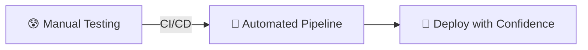

---

## 📍 Slide 2 – 🎯 Learning Outcomes

* ✅ Understand CI/CD principles and benefits
* ✅ Write effective unit tests
* ✅ Build GitHub Actions workflows
* ✅ Implement security scanning with Snyk
* ✅ Apply CI/CD best practices (caching, versioning)

**🎓 By the end of this lecture:**

| # | 🎯 Outcome |
|---|-----------|
| 1 | 🧠 Explain CI/CD and why it matters |
| 2 | 🧪 Write meaningful unit tests |
| 3 | ⚙️ Create GitHub Actions workflows |
| 4 | 🔐 Integrate security scanning |
| 5 | 📦 Automate Docker builds & publishing |

---

## 📍 Slide 3 – 📋 Lecture Overview

* 📚 **CI/CD fundamentals** — what, why, how
* 🧪 **Testing strategies** — unit, integration, coverage
* ⚙️ **GitHub Actions** — YAML workflows, actions marketplace
* 🔐 **Security** — Snyk vulnerability scanning
* 🚀 **Automation** — Docker builds, versioning, caching

**⏱️ Lecture Structure:**
```
Section 0: Introduction           → 📝 PRE Quiz
Section 1: The Testing Problem
Section 2: CI/CD Fundamentals
Section 3: GitHub Actions Hands-on → 📝 MID Quiz
Section 4: Advanced CI Patterns
Section 5: Production Practices
Section 6: Reflection             → 📝 POST Quiz
```

---

## 📍 Slide 4 – ❓ The Big Question

* 📊 **85%** of software bugs are found in production (2024)
* ⏱️ Average cost to fix a prod bug: **100x** more than dev bug
* 🚀 Teams with good CI deploy **46x** more frequently

> 💬 *"If it hurts, do it more often"* — Continuous Delivery principle

**🤔 Think about it:**
* How do you know your code works before deploying?
* What happens when someone breaks the main branch?
* How many bugs could be caught automatically?

---

## 📍 Slide 5 – 📝 QUIZ — DEVOPS_L3_PRE

---

## 📍 Slide 6 – 🔥 Section 1: The Testing Problem

* 👨‍💻 **Developer**: "It works on my machine!"
* 🐛 **Production**: 500 errors, users complaining
* 😰 **The gap**: No automated testing or validation
* 💥 **Result**: Bugs slip through, confidence is low

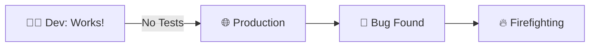

---

## 📍 Slide 7 – 🧪 Manual Testing Hell

* 📋 **Manual checklist**: 50 steps to test before deploy
* ⏱️ **Time**: 2 hours per test cycle
* 😴 **Human error**: Forgot to test one endpoint
* 🔄 **Frequency**: Only before big releases (too painful)

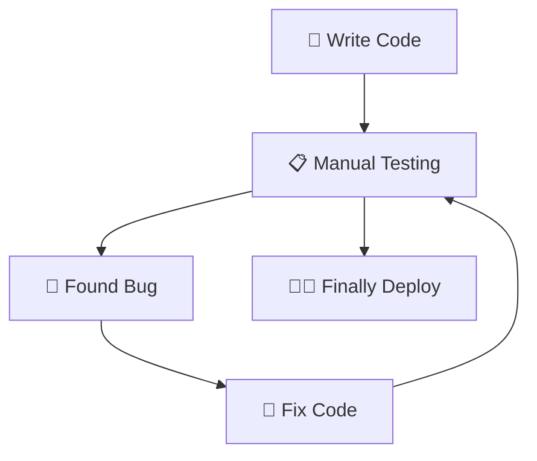

**😰 Problems:**
* 🐌 Slow feedback loop
* 🎰 Testing is inconsistent
* 🧠 Requires human to remember all steps
* 💀 Nobody wants to test

---

## 📍 Slide 8 – 💥 The Integration Problem

* 👥 **Multiple developers** pushing to main branch
* 🔀 **Merge conflicts** caught too late
* 💥 **Breaking changes** not detected
* 🤷 **"Who broke the build?"** — the blame game

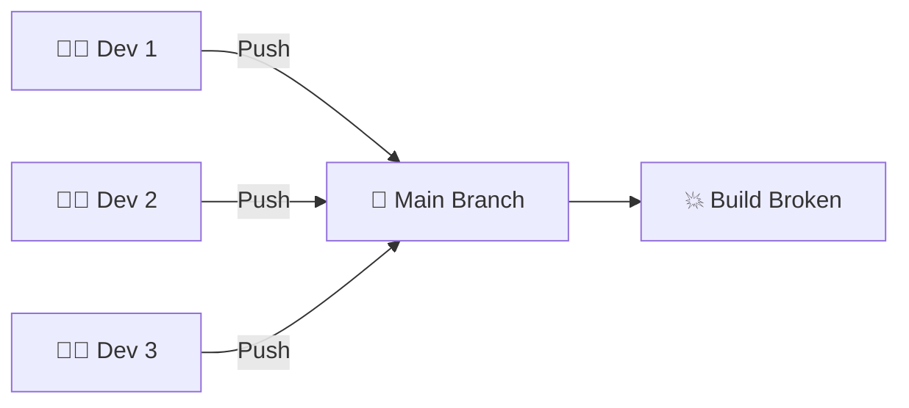

> 🤔 **Think:** How do we prevent this?

---

## 📍 Slide 9 – 🔐 The Security Gap

* 📦 **Dependencies** with known vulnerabilities
* 🔓 **Secrets** accidentally committed
* 🚨 **CVEs** discovered after deployment
* 🤷 **Nobody checked** before merging

**📊 Real Stats:**
* 🔍 **84%** of codebases have vulnerable dependencies
* ⏱️ Average time to detect vulnerability: **54 days**
* 💰 Average breach cost: **$4.45 million**

---

## 📍 Slide 10 – 💸 The Cost of No CI

| 🔥 Problem | 💥 Impact |
|------------|-----------|
| 🐛 Bugs in production | Customer churn, reputation damage |
| ⏱️ Slow feedback | Wasted development time |
| 😰 Fear of deployment | Infrequent releases |
| 🔒 Security vulnerabilities | Data breaches, compliance issues |

**📈 Real Numbers:**
* 🐛 Prod bug fix cost: **$10,000 - $100,000**
* 🕒 Time to detect + fix: **4-8 hours**
* 🏢 Without CI: Deploy **monthly**
* 🚀 With CI: Deploy **daily**

---

## 📍 Slide 11 – 💡 Section 2: CI/CD Fundamentals

* 🤖 **Continuous Integration (CI)** = automatically test every change
* 🚀 **Continuous Delivery (CD)** = always ready to deploy
* 📦 **Continuous Deployment** = automatically deploy to production
* 🎯 **Goal**: Fast, reliable, automated software delivery

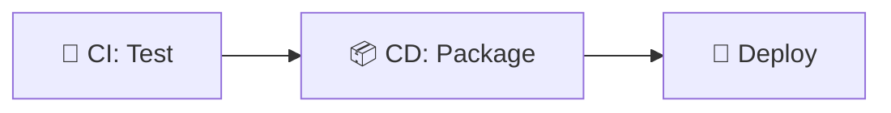

**📖 Definitions:**
> *CI: Developers integrate code into shared repository frequently. Each integration is verified by automated build and tests.*
> *CD: Software can be released to production at any time.*

---

## 📍 Slide 12 – 🔄 The CI/CD Pipeline

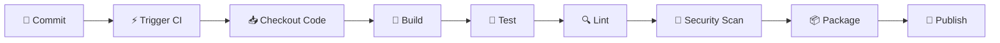

**🔧 Stages:**
1. 📝 **Commit** — Developer pushes code
2. ⚡ **Trigger** — CI system detects change
3. 🔨 **Build** — Compile/prepare code
4. 🧪 **Test** — Run automated tests
5. 🔍 **Lint** — Check code quality
6. 🔐 **Scan** — Security vulnerabilities
7. 📦 **Package** — Build artifacts (Docker image)
8. 🚀 **Publish** — Push to registry

---

## 📍 Slide 13 – ✅ CI/CD Benefits

| 🎯 Benefit | 📊 Impact |
|-----------|----------|
| ⚡ **Fast Feedback** | Know in 5 min if code works |
| 🐛 **Early Bug Detection** | Catch before production |
| 🔒 **Security** | Automated vulnerability scanning |
| 📦 **Consistent Builds** | Same process every time |
| 💪 **Confidence** | Deploy without fear |
| 🚀 **Faster Releases** | Deploy multiple times per day |

**📈 DORA Metrics (Elite Performers):**
* 📦 Deploy frequency: **Multiple times/day**
* ⏱️ Lead time: **< 1 hour**
* 🔧 MTTR: **< 1 hour**
* ❌ Change failure rate: **< 15%**

---

## 📍 Slide 14 – 🧪 Testing Pyramid

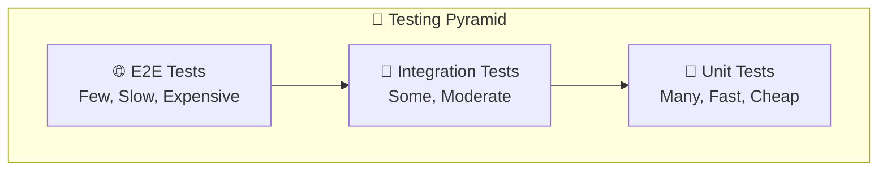

**🎯 Test Types:**
* 🧪 **Unit Tests** (80%) — Test individual functions
* 🔗 **Integration Tests** (15%) — Test components together
* 🌐 **End-to-End Tests** (5%) — Test full user flows

**💡 Why the pyramid?**
* ✅ Unit tests: Fast (ms), cheap, catch most bugs
* ✅ Integration: Slower (seconds), catch interface bugs
* ⚠️ E2E: Slowest (minutes), brittle, expensive

---

## 📍 Slide 15 – ⚡ Before vs After CI/CD

| 😰 Before CI/CD | 🚀 After CI/CD |
|-----------------|----------------|
| 📋 Manual testing checklist | 🤖 Automated test suite |
| 🎰 "Fingers crossed" deploys | ✅ Confident deployments |
| 🐛 Bugs found in production | 🧪 Bugs caught in CI |
| ⏱️ 2 hour test cycle | ⚡ 5 minute feedback |
| 😱 Deploy monthly | 🚀 Deploy daily |
| 🤷 "Who broke it?" | 📊 Git bisect + logs |

> 🤔 Which column is your current process?

---

## 📍 Slide 16 – 🎮 Section 3: GitHub Actions Hands-On

## 🕹️ Lab Preview: Build Your CI Pipeline

* 🏢 **Scenario**: You have a Python Flask app
* 🎯 **Goal**: Automate testing and Docker builds
* 📋 **Requirements**: Tests, lint, security scan, publish

**❓ How do we automate all this?**

> 🤖 **GitHub Actions** to the rescue!

🎮 **Let's build it step by step.**

---

## 📍 Slide 17 – 💥 Scenario 1: No Tests

**😰 The Problem:**
```python
# app.py
@app.route('/')
def home():
    return {"message": "Hello", "hostname": os.getenv("HOSTNAME")}

# 🚫 No tests!
```

* 📝 Code looks fine
* 💥 Deploy → crashes because `HOSTNAME` is None
* 🐛 Users see 500 errors
* 😱 Rollback emergency

> ❓ **How do we catch this before deploy?**

---

## 📍 Slide 18 – ✅ Solution: Unit Testing

## 🛠️ Fix: Write Tests First

```python
# tests/test_app.py
import pytest
from app import app

def test_home_endpoint():
    """Test that home returns expected structure"""
    client = app.test_client()
    response = client.get('/')

    assert response.status_code == 200
    data = response.get_json()
    assert "message" in data
    assert "hostname" in data
    assert isinstance(data["message"], str)

def test_health_endpoint():
    """Test health check"""
    client = app.test_client()
    response = client.get('/health')

    assert response.status_code == 200
    assert response.get_json()["status"] == "healthy"
```

**🎯 Result:** Tests catch the bug before deploy!

---

## 📍 Slide 19 – 🧪 Testing Frameworks

## Python Testing Options

| Framework | 🎯 Pros | ⚠️ Cons |
|-----------|--------|--------|
| **pytest** | Simple, powerful, fixtures | Extra dependency |
| **unittest** | Built-in, no dependencies | Verbose, old-style |

```bash
# 🧪 pytest (recommended)
pip install pytest
pytest tests/

# 🧪 unittest (built-in)
python -m unittest discover tests/
```

**💡 Why pytest?**
* ✅ Simple syntax (`assert` instead of `self.assertEqual`)
* ✅ Powerful fixtures (setup/teardown)
* ✅ Great plugins (coverage, parallel, etc.)
* ✅ Industry standard

---

## 📍 Slide 20 – 📝 Scenario 2: Manual Docker Builds

**😰 The Problem:**
```bash
# 🐌 Manual process every time
docker build -t myapp:latest .
docker tag myapp:latest username/myapp:v1.2.3
docker login
docker push username/myapp:v1.2.3
docker push username/myapp:latest

# 😱 Forgot to update version tag!
# 💀 Built from wrong branch!
```

* ⏱️ Takes 10 minutes
* 🎰 Inconsistent (human error)
* 📋 No validation before build
* 🤷 Can't track what version is deployed

---

## 📍 Slide 21 – ✅ Solution: GitHub Actions CI/CD

## 🛠️ Fix: Automate Everything

```yaml
# .github/workflows/python-ci.yml
name: Python CI

on:
  push:
    branches: [ main ]
  pull_request:

jobs:
  test:
    runs-on: ubuntu-latest
    steps:
      - uses: actions/checkout@v4

      - uses: actions/setup-python@v5
        with:
          python-version: '3.12'

      - name: Install dependencies
        run: |
          pip install -r requirements.txt
          pip install pytest flake8

      - name: Lint
        run: flake8 app.py

      - name: Test
        run: pytest tests/
```

**🎯 Result:** Every commit automatically tested!

---

## 📍 Slide 22 – 🐳 Docker Build Automation

```yaml
  docker:
    needs: test  # ✅ Only run if tests pass
    runs-on: ubuntu-latest
    steps:
      - uses: actions/checkout@v4

      - name: Login to Docker Hub
        uses: docker/login-action@v3
        with:
          username: ${{ secrets.DOCKER_USERNAME }}
          password: ${{ secrets.DOCKER_TOKEN }}

      - name: Build and push
        uses: docker/build-push-action@v5
        with:
          context: ./app_python
          push: true
          tags: |
            ${{ secrets.DOCKER_USERNAME }}/myapp:latest
            ${{ secrets.DOCKER_USERNAME }}/myapp:${{ github.sha }}
```

**🔐 Security Note:** Never hardcode credentials!

---

## 📍 Slide 23 – 🔓 Scenario 3: Vulnerable Dependencies

**😰 The Problem:**
```bash
# requirements.txt
flask==2.0.1  # 💀 Known CVE-2023-30861
requests==2.25.0  # 🔓 Security vulnerability

# 🤷 Nobody checked before deploying
```

* 🔍 **84%** of apps have vulnerable dependencies
* ⏱️ Takes **weeks** to discover
* 💀 Already in production when found

**📊 Real Example:**
* 📦 Log4Shell (2021) — **35,000+ CVE**
* 💰 Cost to remediate: **Billions of dollars**

---

## 📍 Slide 24 – ✅ Solution: Snyk Security Scanning

## 🛠️ Fix: Automated Vulnerability Scanning

```yaml
  security:
    runs-on: ubuntu-latest
    steps:
      - uses: actions/checkout@v4

      - name: Run Snyk
        uses: snyk/actions/python-3.10@master
        env:
          SNYK_TOKEN: ${{ secrets.SNYK_TOKEN }}
        with:
          args: --severity-threshold=high
```

**🎯 What Snyk Does:**
* 🔍 Scans dependencies for known CVEs
* 📊 Reports severity (low/medium/high/critical)
* 🔧 Suggests fixes
* ❌ Fails build if critical vulnerabilities found

**🔐 Result:** Catch vulnerabilities before production!

---

## 📍 Slide 25 – 🐌 Scenario 4: Slow CI Builds

**😰 The Problem:**
```
[Run 1] Installing dependencies... 2 minutes
[Run 2] Installing dependencies... 2 minutes
[Run 3] Installing dependencies... 2 minutes
# 💸 Wasting 6 minutes downloading same packages!
```

* ⏱️ Each run: **5-10 minutes**
* 🔄 Re-downloading same dependencies
* 💰 Wasting CI minutes (costs money!)
* 😴 Slow feedback loop

---

## 📍 Slide 26 – ✅ Solution: Dependency Caching

## 🛠️ Fix: Cache Dependencies

```yaml
- uses: actions/setup-python@v5
  with:
    python-version: '3.12'
    cache: 'pip'  # ✅ Enable caching
    cache-dependency-path: 'requirements.txt'

# Alternative with explicit cache
- uses: actions/cache@v4
  with:
    path: ~/.cache/pip
    key: ${{ runner.os }}-pip-${{ hashFiles('requirements.txt') }}
```

**📊 Performance Impact:**
* ⏱️ **Before caching**: 5 minutes
* ⚡ **After caching**: 30 seconds
* 🚀 **10x faster!**

**💡 Cache Key Strategy:**
* 🔑 Key includes `requirements.txt` hash
* 🔄 Cache invalidates when dependencies change
* ✅ Fresh install when needed, cached otherwise

---

## 📍 Slide 27 – 📝 QUIZ — DEVOPS_L3_MID

---

## 📍 Slide 28 – 🏷️ Section 4: Versioning Strategies

## 📦 How to Version Your Images?

**Two main approaches:**

**🔢 Semantic Versioning (SemVer):**
* Format: `MAJOR.MINOR.PATCH` (e.g., `1.2.3`)
* 🎯 Use when: Breaking changes matter
* 📚 Example: Libraries, APIs

**📅 Calendar Versioning (CalVer):**
* Format: `YYYY.MM.DD` (e.g., `2024.01.15`)
* 🎯 Use when: Continuous deployment
* 🚀 Example: Web services, SaaS

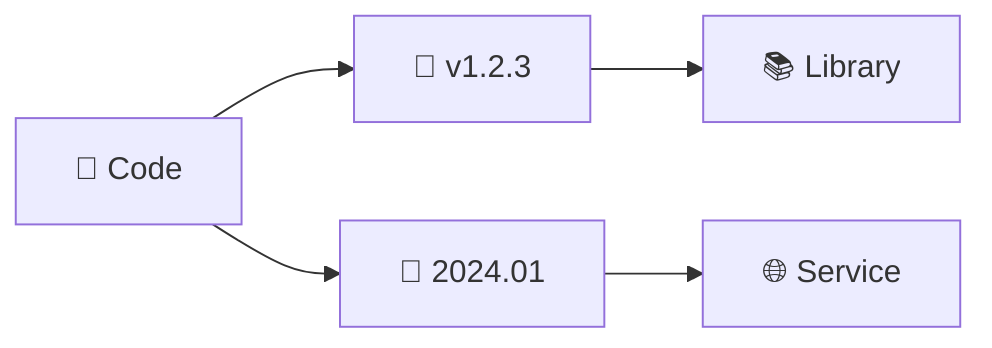

---

## 📍 Slide 29 – 🔢 Semantic Versioning (SemVer)

## v MAJOR.MINOR.PATCH

| Version | 🎯 When to Bump |
|---------|----------------|
| **MAJOR** (v2.0.0) | Breaking changes (API changed) |
| **MINOR** (v1.1.0) | New features (backward-compatible) |
| **PATCH** (v1.0.1) | Bug fixes (backward-compatible) |

```yaml
# 🏷️ Multiple tags per release
tags: |
  username/app:1.2.3
  username/app:1.2
  username/app:1
  username/app:latest
```

**✅ Pros:**
* 📖 Clear breaking change signals
* 🎯 Industry standard for libraries
* 🔄 Users can pin to major version

**⚠️ Cons:**
* 🤔 Requires discipline
* 📋 Need to track what's breaking vs feature

---

## 📍 Slide 30 – 📅 Calendar Versioning (CalVer)

## YYYY.MM.DD or YYYY.MM

| Format | 📝 Example | 🎯 Use Case |
|--------|-----------|-------------|
| `YYYY.MM.DD` | `2024.01.15` | Daily releases |
| `YYYY.MM.MICRO` | `2024.01.3` | Monthly + patch |
| `YYYY.0M` | `2024.01` | Monthly releases |

```yaml
# 📅 Generate version from date
- name: Generate version
  run: echo "VERSION=$(date +%Y.%m.%d)" >> $GITHUB_ENV

tags: |
  username/app:2024.01.15
  username/app:2024.01
  username/app:latest
```

**✅ Pros:**
* 📆 No ambiguity (date is date)
* 🚀 Perfect for continuous deployment
* 🧠 Easy to remember

**⚠️ Cons:**
* 🤷 Doesn't indicate breaking changes

---

## 📍 Slide 31 – 🔀 Matrix Builds

## Test Multiple Versions

```yaml
jobs:
  test:
    runs-on: ubuntu-latest
    strategy:
      matrix:
        python-version: ['3.11', '3.12', '3.13']

    steps:
      - uses: actions/setup-python@v5
        with:
          python-version: ${{ matrix.python-version }}

      - run: pytest tests/
```

**🎯 What This Does:**
* 🔄 Runs tests **3 times** (one per Python version)
* ⚡ Runs in **parallel**
* ✅ Ensures compatibility across versions

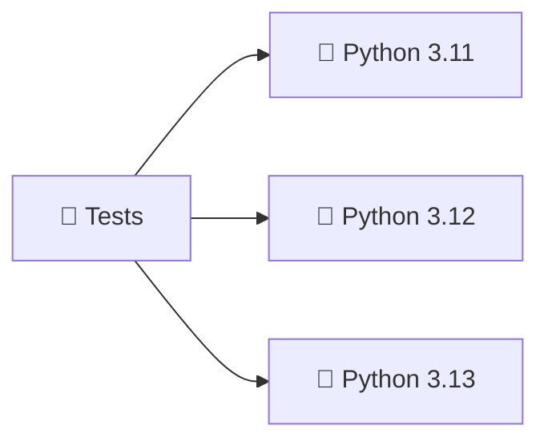

---

## 📍 Slide 32 – 📂 Path Filters (Monorepo)

## Only Run CI for Changed Apps

```yaml
# Python CI only runs when Python code changes
on:
  push:
    paths:
      - 'app_python/**'
      - '.github/workflows/python-ci.yml'

# Go CI only runs when Go code changes
on:
  push:
    paths:
      - 'app_go/**'
      - '.github/workflows/go-ci.yml'
```

**🎯 Benefits:**
* ⚡ Faster CI (don't run unnecessary builds)
* 💰 Save CI minutes
* 🔕 Less noise (only relevant notifications)

**📊 Impact:**
* 🐌 Without filters: Every commit runs **all** CI
* 🚀 With filters: Only **affected** apps run

---

## 📍 Slide 33 – 📊 Test Coverage

## Measure What's Tested

```yaml
- name: Run tests with coverage
  run: |
    pip install pytest-cov
    pytest --cov=app_python --cov-report=xml --cov-report=term

- name: Upload to Codecov
  uses: codecov/codecov-action@v4
  with:
    file: ./coverage.xml
```

**📊 Coverage Badge:**
```markdown

```

**🎯 What's Good Coverage?**
* 🥉 **60-70%** — Okay, could be better
* 🥈 **70-85%** — Good, most code tested
* 🥇 **85-95%** — Excellent coverage
* ⚠️ **100%** — Usually overkill (diminishing returns)

---

## 📍 Slide 34 – ✅ CI Best Practices

| 🎯 Practice | 💡 Why It Matters |
|------------|------------------|
| ⚡ **Fail Fast** | Stop on first failure, save time |
| 🔗 **Job Dependencies** | Don't push if tests fail |
| 🔒 **Secrets in Vault** | Never hardcode credentials |
| 📦 **Cache Dependencies** | 10x faster builds |
| 🔍 **Security Scanning** | Catch CVEs early |
| 📊 **Status Badges** | Visibility into health |
| 🎯 **Branch Protection** | Require CI before merge |
| ♻️ **Concurrency Control** | Cancel outdated runs |

**🔐 Security:**
* ✅ Use `secrets.*` for sensitive data
* ✅ Minimum permissions (`permissions:`)
* ✅ Pin action versions (`actions/checkout@v4`)

---

## 📍 Slide 35 – 🌐 GitHub Actions Marketplace

## Reusable Actions

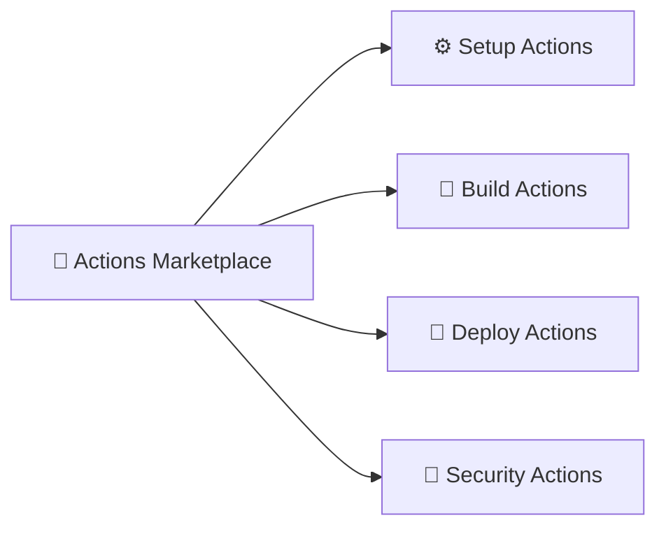

**🔥 Popular Actions:**
* ⚙️ `actions/checkout@v4` — Clone repo
* 🐍 `actions/setup-python@v5` — Setup Python
* 🐳 `docker/build-push-action@v5` — Build Docker
* 🔐 `snyk/actions@master` — Security scan
* 📊 `codecov/codecov-action@v4` — Coverage

**🔍 Find Actions:**
* 🌐 [github.com/marketplace](https://github.com/marketplace?type=actions)
* ⭐ Check stars/downloads
* 📖 Read documentation
* 🔒 Verify source/security

---

## 📍 Slide 36 – 🏢 Section 5: Production CI/CD

## Real-World CI Workflows

**🎬 Netflix:**
* 🚀 **3000+** builds per day
* 🔄 Full CI pipeline in **<10 minutes**
* 🎯 A/B test deployments

**🛒 Shopify:**
* ⚡ Deploy **80+ times per day**
* 🤖 Auto-rollback on failure
* 📊 Real-time metrics in CI

**🔍 Google:**
* 🏗️ **Monorepo** with 2 billion LOC
* 🧪 **100+ million tests** daily
* 📦 Bazel build system

---

## 📍 Slide 37 – 🚦 Branch Protection Rules

## Require CI Before Merge

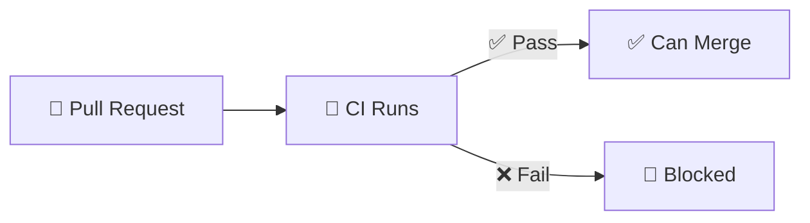

**⚙️ GitHub Settings:**
* ✅ Require status checks to pass
* ✅ Require branches to be up to date
* ✅ Require review from code owners
* 🔒 Prevent direct push to main

**🎯 Result:**
* 🚫 No broken code in main branch
* ✅ Every change is tested
* 📊 Full history of CI results

---

## 📍 Slide 38 – 🔄 GitOps Preview

## From CI to CD

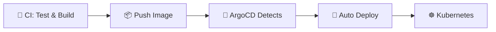

**🔮 Coming Up:**
* 📦 **Lab 13**: ArgoCD deploys what CI builds
* ☸️ **K8s**: Orchestrate containers
* 🔄 **GitOps**: Git as source of truth
* 🚀 **Full automation**: Commit → Production

---

## 📍 Slide 39 – 💡 CI/CD Anti-Patterns

| ❌ Anti-Pattern | ✅ Better Approach |
|----------------|-------------------|
| 🎰 "It works on my machine" | 🧪 Automated tests catch issues |
| 📋 Manual deployment checklist | 🤖 Automated pipeline |
| 🤷 No tests, just deploy | 🧪 Comprehensive test suite |
| 💀 Long-lived feature branches | 🔄 Trunk-based development |
| 🐌 Slow CI (>30 min) | ⚡ Optimize, parallelize, cache |
| 🔓 Secrets in code | 🔒 Environment variables |

---

## 📍 Slide 40 – 📈 CI Metrics to Track

| 📊 Metric | 🎯 Target |
|-----------|----------|
| ⏱️ **Build Time** | < 10 minutes |
| ✅ **Success Rate** | > 95% |
| 🐛 **Bugs Caught in CI** | Maximize |
| 📦 **Deploy Frequency** | Multiple/day |
| 🔧 **Time to Fix Broken Build** | < 10 minutes |
| 📊 **Test Coverage** | > 80% |

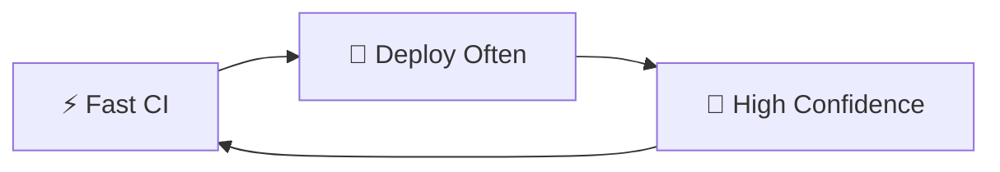

---

## 📍 Slide 41 – 🎯 Section 6: Reflection

## 📝 Key Takeaways

1. 🤖 **CI automates testing** — catch bugs before production
2. 🧪 **Unit tests are essential** — fast feedback loop
3. ⚙️ **GitHub Actions** — powerful, free CI/CD platform
4. 🔐 **Security scanning** — integrate Snyk, scan dependencies
5. 📦 **Versioning matters** — SemVer or CalVer, be consistent

> 💡 CI isn't just about automation — it's about building confidence.

---

## 📍 Slide 42 – 🧠 The Mindset Shift

| 😰 Old Mindset | 🚀 CI/CD Mindset |
|---------------|------------------|
| 📋 "Test before release" | 🧪 "Test every commit" |
| 🤞 "Hope it works" | ✅ "Know it works" |
| 🎰 Manual deployments | 🤖 Automated pipelines |
| 😱 "Who broke it?" | 📊 "CI caught it" |
| 🐌 Deploy monthly | 🚀 Deploy daily |
| 🔍 Find bugs in prod | 🧪 Catch bugs in CI |

> ❓ Which mindset will you adopt?

---

## 📍 Slide 43 – ✅ Your Progress

## 🎓 What You Now Understand

* ✅ Why CI/CD is critical for modern development
* ✅ How to write effective unit tests
* ✅ GitHub Actions workflow syntax
* ✅ Security scanning with Snyk
* ✅ Versioning strategies (SemVer vs CalVer)
* ✅ CI best practices (caching, matrix builds, path filters)

> 🚀 **You're ready for Lab 3!**

---

## 📍 Slide 44 – 📝 QUIZ — DEVOPS_L3_POST

---

## 📍 Slide 45 – 🚀 What Comes Next

## 📚 Lab 3: Build Your CI Pipeline

* 🧪 Write unit tests for your Flask app
* ⚙️ Create GitHub Actions workflow
* 🔐 Integrate Snyk security scanning
* 📦 Automate Docker builds and versioning
* ⚡ Apply caching and best practices
* 🏆 Bonus: Multi-app CI with path filters

**🔮 Future Lectures:**
* 📦 **Lecture 7**: Monitoring & Observability
* ☸️ **Lecture 9**: Kubernetes Deployment
* 🔄 **Lecture 13**: GitOps with ArgoCD

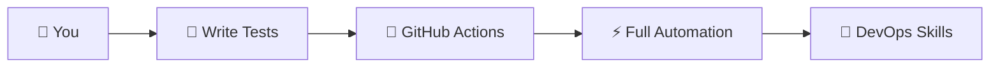

**👋 See you in the lab!**

---

## 📚 Resources & Further Reading

**📕 Books:**
* 📖 *Continuous Delivery* — Jez Humble
* 📖 *The DevOps Handbook* — Gene Kim
* 📖 *Accelerate* — Nicole Forsgren

**🔗 Links:**
* 🌐 [GitHub Actions Docs](https://docs.github.com/en/actions)
* 🌐 [Pytest Documentation](https://docs.pytest.org/)
* 🌐 [Snyk Security](https://snyk.io/)
* 🌐 [SemVer](https://semver.org/)
* 🌐 [CalVer](https://calver.org/)

**🛠️ Tools:**
* 🔍 [act](https://github.com/nektos/act) — Run GitHub Actions locally
* 🔍 [actionlint](https://github.com/rhysd/actionlint) — Lint workflows
* 📊 [Codecov](https://codecov.io/) — Coverage tracking

---
