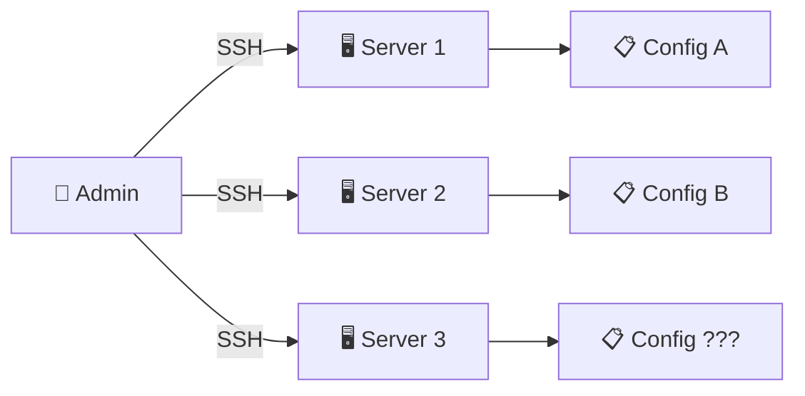
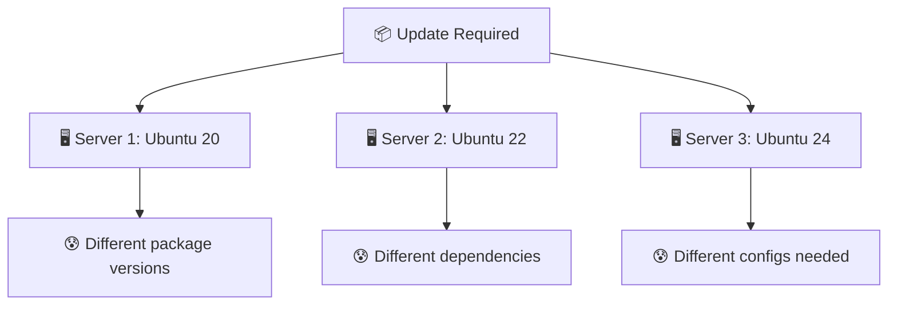
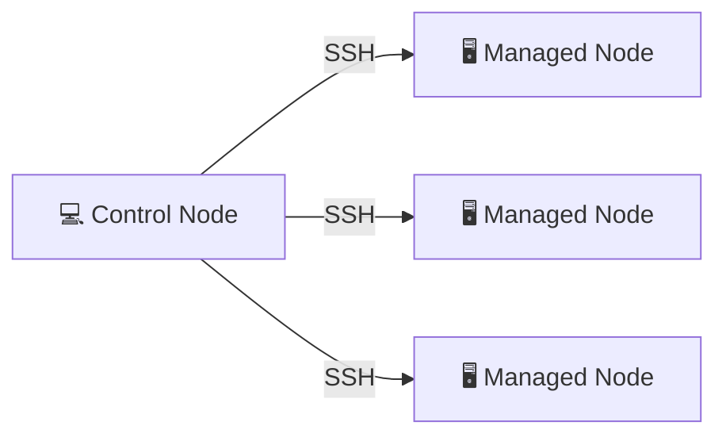
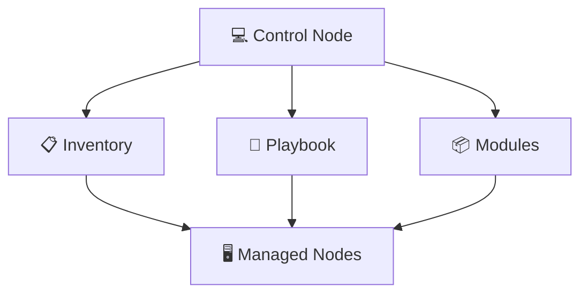
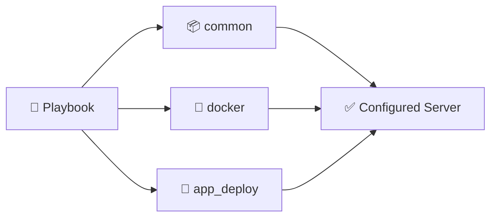
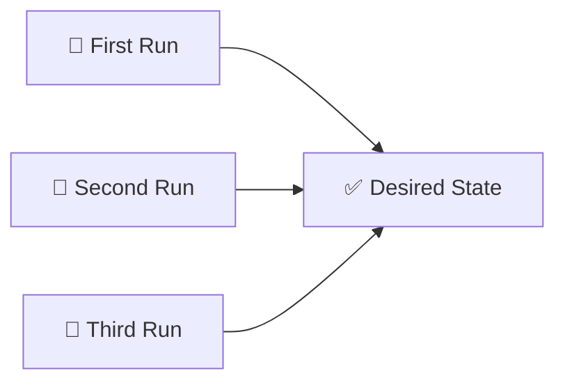
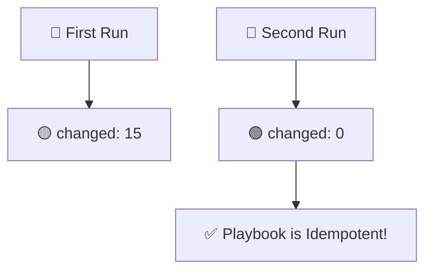

# 📌 Lecture 5 — Configuration Management: Ansible Fundamentals

## 📍 Slide 1 – 🚀 Welcome to Configuration Management

* 🌍 **Infrastructure is provisioned** — but what about configuring it?
* 😰 Manual server setup leads to inconsistency and errors
* 🔧 **Ansible automates configuration** — repeatable, reliable, documented
* 🎯 This lecture: master Ansible roles, playbooks, and best practices


---

## 📍 Slide 2 – 🎯 What You Will Learn

* ✅ Understand Ansible architecture and concepts
* ✅ Write idempotent playbooks and roles
* ✅ Secure credentials with Ansible Vault
* ✅ Apply configuration management best practices

**🎓 Learning Outcomes:**
| # | Outcome |
|---|---------|
| 1 | 🧠 Explain Ansible's agentless architecture |
| 2 | 🔍 Create reusable roles for configuration |
| 3 | 🛠️ Write idempotent tasks and handlers |
| 4 | 🗺️ Secure secrets with Ansible Vault |

---

## 📍 Slide 3 – 📋 How This Lecture Works

* 📚 **Concepts + YAML examples** — hands-on learning
* 🎮 **Real-world scenarios** — server configuration challenges
* 📝 **3 quiz checkpoints**: PRE / MID / POST
* 🛠️ **Best practices**: roles, handlers, idempotency

**⏱️ Lecture Structure:**
```
Section 0: Introduction (now)     → 📝 PRE Quiz
Section 1: The Configuration Problem
Section 2: Ansible Fundamentals
Section 3: Roles & Playbooks      → 📝 MID Quiz
Section 4: Idempotency & Handlers
Section 5: Real World Ansible
Section 6: Reflection             → 📝 POST Quiz
```

---

## 📍 Slide 4 – ❓ The Big Question

* 📊 **94%** of organizations experienced security incidents from misconfigurations
* ⏱️ Average time to configure a server manually: **2-4 hours**
* 💥 Most configuration drift goes **undetected for months**

> 💬 *"I installed it the same way... I think"* — Every sysadmin, ever

**🤔 Think about it:**
* How do you ensure 100 servers have identical configs?
* What happens when you need to update a package on all servers?
* Can you prove compliance across your infrastructure?

---

## 📍 Slide 5 – 📝 QUIZ — DEVOPS_L5_PRE

---

## 📍 Slide 6 – 🔥 Section 1: The Configuration Problem

* 🔧 **Manual configuration** = SSH into each server
* 📋 Run commands, edit files, install packages
* 📝 Document steps (that nobody reads)
* 💥 Result: **no two servers are identical**



---

## 📍 Slide 7 – 🐚 Shell Script Approach

* 📝 Write bash scripts to automate
* 🔄 Run scripts on each server
* ⚠️ Problem: Scripts aren't idempotent

```bash
#!/bin/bash
# 😰 What happens if you run this twice?
apt-get update
apt-get install -y nginx
echo "Welcome" > /var/www/html/index.html
systemctl start nginx
```

**💥 Issues:**
* 🔄 Re-running may cause errors
* 😰 No rollback mechanism
* 📋 No state tracking
* 🔗 No dependency management

> 🤔 **Think:** What if nginx is already installed?

---

## 📍 Slide 8 – 😱 Configuration Management Challenges

* 📅 100 servers need the same update
* 🔧 Some servers have different OS versions
* 📋 Some packages conflict with others
* 💀 One mistake = hours of cleanup



**📊 The Numbers:**
* 🔍 **85%** of breaches involve misconfiguration
* ⏱️ Manual update of 100 servers: **days**
* 💰 Cost of configuration-related downtime: **$5,600/minute**

---

## 📍 Slide 9 – 😨 Documentation Drift

* 📝 Documentation written once
* 🔧 Server modified many times
* 📋 Documentation never updated
* 💀 Reality ≠ documentation

> ⚠️ **Outdated docs are worse than no docs**

**😰 Signs of Documentation Drift:**
* 🔇 "The wiki says X but we do Y now"
* 📝 Multiple conflicting runbooks
* 🐌 New hires struggle to onboard
* 🚪 Knowledge leaves with employees

**💬 Discussion:** How current is your documentation?

---

## 📍 Slide 10 – 💸 The Cost of Manual Configuration

| 🔥 Problem | 💥 Impact |
|------------|-----------|
| 🐢 Slow updates | Security vulnerabilities linger |
| 📋 Manual errors | Downtime from typos |
| 👉 Inconsistency | "Works on server 1 but not 2" |
| 🙈 No audit trail | Compliance failures |

**📈 Real Numbers:**
* 🏢 **Manual config time**: 2-4 hours per server
* 🚀 **With Ansible**: 5-10 minutes per server
* 🔄 **Scaling**: minutes vs days

**💰 ROI Example:**
* 👨‍💻 100 servers × 3 hours × $75/hour = **$22,500**
* 🤖 Ansible: 1 hour setup + seconds to run = **$75**

---

## 📍 Slide 11 – 💡 Section 2: What Ansible Is

* 🔧 **Configuration management tool** — automate server setup
* 🌐 **Agentless** — uses SSH, no agents to install
* 📝 **YAML-based** — human-readable playbooks
* 🔄 **Idempotent** — safe to run multiple times



**📖 Definition:**
> *Ansible is an open-source automation tool for configuration management, application deployment, and task automation using a simple YAML syntax.*

---

## 📍 Slide 12 – 🚫 What Ansible is NOT

| ❌ Myth | ✅ Reality |
|---------|-----------|
| "Replaces Terraform" | 🤝 They complement each other |
| "Requires agents" | 🌐 Agentless, SSH-based |
| "Only for Linux" | 🪟 Works with Windows too |
| "Just a scripting tool" | 📦 Full configuration management |
| "Hard to learn" | 📝 YAML is simple |

> 🔥 **Hot take:** Terraform provisions, Ansible configures. Use both.

**🎯 Ansible is about:**
* 🧠 Declarative configuration
* 🤝 Consistent state across servers
* 🔄 Repeatable automation
* 📊 Self-documenting infrastructure

---

## 📍 Slide 13 – 🏗️ Ansible Architecture



| 🧱 Component | 🎯 Purpose |
|-------------|----------|
| 💻 **Control Node** | Where Ansible runs |
| 📋 **Inventory** | List of managed servers |
| 📝 **Playbook** | Automation instructions |
| 📦 **Modules** | Units of work (apt, copy, service) |
| 🖥️ **Managed Nodes** | Target servers |

---

## 📍 Slide 14 – 📋 Inventory Basics

```ini
# inventory/hosts.ini
[webservers]
web1 ansible_host=192.168.1.10
web2 ansible_host=192.168.1.11

[databases]
db1 ansible_host=192.168.1.20

[all:vars]
ansible_user=ubuntu
ansible_python_interpreter=/usr/bin/python3
```

**🎯 Inventory Features:**
* 📁 Group servers logically
* 🔧 Set per-host or per-group variables
* 🌐 Static files or dynamic discovery
* 🏷️ Use patterns: `webservers`, `all`, `db*`

---

## 📍 Slide 15 – ⚡ Before vs After Ansible

| 😰 Before | 🚀 After |
|----------|---------|
| 📅 SSH into each server | 🤖 One command for all |
| 📋 Manual steps | 📝 Documented playbooks |
| 👉 "Run these commands" | ✅ "Desired state defined" |
| 😨 Fear of updates | 💪 Confident automation |
| 🐌 Hours per server | ⚡ Seconds per server |
| 📝 Outdated wiki | 📄 Living documentation |

> 🤔 How much time does your team spend on manual configuration?

---

## 📍 Slide 16 – 🎮 Section 3: Roles & Playbooks

## 📝 Playbook Basics

* 📄 YAML file with automation tasks
* 🎯 Defines desired state
* 🔄 Executes on target hosts
* 📦 Groups related tasks

**🎮 Let's write some Ansible.**

---

## 📍 Slide 17 – 📝 Simple Playbook Example

```yaml
---
# playbook.yml
- name: Configure web servers
  hosts: webservers
  become: yes  # 🔐 Run as root

  tasks:
    - name: Update apt cache
      apt:
        update_cache: yes
        cache_valid_time: 3600

    - name: Install nginx
      apt:
        name: nginx
        state: present

    - name: Start nginx
      service:
        name: nginx
        state: started
        enabled: yes
```

**🛠️ Run it:**
```bash
ansible-playbook -i inventory/hosts.ini playbook.yml
```

---

## 📍 Slide 18 – 📦 Why Roles?

```mermaid
flowchart TD
  subgraph ❌ Without Roles
    P1[📝 One huge playbook]
    P1 --> Problem[😰 Hard to maintain]
  end
  subgraph ✅ With Roles
    R1[📦 common role]
    R2[📦 docker role]
    R3[📦 app role]
    R1 --> Reuse[🔄 Reusable]
    R2 --> Reuse
    R3 --> Reuse
  end
```

**📦 Role Benefits:**
* 🔄 **Reusability**: Use across projects
* 📁 **Organization**: Clear structure
* 🧪 **Testability**: Test roles independently
* 🤝 **Sharing**: Ansible Galaxy

---

## 📍 Slide 19 – 📁 Role Structure

```
roles/
├── docker/
│   ├── tasks/
│   │   └── main.yml      # 🎯 Main tasks
│   ├── handlers/
│   │   └── main.yml      # 🔔 Event handlers
│   ├── defaults/
│   │   └── main.yml      # 📊 Default variables
│   ├── templates/
│   │   └── config.j2     # 📝 Jinja2 templates
│   └── files/
│       └── script.sh     # 📄 Static files
```

**🔑 Key Directories:**
* 📁 **tasks/**: What to do
* 📁 **handlers/**: React to changes
* 📁 **defaults/**: Default values (low priority)
* 📁 **templates/**: Dynamic file templates
* 📁 **files/**: Static files to copy

---

## 📍 Slide 20 – 🐳 Docker Role Example

```yaml
# roles/docker/tasks/main.yml
---
- name: Install Docker prerequisites
  apt:
    name:
      - apt-transport-https
      - ca-certificates
      - curl
    state: present

- name: Add Docker GPG key
  apt_key:
    url: https://download.docker.com/linux/ubuntu/gpg
    state: present

- name: Add Docker repository
  apt_repository:
    repo: "deb https://download.docker.com/linux/ubuntu {{ ansible_distribution_release }} stable"
    state: present

- name: Install Docker
  apt:
    name: docker-ce
    state: present
  notify: restart docker
```

---

## 📍 Slide 21 – 🔔 Handlers

```yaml
# roles/docker/handlers/main.yml
---
- name: restart docker
  service:
    name: docker
    state: restarted
```

**🔔 Handler Features:**
* 🔄 Only run when notified
* ⏱️ Run once at end of play
* 🎯 React to configuration changes
* 💡 Prevent unnecessary restarts

```yaml
# tasks/main.yml
- name: Update Docker config
  template:
    src: daemon.json.j2
    dest: /etc/docker/daemon.json
  notify: restart docker  # 🔔 Trigger handler
```

---

## 📍 Slide 22 – 📊 Variables & Defaults

```yaml
# roles/docker/defaults/main.yml
---
docker_version: "24.0"
docker_users:
  - ubuntu
docker_log_driver: "json-file"
docker_log_max_size: "10m"
```

**📊 Variable Precedence (lowest to highest):**
1. 📁 Role defaults
2. 📋 Inventory variables
3. 📄 Playbook vars
4. 🔧 Command line (`-e var=value`)

```yaml
# Using variables in tasks
- name: Install Docker {{ docker_version }}
  apt:
    name: "docker-ce={{ docker_version }}*"
    state: present
```

---

## 📍 Slide 23 – 📝 Using Roles in Playbooks

```yaml
# playbooks/provision.yml
---
- name: Provision web servers
  hosts: webservers
  become: yes

  roles:
    - common      # 📦 Install common packages
    - docker      # 🐳 Install Docker
    - app_deploy  # 🚀 Deploy application
```

**🎯 Clean and simple!**



---

## 📍 Slide 24 – 🔐 Ansible Vault

```bash
# 🔐 Create encrypted file
ansible-vault create group_vars/all.yml

# 📝 Edit encrypted file
ansible-vault edit group_vars/all.yml

# 👀 View encrypted file
ansible-vault view group_vars/all.yml
```

**🔐 Encrypted Content:**
```yaml
---
# group_vars/all.yml (encrypted)
dockerhub_username: myuser
dockerhub_password: super_secret_token
app_secret_key: very_secret_key_123
```

**🛠️ Using Vault:**
```bash
ansible-playbook playbook.yml --ask-vault-pass
# Or use password file (gitignored!)
ansible-playbook playbook.yml --vault-password-file .vault_pass
```

---

## 📍 Slide 25 – 📝 QUIZ — DEVOPS_L5_MID

---

## 📍 Slide 26 – 🔄 Section 4: Idempotency

## ♾️ What is Idempotency?

* 🔄 Same result whether run once or many times
* ✅ Safe to re-run playbooks
* 📊 Converges to desired state
* 🎯 No unintended side effects



**🎨 Output Colors:**
* 🟢 **ok**: Already in desired state
* 🟡 **changed**: Made a change
* 🔴 **failed**: Task failed
* ⚫ **skipped**: Task skipped

---

## 📍 Slide 27 – 🔄 Idempotent vs Non-Idempotent

```yaml
# ❌ Non-idempotent (shell command)
- name: Add line to file
  shell: echo "config=value" >> /etc/app.conf
  # 💥 Adds line EVERY time!

# ✅ Idempotent (lineinfile module)
- name: Ensure line in file
  lineinfile:
    path: /etc/app.conf
    line: "config=value"
    state: present
  # ✅ Only adds if missing!
```

**📦 Idempotent Modules:**
| Module | Purpose | Idempotent? |
|--------|---------|-------------|
| `apt` | Install packages | ✅ Yes |
| `service` | Manage services | ✅ Yes |
| `file` | Manage files | ✅ Yes |
| `shell` | Run commands | ❌ Usually no |
| `command` | Run commands | ❌ Usually no |

---

## 📍 Slide 28 – 🧪 Testing Idempotency



**🧪 Test Process:**
1. 🚀 Run playbook first time → many changes
2. 🚀 Run playbook second time → **zero changes**
3. ✅ If second run shows `changed: 0`, you're idempotent

**📊 Example Output:**
```
PLAY RECAP
server1 : ok=15  changed=0  unreachable=0  failed=0
```

---

## 📍 Slide 29 – 📊 Configuration Management Metrics

| 📊 Metric | 📏 Measures | 🏆 Target |
|-----------|------------|---------|
| ⏱️ **Config Time** | Time to configure server | < 15 minutes |
| 🔄 **Drift Rate** | Servers with drift | 0% |
| ✅ **Idempotency** | Re-run changes | 0 changes |
| 📜 **Compliance** | Servers meeting policy | 100% |

> 📚 These metrics indicate configuration management maturity.

**🤔 Question:** What happens when you re-run your playbooks?

---

## 📍 Slide 30 – 🌊 From Manual to Automated

```mermaid
flowchart LR
  subgraph 😱 Manual
    SSH[🔌 SSH Sessions]
    Commands[💻 Run Commands]
    Hope[🙏 Hope It Works]
  end
  subgraph 🤖 Automated
    Playbook[📝 Playbooks]
    Roles[📦 Roles]
    Consistent[✅ Consistent]
  end
  Manual -->|🚀 Ansible| Automated
```

**🎯 Automation State:**
* ⚡ Any server configurable in minutes
* 🔄 All changes through playbooks
* 📈 Teams deploy configuration confidently

---

## 📍 Slide 31 – 🏢 Section 5: Ansible in Real Life

## 📅 A Day with Ansible

**☀️ Morning:**
* 📊 Review Ansible PR for new role
* 👀 Check syntax with `ansible-lint`
* ✅ Merge to main branch

**🌤️ Afternoon:**
* 🚨 Security patch needed
* 🔧 Update role with new package version
* 🚀 Run playbook — **all servers patched in 10 minutes**

**🌙 Evening:**
* 🤖 Scheduled playbook runs
* 📊 Compliance reports generated
* 🏠 Go home confident

---

## 📍 Slide 32 – 👥 Team Ansible Workflow

| 👤 Role | 🎯 Ansible Responsibility |
|---------|----------------------|
| 🔧 **DevOps** | Write and maintain roles |
| 👨‍💻 **Developer** | Request configuration changes |
| 🛡️ **Security** | Review roles for compliance |
| 📊 **Audit** | Verify configuration state |

**🔗 Common Workflow:**
* 📝 Create branch with role changes
* 🔍 CI runs `ansible-lint` and syntax check
* 👀 Team reviews the changes
* ✅ Merge triggers playbook run

---

## 📍 Slide 33 – 🤝 Ansible + Terraform


**🤝 Integration Patterns:**
* 🌍 Terraform provisions infrastructure
* 📋 Terraform outputs inventory
* 🔧 Ansible configures servers
* 🔄 Both stored in Git

**💡 Best Practice:**
* 🏗️ Terraform = **what** exists
* 🔧 Ansible = **how** it's configured

---

## 📍 Slide 34 – 📈 Career Path: Ansible Skills


**🛠️ Skills to Build:**
* 📝 YAML and Jinja2 fluency
* 📦 Role design patterns
* 🔐 Vault and secrets management
* 🌐 Dynamic inventory
* 🔄 CI/CD integration

---

## 📍 Slide 35 – 🌍 Real Company Examples

**🏢 Enterprise Users:**
* 🏦 **NASA**: Manages thousands of servers
* 🎮 **EA Games**: Game server configuration
* 🛒 **Walmart**: Retail infrastructure

**☁️ Cloud Native:**
* 🔍 **Twitter**: Configuration at scale
* 📦 **Lyft**: Microservices configuration
* 🎬 **Apple**: Device management

**📊 Stats:**
* 🌍 **#1** open-source automation tool
* 📦 **30,000+** modules available
* 🏢 **Most used** by Fortune 100

---

## 📍 Slide 36 – 🎯 Section 6: Reflection

## 📝 Key Takeaways

1. 🔧 **Ansible = Agentless configuration management**
2. 📦 **Roles organize** reusable automation
3. 🔄 **Idempotency** makes re-runs safe
4. 🔔 **Handlers** efficiently manage service restarts
5. 🔐 **Vault encrypts** sensitive data

> 💡 Ansible playbooks are living documentation of your infrastructure.

---

## 📍 Slide 37 – 🧠 The Mindset Shift

| 😰 Old Mindset | 🚀 Ansible Mindset |
|---------------|------------------|
| 🙅 "SSH and run commands" | 📝 "Define in playbook" |
| 🚫 "Each server is unique" | 🔄 "All servers are identical" |
| 👉 "Document the steps" | 📄 "Code IS documentation" |
| 😨 "Updates are risky" | 💪 "Updates are automated" |
| 💻 "Works on my server" | 🌍 "Works on all servers" |

> ❓ Which mindset describes your team?

---

## 📍 Slide 38 – ✅ Your Progress

## 🎓 What You Now Understand

* ✅ Ansible's agentless architecture
* ✅ How to write playbooks and roles
* ✅ Why idempotency matters
* ✅ How handlers improve efficiency
* ✅ Securing secrets with Vault

> 🚀 **You're ready for Lab 5: Ansible Fundamentals**

---

## 📍 Slide 39 – 📝 QUIZ — DEVOPS_L5_POST

---

## 📍 Slide 40 – 🚀 What Comes Next

## 📚 Next Lecture: Continuous Deployment with Ansible

* 🚀 Application deployment roles
* 🐳 Docker Compose templates
* 🏷️ Tags and blocks
* 💻 Hands-on: Deploying your app with Ansible

**🎉 Your configuration automation journey continues.**

> 🔧 From manual to automated — one playbook at a time.


**👋 See you in the next lecture!**

---

## 📚 Resources & Further Reading

**📕 Books:**
* 📖 *Ansible: Up & Running* — Lorin Hochstein
* 📖 *Ansible for DevOps* — Jeff Geerling
* 📖 *The Practice of Cloud System Administration* — Limoncelli

**🔗 Links:**
* 🌐 [Ansible Documentation](https://docs.ansible.com/)
* 🌐 [Ansible Galaxy](https://galaxy.ansible.com/)
* 🌐 [Ansible Best Practices](https://docs.ansible.com/ansible/latest/user_guide/playbooks_best_practices.html)

---
