# 📌 Lecture 6 — Continuous Deployment: Advanced Ansible

## 📍 Slide 1 – 🚀 Welcome to Continuous Deployment

* 🌍 **Configuration is automated** — but what about deployments?
* 😰 Manual deployments are slow, error-prone, and risky
* 🚀 **CI/CD with Ansible** = automated, repeatable, safe deployments
* 🎯 This lecture: master blocks, tags, Docker Compose, and CI/CD integration

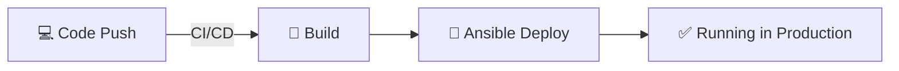

---

## 📍 Slide 2 – 🎯 What You Will Learn

* ✅ Use blocks for error handling and task grouping
* ✅ Apply tags for selective execution
* ✅ Deploy applications with Docker Compose templates
* ✅ Integrate Ansible with GitHub Actions

**🎓 Learning Outcomes:**
| # | Outcome |
|---|---------|
| 1 | 🧠 Implement blocks with rescue and always |
| 2 | 🔍 Design effective tag strategies |
| 3 | 🛠️ Template Docker Compose files with Jinja2 |
| 4 | 🗺️ Automate deployments with CI/CD |

---

## 📍 Slide 3 – 📋 How This Lecture Works

* 📚 **Advanced patterns** — production-ready practices
* 🎮 **Real-world scenarios** — deployment challenges
* 📝 **3 quiz checkpoints**: PRE / MID / POST
* 🛠️ **CI/CD integration**: GitHub Actions + Ansible

**⏱️ Lecture Structure:**
```
Section 0: Introduction (now)     → 📝 PRE Quiz
Section 1: The Deployment Problem
Section 2: Blocks & Error Handling
Section 3: Tags & Selective Execution → 📝 MID Quiz
Section 4: Docker Compose Deployment
Section 5: CI/CD Integration
Section 6: Reflection             → 📝 POST Quiz
```

---

## 📍 Slide 4 – ❓ The Big Question

* 📊 **46%** of organizations deploy weekly or faster
* ⏱️ Top performers deploy **multiple times per day**
* 💥 **80%** of outages caused by changes (deploys, configs)

> 💬 *"We deploy on Fridays and pray over the weekend"* — Nobody should say this

**🤔 Think about it:**
* How often does your team deploy?
* How long does a deployment take?
* Can you roll back in under 5 minutes?

---

## 📍 Slide 5 – 📝 QUIZ — DEVOPS_L6_PRE

---

## 📍 Slide 6 – 🔥 Section 1: The Deployment Problem

* 🎰 **Deployments = high-risk events**
* 📋 Manual steps, checklists, approval gates
* 🌙 Deploy only during "maintenance windows"
* 💥 Result: **fear of deploying**

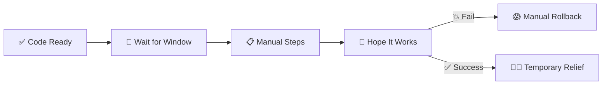

---

## 📍 Slide 7 – 💥 Deployment Failures

* 🔧 Wrong version deployed
* 📦 Missing dependencies
* ⚙️ Configuration mismatch
* 💀 Partial deployment (some servers updated, some not)

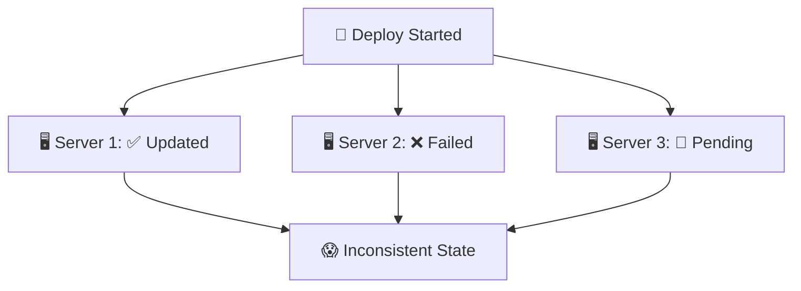

**📊 The Numbers:**
* 🔍 **60%** of outages caused by bad deployments
* ⏱️ Average recovery time: **4+ hours**
* 💰 Cost per hour of downtime: **$300,000+**

---

## 📍 Slide 8 – 😱 Rollback Nightmares

* 📋 "Just revert the code" — but what about:
  * 💾 Database migrations?
  * ⚙️ Configuration changes?
  * 📦 Dependencies?
* 🙈 No automated rollback = manual scramble
* 💀 Hours of downtime

> ⚠️ **If you can't roll back quickly, you shouldn't deploy**

**😰 Signs of Rollback Problems:**
* 🔇 "We've never actually tested rollback"
* 📝 Rollback requires manual steps
* 🐌 "Rollback takes longer than fixing forward"
* 🚪 Nobody knows the rollback procedure

---

## 📍 Slide 9 – 😨 All-or-Nothing Deploys

* 📅 Big-bang releases every few months
* 🎰 Everything changes at once
* 📋 Impossible to isolate failures
* 💀 If it fails, everything fails

> ⚠️ **Large releases = large risk**

**💬 Discussion:** Would you rather deploy 100 changes once or 1 change 100 times?

---

## 📍 Slide 10 – 💸 The Cost of Manual Deployment

| 🔥 Problem | 💥 Impact |
|------------|-----------|
| 🐢 Slow deployments | Features delayed |
| 📋 Manual errors | Outages, rollbacks |
| 👉 Inconsistent process | "Works for Alice, not Bob" |
| 🙈 Fear of deploying | Innovation stalls |

**📈 Elite vs Low Performers:**
| Metric | 🏆 Elite | 😰 Low |
|--------|---------|-------|
| Deploy frequency | Multiple/day | Monthly |
| Lead time | < 1 hour | 1-6 months |
| Change failure rate | 0-15% | 46-60% |
| Recovery time | < 1 hour | 1 week+ |

---

## 📍 Slide 11 – 💡 Section 2: Blocks & Error Handling

* 🧱 **Blocks** = group related tasks
* 🔄 **Rescue** = handle failures
* ✅ **Always** = run regardless of outcome
* 🎯 Production-ready error handling

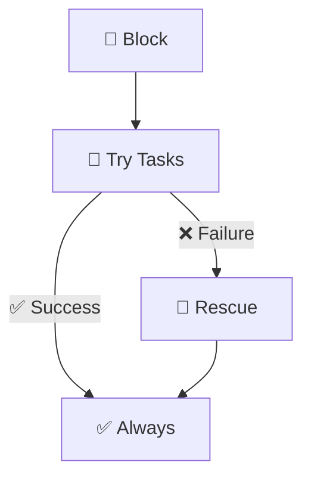

---

## 📍 Slide 12 – 🧱 Block Syntax

```yaml
- name: Deploy application with error handling
  block:
    - name: Pull latest image
      docker_image:
        name: "{{ app_image }}"
        source: pull

    - name: Start container
      docker_container:
        name: "{{ app_name }}"
        image: "{{ app_image }}"
        state: started

  rescue:
    - name: Log failure
      debug:
        msg: "Deployment failed! Rolling back..."

    - name: Notify team
      uri:
        url: "{{ slack_webhook }}"
        method: POST
        body: '{"text": "Deployment failed!"}'

  always:
    - name: Cleanup temp files
      file:
        path: /tmp/deploy
        state: absent
```

---

## 📍 Slide 13 – 🛡️ Block Benefits

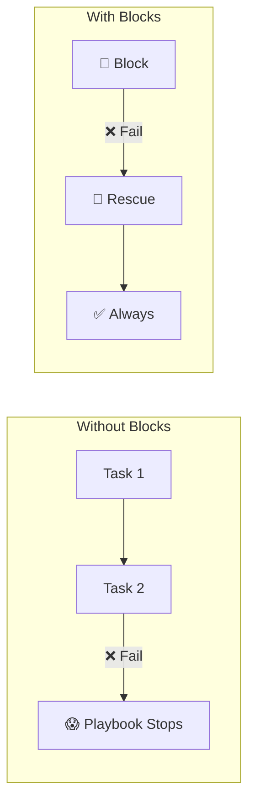

**🛡️ Advantages:**
* 🔄 Graceful error handling
* 📊 Cleanup runs even on failure
* 🔔 Notification on failure
* 🎯 Apply settings to multiple tasks

```yaml
- name: Docker installation
  block:
    - name: Task 1
    - name: Task 2
    - name: Task 3
  become: yes        # 🔐 Applied to all tasks
  when: install_docker  # 🔀 Condition for all
  tags:
    - docker         # 🏷️ Tag for all
```

---

## 📍 Slide 14 – 🏷️ Section 3: Tags Strategy

* 🏷️ **Tags** = label tasks for selective execution
* 🎯 Run only what you need
* ⏱️ Speed up development and testing
* 🔧 Isolate specific operations

```bash
# Run only docker tasks
ansible-playbook site.yml --tags "docker"

# Skip common tasks
ansible-playbook site.yml --skip-tags "common"

# List available tags
ansible-playbook site.yml --list-tags
```

---

## 📍 Slide 15 – 🏷️ Tag Design Patterns

```yaml
# roles/web_app/tasks/main.yml
- name: Application deployment
  block:
    - name: Pull image
      docker_image:
        name: "{{ app_image }}"
        source: pull

    - name: Deploy container
      docker_container:
        name: "{{ app_name }}"
        state: started
  tags:
    - app_deploy
    - deploy

- name: Application wipe
  block:
    - name: Stop container
      docker_container:
        name: "{{ app_name }}"
        state: absent
  when: web_app_wipe | bool
  tags:
    - web_app_wipe
```

**🏷️ Tag Categories:**
* 🚀 **deploy**: Deployment tasks
* 🧹 **wipe**: Cleanup tasks
* 📦 **packages**: Package installation
* ⚙️ **config**: Configuration only

---

## 📍 Slide 16 – ⚠️ Wipe Logic Pattern

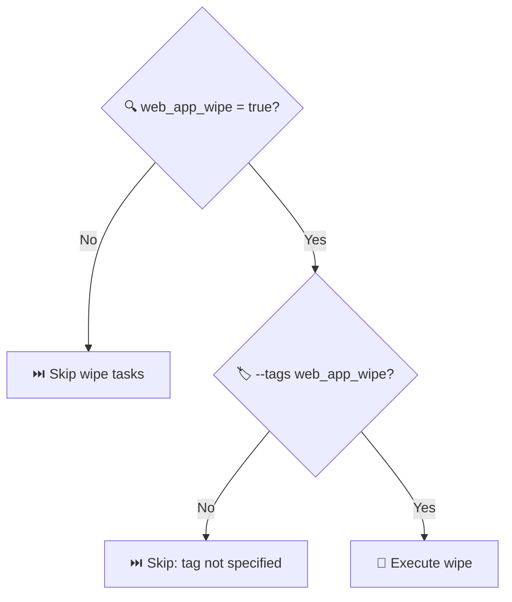

**🛡️ Double Safety Mechanism:**
* 📊 **Variable gate**: `web_app_wipe: false` by default
* 🏷️ **Tag gate**: Must specify `--tags web_app_wipe`
* ✅ Both required to execute dangerous tasks

```bash
# Normal deploy (wipe doesn't run)
ansible-playbook deploy.yml

# Wipe only
ansible-playbook deploy.yml -e "web_app_wipe=true" --tags web_app_wipe

# Clean reinstall (wipe + deploy)
ansible-playbook deploy.yml -e "web_app_wipe=true"
```

---

## 📍 Slide 17 – 🐳 Docker Compose Deployment

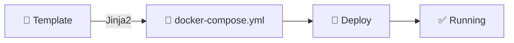

**🐳 Why Docker Compose with Ansible?**
* 📝 Declarative container configuration
* 🔄 Managed by templates (dynamic values)
* 🔧 Easy updates and rollbacks
* 📊 Multi-container applications

---

## 📍 Slide 18 – 📝 Jinja2 Templates

```yaml
# roles/web_app/templates/docker-compose.yml.j2
version: '3.8'

services:
  {{ app_name }}:
    image: {{ docker_image }}:{{ docker_tag }}
    container_name: {{ app_name }}
    ports:
      - "{{ app_port }}:{{ app_internal_port }}"
    environment:

      {{ key }}: "{{ value }}"

    restart: unless-stopped
    healthcheck:
      test: ["CMD", "curl", "-f", "http://localhost:{{ app_internal_port }}/health"]
      interval: 30s
      timeout: 10s
      retries: 3
```

**📊 Variables Used:**
* 📦 `app_name`: Container name
* 🐳 `docker_image`: Image repository
* 🏷️ `docker_tag`: Image version
* 🔌 `app_port`: Exposed port

---

## 📍 Slide 19 – 🚀 Deploy with Docker Compose Module

```yaml
# roles/web_app/tasks/main.yml
- name: Create application directory
  file:
    path: "{{ compose_project_dir }}"
    state: directory
    mode: '0755'

- name: Template docker-compose file
  template:
    src: docker-compose.yml.j2
    dest: "{{ compose_project_dir }}/docker-compose.yml"
    mode: '0644'
  notify: restart app

- name: Deploy with Docker Compose
  community.docker.docker_compose_v2:
    project_src: "{{ compose_project_dir }}"
    state: present
    pull: always
  register: deploy_result

- name: Verify deployment
  uri:
    url: "http://localhost:{{ app_port }}/health"
    status_code: 200
  retries: 5
  delay: 10
```

---

## 📍 Slide 20 – 🔗 Role Dependencies

```yaml
# roles/web_app/meta/main.yml
---
dependencies:
  - role: docker
    vars:
      docker_users:
        - "{{ ansible_user }}"
```

**🔗 Dependency Benefits:**
* 🔄 Automatic execution order
* 📦 Ensures prerequisites
* 🎯 Self-contained roles

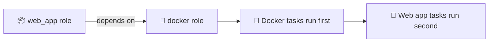

---

## 📍 Slide 21 – 📊 Multi-Environment Deployment

```yaml
# vars/app_python.yml
app_name: devops-python
docker_image: username/devops-info-service
docker_tag: latest
app_port: 8000

# vars/app_bonus.yml
app_name: devops-go
docker_image: username/devops-info-service-go
docker_tag: latest
app_port: 8001
```

```yaml
# playbooks/deploy_python.yml
---
- name: Deploy Python Application
  hosts: webservers
  become: yes
  vars_files:
    - ../vars/app_python.yml
  roles:
    - web_app
```

**🔄 Same role, different variables!**

---

## 📍 Slide 22 – 🤖 CI/CD Integration

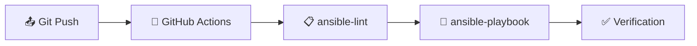

**🤖 CI/CD Benefits:**
* 🔄 Automatic deployments on push
* 📋 Linting catches errors early
* 🔐 Secure credential handling
* 📊 Audit trail of deployments

---

## 📍 Slide 23 – 📝 GitHub Actions Workflow

```yaml
# .github/workflows/ansible-deploy.yml
name: Ansible Deployment

on:
  push:
    branches: [main]
    paths:
      - 'ansible/**'

jobs:
  lint:
    runs-on: ubuntu-latest
    steps:
      - uses: actions/checkout@v4
      - name: Install ansible-lint
        run: pip install ansible ansible-lint
      - name: Run ansible-lint
        run: ansible-lint ansible/playbooks/*.yml

  deploy:
    needs: lint
    runs-on: ubuntu-latest
    steps:
      - uses: actions/checkout@v4
      - name: Setup SSH
        run: |
          mkdir -p ~/.ssh
          echo "${{ secrets.SSH_KEY }}" > ~/.ssh/id_rsa
          chmod 600 ~/.ssh/id_rsa
      - name: Deploy
        run: |
          cd ansible
          echo "${{ secrets.VAULT_PASS }}" > .vault_pass
          ansible-playbook playbooks/deploy.yml \
            --vault-password-file .vault_pass
          rm .vault_pass
```

---

## 📍 Slide 24 – 🔐 Secrets in CI/CD

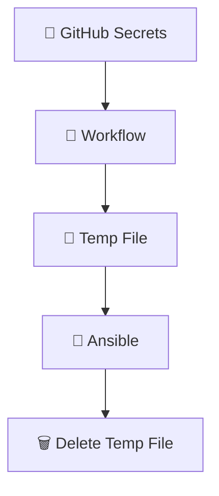

**🔐 Security Practices:**
* 📦 Store credentials in GitHub Secrets
* 📄 Write to temp file during run
* 🗑️ Delete immediately after use
* 🚫 Never echo secrets to logs

```yaml
# Using secrets safely
- name: Deploy with Vault
  env:
    VAULT_PASS: ${{ secrets.ANSIBLE_VAULT_PASSWORD }}
  run: |
    echo "$VAULT_PASS" > /tmp/vault_pass
    ansible-playbook playbook.yml --vault-password-file /tmp/vault_pass
    rm /tmp/vault_pass  # 🗑️ Cleanup!
```

---

## 📍 Slide 25 – 📝 QUIZ — DEVOPS_L6_MID

---

## 📍 Slide 26 – 📁 Section 4: Path Filters

```yaml
on:
  push:
    paths:
      - 'ansible/**'           # 📁 Only ansible changes
      - '!ansible/docs/**'     # 📝 Exclude docs
      - '.github/workflows/ansible-deploy.yml'
```

**📁 Path Filter Benefits:**
* ⚡ Faster CI (skip unnecessary runs)
* 💰 Lower costs (fewer minutes used)
* 🎯 Focused workflows

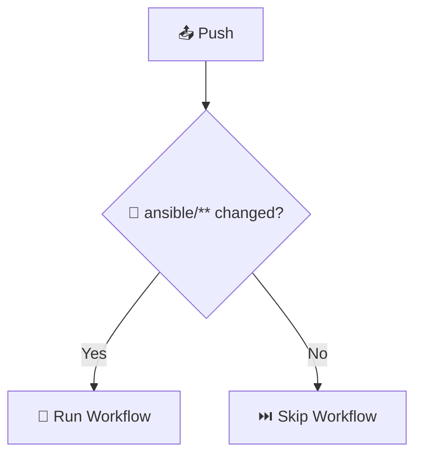

---

## 📍 Slide 27 – 📊 Deployment Metrics

| 📊 Metric | 📏 Measures | 🏆 Target |
|-----------|------------|---------|
| ⏱️ **Deploy Time** | Push to production | < 15 minutes |
| 📦 **Deploy Frequency** | How often | Daily+ |
| ❌ **Failure Rate** | Failed deploys | < 15% |
| 🔄 **Rollback Time** | Recovery time | < 5 minutes |

> 📚 These are DORA metrics for deployment performance.

**🤔 Question:** How fast can you deploy and roll back?

---

## 📍 Slide 28 – 🔄 Rollback Strategy

```yaml
# Rollback by re-deploying previous version
- name: Rollback application
  block:
    - name: Stop current container
      docker_container:
        name: "{{ app_name }}"
        state: stopped

    - name: Deploy previous version
      community.docker.docker_compose_v2:
        project_src: "{{ compose_project_dir }}"
        state: present
      vars:
        docker_tag: "{{ rollback_tag }}"

    - name: Verify rollback
      uri:
        url: "http://localhost:{{ app_port }}/health"
        status_code: 200
      retries: 3
      delay: 5
```

**🔄 Rollback Options:**
* 🏷️ Deploy previous tag
* 📦 Docker Compose down/up
* 🔙 Git revert + CI/CD

---

## 📍 Slide 29 – 🌊 From Manual to Automated Deployment

```mermaid
flowchart LR
  subgraph 😱 Manual
    SSH[🔌 SSH to servers]
    Commands[💻 Run commands]
    Hope[🙏 Hope it works]
  end
  subgraph 🤖 Automated
    Push[📤 Git push]
    CI[🔄 CI/CD]
    Deploy[🚀 Ansible]
  end
  Manual -->|🚀 Automate| Automated
```

**🎯 Automation State:**
* ⚡ Deploy in minutes, not hours
* 🔄 Every change through CI/CD
* 📈 Deploy with confidence

---

## 📍 Slide 30 – 🏢 Section 5: Real World CI/CD

## 📅 A Day with Automated Deployment

**☀️ Morning:**
* 📊 Review deployment PR
* 👀 Check CI lint results
* ✅ Merge to main

**🌤️ Afternoon:**
* 🤖 CI automatically deploys
* 📊 Monitoring shows healthy
* ☕ Coffee break

**🌙 Evening:**
* 🚨 Bug found in production
* 🔙 Revert commit, CI deploys previous
* ⏱️ **5 minutes** to rollback

---

## 📍 Slide 31 – 👥 Team Deployment Workflow

| 👤 Role | 🎯 CI/CD Responsibility |
|---------|----------------------|
| 👨‍💻 **Developer** | Create PR, fix lint issues |
| 🔧 **DevOps** | Maintain workflows, roles |
| 👀 **Reviewer** | Approve changes |
| 🤖 **CI/CD** | Execute deployment |

**🔗 GitOps Workflow:**
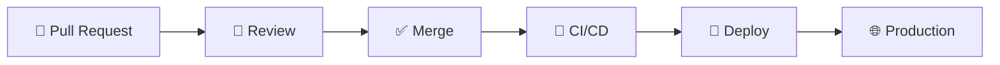

---

## 📍 Slide 32 – 🔀 Deployment Strategies

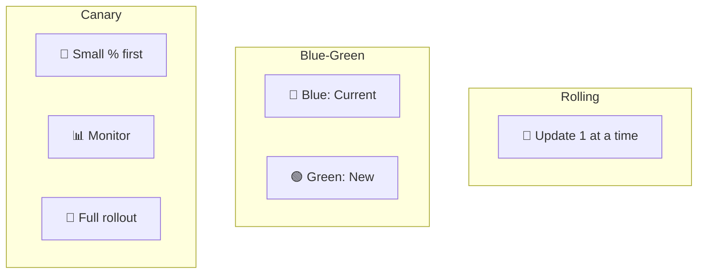

| 🚀 Strategy | 🎯 Use Case |
|------------|----------|
| 🔄 **Rolling** | Gradual update, zero downtime |
| 🔵 **Blue-Green** | Instant switch, easy rollback |
| 🐤 **Canary** | Test with subset of users |

---

## 📍 Slide 33 – 🧪 Deployment Verification

```yaml
# Verify deployment success
- name: Wait for application
  uri:
    url: "http://{{ ansible_host }}:{{ app_port }}/health"
    status_code: 200
    return_content: yes
  register: health_check
  until: health_check.status == 200
  retries: 10
  delay: 6

- name: Run smoke tests
  command: "curl -f http://{{ ansible_host }}:{{ app_port }}/"
  register: smoke_test
  failed_when: smoke_test.rc != 0

- name: Log deployment success
  debug:
    msg: "✅ Deployment verified: {{ app_name }} is healthy"
```

---

## 📍 Slide 34 – 📈 Career Path: CD Skills

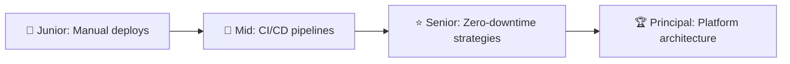

**🛠️ Skills to Build:**
* 🔄 CI/CD pipeline design
* 🐳 Container orchestration
* 📊 Monitoring and alerting
* 🔙 Rollback strategies
* 🔐 Security in pipelines

---

## 📍 Slide 35 – 🌍 Real Company Examples

**🏢 Enterprise CD:**
* 📦 **Amazon**: Deploy every 11.7 seconds
* 🎬 **Netflix**: Canary deployments everywhere
* 🔍 **Google**: Feature flags for gradual rollout

**☁️ CD Practices:**
* 🏦 **Stripe**: Shadow traffic for testing
* 📦 **Etsy**: 50+ deploys per day
* 🎮 **Spotify**: Squad-based ownership

**📊 Stats:**
* 🚀 Elite teams deploy **on demand**
* ⏱️ Lead time: **less than 1 hour**
* 🔄 Recovery: **less than 1 hour**

---

## 📍 Slide 36 – 🎯 Section 6: Reflection

## 📝 Key Takeaways

1. 🧱 **Blocks** enable graceful error handling
2. 🏷️ **Tags** allow selective execution
3. 🐳 **Docker Compose** templates for flexible deployments
4. 🔗 **Role dependencies** ensure proper ordering
5. 🤖 **CI/CD** automates the entire process

> 💡 Small, frequent deployments are safer than big releases.

---

## 📍 Slide 37 – 🧠 The Mindset Shift

| 😰 Old Mindset | 🚀 CD Mindset |
|---------------|------------------|
| 🙅 "Deploy on weekends" | 🚀 "Deploy anytime" |
| 🚫 "Big releases quarterly" | 🔄 "Small releases daily" |
| 👉 "Manual verification" | 🤖 "Automated checks" |
| 😨 "Rollback is hard" | 💪 "Rollback in minutes" |
| 💻 "It works locally" | 🌍 "CI validates it" |

> ❓ Which mindset describes your team?

---

## 📍 Slide 38 – ✅ Your Progress

## 🎓 What You Now Understand

* ✅ Blocks with rescue and always
* ✅ Tag strategies for selective execution
* ✅ Docker Compose templates with Jinja2
* ✅ Role dependencies and ordering
* ✅ CI/CD integration with GitHub Actions

> 🚀 **You're ready for Lab 6: Advanced Ansible & CI/CD**

---

## 📍 Slide 39 – 📝 QUIZ — DEVOPS_L6_POST

---

## 📍 Slide 40 – 🚀 What Comes Next

## 📚 Next Lecture: Observability & Logging

* 📋 Log aggregation with Loki
* 📊 Visualization with Grafana
* 🔍 LogQL query language
* 💻 Hands-on: Building a logging stack

**🎉 Your continuous deployment journey continues.**

> 🚀 From manual deploys to automated CI/CD — one commit at a time.

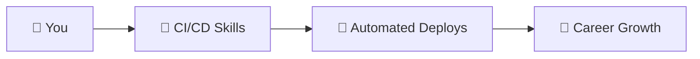

**👋 See you in the next lecture!**

---

## 📚 Resources & Further Reading

**📕 Books:**
* 📖 *Continuous Delivery* — Jez Humble
* 📖 *The DevOps Handbook* — Gene Kim et al.
* 📖 *Accelerate* — Nicole Forsgren

**🔗 Links:**
* 🌐 [Ansible Blocks](https://docs.ansible.com/ansible/latest/user_guide/playbooks_blocks.html)
* 🌐 [Ansible Tags](https://docs.ansible.com/ansible/latest/user_guide/playbooks_tags.html)
* 🌐 [GitHub Actions](https://docs.github.com/en/actions)

---
