# 📌 Lecture 7 — Observability & Logging: From Blind to Insight

## 📍 Slide 1 – 🚀 Welcome to Observability

* 🌍 **Applications are running** — but what's happening inside?
* 😰 Without visibility, debugging is guesswork
* 🔍 **Observability** = understanding system state from outputs
* 🎯 This lecture: master logging with Loki, Promtail, and Grafana

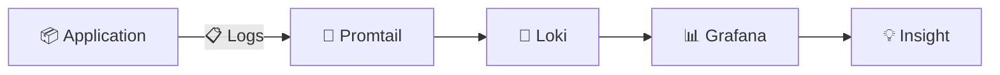

---

## 📍 Slide 2 – 🎯 What You Will Learn

* ✅ Understand the three pillars of observability
* ✅ Deploy Loki stack for log aggregation
* ✅ Query logs with LogQL
* ✅ Build effective log dashboards

**🎓 Learning Outcomes:**
| # | Outcome |
|---|---------|
| 1 | 🧠 Differentiate logs, metrics, and traces |
| 2 | 🔍 Configure Loki 3.0 with TSDB storage |
| 3 | 🛠️ Write LogQL queries for filtering and aggregation |
| 4 | 🗺️ Design actionable log dashboards |

---

## 📍 Slide 3 – 📋 How This Lecture Works

* 📚 **Concepts + Configuration** — hands-on focus
* 🎮 **Real-world scenarios** — debugging production issues
* 📝 **3 quiz checkpoints**: PRE / MID / POST
* 🛠️ **Tool stack**: Loki + Promtail + Grafana

**⏱️ Lecture Structure:**
```
Section 0: Introduction (now)     → 📝 PRE Quiz
Section 1: The Visibility Problem
Section 2: Observability Fundamentals
Section 3: Loki Stack Deep Dive   → 📝 MID Quiz
Section 4: LogQL & Dashboards
Section 5: Production Logging
Section 6: Reflection             → 📝 POST Quiz
```

---

## 📍 Slide 4 – ❓ The Big Question

* 📊 **70%** of mean time to resolution is spent finding the problem
* ⏱️ Average time to detect issues: **hours to days**
* 💥 Without observability, debugging is **archaeology**

> 💬 *"Users reported it's slow... but where?"* — Every on-call engineer, ever

**🤔 Think about it:**
* How do you know your app is healthy?
* When users report issues, where do you look first?
* Can you trace a request through your system?

---

## 📍 Slide 5 – 📝 QUIZ — DEVOPS_L7_PRE

---

## 📍 Slide 6 – 🔥 Section 1: The Visibility Problem

* 🙈 **No logs** = flying blind
* 📋 Logs scattered across servers
* 🔍 grep through SSH sessions
* 💥 Result: **hours spent finding problems**

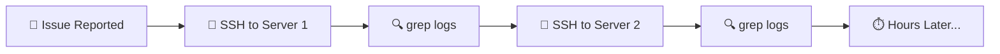

---

## 📍 Slide 7 – 📋 Log Chaos

* 📁 Logs in different formats
* 🖥️ Different locations per server
* 📅 Old logs deleted or rotated
* 💀 No correlation between services

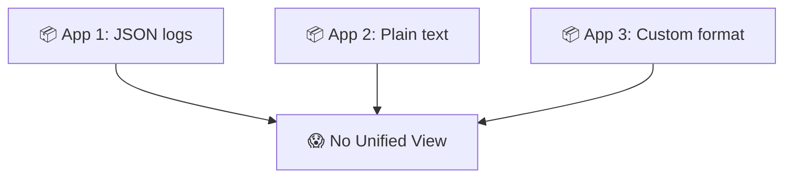

**📊 The Numbers:**
* 🔍 **73%** of engineers can't find logs quickly
* ⏱️ Average time to find relevant log: **15+ minutes**
* 💰 Cost of slow debugging: **$26,000/hour** (enterprise)

---

## 📍 Slide 8 – 😱 "It's Working for Me"

* 👥 Users report: *"App is slow"*
* 🤷 Team responds: *"Works for me"*
* 🔍 No data to prove either side
* 💀 Frustration all around

> ⚠️ **Without observability, you can't prove anything**

**😰 Signs of Poor Observability:**
* 🔇 "Check the server logs" (which server?)
* 📝 "It was working yesterday" (what changed?)
* 🐌 "Let's restart and see" (cargo cult debugging)
* 🚪 Blame instead of data

**💬 Discussion:** How do you currently debug production issues?

---

## 📍 Slide 9 – 🔥 The Alert Fatigue Problem

* 🚨 Too many alerts = no alerts
* 📧 Inbox full of "warnings"
* 😴 Real issues get ignored
* 💀 On-call burnout

> ⚠️ **Noise drowns out signal**

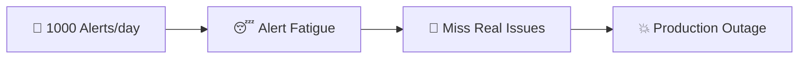

---

## 📍 Slide 10 – 💸 The Cost of Blind Operations

| 🔥 Problem | 💥 Impact |
|------------|-----------|
| 🐢 Slow debugging | Hours/days to resolve |
| 📋 No correlation | Can't trace requests |
| 👉 Finger pointing | No data, just blame |
| 🙈 Hidden failures | Issues go unnoticed |

**📈 Real Numbers:**
* 🏢 **MTTR without observability**: 4+ hours
* 🚀 **MTTR with observability**: < 30 minutes
* 💰 **ROI of observability**: 10x+ reduction in incident cost

**💰 Cost Example:**
* 💵 1-hour outage: **$300,000**
* 🔍 Good observability: **$30/month**
* 🧮 Break-even: **first 6 seconds of prevented downtime**

---

## 📍 Slide 11 – 💡 Section 2: What Observability Is

* 🔍 **Observability** = understanding system state from external outputs
* 📊 **Three pillars**: Logs, Metrics, Traces
* 🎯 Answer: "Why is this happening?"
* 🚫 NOT just monitoring (which asks "Is it working?")

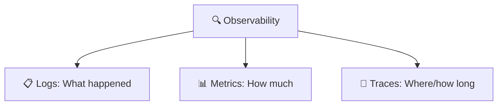

**📖 Definition:**
> *Observability is the ability to understand the internal state of a system by examining its external outputs — logs, metrics, and traces.*

---

## 📍 Slide 12 – 📋 The Three Pillars

| 📊 Pillar | 🎯 Answers | 🛠️ Tools |
|-----------|-----------|----------|
| 📋 **Logs** | What happened? | Loki, ELK |
| 📊 **Metrics** | How much/fast? | Prometheus |
| 🔗 **Traces** | Where did time go? | Jaeger, Tempo |

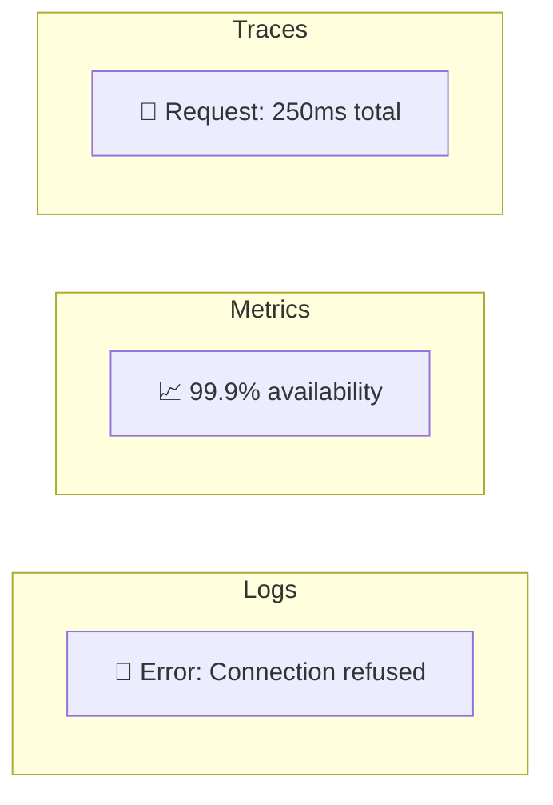

**🎯 Together they tell the full story**

---

## 📍 Slide 13 – 📋 Logs: What Happened

* 📝 **Events** with timestamps
* 🔍 Detailed context for debugging
* 📊 Can be structured (JSON) or unstructured
* ⚠️ High volume, high storage

```json
{
  "timestamp": "2024-01-15T10:23:45Z",
  "level": "ERROR",
  "service": "user-api",
  "message": "Database connection failed",
  "error": "Connection refused",
  "host": "server-1"
}
```

**🎯 Use logs when:**
* 🔍 Debugging specific errors
* 📋 Understanding request flow
* 🛡️ Security auditing

---

## 📍 Slide 14 – 📊 Why Structured Logging?

```mermaid
flowchart LR
  subgraph ❌ Unstructured
    U1[ERROR: Failed to connect to db at 10:23]
  end
  subgraph ✅ Structured
    S1[JSON with fields]
  end
  U1 --> Hard[😰 Hard to parse]
  S1 --> Easy[✅ Easy to query]
```

**❌ Unstructured:**
```
ERROR 2024-01-15 10:23:45 Connection to database failed on server-1
```

**✅ Structured (JSON):**
```json
{"timestamp":"2024-01-15T10:23:45Z","level":"ERROR","msg":"Connection failed","server":"server-1"}
```

**🎯 Benefits:**
* 🔍 Easy to filter and search
* 📊 Aggregate by any field
* 🤖 Machine-parseable

---

## 📍 Slide 15 – ⚡ Loki vs ELK

| 📋 Aspect | 📊 Loki | 🔍 ELK Stack |
|-----------|---------|-------------|
| 🏗️ Architecture | Lightweight | Heavy |
| 💾 Storage | Index labels only | Full-text index |
| 📊 Query | LogQL | Lucene |
| 💰 Cost | Low (storage) | High (compute) |
| 🎯 Best for | Cloud-native | Enterprise search |

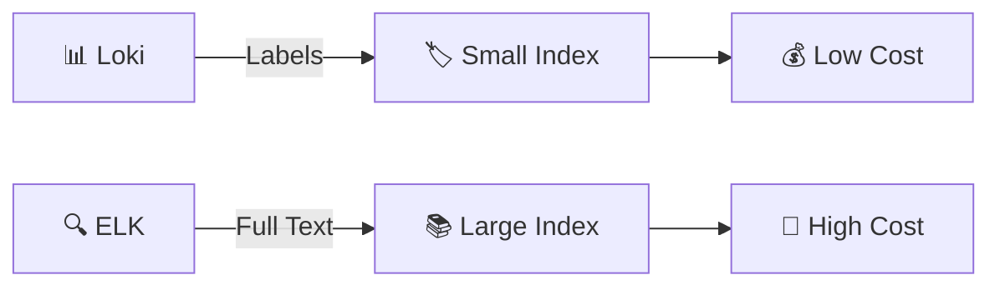

> 🔥 **Loki**: "Like Prometheus, but for logs"

---

## 📍 Slide 16 – 🎮 Section 3: Loki Stack Deep Dive

## 🏗️ Loki Architecture

* 💾 **Loki**: Log storage (index + chunks)
* 🔧 **Promtail**: Log collector (agent)
* 📊 **Grafana**: Visualization

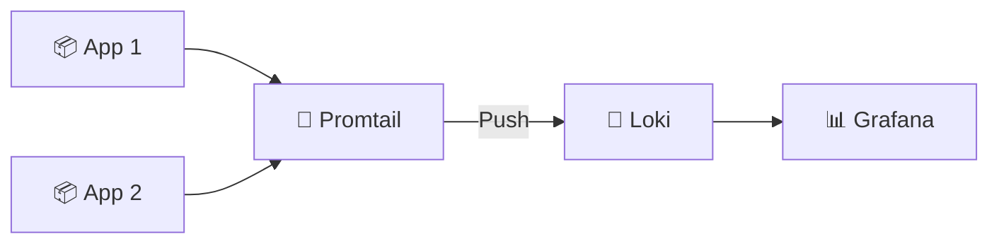

**🎮 Let's build a logging stack.**

---

## 📍 Slide 17 – 💾 Loki 3.0 Features

* 🚀 **TSDB index**: 10x faster queries
* 📊 **Structured metadata**: First-class support
* 💾 **Better compression**: Lower storage costs
* 🔍 **Schema v13**: Latest and recommended

```yaml
# loki/config.yml
schema_config:
  configs:
    - from: 2024-01-01
      store: tsdb        # 🚀 New fast store
      object_store: filesystem
      schema: v13        # 📊 Latest schema
      index:
        prefix: index_
        period: 24h
```

**🎯 Always use TSDB for new deployments!**

---

## 📍 Slide 18 – ⚙️ Loki Configuration

```yaml
# loki/config.yml
auth_enabled: false

server:
  http_listen_port: 3100

common:
  path_prefix: /loki
  storage:
    filesystem:
      chunks_directory: /loki/chunks
      rules_directory: /loki/rules
  replication_factor: 1
  ring:
    instance_addr: 127.0.0.1
    kvstore:
      store: inmemory

limits_config:
  retention_period: 168h  # 🗓️ 7 days
```

**🔑 Key Settings:**
* 🔐 `auth_enabled`: False for testing
* 💾 `storage`: Where logs are stored
* 🗓️ `retention_period`: How long to keep logs

---

## 📍 Slide 19 – 🔧 Promtail Configuration

```yaml
# promtail/config.yml
server:
  http_listen_port: 9080

positions:
  filename: /tmp/positions.yaml

clients:
  - url: http://loki:3100/loki/api/v1/push

scrape_configs:
  - job_name: docker
    docker_sd_configs:
      - host: unix:///var/run/docker.sock
        refresh_interval: 5s
    relabel_configs:
      - source_labels: ['__meta_docker_container_name']
        regex: '/(.*)'
        target_label: 'container'
```

**🔑 Key Components:**
* 📋 `positions`: Track what's been read
* 🔗 `clients`: Where to send logs
* 🐳 `docker_sd_configs`: Auto-discover containers

---

## 📍 Slide 20 – 🐳 Docker Compose Stack

```yaml
# docker-compose.yml
version: '3.8'

services:
  loki:
    image: grafana/loki:3.0.0
    ports:
      - "3100:3100"
    volumes:
      - ./loki/config.yml:/etc/loki/config.yml
      - loki-data:/loki
    command: -config.file=/etc/loki/config.yml

  promtail:
    image: grafana/promtail:3.0.0
    volumes:
      - ./promtail/config.yml:/etc/promtail/config.yml
      - /var/lib/docker/containers:/var/lib/docker/containers:ro
      - /var/run/docker.sock:/var/run/docker.sock:ro
    command: -config.file=/etc/promtail/config.yml

  grafana:
    image: grafana/grafana:11.3.0
    ports:
      - "3000:3000"
    volumes:
      - grafana-data:/var/lib/grafana
```

---

## 📍 Slide 21 – 🏷️ Labels: The Key Concept

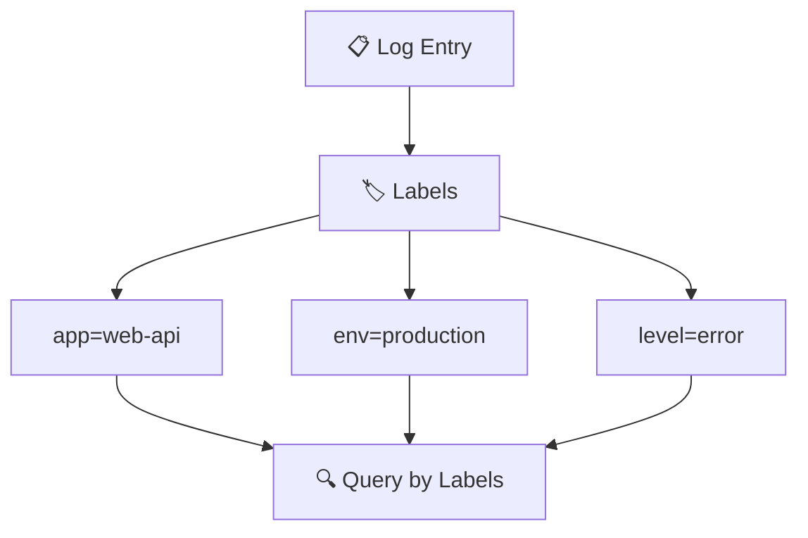

**🏷️ Labels = How Loki indexes logs**

```logql
# Query logs by labels
{app="web-api", env="production"}

# Filter errors
{app="web-api"} |= "error"
```

**⚠️ Label Best Practices:**
* 🔢 Keep cardinality low (< 10 values per label)
* 🚫 Never use high-cardinality fields (user IDs, request IDs)
* 🏷️ Use for: app name, environment, service

---

## 📍 Slide 22 – 🔍 LogQL Basics

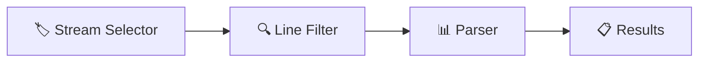

**🔍 Query Structure:**
```logql
{label="value"} |= "filter" | json | field="value"
```

**📋 Examples:**
```logql
# All logs from container
{container="web-api"}

# Errors only
{container="web-api"} |= "error"

# Parse JSON, filter by level
{container="web-api"} | json | level="ERROR"

# Count errors per minute
rate({container="web-api"} |= "error" [1m])
```

---

## 📍 Slide 23 – 📊 LogQL Operators

| 🔧 Operator | 🎯 Purpose | 📝 Example |
|-------------|----------|---------|
| `\|=` | Contains | `\|= "error"` |
| `!=` | Not contains | `!= "debug"` |
| `\|~` | Regex match | `\|~ "error\|warn"` |
| `\| json` | Parse JSON | `\| json` |
| `\| logfmt` | Parse logfmt | `\| logfmt` |
| `rate()` | Logs per second | `rate({app="x"}[5m])` |

**📊 Aggregation:**
```logql
# Logs per second by container
sum by (container) (rate({job="docker"}[1m]))

# Count by level
sum by (level) (count_over_time({app="web"} | json [5m]))
```

---

## 📍 Slide 24 – 🐍 Structured Logging in Python

```python
import logging
import json
from datetime import datetime

class JSONFormatter(logging.Formatter):
    def format(self, record):
        log_obj = {
            "timestamp": datetime.utcnow().isoformat() + "Z",
            "level": record.levelname,
            "message": record.getMessage(),
            "logger": record.name,
        }
        if record.exc_info:
            log_obj["exception"] = self.formatException(record.exc_info)
        return json.dumps(log_obj)

# Setup
handler = logging.StreamHandler()
handler.setFormatter(JSONFormatter())
logger = logging.getLogger()
logger.addHandler(handler)
logger.setLevel(logging.INFO)

# Usage
logger.info("User logged in", extra={"user_id": 123})
```

---

## 📍 Slide 25 – 📝 QUIZ — DEVOPS_L7_MID

---

## 📍 Slide 26 – 📊 Section 4: Building Dashboards

## 🎨 Dashboard Design Principles

* 🎯 **Purpose**: What question does it answer?
* 📊 **Hierarchy**: Most important at top
* 🎨 **Color**: Red = bad, Green = good
* 🔄 **Refresh**: Auto-refresh for real-time

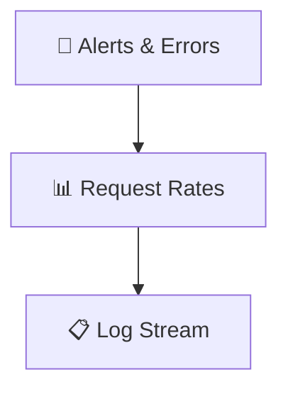

---

## 📍 Slide 27 – 📊 Essential Log Panels

**1️⃣ Log Stream (Logs visualization)**
```logql
{app=~"devops-.*"}
```

**2️⃣ Error Rate (Time series)**
```logql
sum by (app) (rate({app=~"devops-.*"} |= "ERROR" [1m]))
```

**3️⃣ Request Rate (Time series)**
```logql
sum by (app) (rate({app=~"devops-.*"} [1m]))
```

**4️⃣ Level Distribution (Pie chart)**
```logql
sum by (level) (count_over_time({app=~"devops-.*"} | json [5m]))
```

---

## 📍 Slide 28 – 📊 Grafana Panel Types

| 📊 Type | 🎯 Use For |
|---------|----------|
| 📋 **Logs** | Raw log entries |
| 📈 **Time series** | Trends over time |
| 📊 **Stat** | Single values |
| 🥧 **Pie chart** | Distribution |
| 📋 **Table** | Structured data |
| 🌡️ **Gauge** | Current status |

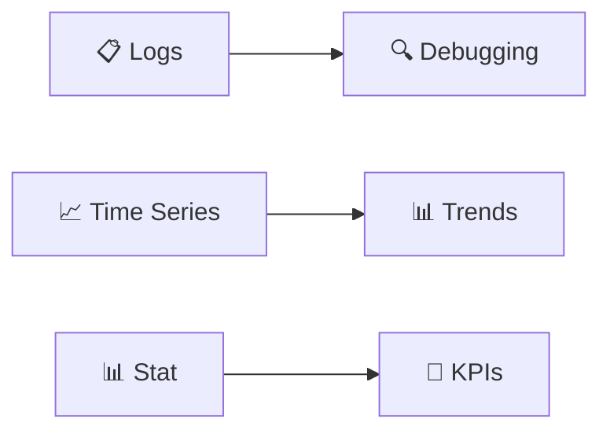

---

## 📍 Slide 29 – 📊 Logging Metrics

| 📊 Metric | 📏 Measures | 🏆 Target |
|-----------|------------|---------|
| 📋 **Log Volume** | Logs per second | Stable |
| ❌ **Error Rate** | Errors per minute | < 1% |
| ⏱️ **Query Time** | Time to find logs | < 30s |
| 💾 **Retention** | How long kept | 7+ days |

> 📚 These metrics indicate logging health.

**🤔 Question:** How quickly can you find relevant logs?

---

## 📍 Slide 30 – 🌊 From Blind to Observable

```mermaid
flowchart LR
  subgraph 😱 Blind
    SSH[🔌 SSH grep]
    Guess[🤷 Guesswork]
    Slow[⏱️ Hours]
  end
  subgraph 🔍 Observable
    Dashboard[📊 Dashboard]
    Query[🔍 LogQL]
    Fast[⚡ Minutes]
  end
  Blind -->|🚀 Loki| Observable
```

**🎯 Observability State:**
* ⚡ Find issues in minutes, not hours
* 🔄 Unified view across all services
* 📈 Data-driven debugging

---

## 📍 Slide 31 – 🏢 Section 5: Production Logging

## 📅 A Day with Observability

**☀️ Morning:**
* 📊 Check Grafana dashboard — all green ✅
* 📋 Review overnight logs — no anomalies
* ☕ Coffee with confidence

**🌤️ Afternoon:**
* 🚨 Alert: Error rate spike
* 🔍 LogQL: `{app="api"} |= "error" | json | level="ERROR"`
* 🔧 Found: Database timeout
* ⏱️ **10 minutes** to identify root cause

**🌙 Evening:**
* 📊 Review error trends
* 📝 Create runbook for similar issues
* 🏠 Go home knowing you can debug remotely

---

## 📍 Slide 32 – 👥 Team Logging Workflow

| 👤 Role | 🎯 Observability Responsibility |
|---------|----------------------|
| 👨‍💻 **Developer** | Add structured logging |
| 🔧 **DevOps** | Maintain logging stack |
| 🛡️ **SRE** | Build dashboards, respond to alerts |
| 📊 **On-call** | Use logs for incident response |

**🔗 Incident Response Flow:**
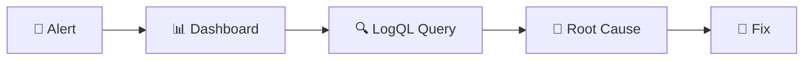

---

## 📍 Slide 33 – 🔐 Production Considerations

```yaml
# Production settings
deploy:
  resources:
    limits:
      memory: 1G
      cpus: '1.0'
    reservations:
      memory: 512M

healthcheck:
  test: ["CMD", "wget", "--no-verbose", "--tries=1", "--spider", "http://localhost:3100/ready"]
  interval: 10s
  timeout: 5s
  retries: 5
```

**🛡️ Production Checklist:**
* 💾 Persistent volumes for data
* 🔐 Secure Grafana (disable anonymous)
* 📊 Resource limits on all services
* 🏥 Health checks enabled
* 🗓️ Retention policies configured

---

## 📍 Slide 34 – 📈 Career Path: Observability Skills

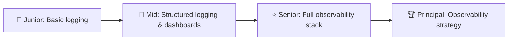

**🛠️ Skills to Build:**
* 📋 Structured logging patterns
* 🔍 LogQL/PromQL fluency
* 📊 Dashboard design
* 🚨 Alerting strategies
* 🔗 Distributed tracing

---

## 📍 Slide 35 – 🌍 Real Company Examples

**🏢 Observability Leaders:**
* 🎬 **Netflix**: Custom observability platform
* 🔍 **Google**: Invented Dapper (tracing)
* 📦 **Uber**: Jaeger (open-source tracing)

**☁️ Modern Practices:**
* 🏦 **Stripe**: Structured logging everywhere
* 📦 **Spotify**: Centralized logging for 1000+ microservices
* 🎮 **Riot Games**: Real-time game telemetry

**📊 Stats:**
* 🔍 **80%** of debugging time is finding problems
* ⏱️ Good observability reduces MTTR by **70%+**
* 💰 ROI: **10-100x** in reduced incident costs

---

## 📍 Slide 36 – 🎯 Section 6: Reflection

## 📝 Key Takeaways

1. 🔍 **Observability = Logs + Metrics + Traces**
2. 📋 **Structured logging** enables powerful queries
3. 🏷️ **Labels** are how Loki indexes (keep cardinality low)
4. 📊 **LogQL** is your query language
5. 📈 **Dashboards** provide unified visibility

> 💡 You can't fix what you can't see. Observability gives you eyes.

---

## 📍 Slide 37 – 🧠 The Mindset Shift

| 😰 Old Mindset | 🔍 Observable Mindset |
|---------------|------------------|
| 🙅 "SSH and grep" | 📊 "Query Grafana" |
| 🚫 "Check the logs somewhere" | 🔍 "All logs in one place" |
| 👉 "It's probably X" | 📊 "Data shows it's Y" |
| 😨 "Debugging takes hours" | ⚡ "Root cause in minutes" |
| 💻 "Works on my machine" | 🌍 "Production shows different" |

> ❓ Which mindset describes your team?

---

## 📍 Slide 38 – ✅ Your Progress

## 🎓 What You Now Understand

* ✅ The three pillars of observability
* ✅ Loki architecture and configuration
* ✅ LogQL query syntax
* ✅ Building effective dashboards
* ✅ Production logging best practices

> 🚀 **You're ready for Lab 7: Loki Logging Stack**

---

## 📍 Slide 39 – 📝 QUIZ — DEVOPS_L7_POST

---

## 📍 Slide 40 – 🚀 What Comes Next

## 📚 Next Lecture: Monitoring with Prometheus

* 📊 Metrics collection and storage
* 🔢 PromQL query language
* 📈 Application instrumentation
* 💻 Hands-on: Building metrics dashboards

**🎉 Your observability journey continues.**

> 🔍 From blind operations to insight — one query at a time.

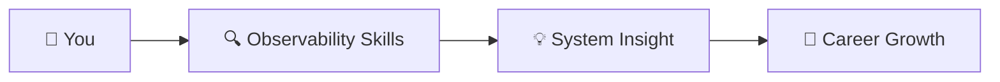

**👋 See you in the next lecture!**

---

## 📚 Resources & Further Reading

**📕 Books:**
* 📖 *Observability Engineering* — Charity Majors
* 📖 *Distributed Systems Observability* — Cindy Sridharan
* 📖 *The Art of Monitoring* — James Turnbull

**🔗 Links:**
* 🌐 [Grafana Loki Documentation](https://grafana.com/docs/loki/latest/)
* 🌐 [LogQL Reference](https://grafana.com/docs/loki/latest/query/)
* 🌐 [Promtail Configuration](https://grafana.com/docs/loki/latest/send-data/promtail/)

---
