# 📌 Lecture 8 — Monitoring with Prometheus: From Guessing to Measuring

## 📍 Slide 1 – 🚀 Welcome to Metrics Monitoring

* 🌍 **Logs tell you what happened** — but how much and how fast?
* 😰 Without metrics, capacity planning is guesswork
* 📊 **Prometheus** = the industry standard for metrics
* 🎯 This lecture: master metrics collection, PromQL, and dashboards

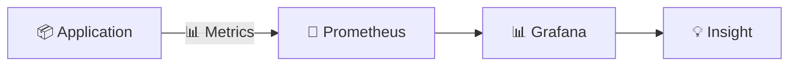

---

## 📍 Slide 2 – 🎯 What You Will Learn

* ✅ Understand metrics types and instrumentation
* ✅ Configure Prometheus for metrics collection
* ✅ Query metrics with PromQL
* ✅ Build effective monitoring dashboards

**🎓 Learning Outcomes:**
| # | Outcome |
|---|---------|
| 1 | 🧠 Differentiate Counter, Gauge, Histogram |
| 2 | 🔍 Configure Prometheus scrape targets |
| 3 | 🛠️ Write PromQL queries for analysis |
| 4 | 🗺️ Design RED method dashboards |

---

## 📍 Slide 3 – 📋 How This Lecture Works

* 📚 **Concepts + Instrumentation** — hands-on focus
* 🎮 **Real-world scenarios** — performance monitoring
* 📝 **3 quiz checkpoints**: PRE / MID / POST
* 🛠️ **Methods**: RED, USE, Four Golden Signals

**⏱️ Lecture Structure:**
```
Section 0: Introduction (now)     → 📝 PRE Quiz
Section 1: The Monitoring Problem
Section 2: Prometheus Fundamentals
Section 3: Application Instrumentation → 📝 MID Quiz
Section 4: PromQL & Dashboards
Section 5: Production Monitoring
Section 6: Reflection             → 📝 POST Quiz
```

---

## 📍 Slide 4 – ❓ The Big Question

* 📊 **83%** of organizations can't predict performance issues
* ⏱️ Average time to detect capacity problems: **too late**
* 💥 Without metrics, you're **reactive, not proactive**

> 💬 *"Is the server slow or is it just me?"* — Everyone, always

**🤔 Think about it:**
* How do you know if your app can handle more load?
* When did response times start degrading?
* How much headroom do you have?

---

## 📍 Slide 5 – 📝 QUIZ — DEVOPS_L8_PRE

---

## 📍 Slide 6 – 🔥 Section 1: The Monitoring Problem

* 🤷 **No metrics** = can't measure performance
* 📊 Users complain before you know there's a problem
* 🔍 Can't identify bottlenecks
* 💥 Result: **reactive firefighting**

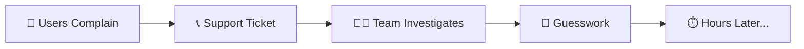

---

## 📍 Slide 7 – 📊 Metrics vs Logs

```mermaid
flowchart TD
  subgraph 📋 Logs
    L1[What happened?]
    L2[Detailed events]
    L3[High cardinality]
  end
  subgraph 📊 Metrics
    M1[How much/fast?]
    M2[Aggregated numbers]
    M3[Low cardinality]
  end
```

| 📋 Aspect | 📊 Metrics | 📝 Logs |
|-----------|----------|---------|
| 🎯 Question | How much? | What happened? |
| 📈 Volume | Low | High |
| 💾 Storage | Small | Large |
| 🔍 Analysis | Trends, alerts | Debugging |
| ⏱️ Retention | Long (months) | Short (days) |

> 🔥 **Use both**: Logs for debugging, metrics for monitoring

---

## 📍 Slide 8 – 😱 Alert Blindness

* 🚨 No alerts = problems go unnoticed
* 📧 Too many alerts = alert fatigue
* 🔍 Wrong thresholds = false positives
* 💀 On-call burnout

> ⚠️ **Good metrics = actionable alerts**

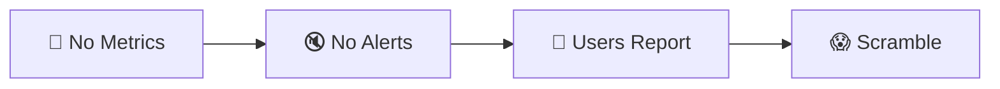

---

## 📍 Slide 9 – 😨 Capacity Planning Without Metrics

* 📅 "We need more servers" — but how many?
* 🔮 Crystal ball capacity planning
* 💰 Over-provision (waste money) or under-provision (outages)
* 💀 No data to justify decisions

> ⚠️ **Without metrics, capacity planning is gambling**

**💬 Discussion:** How does your team plan capacity?

---

## 📍 Slide 10 – 💸 The Cost of Blind Monitoring

| 🔥 Problem | 💥 Impact |
|------------|-----------|
| 🐢 No baseline | Can't detect degradation |
| 📊 No trends | Can't predict growth |
| 👉 No attribution | Can't identify bottlenecks |
| 🙈 No thresholds | Can't alert proactively |

**📈 Real Numbers:**
* 🏢 **Reactive incident detection**: Users report first (30+ min delay)
* 🚀 **Proactive with metrics**: Alert in seconds
* 💰 **Cost of 30-minute delay**: $150,000+ (enterprise)

---

## 📍 Slide 11 – 💡 Section 2: What Prometheus Is

* 📊 **Time-series database** for metrics
* 🔄 **Pull-based** model — scrapes targets
* 📈 **PromQL** — powerful query language
* 🎯 Industry standard for cloud-native monitoring

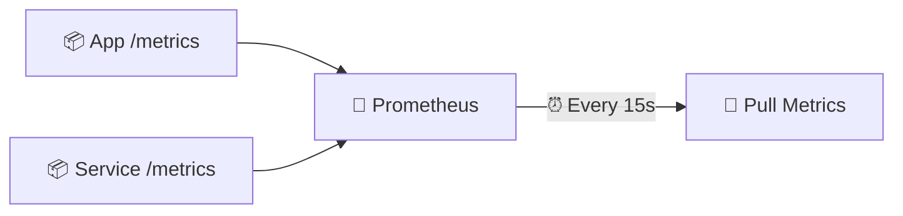

**📖 Definition:**
> *Prometheus is an open-source monitoring system that collects metrics from targets by scraping HTTP endpoints, stores them in a time-series database, and provides a powerful query language (PromQL) for analysis.*

---

## 📍 Slide 12 – 🔄 Pull vs Push Model

```mermaid
flowchart TD
  subgraph Pull (Prometheus)
    P1[💾 Prometheus] -->|🔄 Scrape| T1[📦 Target]
    P1 -->|🔄 Scrape| T2[📦 Target]
  end
  subgraph Push (StatsD)
    S1[📦 App] -->|📤 Push| D1[💾 Collector]
    S2[📦 App] -->|📤 Push| D1
  end
```

**🔄 Pull Benefits:**
* 🔍 Prometheus controls the rate
* ✅ Know immediately if target is down (scrape fails)
* 🎯 Apps don't need to know about monitoring
* 🔧 Easy service discovery

---

## 📍 Slide 13 – 🏗️ Prometheus Architecture

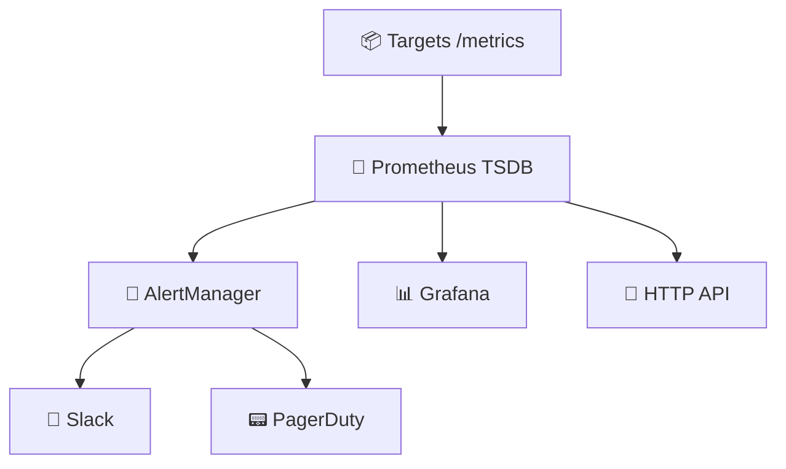

| 🧱 Component | 🎯 Purpose |
|-------------|----------|
| 💾 **Prometheus** | Scrape, store, query |
| 📦 **Targets** | Expose /metrics endpoint |
| 🚨 **AlertManager** | Handle alerts |
| 📊 **Grafana** | Visualization |

---

## 📍 Slide 14 – 📊 Metric Types

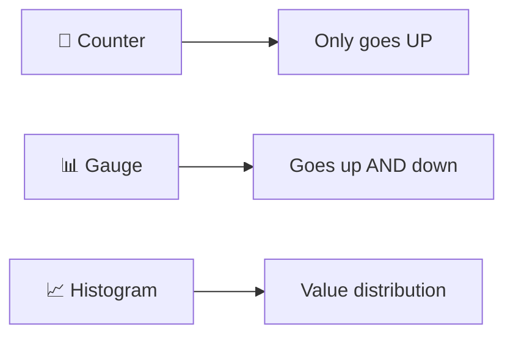

| 📊 Type | 🎯 Use For | 📝 Example |
|---------|----------|---------|
| 🔢 **Counter** | Cumulative events | Total requests |
| 📊 **Gauge** | Current value | Temperature, memory |
| 📈 **Histogram** | Distribution | Request latency |
| 📊 **Summary** | Percentiles | Pre-calculated p95 |

---

## 📍 Slide 15 – 🔢 Counter Deep Dive

```python
from prometheus_client import Counter

# 🔢 Counter: Only goes up
http_requests_total = Counter(
    'http_requests_total',
    'Total HTTP requests',
    ['method', 'endpoint', 'status']
)

# Usage
http_requests_total.labels(method='GET', endpoint='/', status='200').inc()
```

**📊 Query Patterns:**
```promql
# Total requests
http_requests_total

# Requests per second (rate over 5m)
rate(http_requests_total[5m])

# Requests per second by endpoint
sum by (endpoint) (rate(http_requests_total[5m]))
```

**⚠️ Counter Rule:** Use `rate()` to get per-second values

---

## 📍 Slide 16 – 🎮 Section 3: Application Instrumentation

## 🐍 Python prometheus_client

```python
from prometheus_client import Counter, Gauge, Histogram, generate_latest
from flask import Flask, Response

app = Flask(__name__)

# 📊 Define metrics
requests = Counter('http_requests', 'Total requests', ['method', 'path'])
latency = Histogram('http_latency_seconds', 'Request latency', ['path'])
in_progress = Gauge('http_in_progress', 'Requests in progress')

@app.route('/metrics')
def metrics():
    return Response(generate_latest(), content_type='text/plain')
```

**🎮 Let's instrument an application.**

---

## 📍 Slide 17 – 📊 Histogram Deep Dive

```python
from prometheus_client import Histogram

# 📈 Histogram with buckets
request_latency = Histogram(
    'http_request_duration_seconds',
    'Request latency in seconds',
    ['method', 'endpoint'],
    buckets=[0.01, 0.05, 0.1, 0.5, 1.0, 5.0]  # 🪣 Custom buckets
)

# Usage
with request_latency.labels(method='GET', endpoint='/').time():
    # ... handle request ...
    pass
```

**📊 Query Patterns:**
```promql
# 95th percentile latency
histogram_quantile(0.95, rate(http_request_duration_seconds_bucket[5m]))

# Average latency
rate(http_request_duration_seconds_sum[5m]) / rate(http_request_duration_seconds_count[5m])
```

---

## 📍 Slide 18 – 📈 The RED Method

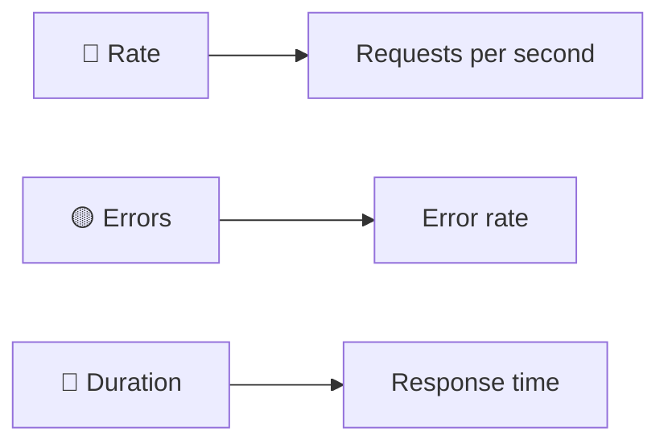

**📊 RED Method for Request-Driven Services:**

| 📊 Metric | 🎯 Question | 📝 PromQL |
|-----------|----------|---------|
| 🔴 **Rate** | How busy? | `rate(requests[5m])` |
| 🟡 **Errors** | How often failing? | `rate(errors[5m])` |
| 🔵 **Duration** | How slow? | `histogram_quantile(0.95, ...)` |

**🎯 If you monitor only 3 things, monitor these!**

---

## 📍 Slide 19 – 📈 The USE Method

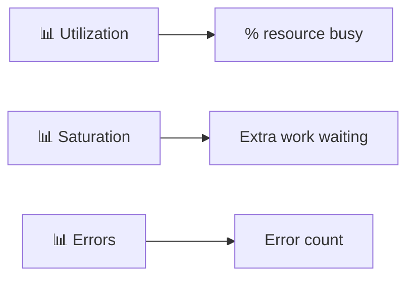

**📊 USE Method for Resources (CPU, Memory, Disk):**

| 📊 Metric | 🎯 Example |
|-----------|----------|
| 📊 **Utilization** | CPU at 80% |
| 📊 **Saturation** | 10 requests queued |
| 📊 **Errors** | Disk I/O errors |

**🎯 USE for resources, RED for services**

---

## 📍 Slide 20 – ⚙️ Prometheus Configuration

```yaml
# prometheus/prometheus.yml
global:
  scrape_interval: 15s
  evaluation_interval: 15s

scrape_configs:
  - job_name: 'prometheus'
    static_configs:
      - targets: ['localhost:9090']

  - job_name: 'app'
    static_configs:
      - targets: ['app-python:8000']
    metrics_path: '/metrics'

  - job_name: 'loki'
    static_configs:
      - targets: ['loki:3100']
```

**🔑 Key Settings:**
* ⏱️ `scrape_interval`: How often to collect (15s default)
* 🎯 `targets`: What to scrape
* 📍 `metrics_path`: Where metrics are exposed

---

## 📍 Slide 21 – 🎯 Scrape Targets

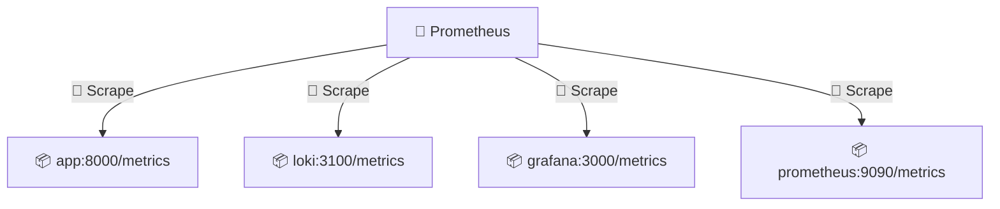

**📊 Verify Targets:**
```bash
# Check targets status
curl http://localhost:9090/api/v1/targets

# Web UI
http://localhost:9090/targets
```

**✅ All targets should show `UP`**

---

## 📍 Slide 22 – 📊 /metrics Endpoint Format

```
# HELP http_requests_total Total HTTP requests
# TYPE http_requests_total counter
http_requests_total{method="GET",endpoint="/",status="200"} 1234
http_requests_total{method="GET",endpoint="/health",status="200"} 567
http_requests_total{method="POST",endpoint="/api",status="201"} 89

# HELP http_request_duration_seconds Request latency
# TYPE http_request_duration_seconds histogram
http_request_duration_seconds_bucket{le="0.01"} 100
http_request_duration_seconds_bucket{le="0.05"} 200
http_request_duration_seconds_bucket{le="0.1"} 250
http_request_duration_seconds_bucket{le="+Inf"} 300
http_request_duration_seconds_sum 45.67
http_request_duration_seconds_count 300
```

**📊 Format:** `metric_name{labels} value`

---

## 📍 Slide 23 – 🏷️ Labels Best Practices

```python
# ✅ Good: Low cardinality labels
http_requests.labels(method='GET', status='200', endpoint='/api')

# ❌ Bad: High cardinality (user IDs, request IDs)
http_requests.labels(user_id='12345')  # 💥 Millions of time series!
```

**🏷️ Label Rules:**
* ✅ Use for: method, endpoint, status, service
* ❌ Avoid: user_id, request_id, session_id
* 📊 Target: < 1000 unique label combinations

**⚠️ High cardinality = memory explosion**

---

## 📍 Slide 24 – 🔍 PromQL Basics

```promql
# Instant vector (current value)
http_requests_total

# Range vector (over time)
http_requests_total[5m]

# Rate (per-second)
rate(http_requests_total[5m])

# Sum by label
sum by (endpoint) (rate(http_requests_total[5m]))

# Filter by label
http_requests_total{status="500"}
```

**🔑 Key Operators:**
* `rate()` — Per-second rate for counters
* `sum()` — Aggregate across series
* `by ()` — Group results
* `{}` — Filter by labels

---

## 📍 Slide 25 – 📝 QUIZ — DEVOPS_L8_MID

---

## 📍 Slide 26 – 📊 Section 4: Building Dashboards

## 🎨 Dashboard Design with RED

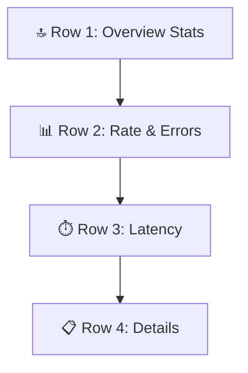

**📊 Essential Panels:**
1. 📊 **Request Rate** — Requests per second
2. ❌ **Error Rate** — 5xx responses
3. ⏱️ **Latency p95** — 95th percentile
4. 📈 **Latency Heatmap** — Distribution

---

## 📍 Slide 27 – 📊 PromQL Dashboard Queries

**1️⃣ Request Rate (Time series)**
```promql
sum(rate(http_requests_total[5m])) by (endpoint)
```

**2️⃣ Error Rate % (Time series)**
```promql
sum(rate(http_requests_total{status=~"5.."}[5m]))
  / sum(rate(http_requests_total[5m])) * 100
```

**3️⃣ P95 Latency (Time series)**
```promql
histogram_quantile(0.95,
  sum(rate(http_request_duration_seconds_bucket[5m])) by (le))
```

**4️⃣ Uptime (Stat)**
```promql
up{job="app"}
```

---

## 📍 Slide 28 – 📈 Heatmap for Latency

```promql
# Latency distribution over time
sum(rate(http_request_duration_seconds_bucket[1m])) by (le)
```

**🎨 Heatmap Benefits:**
* 📊 See latency distribution
* 🔍 Spot outliers
* 📈 Track changes over time

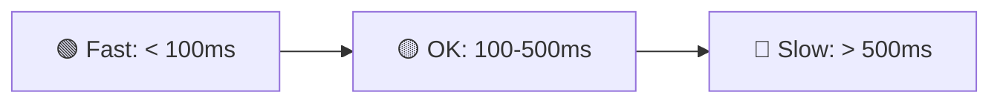

---

## 📍 Slide 29 – 📊 Monitoring Metrics

| 📊 Metric | 📏 Measures | 🏆 Target |
|-----------|------------|---------|
| ⏱️ **Scrape Success** | Targets reachable | 100% |
| 📊 **Series Count** | Time series | Stable |
| 💾 **Storage Size** | Disk usage | Predictable |
| 🔍 **Query Latency** | PromQL speed | < 1s |

> 📚 Monitor your monitoring!

**🤔 Question:** What happens if Prometheus goes down?

---

## 📍 Slide 30 – 🌊 From Guessing to Measuring

```mermaid
flowchart LR
  subgraph 😱 Guessing
    NoData[🤷 No Data]
    Reactive[🔥 Reactive]
    Slow[⏱️ Slow Detection]
  end
  subgraph 📊 Measuring
    Metrics[📈 Real Metrics]
    Proactive[⚡ Proactive]
    Fast[🚀 Instant Detection]
  end
  Guessing -->|🚀 Prometheus| Measuring
```

**🎯 Monitoring State:**
* ⚡ Detect issues before users
* 📊 Data-driven capacity planning
* 📈 Trend analysis and predictions

---

## 📍 Slide 31 – 🏢 Section 5: Production Monitoring

## 📅 A Day with Prometheus

**☀️ Morning:**
* 📊 Check Grafana — all green ✅
* 📈 Review overnight trends
* 🔍 No anomalies detected

**🌤️ Afternoon:**
* 🚨 Alert: Latency p95 > 500ms
* 📊 Dashboard shows spike at 2pm
* 🔍 PromQL: `histogram_quantile(0.95, ...)`
* 🔧 Found: Database slow query
* ⏱️ **5 minutes** to identify

**🌙 Evening:**
* 📊 Review daily trends
* 📈 Plan tomorrow's capacity
* 🏠 Go home with confidence

---

## 📍 Slide 32 – 👥 Team Monitoring Workflow

| 👤 Role | 🎯 Monitoring Responsibility |
|---------|----------------------|
| 👨‍💻 **Developer** | Add metrics to code |
| 🔧 **DevOps** | Maintain Prometheus |
| 🛡️ **SRE** | Design dashboards & alerts |
| 📊 **On-call** | Respond to alerts |

**🔗 Alert Flow:**
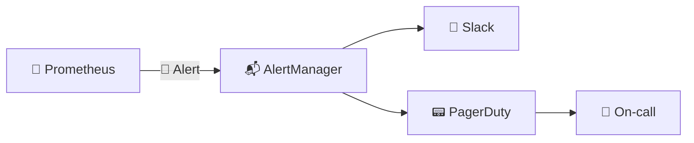

---

## 📍 Slide 33 – 🔐 Production Considerations

```yaml
# Prometheus with retention
command:
  - '--config.file=/etc/prometheus/prometheus.yml'
  - '--storage.tsdb.retention.time=15d'
  - '--storage.tsdb.retention.size=10GB'

deploy:
  resources:
    limits:
      memory: 1G
      cpus: '1.0'

healthcheck:
  test: ["CMD", "wget", "-q", "--spider", "http://localhost:9090/-/healthy"]
  interval: 10s
  timeout: 5s
  retries: 5
```

**🛡️ Production Checklist:**
* 💾 Persistent storage configured
* 🗓️ Retention policy set
* 📊 Resource limits defined
* 🏥 Health checks enabled

---

## 📍 Slide 34 – 📈 Career Path: Monitoring Skills

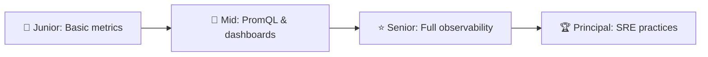

**🛠️ Skills to Build:**
* 📊 Application instrumentation
* 🔍 PromQL fluency
* 📈 Dashboard design
* 🚨 Alert engineering
* 📊 SLO/SLI definition

---

## 📍 Slide 35 – 🌍 Real Company Examples

**🏢 Prometheus at Scale:**
* ☁️ **SoundCloud**: Created Prometheus (2012)
* 🔍 **Google**: Inspired Prometheus (Borgmon)
* 🎬 **Netflix**: Millions of time series

**☁️ Modern Practices:**
* 📦 **Spotify**: Custom Prometheus federation
* 🏦 **Stripe**: Fine-grained latency tracking
* 🎮 **Riot Games**: Real-time game metrics

**📊 Stats:**
* 🌍 **#1** cloud-native monitoring tool
* 📦 **CNCF graduated** project
* 🏢 Adopted by **70%+** of K8s users

---

## 📍 Slide 36 – 🎯 Section 6: Reflection

## 📝 Key Takeaways

1. 📊 **Metrics complement logs** — different purposes
2. 🔢 **Counter, Gauge, Histogram** — choose wisely
3. 🔴 **RED method** for services (Rate, Errors, Duration)
4. 🏷️ **Labels** — keep cardinality low
5. 📈 **PromQL** is powerful — learn it well

> 💡 If you can't measure it, you can't improve it.

---

## 📍 Slide 37 – 🧠 The Mindset Shift

| 😰 Old Mindset | 📊 Metrics Mindset |
|---------------|------------------|
| 🙅 "Seems fine" | 📊 "Data shows it's fine" |
| 🚫 "Users will tell us" | 🚨 "Alerts tell us first" |
| 👉 "We need more servers" | 📈 "Data shows we need 3 more" |
| 😨 "Deploy and hope" | 📊 "Deploy and measure" |
| 💻 "Performance is subjective" | 🔢 "p95 is 250ms" |

> ❓ Which mindset describes your team?

---

## 📍 Slide 38 – ✅ Your Progress

## 🎓 What You Now Understand

* ✅ Metrics types and when to use each
* ✅ Prometheus architecture and configuration
* ✅ Application instrumentation patterns
* ✅ PromQL query syntax
* ✅ Dashboard design with RED method

> 🚀 **You're ready for Lab 8: Prometheus Monitoring**

---

## 📍 Slide 39 – 📝 QUIZ — DEVOPS_L8_POST

---

## 📍 Slide 40 – 🚀 What Comes Next

## 📚 Next Lecture: Kubernetes Fundamentals

* ☸️ Container orchestration
* 📦 Deployments and Services
* 🔄 Scaling and self-healing
* 💻 Hands-on: Deploying to Kubernetes

**🎉 Your monitoring journey continues.**

> 📊 From guessing to measuring — one metric at a time.


**👋 See you in the next lecture!**

---

## 📚 Resources & Further Reading

**📕 Books:**
* 📖 *Prometheus: Up & Running* — Brian Brazil
* 📖 *Site Reliability Engineering* — Google
* 📖 *The Art of Monitoring* — James Turnbull

**🔗 Links:**
* 🌐 [Prometheus Documentation](https://prometheus.io/docs/)
* 🌐 [PromQL Basics](https://prometheus.io/docs/prometheus/latest/querying/basics/)
* 🌐 [RED Method](https://grafana.com/blog/2018/08/02/the-red-method-how-to-instrument-your-services/)

---
