# 📌 Lecture 9 — Kubernetes Fundamentals: Container Orchestration

## 📍 Slide 1 – 🚀 Welcome to Kubernetes

* 🌍 **Containers are great** — but who manages them at scale?
* 😰 Manual container management doesn't scale
* ☸️ **Kubernetes** = the operating system for containers
* 🎯 This lecture: master deployments, services, and orchestration

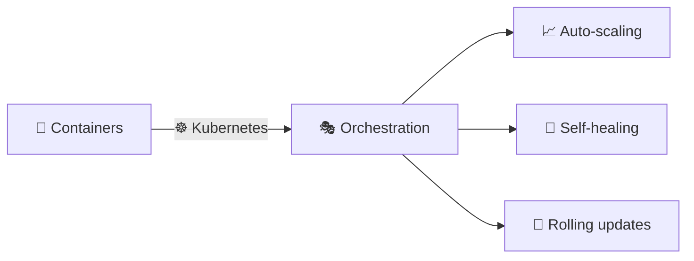

---

## 📍 Slide 2 – 🎯 What You Will Learn

* ✅ Understand Kubernetes architecture and concepts
* ✅ Write production-ready Deployment manifests
* ✅ Expose applications with Services and Ingress
* ✅ Implement health checks and resource management

**🎓 Learning Outcomes:**
| # | Outcome |
|---|---------|
| 1 | 🧠 Explain Kubernetes declarative model |
| 2 | 🔍 Create Deployments with probes and limits |
| 3 | 🛠️ Configure Services for networking |
| 4 | 🗺️ Perform scaling and rolling updates |

---

## 📍 Slide 3 – 📋 How This Lecture Works

* 📚 **Concepts + YAML manifests** — hands-on focus
* 🎮 **Real-world scenarios** — production deployment challenges
* 📝 **3 quiz checkpoints**: PRE / MID / POST
* 🛠️ **Tools**: kubectl, minikube, manifests

**⏱️ Lecture Structure:**
```
Section 0: Introduction (now)     → 📝 PRE Quiz
Section 1: The Orchestration Problem
Section 2: Kubernetes Architecture
Section 3: Core Resources          → 📝 MID Quiz
Section 4: Health & Resource Management
Section 5: Production Kubernetes
Section 6: Reflection             → 📝 POST Quiz
```

---

## 📍 Slide 4 – ❓ The Big Question

* 📊 **92%** of organizations use containers in production
* ⏱️ Average container lifecycle: **minutes to hours** (not days)
* 💥 Managing 100+ containers manually is **impossible**

> 💬 *"Why did container 47 crash? Where's the replacement?"* — Nobody wants to ask this manually

**🤔 Think about it:**
* How do you ensure 10 copies of your app are always running?
* What happens when a container crashes at 3am?
* How do you update without downtime?

---

## 📍 Slide 5 – 📝 QUIZ — DEVOPS_L9_PRE

---

## 📍 Slide 6 – 🔥 Section 1: The Orchestration Problem

* 🐳 **One container is easy** — just `docker run`
* 📦 100 containers? 1000 containers?
* 🔧 Manual restart on crash?
* 💥 Result: **operations nightmare**

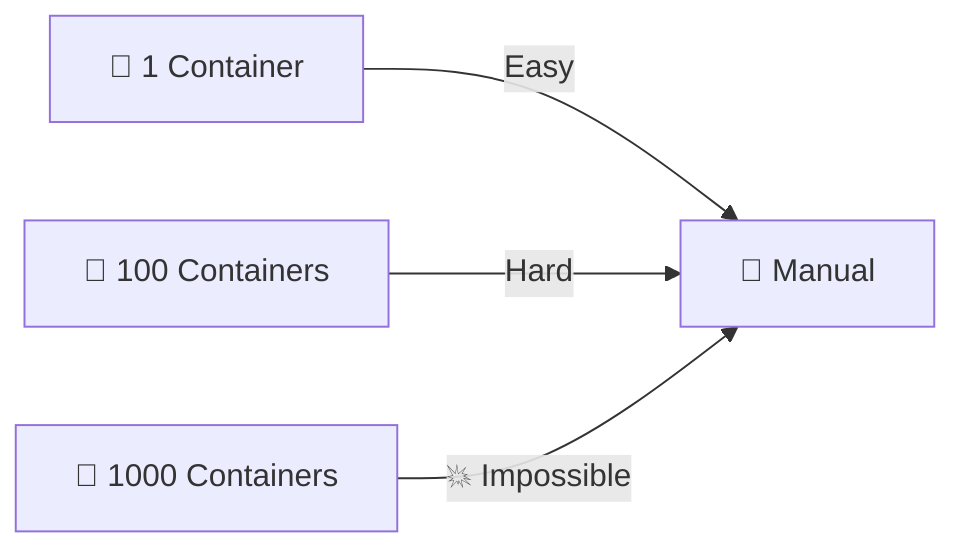

---

## 📍 Slide 7 – 😱 Container Management Chaos

* 📋 Tracking which containers run where
* 🔄 Restarting crashed containers
* 📊 Load balancing between replicas
* 🔒 Managing secrets and configs
* 💀 Scaling up/down based on load

```mermaid
flowchart TD
  Crash[💥 Container Crash] --> Detect[🔍 Detect (how?)]
  Detect --> Restart[🔄 Restart (where?)]
  Restart --> LoadBalance[⚖️ Update LB (manually?)]
  LoadBalance --> Hope[🙏 Hope it works]
```

**📊 The Numbers:**
* 🔍 **Netflix**: 100,000+ container instances
* 📦 **Spotify**: 10,000+ services
* ⏱️ Manual management: **impossible**

---

## 📍 Slide 8 – 🔧 Docker Compose Limitations

* ✅ Great for development and simple deployments
* ❌ Single host only
* ❌ No automatic restart across nodes
* ❌ No rolling updates
* ❌ No auto-scaling

> ⚠️ **Docker Compose ≠ production orchestration**

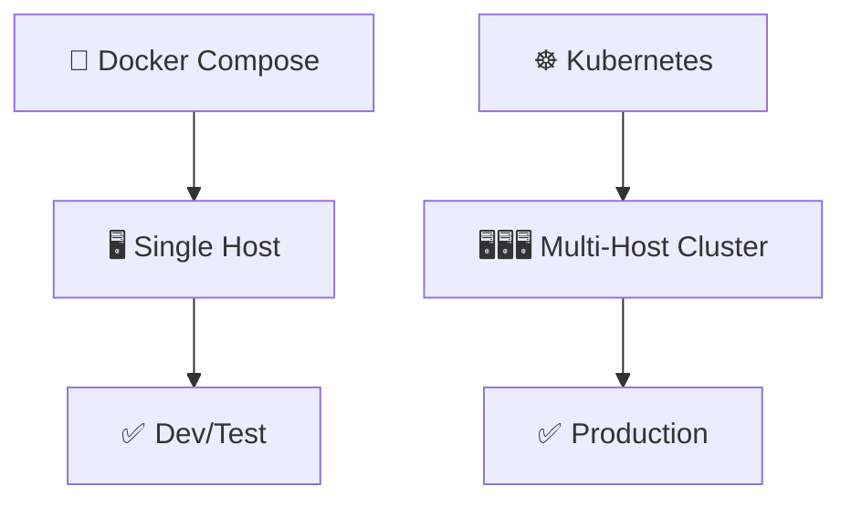

---

## 📍 Slide 9 – 😨 Zero Downtime Deployments

* 📅 Traditional: Schedule maintenance window
* 🔧 Stop old version, start new version
* ⏱️ Downtime = lost revenue
* 💀 Risky deployments = fear of deploying

> ⚠️ **Every minute of downtime costs money**

**💬 Discussion:** How do you update without any downtime?

---

## 📍 Slide 10 – 💸 The Cost of Manual Orchestration

| 🔥 Problem | 💥 Impact |
|------------|-----------|
| 🐢 Slow scaling | Can't handle traffic spikes |
| 📋 Manual recovery | Long outages |
| 👉 No load balancing | Uneven distribution |
| 🙈 Version confusion | "Which version is running?" |

**📈 Real Numbers:**
* 🏢 **Manual ops**: 10+ hours/week
* 🚀 **With Kubernetes**: Minutes/week
* 💰 **Downtime cost**: $5,600/minute (average)

---

## 📍 Slide 11 – 💡 Section 2: What Kubernetes Is

* ☸️ **Container orchestration platform**
* 🎭 **Manages** container lifecycle automatically
* 🔄 **Declarative** — you define desired state
* 🌐 **Portable** — runs anywhere (cloud, on-prem, laptop)

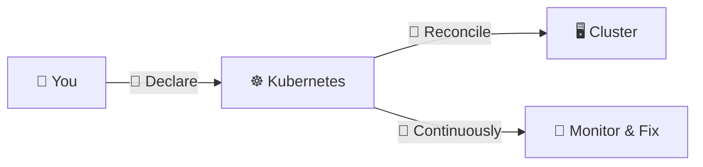

**📖 Definition:**
> *Kubernetes is an open-source container orchestration platform that automates deployment, scaling, and management of containerized applications.*

---

## 📍 Slide 12 – 🎭 Declarative vs Imperative

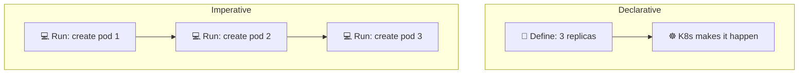

| 📋 Approach | 📝 You Say | ☸️ K8s Does |
|-------------|----------|------------|
| 🎭 **Declarative** | "I want 3 replicas" | Creates/maintains 3 |
| 💻 **Imperative** | "Create this pod" | Creates 1 pod |

**🎯 Always prefer declarative manifests!**

---

## 📍 Slide 13 – 🏗️ Kubernetes Architecture

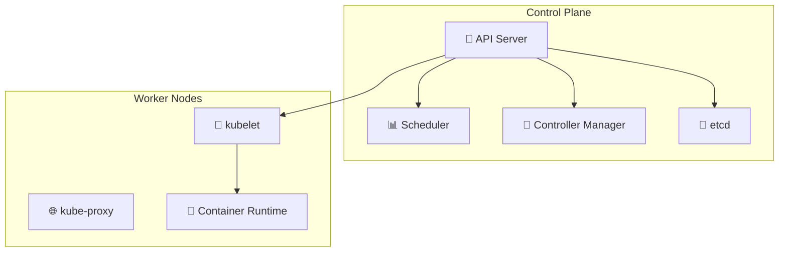

| 🧱 Component | 🎯 Purpose |
|-------------|----------|
| 📡 **API Server** | Gateway to cluster |
| 📊 **Scheduler** | Places pods on nodes |
| 🔄 **Controller** | Ensures desired state |
| 💾 **etcd** | Cluster state database |
| 🤖 **kubelet** | Node agent |

---

## 📍 Slide 14 – 📦 Core Resources

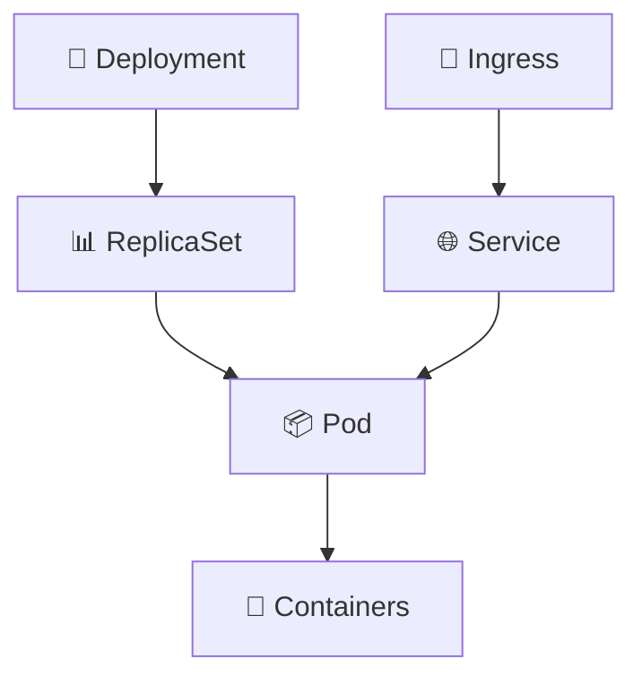

| 📦 Resource | 🎯 Purpose |
|-------------|----------|
| 📦 **Pod** | Smallest unit, contains containers |
| 🚀 **Deployment** | Manages replicas and updates |
| 🌐 **Service** | Stable network endpoint |
| 🚪 **Ingress** | HTTP routing and TLS |

---

## 📍 Slide 15 – ⚡ Before vs After Kubernetes

| 😰 Before | 🚀 After |
|----------|---------|
| 📅 Manual restart on crash | 🔄 Auto-restart |
| 📋 Manual scaling | 📈 Auto-scaling |
| 👉 Downtime for updates | 🔄 Rolling updates |
| 😨 Fear of deploying | 💪 Deploy anytime |
| 🐌 Hours to scale | ⚡ Seconds to scale |
| 📝 Track servers manually | 🎭 Declarative state |

> 🤔 Ready to orchestrate?

---

## 📍 Slide 16 – 🎮 Section 3: Core Resources

## 📦 The Pod

* 🐳 **One or more containers** sharing network/storage
* 📦 **Smallest deployable unit**
* ⏱️ **Ephemeral** — created and destroyed
* 🏷️ **Labeled** for selection

```yaml
apiVersion: v1
kind: Pod
metadata:
  name: my-app
  labels:
    app: web
spec:
  containers:
  - name: web
    image: nginx:latest
    ports:
    - containerPort: 80
```

**⚠️ Never create pods directly — use Deployments!**

---

## 📍 Slide 17 – 🚀 Deployments

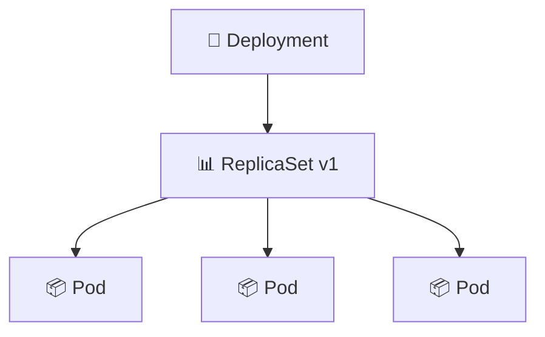

**🚀 Deployment manages:**
* 📊 Desired replica count
* 🔄 Rolling updates
* 🔙 Rollback capability
* 🏷️ Pod template

```yaml
apiVersion: apps/v1
kind: Deployment
metadata:
  name: web-app
spec:
  replicas: 3
  selector:
    matchLabels:
      app: web
  template:
    metadata:
      labels:
        app: web
    spec:
      containers:
      - name: web
        image: myapp:1.0
```

---

## 📍 Slide 18 – 🏷️ Labels and Selectors

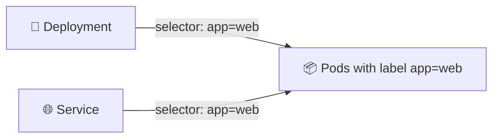

**🏷️ Labels = Key-value pairs for organization**

```yaml
metadata:
  labels:
    app: web-frontend
    environment: production
    version: v1.2.3

selector:
  matchLabels:
    app: web-frontend
```

**🎯 Labels enable:**
* 🔍 Service discovery
* 📊 Resource selection
* 🏗️ Organization

---

## 📍 Slide 19 – 🌐 Services

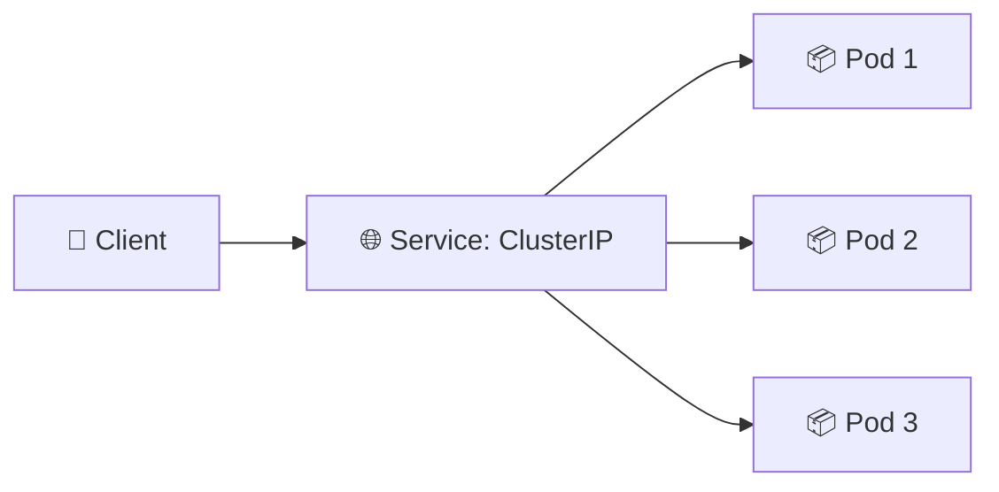

**🌐 Service types:**
| 🔧 Type | 🎯 Use Case |
|---------|----------|
| 🔒 **ClusterIP** | Internal cluster access |
| 🔓 **NodePort** | External via node IP |
| ☁️ **LoadBalancer** | Cloud load balancer |
| 🔗 **ExternalName** | DNS alias |

```yaml
apiVersion: v1
kind: Service
metadata:
  name: web-service
spec:
  type: NodePort
  selector:
    app: web
  ports:
  - port: 80
    targetPort: 8000
    nodePort: 30080
```

---

## 📍 Slide 20 – 🔄 Rolling Updates

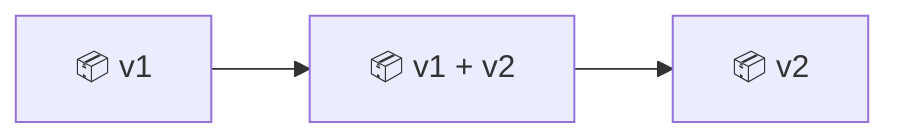

**🔄 How it works:**
1. 📦 Create new pods with new version
2. ⏳ Wait for them to be ready
3. 🗑️ Terminate old pods gradually
4. ✅ Zero downtime!

```yaml
spec:
  strategy:
    type: RollingUpdate
    rollingUpdate:
      maxSurge: 1        # Extra pods during update
      maxUnavailable: 0  # Always maintain capacity
```

---

## 📍 Slide 21 – 📊 kubectl Commands

```bash
# 📋 Get resources
kubectl get pods
kubectl get deployments
kubectl get services

# 🔍 Describe (detailed info)
kubectl describe pod <name>

# 📝 Apply manifest
kubectl apply -f deployment.yaml

# 📊 Watch changes
kubectl get pods -w

# 🔙 Rollback
kubectl rollout undo deployment/<name>

# 📈 Scale
kubectl scale deployment/<name> --replicas=5
```

---

## 📍 Slide 22 – 🚪 Ingress

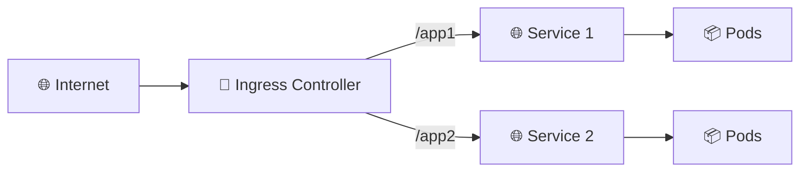

**🚪 Ingress provides:**
* 🔗 URL routing
* 🔐 TLS termination
* 🏷️ Name-based virtual hosting

```yaml
apiVersion: networking.k8s.io/v1
kind: Ingress
metadata:
  name: app-ingress
spec:
  rules:
  - host: app.example.com
    http:
      paths:
      - path: /
        pathType: Prefix
        backend:
          service:
            name: web-service
            port:
              number: 80
```

---

## 📍 Slide 23 – 🏥 Health Checks

```yaml
spec:
  containers:
  - name: app
    image: myapp:1.0
    livenessProbe:
      httpGet:
        path: /health
        port: 8000
      initialDelaySeconds: 10
      periodSeconds: 5
    readinessProbe:
      httpGet:
        path: /ready
        port: 8000
      initialDelaySeconds: 5
      periodSeconds: 3
```

| 🏥 Probe | 🎯 Purpose | ❌ Failure Action |
|----------|----------|------------------|
| 🔴 **Liveness** | Is it alive? | Restart container |
| 🟢 **Readiness** | Is it ready? | Remove from service |
| 🟡 **Startup** | Did it start? | Keep waiting |

---

## 📍 Slide 24 – 📊 Resource Management

```yaml
spec:
  containers:
  - name: app
    image: myapp:1.0
    resources:
      requests:
        memory: "128Mi"
        cpu: "100m"       # 0.1 CPU core
      limits:
        memory: "256Mi"
        cpu: "200m"       # 0.2 CPU core
```

**📊 Requests vs Limits:**
| 📊 Setting | 🎯 Purpose |
|-----------|----------|
| 📋 **Requests** | Guaranteed resources, scheduling |
| 🔒 **Limits** | Maximum allowed, OOM if exceeded |

**⚠️ Always set both!**

---

## 📍 Slide 25 – 📝 QUIZ — DEVOPS_L9_MID

---

## 📍 Slide 26 – 📁 Section 4: Manifest Best Practices

## 📄 Complete Deployment Example

```yaml
apiVersion: apps/v1
kind: Deployment
metadata:
  name: web-app
  labels:
    app: web-app
spec:
  replicas: 3
  selector:
    matchLabels:
      app: web-app
  strategy:
    type: RollingUpdate
    rollingUpdate:
      maxSurge: 1
      maxUnavailable: 0
  template:
    metadata:
      labels:
        app: web-app
    spec:
      containers:
      - name: web-app
        image: username/web-app:1.0.0
        ports:
        - containerPort: 8000
        resources:
          requests:
            memory: "128Mi"
            cpu: "100m"
          limits:
            memory: "256Mi"
            cpu: "200m"
        livenessProbe:
          httpGet:
            path: /health
            port: 8000
          initialDelaySeconds: 10
        readinessProbe:
          httpGet:
            path: /health
            port: 8000
          initialDelaySeconds: 5
```

---

## 📍 Slide 27 – 🔐 Security Best Practices

```yaml
spec:
  containers:
  - name: app
    image: myapp:1.0
    securityContext:
      runAsNonRoot: true
      runAsUser: 1000
      readOnlyRootFilesystem: true
      allowPrivilegeEscalation: false
```

**🔐 Security Checklist:**
* ✅ Run as non-root user
* ✅ Read-only filesystem
* ✅ No privilege escalation
* ✅ Specific image tags (not `:latest`)
* ✅ Resource limits defined

---

## 📍 Slide 28 – 📊 Kubernetes Metrics

| 📊 Metric | 📏 Measures | 🏆 Target |
|-----------|------------|---------|
| 📦 **Pod Restarts** | Stability | 0 |
| ⏱️ **Pod Startup Time** | Speed | < 30s |
| 📊 **Resource Usage** | Efficiency | 50-80% |
| ✅ **Probe Success** | Health | 100% |

> 📚 Monitor your cluster health!

**🤔 Question:** How many pod restarts is "normal"?

---

## 📍 Slide 29 – 🌊 From Manual to Orchestrated

```mermaid
flowchart LR
  subgraph 😱 Manual
    SSH[🔌 SSH to servers]
    Docker[🐳 docker run]
    Restart[🔄 Manual restart]
  end
  subgraph ☸️ Orchestrated
    Manifest[📝 YAML Manifest]
    Apply[kubectl apply]
    AutoHeal[🏥 Auto-healing]
  end
  Manual -->|🚀 Kubernetes| Orchestrated
```

**🎯 Orchestration State:**
* ⚡ Deploy in seconds
* 🔄 Auto-healing always
* 📈 Scale on demand

---

## 📍 Slide 30 – 🏢 Section 5: Production Kubernetes

## 📅 A Day with Kubernetes

**☀️ Morning:**
* 📊 Check cluster health — all green ✅
* 📈 Review resource usage
* 🔄 Approve deployment PR

**🌤️ Afternoon:**
* 🚀 `kubectl apply -f deployment.yaml`
* 📊 Watch rolling update: `kubectl rollout status`
* ✅ Zero downtime update complete

**🌙 Evening:**
* 📈 Auto-scaling handles traffic spike
* 🏥 Crashed pod auto-restarted
* 🏠 Sleep peacefully

---

## 📍 Slide 31 – 👥 Team Kubernetes Workflow

| 👤 Role | 🎯 Kubernetes Responsibility |
|---------|----------------------|
| 👨‍💻 **Developer** | Write manifests, define resources |
| 🔧 **DevOps** | Manage cluster, set policies |
| 🛡️ **SRE** | Monitor, scale, incident response |
| 📊 **Platform** | Build internal tooling |

**🔗 GitOps Flow:**
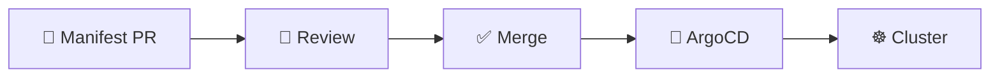

---

## 📍 Slide 32 – 🔧 Local Development

```bash
# 🎯 minikube: Full-featured local cluster
minikube start
minikube status
minikube service web-service --url

# 🐳 kind: Lightweight, Docker-based
kind create cluster
kind load docker-image myapp:latest

# 📊 Useful addons
minikube addons enable ingress
minikube addons enable metrics-server
```

**🛠️ Local Options:**
| 🔧 Tool | 🎯 Best For |
|---------|----------|
| 🚀 **minikube** | Learning, full features |
| 🐳 **kind** | CI/CD, fast startup |
| 🖥️ **Docker Desktop** | Mac/Windows convenience |

---

## 📍 Slide 33 – 📈 Career Path: Kubernetes Skills

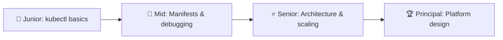

**🛠️ Skills to Build:**
* 📝 YAML manifest fluency
* 🔍 kubectl debugging
* 🏗️ Architecture patterns
* 📊 Resource optimization
* 🔐 Security hardening

---

## 📍 Slide 34 – 🌍 Real Company Examples

**🏢 Kubernetes at Scale:**
* 📦 **Spotify**: 10,000+ services on K8s
* 🔍 **Google**: Runs everything on Kubernetes
* 🎬 **Netflix**: Titus (K8s-inspired)

**☁️ Modern Practices:**
* 📦 **Airbnb**: 1000+ microservices
* 🏦 **Capital One**: K8s for banking workloads
* 🎮 **Pokemon Go**: Global scale with K8s

**📊 Stats:**
* 🌍 **5.6M+** Kubernetes developers
* 📦 **92%** container adoption uses K8s
* 🏢 **#1** CNCF project

---

## 📍 Slide 35 – 🎯 Section 6: Reflection

## 📝 Key Takeaways

1. ☸️ **Kubernetes orchestrates containers** at scale
2. 🎭 **Declarative** — define desired state, K8s maintains it
3. 🚀 **Deployments** manage replicas and updates
4. 🌐 **Services** provide stable networking
5. 🏥 **Probes** ensure health, **limits** ensure stability

> 💡 Kubernetes is the operating system for cloud-native applications.

---

## 📍 Slide 36 – 🧠 The Mindset Shift

| 😰 Old Mindset | ☸️ K8s Mindset |
|---------------|------------------|
| 🙅 "Restart manually" | 🔄 "K8s restarts automatically" |
| 🚫 "SSH to fix" | 📝 "Fix manifest, apply" |
| 👉 "Which server?" | 📦 "Which pod?" |
| 😨 "Scale takes hours" | ⚡ "Scale in seconds" |
| 💻 "Deploy on weekends" | 🚀 "Deploy anytime" |

> ❓ Which mindset describes your team?

---

## 📍 Slide 37 – ✅ Your Progress

## 🎓 What You Now Understand

* ✅ Kubernetes architecture and concepts
* ✅ Deployments, Services, and Ingress
* ✅ Health checks and resource management
* ✅ Rolling updates and scaling
* ✅ kubectl commands for daily use

> 🚀 **You're ready for Lab 9: Kubernetes Fundamentals**

---

## 📍 Slide 38 – 📝 QUIZ — DEVOPS_L9_POST

---

## 📍 Slide 39 – 🚀 What Comes Next

## 📚 Next Lecture: Helm Package Management

* ⛵ Helm charts for packaging
* 📝 Templating with Go templates
* 🔧 Values management
* 💻 Hands-on: Creating Helm charts

**🎉 Your Kubernetes journey continues.**

> ☸️ From manual containers to orchestration — one manifest at a time.


**👋 See you in the next lecture!**

---

## 📍 Slide 40 – 📚 Resources & Further Reading

**📕 Books:**
* 📖 *Kubernetes: Up & Running* — Brendan Burns
* 📖 *The Kubernetes Book* — Nigel Poulton
* 📖 *Cloud Native DevOps with Kubernetes* — John Arundel

**🔗 Links:**
* 🌐 [Kubernetes Documentation](https://kubernetes.io/docs/)
* 🌐 [kubectl Cheat Sheet](https://kubernetes.io/docs/reference/kubectl/cheatsheet/)
* 🌐 [Kubernetes the Hard Way](https://github.com/kelseyhightower/kubernetes-the-hard-way)

---
