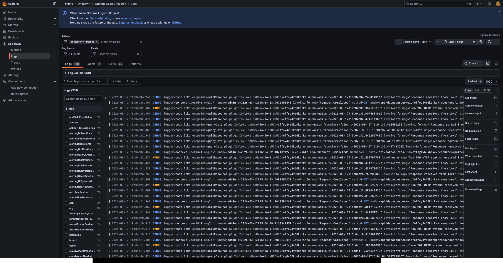
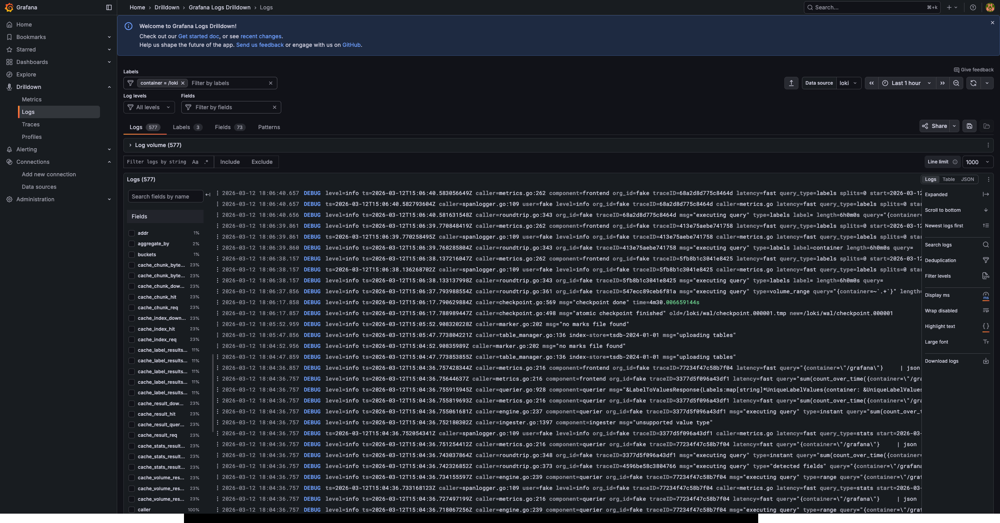
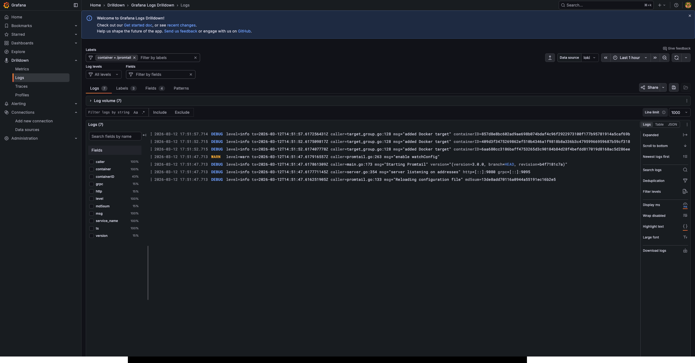
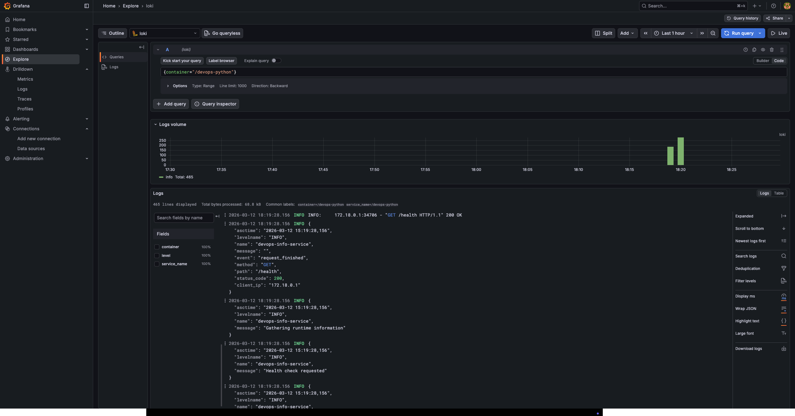
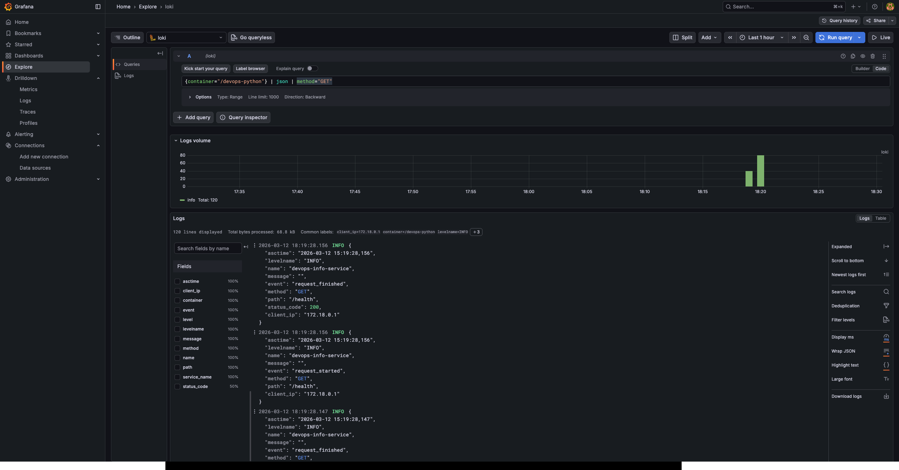
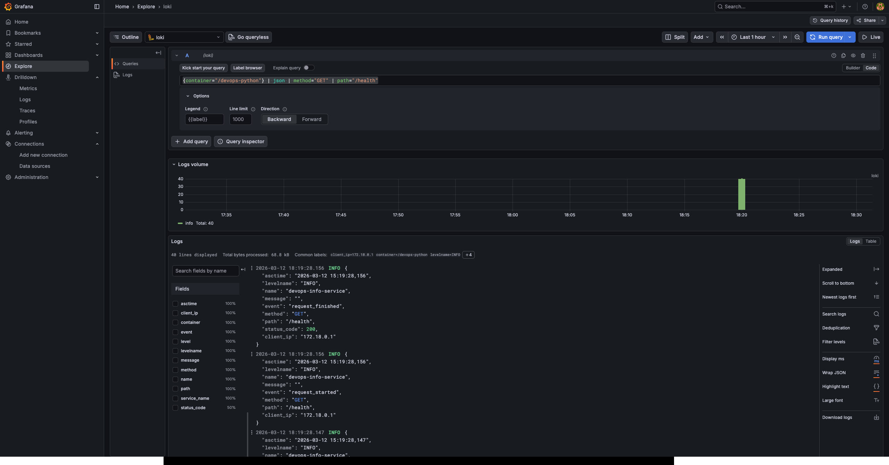
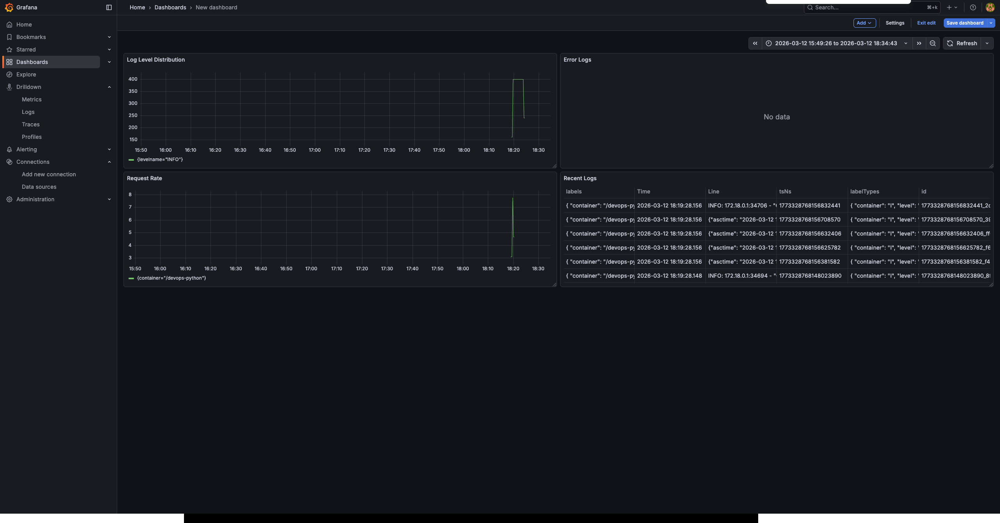
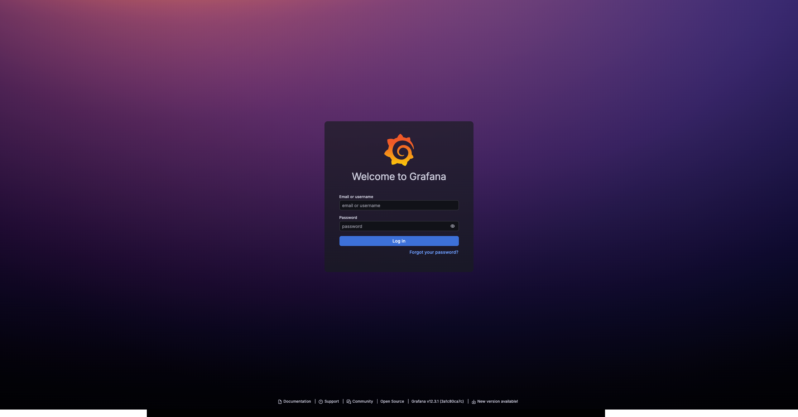

# LAB07.md — Centralized Logging with Grafana Loki

## Architecture Overview

```
┌─────────────────┐     ┌─────────────────┐     ┌─────────────────┐
│  Docker         │     │  Promtail       │     │  Loki           │
│  Containers     │────▶│  (Log Agent)    │────▶│  (Log Storage)  │
│  - python-app   │     │                 │     │                 │
│  - grafana      │     │  - Reads logs   │     │  - Indexes only │
│  - loki         │     │  - Adds labels  │     │    labels       │
│  - promtail     │     │  - Sends to Loki│     │  - Stores raw   │
└─────────────────┘     └─────────────────┘     └────────┬────────┘
                                                          │
                                                          ▼
                                                 ┌─────────────────┐
                                                 │  Grafana        │
                                                 │  (Visualization)│
                                                 │                 │
                                                 │  - Explore      │
                                                 │  - Dashboards   │
                                                 └─────────────────┘
```

### Components

| Component | Purpose | Container Name |
|-----------|---------|----------------|
| **Loki** | Log storage engine, indexes only labels | `loki` |
| **Promtail** | Log collector, reads Docker logs, adds metadata | `promtail` |
| **Grafana** | Visualization UI, connects to Loki datasource | `grafana` |
| **Python App** | Test application generating JSON logs | `devops-python` |

## Task 1: Stack Deployment

### Docker Compose Configuration

```yaml
services:
  loki:
    image: grafana/loki:3.0.0
    container_name: loki
    ports:
      - "3100:3100"
    volumes:
      - ./loki/config.yml:/etc/loki/config.yml
      - loki-data:/loki
    command: -config.file=/etc/loki/config.yml
    networks:
      - monitoring

  promtail:
    image: grafana/promtail:3.0.0
    container_name: promtail
    volumes:
      - ./promtail/config.yml:/etc/promtail/config.yml
      - /var/lib/docker/containers:/var/lib/docker/containers:ro
      - /var/run/docker.sock:/var/run/docker.sock
    command: -config.file=/etc/promtail/config.yml
    networks:
      - monitoring
    ports:
      - "9080:9080"

  grafana:
    image: grafana/grafana:12.3.1
    container_name: grafana
    ports:
      - "3000:3000"
    volumes:
      - grafana-data:/var/lib/grafana
    networks:
      - monitoring
```

### Loki Configuration

`loki/config.yml`:
```yaml
auth_enabled: false

server:
  http_listen_port: 3100

common:
  path_prefix: /loki
  storage:
    filesystem:
      chunks_directory: /loki/chunks
      rules_directory: /loki/rules
  replication_factor: 1
  ring:
    kvstore:
      store: inmemory

schema_config:
  configs:
    - from: 2024-01-01
      store: tsdb
      object_store: filesystem
      schema: v13
      index:
        prefix: index_
        period: 24h

limits_config:
  retention_period: 168h
```

**Key decisions:**
- **Filesystem storage** — Simple for local development
- **TSDB store** — Modern index format, better performance
- **168h retention** — 7 days of logs (lab requirement)

### Promtail Configuration

`promtail/config.yml`:
```yaml
server:
  http_listen_port: 9080

positions:
  filename: /tmp/positions.yaml

clients:
  - url: http://loki:3100/loki/api/v1/push

scrape_configs:
  - job_name: docker
    docker_sd_configs:
      - host: unix:///var/run/docker.sock
        refresh_interval: 5s
    relabel_configs:
      - source_labels: ['__meta_docker_container_name']
        regex: '/(.*)'
        target_label: 'container'
```

**How Promtail discovers containers:**
- Connects to Docker socket (`/var/run/docker.sock`)
- Uses Docker API to list running containers
- Reads container logs from `/var/lib/docker/containers/`
- Adds `container` label with container name
- Sends logs to Loki every 5 seconds

### Deployment Commands

```bash
# Start the stack
cd monitoring
docker compose up -d

# Verify all containers running
gleb-pp@gleb-mac monitoring % docker compose ps
NAME       IMAGE                    COMMAND                  SERVICE    STATUS          PORTS
grafana    grafana/grafana:12.3.1   "/run.sh"                grafana    Up 44 seconds   0.0.0.0:3000->3000/tcp
loki       grafana/loki:3.0.0       "/usr/bin/loki -conf…"   loki       Up 44 seconds   0.0.0.0:3100->3100/tcp
promtail   grafana/promtail:3.0.0   "/usr/bin/promtail -…"   promtail   Up 44 seconds   0.0.0.0:9080->9080/tcp

# Verify Loki readiness
gleb-pp@gleb-mac monitoring % curl http://localhost:3100/ready
ready
```

### Promtail Targets Verification


*Screenshot showing Promtail discovered containers at http://localhost:9080/targets*

### Container Logs in Grafana

| Container | Logs Screenshot |
|-----------|-----------------|
| Grafana |  |
| Loki |  |
| Promtail |  |

## Task 2: Application Logging (JSON Format)

### Python Application JSON Logger Setup

**requirements.txt addition:**
```txt
python-json-logger
```

**app.py configuration:**
```python
import logging
import sys
from pythonjsonlogger import jsonlogger

# Configure JSON logger
logger = logging.getLogger("devops-info-service")
logger.setLevel(logging.INFO)

logHandler = logging.StreamHandler(sys.stdout)
formatter = jsonlogger.JsonFormatter(
    "%(asctime)s %(levelname)s %(name)s %(message)s"
)
logHandler.setFormatter(formatter)
logger.addHandler(logHandler)
```

**HTTP Request Logging Middleware:**
```python
@app.middleware("http")
async def log_requests(request: Request, call_next):
    client_ip = request.client.host if request.client else "unknown"
    
    logger.info(
        "request_started",
        extra={
            "method": request.method,
            "path": request.url.path,
            "client_ip": client_ip,
        }
    )
    
    response = await call_next(request)
    
    logger.info(
        "request_finished",
        extra={
            "method": request.method,
            "path": request.url.path,
            "status_code": response.status_code,
            "client_ip": client_ip,
        }
    )
    
    return response
```

### JSON Log Format Example

```json
{
  "asctime": "2026-03-12 15:19:28,156",
  "levelname": "INFO",
  "name": "devops-info-service",
  "message": "request_finished",
  "method": "GET",
  "path": "/health",
  "status_code": 200,
  "client_ip": "172.18.0.1"
}
```

### LogQL Queries Verification

| Query | Description | Screenshot |
|-------|-------------|------------|
| `{container="/devops-python"}` | All logs from Python app |  |
| `{container="/devops-python"} \| json \| method="GET"` | Filter GET requests |  |
| `{container="/devops-python"} \| json \| method="GET" \| path="/health"` | Filter health checks |  |

## Task 3: Grafana Dashboard

### Dashboard Overview


*Dashboard with 4 panels showing log data from Loki*

### Panel 1: Recent Logs
```logql
{container=~"/devops-.*"}
```
- **Visualization:** Logs panel
- **Purpose:** Shows raw logs from all DevOps applications
- **Why:** Provides immediate visibility into current log stream

### Panel 2: Request Rate
```logql
sum by (container) (rate({container=~"/devops-.*"}[1m]))
```
- **Visualization:** Time series graph
- **Purpose:** Shows logs per second by container
- **Why:** Detects traffic spikes and anomalies

### Panel 3: Error Logs
```logql
{container=~"/devops-.*"} | json | levelname="ERROR"
```
- **Visualization:** Logs panel
- **Purpose:** Shows only ERROR level logs
- **Note:** Currently no errors in logs, query returns empty (expected)

### Panel 4: Log Level Distribution
```logql
sum by (levelname) (count_over_time({container=~"/devops-.*"} | json | __error__="" [5m]))
```
- **Visualization:** Stat or Pie chart
- **Purpose:** Count logs by level (INFO, ERROR)
- **Why:** Visual overview of log health distribution
- **Note:** `__error__=""` skips non-JSON lines

## Task 4: Production Configuration

### Resource Limits

```yaml
services:
  loki:
    deploy:
      resources:
        limits:
          cpus: "1.0"
          memory: 1G
        reservations:
          cpus: "0.5"
          memory: 512M
    healthcheck:
      test: ["CMD", "curl", "-f", "http://localhost:3100/ready"]
      interval: 30s
      timeout: 10s
      retries: 5

  promtail:
    deploy:
      resources:
        limits:
          cpus: "0.5"
          memory: 512M
        reservations:
          cpus: "0.25"
          memory: 256M

  grafana:
    env_file:
      - .env
    environment:
      - GF_AUTH_ANONYMOUS_ENABLED=false
      - GF_SECURITY_ADMIN_USER=${GRAFANA_ADMIN_USER}
      - GF_SECURITY_ADMIN_PASSWORD=${GRAFANA_ADMIN_PASSWORD}
    deploy:
      resources:
        limits:
          cpus: "1.0"
          memory: 1G
    healthcheck:
      test: ["CMD", "curl", "-f", "http://localhost:3000/api/health"]
      interval: 30s
      timeout: 10s
      retries: 5
```

### Environment Variables (.env)
```
GRAFANA_ADMIN_USER=admin
GRAFANA_ADMIN_PASSWORD=supersecretpassword
```

### Security Measures

1. **Disabled anonymous access** in Grafana
2. **Admin credentials** stored in `.env` (not committed to Git)
3. **No default passwords** — must be set during deployment

### Health Check Verification

```bash
gleb-pp@gleb-mac monitoring % docker compose ps
NAME                      IMAGE                    COMMAND                  SERVICE      STATUS
monitoring-grafana-1      grafana/grafana:12.3.1   "/run.sh"                grafana      Up 6 seconds (healthy)
monitoring-loki-1         grafana/loki:3.0.0       "/usr/bin/loki -conf…"   loki         Up 6 seconds (healthy)
monitoring-promtail-1     grafana/promtail:3.0.0   "/usr/bin/promtail -…"   promtail     Up 6 seconds
monitoring-python-app-1   monitoring-python-app    "python app.py"          python-app   Up 6 seconds
```

### Grafana Login Page


*Anonymous access disabled — login required*

## Testing Verification

### Commands to Verify Stack

```bash
# 1. Check all containers running
docker compose ps

# 2. Verify Loki ready
curl http://localhost:3100/ready

# 3. Check Promtail targets
curl http://localhost:9080/targets | jq .

# 4. Generate test logs
for i in {1..20}; do curl http://localhost:8000/; done
for i in {1..20}; do curl http://localhost:8000/health; done

# 5. Verify logs in Grafana Explore
# Query: {container="/devops-python"}
```

## Challenges and Solutions

### Challenge 1: Loki Configuration Error
**Problem:** `invalid compactor config: compactor.delete-request-store should be configured when retention is enabled`
**Solution:** Added `delete_request_store: filesystem` to compactor config or simplified config without retention

### Challenge 2: JSON Parsing Errors
**Problem:** `pipeline error: 'JSONParserErr'` because non-JSON lines (like "INFO: 172.18.0.1...") couldn't be parsed
**Solution:** Added `| __error__=""` to skip non-JSON lines in aggregation queries

### Challenge 3: Wrong Label Names
**Problem:** Queries used `app="devops-python"` but actual label was `container="/devops-python"`
**Solution:** Adjusted all LogQL queries to use correct labels after inspecting available labels in Explore

## Theoretical Questions

### How is Loki different from Elasticsearch?

| Feature | Elasticsearch | Loki |
|---------|--------------|------|
| **Indexing** | Full-text indexing of all content | Indexes only labels |
| **Storage** | Inverted index + raw data | Raw data + small index |
| **Resource Usage** | High RAM/CPU requirements | Lightweight, efficient |
| **Query Language** | Lucene/Query DSL | LogQL (label-based) |
| **Use Case** | Full-text search, analytics | Log aggregation, Kubernetes |

### What are log labels?

Labels are key-value metadata attached to log streams:
```
{container="nginx", job="docker", level="info"}
```

**Purpose:**
- Fast filtering without scanning all logs
- Grouping and aggregation
- Efficient indexing

**In this setup:** Promtail automatically adds `container` label from Docker container names.

### How does Promtail discover containers?

Promtail uses Docker Service Discovery:
1. Connects to Docker socket (`/var/run/docker.sock`)
2. Queries Docker API for running containers
3. Gets container metadata (names, IDs, labels)
4. Maps container log files from `/var/lib/docker/containers/`
5. Applies relabeling rules (e.g., extracting container name)
