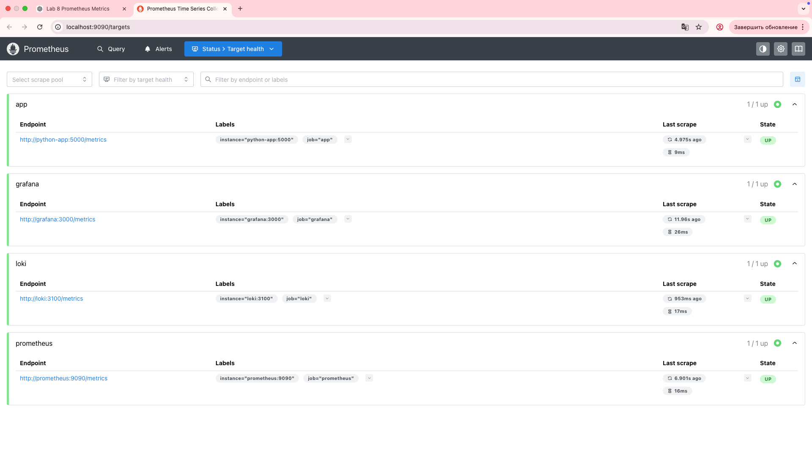
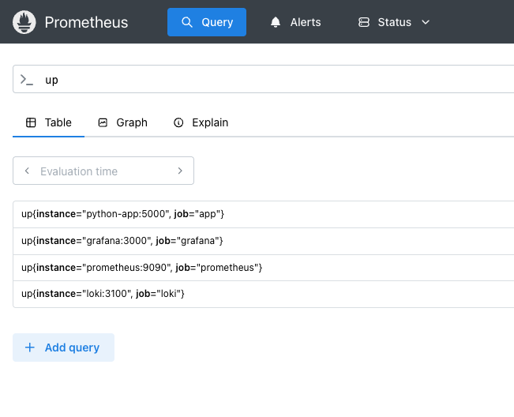
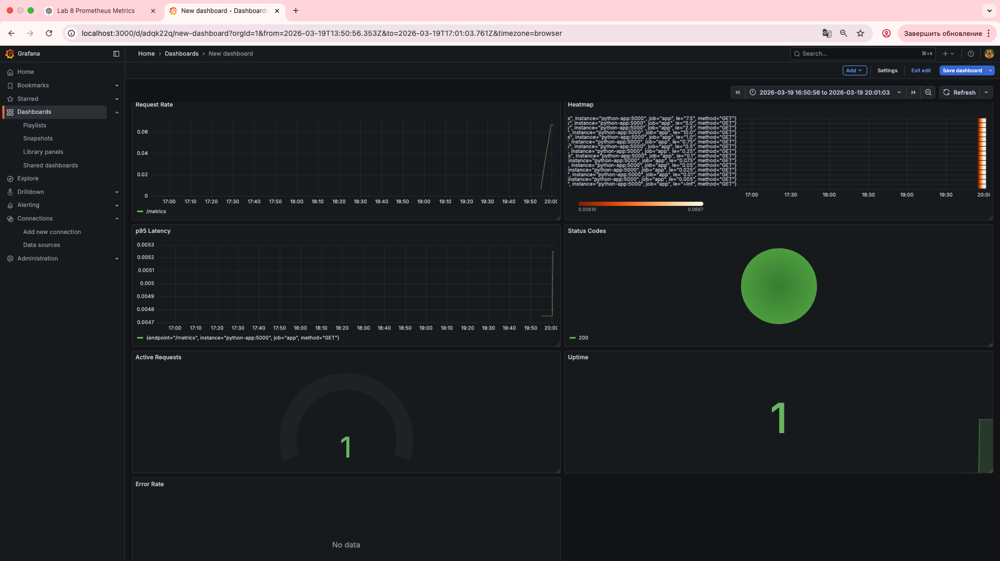
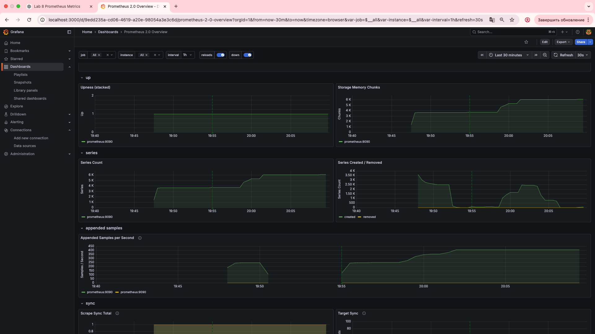
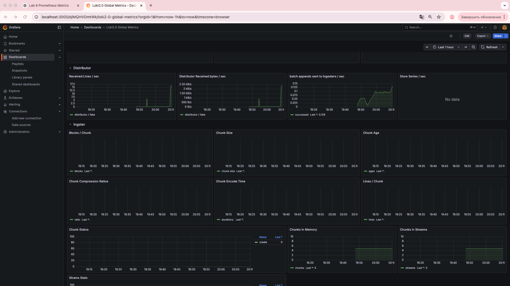

# LAB08.md — Metrics & Monitoring with Prometheus

## Architecture Overview

```
┌─────────────────┐     ┌─────────────────┐     ┌─────────────────┐
│  Python App     │     │  Prometheus     │     │  Grafana        │
│  (Instrumented) │────▶│  (Metrics DB)   │────▶│  (Visualization)│
│                 │     │                 │     │                 │
│  - Exposes      │     │  - Scrapes      │     │  - Queries      │
│    /metrics     │     │    /metrics     │     │    Prometheus   │
│  - Counter      │     │  - Stores TSDB  │     │  - Dashboards   │
│  - Histogram    │     │  - Retention    │     │  - RED Method   │
│  - Gauge        │     │  - Targets UI   │     │    Panels       │
└─────────────────┘     └─────────────────┘     └─────────────────┘
```

### Components & Data Flow

1.  **Python Application**: Instrumented with `prometheus_client`. It exposes metrics at the `/metrics` endpoint.
2.  **Prometheus**: Configured to scrape metrics from the Python app, itself, Loki, and Grafana. It stores this data as a time-series database (TSDB).
3.  **Grafana**: Connects to Prometheus as a data source, allowing us to query the metrics with PromQL and build dashboards for visualization.

### Why Metrics?

- **Logs (Lab 7)** tell you *what happened* (e.g., "Request failed with 500 error").
- **Metrics (Lab 8)** tell you *how much and how often* (e.g., "Error rate is 5%, latency is 200ms").
- Together, they provide **complete observability**.

### The RED Method (for request-driven apps)
- **Rate** - Requests per second
- **Errors** - Rate of failed requests
- **Duration** - How long requests take (latency)

## Task 1 — Application Metrics

### 1.1 Instrumentation Choices

I added the following metrics to the Python application, following the RED method:

| Metric | Type | Purpose | Labels |
| :--- | :--- | :--- | :--- |
| `http_requests_total` | Counter | Total number of HTTP requests received (Rate) | `method`, `endpoint`, `status_code` |
| `http_request_duration_seconds` | Histogram | Duration of HTTP requests (Duration) | `method`, `endpoint` |
| `active_requests` | Gauge | Number of requests currently being processed (built-in) | (none) |
| `devops_info_endpoint_calls_total` | Counter | Business metric: counts calls to specific endpoints | `endpoint` |
| `devops_info_system_collection_seconds` | Histogram | Business metric: time taken to gather system info | (none) |

### 1.2 Code Implementation (Snippet)

```python
from prometheus_client import Counter, Histogram, Gauge, generate_latest

# --- Metric Definitions ---
http_requests_total = Counter(
    "http_requests_total",
    "Total HTTP requests",
    ["method", "endpoint", "status_code"]
)

http_request_duration_seconds = Histogram(
    "http_request_duration_seconds",
    "HTTP request duration",
    ["method", "endpoint"]
)

active_requests = Gauge("active_requests", "Number of active requests")
endpoint_calls = Counter("devops_info_endpoint_calls", "Endpoint calls", ["endpoint"])
system_info_duration = Histogram("devops_info_system_collection_seconds", "System info collection time")

# --- Middleware to track metrics ---
@app.middleware("http")
async def monitor_requests(request: Request, call_next):
    active_requests.inc()
    start_time = time.time()

    response = await call_next(request)

    duration = time.time() - start_time
    http_requests_total.labels(
        method=request.method,
        endpoint=request.url.path,
        status_code=response.status_code
    ).inc()
    http_request_duration_seconds.labels(
        method=request.method,
        endpoint=request.url.path
    ).observe(duration)
    active_requests.dec()
    return response

# --- Metrics Endpoint ---
@app.get("/metrics")
async def metrics():
    return Response(generate_latest(), media_type=CONTENT_TYPE_LATEST)
```

### 1.3 Testing the `/metrics` Endpoint

```bash
gleb-pp@gleb-mac iu-devops-course % curl http://localhost:8000/metrics
# HELP python_gc_objects_collected_total Objects collected during gc
# TYPE python_gc_objects_collected_total counter
python_gc_objects_collected_total{generation="0"} 0.0
python_gc_objects_collected_total{generation="1"} 318.0
python_gc_objects_collected_total{generation="2"} 0.0
# HELP python_gc_objects_uncollectable_total Uncollectable objects found during GC
# TYPE python_gc_objects_uncollectable_total counter
python_gc_objects_uncollectable_total{generation="0"} 0.0
python_gc_objects_uncollectable_total{generation="1"} 0.0
python_gc_objects_uncollectable_total{generation="2"} 0.0
# HELP python_gc_collections_total Number of times this generation was collected
# TYPE python_gc_collections_total counter
python_gc_collections_total{generation="0"} 0.0
python_gc_collections_total{generation="1"} 41.0
python_gc_collections_total{generation="2"} 0.0
# HELP python_info Python platform information
# TYPE python_info gauge
python_info{implementation="CPython",major="3",minor="14",patchlevel="0",version="3.14.0"} 1.0
# HELP http_requests_total Total HTTP requests
# TYPE http_requests_total counter
# HELP http_request_duration_seconds HTTP request duration
# TYPE http_request_duration_seconds histogram
# HELP active_requests Number of active requests
# TYPE active_requests gauge
active_requests 1.0
# HELP devops_info_endpoint_calls_total Endpoint calls
# TYPE devops_info_endpoint_calls_total counter
# HELP devops_info_system_collection_seconds System info collection time
# TYPE devops_info_system_collection_seconds histogram
devops_info_system_collection_seconds_bucket{le="0.005"} 0.0
devops_info_system_collection_seconds_bucket{le="0.01"} 0.0
devops_info_system_collection_seconds_bucket{le="0.025"} 0.0
devops_info_system_collection_seconds_bucket{le="0.05"} 0.0
devops_info_system_collection_seconds_bucket{le="0.075"} 0.0
devops_info_system_collection_seconds_bucket{le="0.1"} 0.0
devops_info_system_collection_seconds_bucket{le="0.25"} 0.0
devops_info_system_collection_seconds_bucket{le="0.5"} 0.0
devops_info_system_collection_seconds_bucket{le="0.75"} 0.0
devops_info_system_collection_seconds_bucket{le="1.0"} 0.0
devops_info_system_collection_seconds_bucket{le="2.5"} 0.0
devops_info_system_collection_seconds_bucket{le="5.0"} 0.0
devops_info_system_collection_seconds_bucket{le="7.5"} 0.0
devops_info_system_collection_seconds_bucket{le="10.0"} 0.0
devops_info_system_collection_seconds_bucket{le="+Inf"} 0.0
devops_info_system_collection_seconds_count 0.0
devops_info_system_collection_seconds_sum 0.0
# HELP devops_info_system_collection_seconds_created System info collection time
# TYPE devops_info_system_collection_seconds_created gauge
devops_info_system_collection_seconds_created 1.7739382744677482e+09
```

## Task 2 — Prometheus Setup

### 2.1 Configuration (`prometheus.yml`)

Prometheus is configured to scrape metrics from all relevant services every 15 seconds.

```yaml
global:
  scrape_interval: 15s

scrape_configs:
  - job_name: "prometheus"
    static_configs:
      - targets: ["prometheus:9090"]

  - job_name: "app"
    static_configs:
      - targets: ["python-app:5000"]   # Scrapes our instrumented app

  - job_name: "loki"
    static_configs:
      - targets: ["loki:3100"]

  - job_name: "grafana"
    static_configs:
      - targets: ["grafana:3000"]
```

### 2.2 Verification: Targets & Queries

After starting the stack with `docker compose up -d`, all targets are correctly scraped by Prometheus.


*Screenshot: Prometheus Targets page (all UP)*  

A simple PromQL query confirms the targets are reporting data:

*Screenshot: PromQL query `up` showing all jobs as '1'*  


## Task 3 — Grafana Dashboards

### 3.1 Custom Application Dashboard (RED Method)

I created a custom dashboard with 6+ panels to visualize the RED method metrics from my Python app.

| Panel Name | PromQL Query | Purpose | Visualization |
| :--- | :--- | :--- | :--- |
| **Request Rate** | `sum(rate(http_requests_total[5m])) by (endpoint)` | Shows requests/sec per endpoint (Rate) | Graph |
| **Error Rate** | `sum(rate(http_requests_total{status_code=~"5.."}[5m]))` or `...{status_code=~"4..|5.."}...` | Shows error rate (Errors) | Graph |
| **Request Duration (p95)** | `histogram_quantile(0.95, sum(rate(http_request_duration_seconds_bucket[5m])) by (le, endpoint))` | Shows 95th percentile latency (Duration) | Graph |
| **Latency Heatmap** | `rate(http_request_duration_seconds_bucket[5m])` | Visual distribution of request latencies | Heatmap |
| **Active Requests** | `active_requests` | Shows current concurrent requests | Gauge |
| **Status Code Distribution** | `sum by (status_code) (rate(http_requests_total[5m]))` | Shows proportion of 2xx vs 4xx vs 5xx | Pie Chart |
| **App Uptime** | `up{job="app"}` | Shows if the app is up (1) or down (0) | Stat |

*Screenshot: Custom Grafana Dashboard with all panels showing live data*  


### 3.2 Imported Dashboards

To enhance observability, I also imported community dashboards for the platform itself:

- **Prometheus 2.0 Stats** (ID: `3662`): For internal Prometheus metrics.
- **Loki Dashboard** (ID: `13407`): For log analysis integrated with metrics.

*Screenshot: Imported Prometheus dashboard*  


*Screenshot: Imported Loki dashboard*  


### 3.3 Exported Dashboard JSON

The custom dashboard configuration is exported for backup and version control:
`dashboard.json`

## Task 4 — Production Configuration

### 4.1 Health Checks

Health checks ensure that Docker can manage the lifecycle of the containers and know when they are ready.

```yaml
services:
  prometheus:
    healthcheck:
      test: ["CMD-SHELL", "wget --no-verbose --tries=1 --spider http://localhost:9090/-/healthy || exit 1"]
      interval: 10s
      timeout: 5s
      retries: 5

  python-app:
    healthcheck:
      test: ["CMD-SHELL", "curl -f http://localhost:5000/health || exit 1"]
      interval: 10s
      timeout: 5s
      retries: 5

  grafana:
    healthcheck:
      test: ["CMD", "curl", "-f", "http://localhost:3000/api/health"]
      interval: 10s
      timeout: 5s
      retries: 5
  # ... health checks for loki, promtail ...
```

### 4.2 Resource Limits

Resource limits are set to prevent any single service from consuming all host resources.

| Service | CPU Limit | Memory Limit |
| :--- | :--- | :--- |
| Prometheus | 1.0 | 1G |
| Loki | 1.0 | 1G |
| Grafana | 0.5 | 512M |
| Python App | 0.5 | 256M |
| Promtail | 0.5 | 512M |

### 4.3 Data Retention & Persistence

**Retention Policy:** Configured in Prometheus to manage disk space and comply with data lifecycle requirements.
```yaml
command:
  - '--config.file=/etc/prometheus/prometheus.yml'
  - '--storage.tsdb.retention.time=15d'   # Keep data for 15 days
  - '--storage.tsdb.retention.size=10GB'  # Or until 10GB is used
```

**Persistent Volumes:** Data is stored in Docker volumes to survive container restarts.
```yaml
volumes:
  loki-data:
  grafana-data:
  prometheus-data:
```

### 4.4 Verification: Health and Persistence

After applying the production config, all services are reported as healthy:

```bash
(venv) gleb-pp@gleb-mac monitoring % docker compose ps
WARN[0000] /Users/gleb-pp/Documents/InnoAssignments/S26 DevOps/iu-devops-course/monitoring/docker-compose.yml: the attribute `version` is obsolete, it will be ignored, please remove it to avoid potential confusion 
NAME                      IMAGE                    COMMAND                  SERVICE      CREATED         STATUS                            PORTS
monitoring-grafana-1      grafana/grafana:12.3.1   "/run.sh"                grafana      5 seconds ago   Up 4 seconds (health: starting)   0.0.0.0:3000->3000/tcp, [::]:3000->3000/tcp
monitoring-loki-1         grafana/loki:3.0.0       "/usr/bin/loki -conf…"   loki         5 seconds ago   Up 4 seconds (health: starting)   0.0.0.0:3100->3100/tcp, [::]:3100->3100/tcp
monitoring-promtail-1     grafana/promtail:3.0.0   "/usr/bin/promtail -…"   promtail     5 seconds ago   Up 4 seconds                      
monitoring-python-app-1   monitoring-python-app    "python app.py"          python-app   5 seconds ago   Up 4 seconds (health: starting)   0.0.0.0:8000->5000/tcp, [::]:8000->5000/tcp
prometheus                prom/prometheus:v3.9.0   "/bin/prometheus --c…"   prometheus   5 seconds ago   Up 4 seconds (health: starting)   0.0.0.0:9090->9090/tcp, [::]:9090->9090/tcp
```

**Persistence Test:** A dashboard was created, the stack was restarted (`docker compose down && docker compose up -d`), and the dashboard persisted, confirming that Grafana data volume is working correctly.

## PromQL Examples

Here are 5 useful PromQL queries used in the dashboards, with explanations:

1.  **Overall Request Rate**
    ```promql
    sum(rate(http_requests_total[5m]))
    ```
    *Explanation:* Calculates the total requests per second across the entire application, averaged over 5 minutes.

2.  **Top 3 Slowest Endpoints (p95)**
    ```promql
    topk(3, histogram_quantile(0.95, sum(rate(http_request_duration_seconds_bucket[5m])) by (le, endpoint)))
    ```
    *Explanation:* Identifies the three endpoints with the highest 95th percentile latency, helping to pinpoint performance bottlenecks.

3.  **Error Percentage**
    ```promql
    (sum(rate(http_requests_total{status_code=~"5.."}[5m])) / sum(rate(http_requests_total[5m]))) * 100
    ```
    *Explanation:* Calculates the percentage of requests that resulted in a 5xx server error.

4.  **Service Uptime**
    ```promql
    up{job="app"}
    ```
    *Explanation:* A simple but critical query showing if the target is scrapable (1) or not (0).

5.  **Application-Specific Metric (System Info Collection Time)**
    ```promql
    histogram_quantile(0.5, rate(devops_info_system_collection_seconds_bucket[5m]))
    ```
    *Explanation:* Tracks the median (50th percentile) time it takes to collect system information, a custom business metric.

## Metrics vs. Logs: When to Use Each

| Aspect | Metrics (Prometheus) | Logs (Loki) |
| :--- | :--- | :--- |
| **Data Type** | Numeric time-series data | Textual, semi-structured events |
| **Primary Use** | Alerting, trending, performance analysis | Debugging, root cause analysis, auditing |
| **Query Style** | Aggregation (e.g., `sum`, `avg`, `rate`) | Filtering and searching (e.g., `{app="..."} \| json`) |
| **Storage** | Efficient, compressed TSDB | Compressed chunks + small index |
| **Example Question** | "What is the average latency for the last 5 minutes?" | "What was the exact error message for this specific failed request?" |

## Challenges & Solutions

- **Challenge 1: Targets showing `UNKNOWN` in Prometheus.**
    - **Solution:** Realized the Python app was binding to `127.0.0.1` instead of `0.0.0.0` inside the container. Set the environment variable `HOST=0.0.0.0` to make it listen on all interfaces, allowing Prometheus to connect.

- **Challenge 2: Error Rate panel showing "0 rows".**
    - **Solution:** The query filtered only for `5xx` errors, but no 5xx errors were generated. This is a "good" problem. For demonstration, the query was temporarily modified to include `4xx` errors, and a request to a non-existent endpoint was made to generate data. The concept of "no data" in Prometheus was documented.
